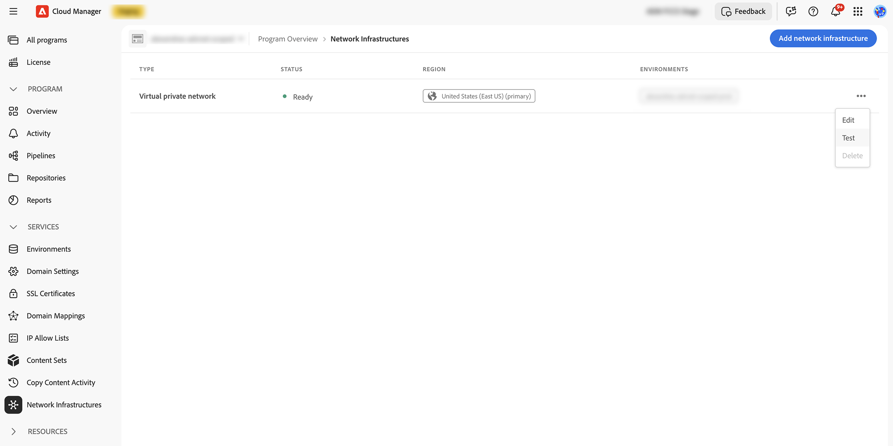

# ネットワーク接続テスト {#network-connectivity-test}

**ネットワーク接続テスト**&#x200B;は、環境でアドバンストネットワークを有効にする前と本番稼働前に、アドバンストネットワークとVPN設定を検証できるCloud Manager診断ツールです。 内部エンドポイントまたはプライベート エンドポイントを含め、AEMが到達する必要があるホストとポートが、アドバンストネットワークが使用するのと同じ接続パス経由で到達できることを確認するために使用します。

テストは、オーサーまたはパブリッシュ ポッドからではなく、プログラムの高度なネットワーク設定に属する&#x200B;**エグレス プロキシ インフラストラクチャ**&#x200B;から実行されます。 アドバンスドネットワークがアクティブな場合にAEMが使用するのと同じアウトバウンドネットワークパスを使用します。 この設計は、**VPN** シナリオで特に便利です。運用開始する前に、プライベート システムまたはオンプレミス システムのDNS解決、ネットワーク ルーティング、ファイアウォール ルール、サービスの可用性を確認できます。

VPNのプロビジョニング、専用エグレス IP、またはフレキシブル ポート エグレスの背景については、[AEM as a Cloud Serviceの高度なネットワークの設定](/help/security/configuring-advanced-networking.md)を参照してください。

>[!IMPORTANT]
>
>接続テストが成功すると、アドバンストネットワークからのネットワークパスがターゲットに到達できることが証明されます。 アプリケーションコードは、必要に応じてアドバンスドネットワークプロキシを使用するように設定する必要があります（プロキシ関連の環境変数やポート転送など）。 コードがプロキシをバイパスする場合、テストが通過しても、想定されるエグレス パスからのトラフィックが表示されない場合があります。

## このツールの使用条件 {#when-to-use}

* **アドバンスドネットワーク**&#x200B;が&#x200B;**プログラム** レベルおよび&#x200B;**前**&#x200B;に作成された後、または&#x200B;**環境**&#x200B;で有効にする間に作成されます。
* プライベートまたはオンプレミスのシステム（内部ホスト名やプライベート IP アドレスなど）に対する&#x200B;**VPN**&#x200B;接続を検証するには、次の手順を実行します。
* サービスが期待どおりに応答しない場合に、DNS問題とファイアウォールまたはルーティング問題を絞り込む。

>[!NOTE]
>
>このツールは、高度なネットワーク（VPN、専用エグレス IP、またはフレキシブルポートエグレス）を使用するプログラム向けです。 これは、アドバンストネットワークを使用しない標準のAEM接続の汎用テストではありません。

## 前提条件 {#prerequisites}

* Cloud Managerプログラム。
* プログラム用に高度なネットワーク インフラストラクチャが既に作成されています（[高度なネットワークの設定](/help/security/configuring-advanced-networking.md)を参照）。

## テストの実行方法 {#how-to-run-a-test}

1. [my.cloudmanager.adobe.com](https://my.cloudmanager.adobe.com/)でCloud Managerにログインし、組織とプログラムを開きます。
1. プログラムの「**環境**」タブを開きます。 左側のサイドバーで、**ネットワークインフラストラクチャ**&#x200B;を選択します。

1. **ネットワークインフラストラクチャ** ページで、テーブル内のインフラストラクチャを見つけます。 行を選択してテスト エクスペリエンスを開くか、行のアクション メニュー（）を開いて、**テスト**&#x200B;を選択します。

   

1. **ネットワークテスト** ダイアログが開きます。 **ホスト**&#x200B;と&#x200B;**ポート**&#x200B;を入力し、**テスト**&#x200B;を選択し、結果エリアでDNS解決、ポートのオープン、HTTP接続、到達性を確認します。 **クリップボードへのコピー**&#x200B;や最近のテスト履歴などのオプションのアクションがダイアログに表示されます。 各セクションの解釈方法については、[結果について](#understanding-results)を参照してください。

   

### 入力フィールド {#input-fields}

| フィールド | 説明 | 例 |
| --- | --- | --- |
| **主催者** | AEMが到達する必要があるサービスのホスト名またはIP アドレス。 | `internal-api.example.com`、`10.0.1.50` |
| **ポート** | ターゲットホストのTCP ポート （1-65535）。 共通の値は、ショートカットリスト（80、443、587、22など）に表示されます。 | `443` |

### 手順 {#test-steps}

1. **ホスト**&#x200B;と&#x200B;**ポート**&#x200B;を入力します。
1. 「**テスト**」を選択します。 結果は通常、数秒以内に表示されます。
1. オプション：**クリップボードにコピー**&#x200B;を使用して、完全なJSON結果を取得します（サポートケースに便利）。
1. 最近のテストは、簡単に再実行するために一覧表示される場合があります。

## 結果の把握 {#understanding-results}

ツールは複数の寸法をレポートします。 これらは、ターゲットが高度なネットワークから到達できるかどうか、およびHTTP対応チェックがどのように動作するかを説明します。

### DNS 解決 {#dns-resolution}

| 結果 | 意味 |
| --- | --- |
| `ips: ["10.0.1.50"]` | DNS解決に成功しました。 ホスト名は、Advanced Networking設定に関連付けられたリゾルバを使用して、リストされたIP アドレスに解決されました。 |
| `error: "DNS resolution error: ..."` | DNS解決に失敗しました。 設定されたDNS サーバーがホスト名を解決できませんでした（名前が間違っている、リゾルバーに到達できない、レコードが見つからない、類似の原因など）。 |

>[!NOTE]
>
>ホスト名ではなく&#x200B;**数値のIP**&#x200B;を入力すると、その値に対してDNS解決がスキップされ、IPが直接使用されます。

### ポートが開きました {#port-open}

| 結果 | 意味 |
| --- | --- |
| `Yes` / true | TCP接続が成功しました。ポートが開いていて、接続を受け入れています。 |
| `No` / false | ポートが閉じられるか、ファイアウォールでフィルタリングされるか、ホストに到達できません。 |

### HTTP 接続 {#http-connectivity}

**すべてのポート**&#x200B;でHTTP/HTTPS要求が試行されます。 ツールは常に&#x200B;**HTTPS**&#x200B;を最初に試し、次に&#x200B;**HTTP**&#x200B;にフォールバックします。 どちらも機能しない場合、結果は、読み取り可能な短い&#x200B;**エラー** メッセージにマッピングされます（以下の表を参照）。

**成功の出力**

| 出力 | 意味 |
| --- | --- |
| `protocol: "https"`、`status_code: 200`、`reason: "200 OK"` | HTTPS接続に成功しました。 |
| `protocol: "http"`、`status_code: 301`、`reason: "301 Moved Permanently"` | HTTP接続が成功しました。サービスは（通常はHTTPSに）リダイレクトされています。 これが普通です。 |

**分類されたエラー出力**

| エラー | メモ | 意味 |
| --- | --- | --- |
| `"Not an HTTP/HTTPS service"` | `"The service appears to be a non-HTTP service (e.g., database, message queue, or custom TCP). Use the port_open and reachability fields to verify connectivity."` | ポートは開いていますが、サービスはHTTPを話しません。 これは、データベース、SFTP、カスタム TCP、および同様のサービスに対して期待されます。 |
| `"Connection refused"` | `"The port is not accepting connections. Verify the service is running and listening on this port."` | この港では何も聞こえない。 |
| `"Connection timed out"` | `"The connection timed out. Check firewall rules and network routing."` | ファイアウォールまたはルーティングの問題が接続を妨げています。 |
| `"No IPs resolved for host"` | — | DNS解決に失敗しました。HTTPをテストできません。 |

>[!NOTE]
>
>ターゲットサービスのHTTP ステータスコード （例：`200`、`301`、`302`、`403`、`404`、または`500`）は、接続用の&#x200B;**成功信号**&#x200B;であり、**ネットワークパス**&#x200B;が機能することを意味します。 ステータスコードは、ネットワーク全体の健全性ではなく、サービス自体の応答を反映します。 非HTTP サービスの場合、ツールは&#x200B;**HTTP/HTTPS サービス**&#x200B;ではないことを示します。これらのサービスの信頼性の高い指標として&#x200B;**Port open**&#x200B;と&#x200B;**Reachability**&#x200B;を使用します。

### 到達可能性 {#reachability}

| 結果 | 意味 |
| --- | --- |
| **達成可能** | ターゲット・ホストおよびポートは、アドバンスト・ネットワーク・インフラストラクチャからアクセス可能です。 ネットワーク構成が正しい。 |
| **アクセスできません：ポートにアクセスできません** | DNSは正常に解決されましたが、ポートへのTCPは成功しませんでした。 これは通常、ファイアウォールまたはルーティングの問題です。 |
| **到達できません：DNS解決に失敗しました** | 設定でホスト名を解決できませんでした。 これは、DNS設定の問題を示しています。 |

### 複数のDNS リゾルバー {#multiple-dns-resolvers}

アドバンスドネットワークインフラストラクチャが&#x200B;**複数のDNS リゾルバー**&#x200B;を定義している場合：

* **すべてのリゾルバーが同じ結果**&#x200B;を返すと、**というラベルの付いた**&#x200B;単一の統合`default`結果が表示されます。
* リゾルバーが&#x200B;**異なる結果**&#x200B;を返すと、各リゾルバーの結果は&#x200B;**個別** （`resolver_1`、`resolver_2`などのラベル付き）、**とリゾルバーIP**&#x200B;が表示されるので、どのDNS サーバーが不整合を引き起こしているかを確認できます。

## トラブルシューティング {#troubleshooting}

以下のシナリオは、ツールに表示される可能性が高いものと、原因を絞り込む手順を組み合わせたものです。 同じ状況を示す&#x200B;**クリップボードへの完全なコピー** JSONについては、[出力例](#example-outputs)を参照してください。

### DNS解決に失敗しました {#dns-failed}

#### 出力

ホスト名がアドバンスドネットワーク DNS設定を使用して解決しなかったため、ツールはポートをテストできません。 結果ビューでは、**DNS解決**&#x200B;にエラー文字列が表示され、**到達性**&#x200B;はDNSが失敗したことを報告します。

```
DNS Resolution: error: "DNS resolution error: ..."
Reachability: "Unreachable: DNS resolution failed"
```

#### レコメンデーション

1. **ホスト名が正しいことを確認します**。タイプミスと、意図した&#x200B;**DNS ゾーン**&#x200B;を使用していることを確認します（間違ったゾーンはよくある間違いです）。
1. **お使いのDNS リゾルバー** （ネットワーク インフラストラクチャで設定されたリゾルバー）が、アドバンスネットワーク CIDR範囲&#x200B;**（ツールとAEMがアウトバウンドチェックに使用するのと同じアドレス空間）から** アクセス可能であることを確認します。 プライベート DNSに依存している場合は、VPN トンネルを介して、またはルーティングがアドバンスト ネットワークに公開するネットワーク アドレス空間内で、これらのサーバーに到達できる必要があります。
1. **構成されたDNS サーバーがホスト名**&#x200B;を解決できることを確認します。Advanced Networkingでは、ネットワークインフラストラクチャの設定で定義されたリゾルバーを&#x200B;**のみ**&#x200B;使用し、**パブリック DNSを**&#x200B;使用しません（例：`8.8.8.8`）。 内部DNSにそのホスト名のレコードがない場合、解決は失敗します。
1. **VPN設定の場合：** DNS サーバーのIP アドレスがVPN アドレス空間内にあることを確認します（トンネルの構築に使用されるリモート ネットワーク CIDR）。 VPN トンネルを経由しないサブネット上のレゾルバは、アドバンストネットワークから到達できません。

### DNSは機能するが、ポートにアクセスできない {#dns-ok-port-blocked}

#### 出力

ツールはホストを解決できますが、ポートへのTCPは成功しません。 概要は次のようになります。

```
DNS Resolution: ips: ["10.0.1.50"]
Port Open: No
Reachability: "Unreachable: Port not accessible"
```

#### レコメンデーション

1. **ファイアウォールを確認し、ターゲット サービス**&#x200B;のルールを許可リストに追加します。アドバンスト ネットワーク インフラストラクチャ CIDR範囲（およびAEMが使用するエグレス IP アドレス）からの着信トラフィックを許可する必要があります。 VPNを使用する場合は、設計に必要に応じてリモート ネットワーク CIDRを含めます。
1. **サービスが実行されていることを確認します**&#x200B;および&#x200B;**テストで入力したホストとポート**&#x200B;でリッスンしています。
1. **VPN設定の場合：** トンネルが起動していることを確認し、ルーティングがターゲット サブネットに到達し、ターゲット アドレスがVPN経由で転送されるリモート ネットワーク アドレス空間にあることを確認します。
1. インフラストラクチャで、アドバンスドネットワークとターゲット間のポートをブロックする可能性のある&#x200B;**ネットワークセキュリティグループ（NSG）、セキュリティルール、または同等の**&#x200B;を確認します。
1. **ポート番号**&#x200B;を確認します。テスト中のポートで、プロセスが実際にリッスンしていることを確認します。

### テストは到達可能ですが、AEMが接続しません {#reachable-but-aem-fails}

#### 出力

接続性チェック自体が成功します。 要約すると、次のようになります。

```
Port Open: Yes
Reachability: "Reachable"
```

その結果、Advanced Networkingからテストしたホストおよびポートへのパスが開きます。 これは、AEM アプリケーショントラフィックがそのパスを使用していることを保証するものではありません。コードの実行時に、サービスログに期待するエグレス IPからのリクエストが表示されない場合があります。

#### レコメンデーション

1. **プロキシ**&#x200B;を使用するには、アプリケーションコードを設定する必要があります。 接続性テストはネットワークパスが機能することを証明しますが、AEMはリクエストを&#x200B;**アドバンストネットワークプロキシ** （例えば、**`AEM_PROXY_HOST`**&#x200B;環境変数）経由で明示的にルーティングする必要があります。 コードがプロキシなしで直接接続を行う場合、トラフィックは高度なネットワークインフラストラクチャを経由しません。
1. **HTTP クライアントのプロキシ設定を確認する** - HTTP クライアントは、同じプロキシ設定（`AEM_PROXY_HOST`および該当する場合はポート転送）を使用する必要があります。
1. **高度なネットワークのポート転送設定**&#x200B;を&#x200B;**環境** レベルで確認します。`portForwards`では、各エントリが右側の&#x200B;**`portOrig`** ターゲットホスト **`portDest`**&#x200B;で&#x200B;**から**&#x200B;にマッピングする必要があります。 **`portOrig`**&#x200B;は、プロキシを介してアウトバウンド接続を開くときに、AEM アプリケーション コードが&#x200B;**に接続する** ポートです。 **`portDest`**&#x200B;は、リモートプロセスがリッスンしているターゲットサービス **の**&#x200B;実際のポートです。 **ターゲットホスト**&#x200B;は、転送で使用されるサービス **の** ホスト名またはアドレスです。 この3つの要件は、アプリケーションの接続方法と一致している必要があります。
1. **`nonProxyHosts`**&#x200B;を確認してください。 ターゲットホストがそこに表示されている場合、リクエスト **はそのホストのプロキシ**&#x200B;をスキップし、検証したアドバンスドネットワークパスに従いません。

### HTTPでエラーが表示されますが、ポートが開いている {#http-error-port-open}

#### 出力

TCPは成功しますが、HTTP/HTTPS プローブは依然として失敗を報告します。 概要は次のようになります。

```
Port Open: Yes
HTTP Connectivity: error: "Connection error: ..." or "Both HTTPS and HTTP failed. ..."
Reachability: "Reachable"
```

#### レコメンデーション

1. **サービスがHTTPまたはHTTPS**&#x200B;を話せない可能性があります（生のTCP、gRPC、または別のプロトコルなど）。 `Port open: Yes`および`Reachability: Reachable`がネットワークパスが機能することを確認している間、HTTP プローブが失敗する可能性があります。 これらのフィールドを、非HTTP サービスの信頼できる唯一の情報源として使用します。
1. **TLSと証明書の構成を調査します**。 HTTPSが失敗してもHTTPが成功する場合（場合によっては`HTTPS failed, HTTP succeeded`などのメモで示される場合もあります）、サービスに証明書の問題がある場合や、そのポートでのみHTTPを提供する場合があります。

### 要求タイムアウト {#timeout}

#### 出力

```json
{ "error": "Request timeout" }
```

#### レコメンデーション

1. **サービスの応答時間を許可** – チェックでは5秒のタイムアウトが使用されます。 それよりも遅く回答したターゲットは、そうでない場合でもタイムアウトします。
1. **ネットワーク待ち時間のアカウント**。 VPN接続では、高い遅延または不健全なトンネルが制限を越えてラウンドトリップをプッシュする可能性があります。トンネルのステータスとルーティングを確認します。
1. **もう一度テストを実行**。 1回限りのネットワークの不具合により、タイムアウトが発生する可能性があります。

## 出力例 {#example-outputs}

### HTTPS テストの成功（例：ポート 443の内部API） {#example-output-successful-https}

```json
{
  "resolvers": [
    {
      "name": "default",
      "dns_resolution": {
        "ips": ["10.0.1.50"]
      },
      "port_open": true,
      "http_connectivity": {
        "protocol": "https",
        "status_code": 200,
        "reason": "200 OK"
      },
      "reachability": "Reachable"
    }
  ]
}
```

### HTTP以外のサービスのテストに成功しました（例：ポート 5432のデータベース） {#example-output-successful-non-http}

```json
{
  "resolvers": [
    {
      "name": "default",
      "dns_resolution": {
        "ips": ["10.0.1.50"]
      },
      "port_open": true,
      "http_connectivity": {
        "error": "Not an HTTP/HTTPS service",
        "note": "The service appears to be a non-HTTP service (e.g., database, message queue, or custom TCP). Use the port_open and reachability fields to verify connectivity."
      },
      "reachability": "Reachable"
    }
  ]
}
```

>[!NOTE]
>
>HTTP エラーは、非HTTP サービスに対して必要です。 **ポートを開く：true**&#x200B;および&#x200B;**到達可能性：Reachable**&#x200B;は、ネットワーク パスが機能することを確認します。

### DNS解決の失敗 {#example-output-dns-resolution-failure}

```json
{
  "resolvers": [
    {
      "name": "default",
      "dns_resolution": {
        "error": "DNS resolution error: dial udp 10.0.0.2:53: i/o timeout"
      },
      "port_open": false,
      "http_connectivity": {
        "error": "DNS resolution failed"
      },
      "reachability": "Unreachable: DNS resolution failed"
    }
  ]
}
```

### ポートにアクセスできません（ファイアウォール / サービスダウン） {#example-output-port-not-accessible}

```json
{
  "resolvers": [
    {
      "name": "default",
      "dns_resolution": {
        "ips": ["10.0.1.50"]
      },
      "port_open": false,
      "http_connectivity": {
        "error": "Connection error: dial tcp 10.0.1.50:443: i/o timeout"
      },
      "reachability": "Unreachable: Port not accessible"
    }
  ]
}
```

## 重要な注意事項 {#important-notes}

### このテストで実行できないこと {#what-this-test-does-not-do}

* テストは、AEM オーサーポッドまたはパブリッシュポッド内から実行されません。 **エグレス プロキシ インフラストラクチャ**&#x200B;から実行されます。 これにより、コード内のアプリケーションレベルのプロキシ設定ではなく、ネットワーク層が検証されます。
* AEM アプリケーションのプロキシ設定は検証されません。 結果が`Reachable`の場合でも、プロキシを使用するようにAEM コードを設定する必要があります。
* 環境レベルのポート転送設定は、単独では検証されません。 インフラストラクチャパスからの生の接続をテストします。
* カスタムペイロードは送信されません。 HTTP テストは、基本的な`GET` リクエストを`/`に発行します。

### 応答時間 {#response-time}

* **典型的：**&#x200B;約2 ～ 3秒。
* **最大：**&#x200B;約5秒のタイムアウトです。
* **すべてのDNS リゾルバー**&#x200B;と接続性チェックが並行して実行されます。

### HTTPと非HTTP サービス {#http-vs-non-http-services}

ツールは、すべてのポートでHTTP/HTTPS接続を試みます。 HTTP以外のサービス（例えば、ポート 5432のPostgreSQL、3306のMySQL、22のSFTP、6379のRedis）の場合、HTTP チェックは接続エラーで失敗する可能性があります。これは予想されます。 これらのサービスの接続を確認するには、`Port open`と`Reachability`に依存します。

## 関連する情報 {#related-information}

* [AEM as a Cloud Service の高度なネットワーク機能の設定](/help/security/configuring-advanced-networking.md)
* [Experience Leagueの高度なネットワーク チュートリアル &#x200B;](https://experienceleague.adobe.com/ja/docs/experience-manager-learn/cloud-service/networking/advanced-networking)
