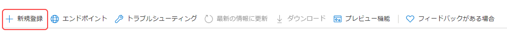

# メールサービスの OAuth2 サポート {#oauth2-support-for-the-mail-service}

AEM as a Cloud Service は、組織が安全なメール要件に準拠できるように、OAuth2 の統合メールサービスをサポートしています。

Oauth は複数のメールプロバイダーに対して設定できます。Microsoft® Office 365 Outlook で OAuth2 による認証を行うように AEM メールサービスを設定する手順を以下に示します。他のベンダーも同様の方法で設定できます。

AEM as a Cloud Service のメールサービスの詳細については、[メールの送信](/help/implementing/developing/introduction/development-guidelines.md#sending-email)を参照してください。

## Microsoft® Outlook {#microsoft-outlook}

1. [https://portal.azure.com/](https://portal.azure.com/)に移動し、ログインします。
1. 検索バーで **Azure Active Directory** を検索し、結果をクリックします。または、[https://portal.azure.com/#blade/Microsoft_AAD_IAM/ActiveDirectoryMenuBlade/Overview](https://portal.azure.com/#blade/Microsoft_AAD_IAM/ActiveDirectoryMenuBlade/Overview) を直接参照することもできます。
1. **アプリの登録**／**新しい登録**&#x200B;をクリックします。

   

1. 必要に応じて情報を入力し、「**登録**」をクリックします。
1. 作成されたアプリに移動し、「**API 権限**」を選択します。
<!-- Alexandru: removing as a result of CQDOC-20609 
1. Click **Add Permission** > **Graph Permission** > **Delegated Permissions**. -->
1. アプリに対して以下の権限を選択し、「**権限を追加**」をクリックします。

   >[!NOTE]
   >
   >権限の設定は、時間の経過と共に進化することがあります。これらが想定どおりに動作しない場合は、Microsoft® にお問い合わせください。

   * `https://outlook.office.com/SMTP.Send`
   * `openid`
   * `offline_access`
   * `email`
   * `profile`
1. **認証**／**プラットフォームを追加**／**Web**&#x200B;に移動し、**リダイレクト URL**&#x200B;セクションで、次の URL（スラッシュありとスラッシュなし）を追加します
   * `http://localhost/`
   * `http://localhost`
1. 各 URL を追加した後で「**設定**」を押し、必要に応じて設定を指定します.
1. 次に、**証明書とシークレット**&#x200B;に移動し、「**新しいクライアントシークレット**」をクリックし、画面上の手順に従ってシークレットを作成します。このシークレットは後で使用するため、必ずメモしてください.
1. 左側のウィンドウで「**概要**」を押し、後で使用するために、「**アプリケーション（クライアント）ID**」および「**ディレクトリ（テナント）ID**」の値をコピーします。

まとめると、次の情報を使用して、AEM 側のメールサービスの OAuth2 を設定する必要があります。

* 認証 URL はテナント ID を使用して構築されます。`https://login.microsoftonline.com/<tenantID>/oauth2/v2.0/authorize` の形式で記述します。
* トークン URL はテナント ID を使用して構築されます。`https://login.microsoftonline.com/<tenantID>/oauth2/v2.0/token` の形式で記述します。
* 更新 URL はテナント ID を使用して構築されます。`https://login.microsoftonline.com/<tenantID>/oauth2/v2.0/token` の形式で記述します。
* クライアント ID
* クライアント秘密鍵

### 更新トークンの生成 {#generating-the-refresh-token}

次に、次の手順に従って OSGi 設定の一部である更新トークンを生成します。

1. `clientID` と `tenantID` を自分のアカウントに固有の値に置き換えてから、ブラウザーで次の URL を開きます。

   ```
   https://login.microsoftonline.com/%3ctenantID%3e/oauth2/v2.0/authorize?client_id=%3cclientId%3e&response_type=code&redirect_uri=http://localhost&response_mode=query&scope=https://outlook.office.com/SMTP.Send%20email%20openid%20profile%20offline_access&state=12345`
   ```

1. 指示に従って、権限を許可します。
1. URL は、次の形式で構成された新しい場所にリダイレクトします。

   ```
   http://localhost/?code=<code>&state=12345&session_state=4f984c6b-cc1f-47b9-81b2-66522ea83f81#`
   ```

1. 上記の例の `<code>` の値をコピーします。
1. 次の cURL コマンドを使用して、 refreshToken を取得します。tenantID、clientID および clientSecret は、アカウントの値とおよび `<code>` の値と置き換えます。

   ```
   curl --location --request POST 'https://login.microsoftonline.com/<tenantId>/oauth2/v2.0/token' \
   --header 'Content-Type: application/x-www-form-urlencoded' \
   --header 'Cookie: buid=0.ARgAep0nU49DzUGmoP2wnvyIkcQjsx26HEpOnvHS0akqXQgYAAA.AQABAAEAAAD--DLA3VO7QrddgJg7Wevry9XPJSKbGVlPt5NWYxLtTl3K1W0LwHXelrffApUo_K02kFrkvmGm94rfBT94t25Zq4bCd5IM3yFOjWb3V22yDM7-rl112sLzbBQBRCL3QAAgAA; esctx=AQABAAAAAAD--DLA3VO7QrddgJg7Wevr4a8wBjYcNbBXRievdTOd15caaeAsQdXeBAQA3tjVQaxmrOXFGkKaE7HBzsJrzA-ci4RRpor-opoo5gpGLh3pj_iMZuqegQPEb1V5sUVQV8_DUEbBv5YFV2eczS5EAhLBAwAd1mHx6jYOL8LwZNDFvd2-MhVXwPd6iKPigSuBxMogAA; x-ms-gateway-slice=estsfd; stsservicecookie=estsfd; fpc=Auv6lTuyAP1FuOOCfj9w0U_5vR5dAQAAALDXP9gOAAAAwIpkkQEAAACT2T_YDgAAAA' \
   --data-urlencode 'client_id=<clientID>' \
   --data-urlencode 'scope=https://outlook.office.com/SMTP.Send email openid profile offline_access' \
   --data-urlencode 'redirect_uri=http://localhost' \
   --data-urlencode 'grant_type=authorization_code' \
   --data-urlencode 'client_secret=<clientSecret>' \
   --data-urlencode 'code=<code>'
   ```

1. refreshToken と accessToken をメモしておきます。

### トークンの検証 {#validating-the-tokens}

AEM 側で Oauth を設定する前に、次の手順で accessToken と refreshToken の両方を検証してください。

1. 次の cURL を使用して、前の手順で作成した更新トークンを使用し、アクセストークンを生成して、`<client_id>`、`<client_secret>` および `<refreshToken>` の値を置き換えます。

   ```
   curl --location --request POST 'https://login.microsoftonline.com/<tenetId>/oauth2/v2.0/token' \
   --header 'Content-Type: application/x-www-form-urlencoded' \
   --header 'Cookie: buid=0.ARgAep0nU49DzUGmoP2wnvyIkcQjsx26HEpOnvHS0akqXQgYAAA.AQABAAEAAAD--DLA3VO7QrddgJg7Wevry9XPJSKbGVlPt5NWYxLtTl3K1W0LwHXelrffApUo_K02kFrkvmGm94rfBT94t25Zq4bCd5IM3yFOjWb3V22yDM7-rl112sLzbBQBRCL3QAAgAA; esctx=AQABAAAAAAD--DLA3VO7QrddgJg7Wevr4a8wBjYcNbBXRievdTOd15caaeAsQdXeBAQA3tjVQaxmrOXFGkKaE7HBzsJrzA-ci4RRpor-opoo5gpGLh3pj_iMZuqegQPEb1V5sUVQV8_DUEbBv5YFV2eczS5EAhLBAwAd1mHx6jYOL8LwZNDFvd2-MhVXwPd6iKPigSuBxMogAA; x-ms-gateway-slice=estsfd; stsservicecookie=estsfd; fpc=Auv6lTuyAP1FuOOCfj9w0U_IezHLAQAAAPeNSdgOAAAA' \
   --data-urlencode 'client_id=<client_id>' \
   --data-urlencode 'scope=https://outlook.office.com/SMTP.Send email openid profile offline_access' \
   --data-urlencode 'redirect_uri=http://localhost' \
   --data-urlencode 'grant_type=refresh_token' \
   --data-urlencode 'client_secret=<client_secret>' \
   --data-urlencode 'refresh_token=<refreshToken>'
   ```

1. アクセストークンを使用してメールを送信し、正しく機能しているかどうかを確認できます。

>[!NOTE]
>
> [この場所](https://learn.microsoft.com/ja-jp/entra/identity-platform/v2-oauth2-auth-code-flow)から Postman API コレクションを取得できます。
>
> 詳しくは、[MSFT OAuth のドキュメント](https://learn.microsoft.com/ja-jp/exchange/client-developer/legacy-protocols/how-to-authenticate-an-imap-pop-smtp-application-by-using-oauth)を参照してください。

### AEM as a Cloud Service との統合 {#integration-with-aem-as-a-cloud-service}

1. `com.day.cq.mailer.oauth.impl.OAuthConfigurationProviderImpl.cfg.json` という名前の OSGI プロパティファイルを `/apps/<my-project>/osgiconfig/config` の下に次の構文で作成します。

   ```
   {
       authUrl: "<Authorization Url>",
       tokenUrl: "<Token Url>",
       clientId: "<clientID>",
       clientSecret: "$[secret:SECRET_SMTP_OAUTH_CLIENT_SECRET]",
       scopes: [
          "scope1",
          "scope2"
       ],
       authCodeRedirectUrl: "http://localhost",
       refreshUrl: "<Refresh token Url>",
       refreshToken: "$[secret:SECRET_SMTP_OAUTH_REFRESH_TOKEN]"
   }
   ```

1. 前の節で説明したように、`authUrl`、`tokenUrl` および `refreshURL` を作成して入力します。
1. 次のスコープを設定に追加します。

   >[!NOTE]
   >
   >スコープは、時間の経過と共に進化することがあります。これらが想定どおりに動作しない場合は、Microsoft® にお問い合わせください。

   * `https://outlook.office.com/SMTP.Send`
   * `openid`
   * `offline_access`
   * `email`
   * `profile`
1. 以下の構文を使用して、OSGI プロパティファイル `called com.day.cq.mailer.DefaultMailService.cfg.json`
を `/apps/<my-project>/osgiconfig/config` の下に作成します。`smtp.host` および `smtp.port` の値は、[メールサービスのチュートリアル](https://experienceleague.adobe.com/ja/docs/experience-manager-learn/cloud-service/networking/examples/email-service)で説明するように、高度なネットワーク設定を反映します。

   ```
   {
    "smtp.host": "$[env:AEM_PROXY_HOST;default=proxy.tunnel]",
    "smtp.user": "<user account that logged into get the oauth tokens>",
    "smtp.password": "value not used",
    "smtp.port": 30465,
    "from.address": "<from address used for sending>",
    "smtp.ssl": false,
    "smtp.starttls": true,
    "smtp.requiretls": true,
    "debug.email": false,
    "oauth.flow": true
   }
   ```

1. Outlook の場合、`smtp.host` 設定値は `smtp.office365.com` です
1. 実行時に、`refreshToken values` および `clientSecret` 秘密鍵を渡すには、[Cloud Manager 変数 API](/help/implementing/deploying/configuring-osgi.md#setting-values-via-api) を使用するか、[Cloud Manager を使用して変数を追加](/help/implementing/cloud-manager/environment-variables.md)します。変数 `SECRET_SMTP_OAUTH_REFRESH_TOKEN` と `SECRET_SMTP_OAUTH_CLIENT_SECRET` の値を定義する必要があります。

### トラブルシューティング {#troubleshooting}

メールサービスが正常に動作しない場合は、前述のように `refreshToken` を再生成し、Cloud Manager API を介して新しい値を渡す必要があります。新しい値がデプロイされるまで数分かかります。
