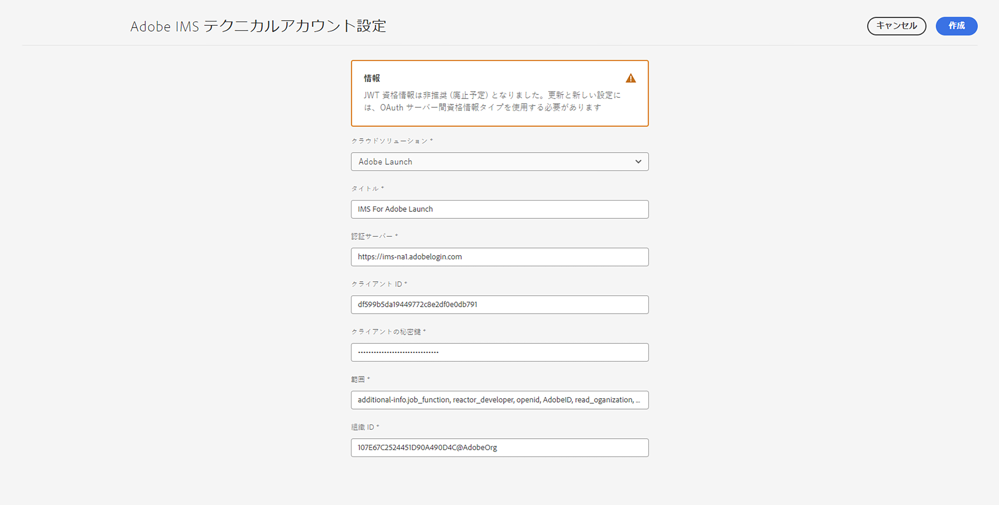
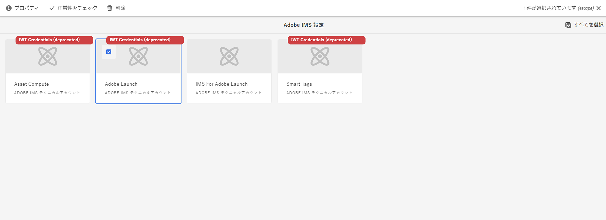
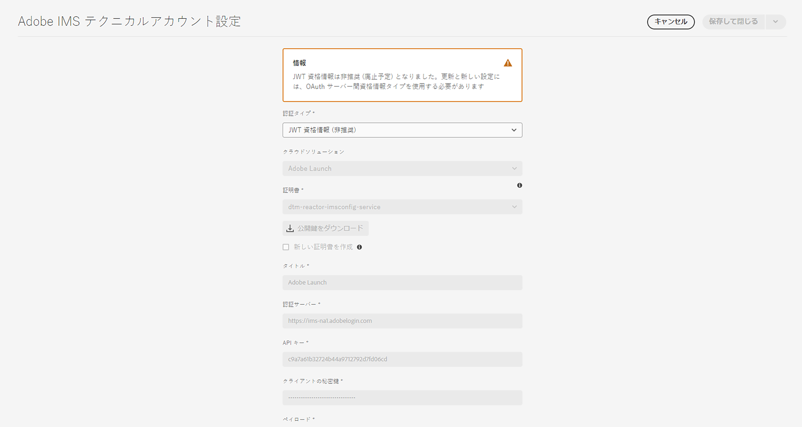
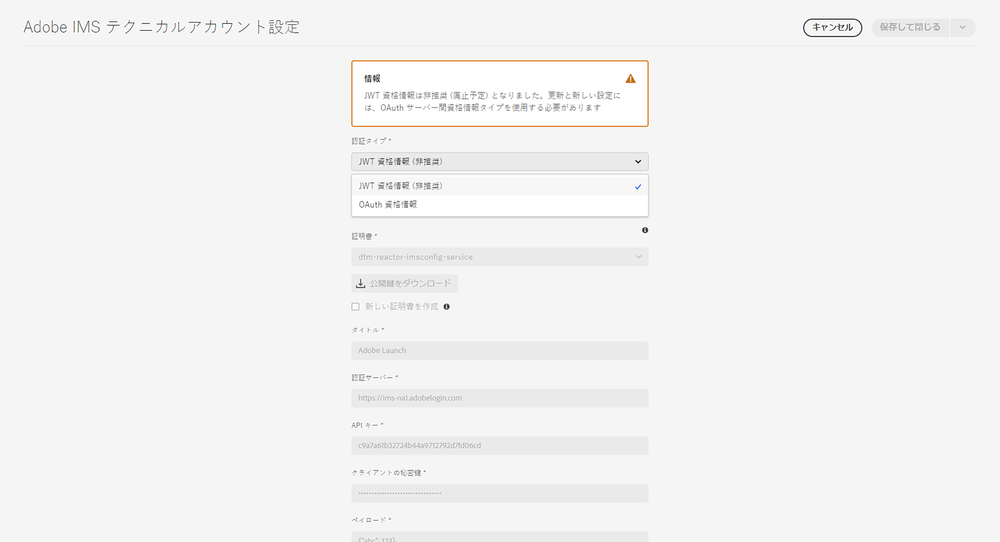
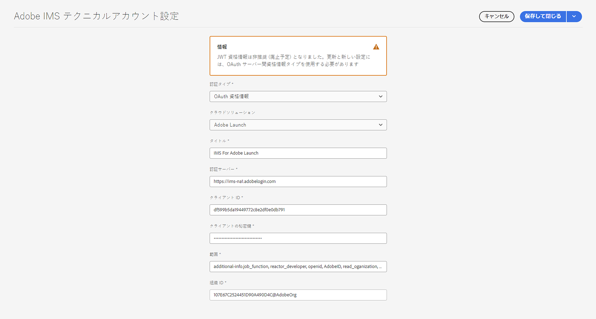

# AEM用 IMS 統合の設定as a Cloud Service {#setting-up-ims-integrations-for-aemaacs}

>[!NOTE]
>
>自動プロビジョニングされた JWT 設定はAdobeによって自動的に処理されるので、手動で移行しないでください。

Adobe Experience Manager（AEM）as a Cloud Serviceは、他の多くのAdobeソリューションと統合できます。 例えば、Adobe Target、Adobe Analyticsなどです。

これらの統合では、S2S OAuth で設定された IMS 統合を使用します。

* 作成が完了したら、以下を行います。

   * [Developer Console での資格情報](#credentials-in-the-developer-console)

* 次の操作を実行できます。

   * （新規）を作成 [OAuth 設定](#creating-oauth-configuration)

   * [既存の JWT 設定の OAuth 設定への移行](#migrating-existing-JWT-configuration-to-oauth)

>[!CAUTION]
>
>以前は、次の機能によって設定されていました [Adobe Developer コンソールで廃止される可能性がある JWT 資格情報](/help/security/jwt-credentials-deprecation-in-adobe-developer-console.md).
>
>このような設定は作成または更新できなくなりましたが、OAuth 設定に移行することができます。

## Developer Console での資格情報 {#credentials-in-the-developer-console}

最初の手順として、Adobe Developer コンソールで OAuth 資格情報を設定する必要があります。

この方法について詳しくは、要件に応じて、Developer Console のドキュメントを参照してください。

* 概要：

   * [サーバーからサーバーへの認証](https://developer.adobe.com/developer-console/docs/guides/authentication/ServerToServerAuthentication/)

* 新しい OAuth 認証情報の作成：

   * [OAuth サーバー間資格情報実装ガイド](https://developer.adobe.com/developer-console/docs/guides/authentication/ServerToServerAuthentication/implementation/)

* 既存の JWT 資格情報の OAuth 資格情報への移行：

   * [サービスアカウント（JWT）資格情報から OAuth サーバー間資格情報への移行](https://developer.adobe.com/developer-console/docs/guides/authentication/ServerToServerAuthentication/migration/)

次に例を示します。

## OAuth 設定の作成 {#creating-oauth-configuration}

OAuth を使用して新しいAdobe IMS統合を作成するには：

1. AEMで、に移動します。 **ツール**, **セキュリティ**, **Adobe IMSの統合**.

1. 「**作成**」を選択します。

1. からの詳細に基づいて設定を完了します。 [Developer Console](https://developer.adobe.com/developer-console/docs/guides/authentication/ServerToServerAuthentication/implementation/). 次に例を示します。

   

1. 変更を&#x200B;**保存**&#x200B;します。

## 既存の JWT 設定の OAuth 設定への移行 {#migrating-existing-JWT-configuration-to-oauth}

JWT 資格情報に基づいて既存のAdobe IMS統合を移行するには：

>[!NOTE]
>
>この例は、Launch IMS 設定を示しています。

1. AEMで、に移動します。 **ツール**, **セキュリティ**, **Adobe IMSの統合**.

1. 移行する必要がある JWT 設定を選択します。 JWT 設定に警告が表示される **JWT 資格情報（非推奨）**.

1. を選択 **プロパティ**:

   

1. 設定は読み取り専用として開きます。

   

1. を選択 **OAuth** から **認証タイプ** ドロップダウン：

   

1. 使用可能なプロパティが更新されます。 開発者コンソールの詳細を使用して、次の手順を実行します。

   

1. 使用方法 **保存して閉じる** をクリックして更新内容を保持します。
コンソールに戻ると、 **JWT 資格情報（非推奨）** 警告は表示されません。