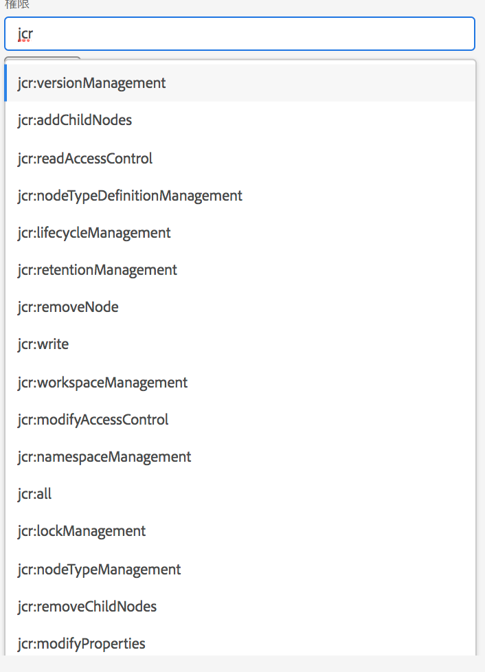
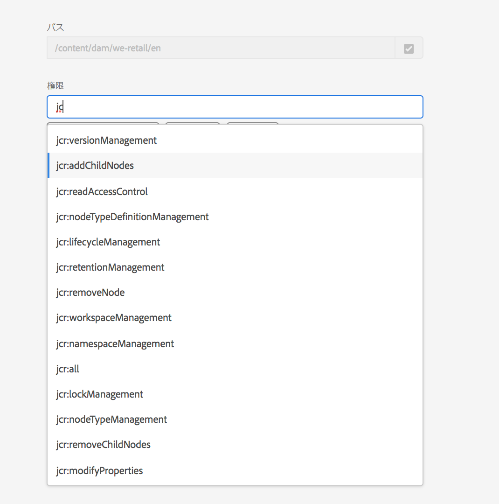

# 権限管理のプリンシパルビュー {#principal-view-for-permissions-management}

## 概要 {#overview}

AEM では、ユーザーとグループに対する権限管理が導入されました。主な機能は従来の UI と同じですが、よりユーザーフレンドリーで効率的です。

## UI へのアクセス {#accessing-the-ui}

次に示すように、新しい UI ベースの権限管理は、セキュリティの下の権限カードからアクセスします。

新しいビューでは、権限が明示的に付与されているすべてのパスで、特定のプリンシパルに対する特権と制限のセット全体を簡単に確認できます。高度な特権と制限を管理するのに

CRXDE に移動する必要がなくなります。同じビューに統合されました。

ユーザーが参照するプリンシパルの種類を、**ユーザー**、**グループ**&#x200B;または&#x200B;**すべて**&#x200B;から選択して、プリンシパルを検索できるフィルターがあります&#x200B;**。**

## プリンシパルの権限の表示 {#viewing-permissions-for-a-principal}

左側のフレームでは、下にスクロールしてプリンシパルを見つけるか、下に示すように、選択したフィルターに基づいてグループまたはユーザーを検索できます。

名前をクリックすると、割り当てられた権限が右側に表示されます。権限ウィンドウに、特定のパス上のアクセス制御エントリと、設定された制限の一覧が表示されます。

## プリンシパルに対する新しいアクセス制御エントリの追加 {#adding-new-access-control-entry-for-a-principal}

新しい権限は、アクセス制御エントリを追加することで追加できます。「ACE を追加」ボタンをクリックします。

これにより、以下のウィンドウが表示されます。次の手順では、許可を設定する必要があるパスを選択します。

ここでは、パスを選択し、そこで **dam-users** の権限を設定できます。

パスが選択された後、ワークフローはこの画面に戻るので、以下に示すように、利用可能な名前空間（`jcr`、`rep`、`crx` など）から 1 つ以上の権限を選択します。

テキストフィールドを使用して検索し、リストから選択することで権限を追加できます。

>[!NOTE]
>
>権限と説明の詳細なリストについては、[ユーザー、グループおよびアクセス権限の管理](https://experienceleague.adobe.com/ja/docs/experience-manager-65/content/security/user-group-ac-admin#access-right-management)を参照してください。

 

権限のリストが選択された後、以下に示すように、「拒否」または「許可」からアクセス権の種類を選択できます。

 

## 制限の使用 {#using-restrictions}

与えられたパス上の特権と許可の種類のリストに加えて、この画面では、以下に示すように、きめ細かいアクセス制御の制限を追加することもできます。

>[!NOTE]
>
>各制限の意味について詳しくは、[Jackrabbit Oak ドキュメント](https://jackrabbit.apache.org/oak/docs/security/authorization/restriction.html)を参照してください。

以下に示すように、制限タイプを選択し、値を入力して **+** アイコンを押すと、制限を追加できます。

 

次のように、新しい ACE がアクセス制御リストに反映されます。`jcr:write` は、上で追加された `jcr:removeNode` を含む集計権限ですが、`jcr:write` でカバーされているので、下に表示されません。

## ACE の編集 {#editing-aces}

アクセス制御エントリは、プリンシパルを選択し、編集する ACE を選択して編集できます。

例えば、ここでは **dam-users** の以下のエントリを、右側の鉛筆アイコンをクリックして編集できます。

編集画面には事前に選択された設定済み ACE が表示されます。これらは ACE の横にある × アイコンをクリックすると削除できます。また、下に示すように、指定したパスに新しい権限を追加できます。

ここでは、与えられたパス上の **dam-users** に、`addChildNodes` 権限が追加されます。

右上の「**保存**」ボタンをクリックして変更を保存します。以下のように、変更内容が **dam-users** の新しい権限に反映されます。

## ACE の削除 {#deleting-aces}

アクセス制御エントリを削除して、特定のパス上のプリンシパルに与えられているすべての権限を削除できます。次に示すように、ACE の横にある X アイコンを使用して ACE を削除できます。

 

## 権限ビュー {#permissions-view}

### タッチ UI の権限ビュー {#touch-ui-permisions-view}

管理者は、AEM 内のセキュリティと管理を強化するために、ノードレベルで権限の割り当てをより詳細に制御し、表示する必要があります。以前は、権限のプリンシパルベースのビューのみが使用可能で、特定のノードやフィルター処理されたビューに ACL がどのように適用されるかを確認する機能が制限されていました。新しいノードとフィルター処理されたビューは、権限割り当ての詳細でコンテキスト化された視点を提供し、セキュリティ設定の管理と監査を向上させることができます。この機能により、管理機能が強化され、権限管理が簡素化されるだけでなく、セキュリティが強化され、設定ミスが減り、AEM でのユーザーアクセス制御が効率化されます。

権限タッチ UI ビューにアクセスするには、以下に示すように、**ツール／セキュリティ／権限**&#x200B;の順にクリックします。

権限ビューを起動したら、表示環境設定に応じて、画面の右上隅にある&#x200B;**ノードビュー**&#x200B;または&#x200B;**フィルター処理されたビュー**&#x200B;をクリックできます。

#### ノードビュー

このビューでは、ACL は個々のノード（パス）ごとに表示されます。以下に関する情報が提供されます。

選択したノードのローカル ACL。
ルート（「/」）までのそれぞれの親ノードに適用される ACL を含む、有効な ACL。
ユーザーには、ACL を追加、削除または更新するオプションがあります。パスをクリックすると、左側のペインにその子が表示され、右側にそのパスに関連付けられたすべての ACL のテーブルビューが表示されます。

#### フィルタリング済みビュー

このビューを使用すると、指定したパスおよびプリンシパルに対する権限を効率的に検索できます。このビューでは、選択したパスのプリンシパルのグループに付与される権限のタイプを容易に判断できます。
さらに、フィルター処理されたビューには、有効な ACL に対するインサイトが表示されます。選択したプリンシパルと共通のプリンシパルを考慮して、選択したパスの親ノードに関連付けられた ACL が表示されます。

### リポジトリブラウザーの権限ビュー {#the-repository-browser-permissions-view}

権限ビューには、[リポジトリブラウザー](/help/implementing/developing/tools/repository-browser.md)経由でアクセスすることもできます。

以下の手順でそれにアクセスできます。

1. Developer Console を開き、「**リポジトリブラウザー**」タブをクリックしてから、「**リポジトリブラウザーを開く**」をクリックします

   

1. リポジトリブラウザーで、「**権限**」タブをクリックします

   

**注**：権限を表示するには、管理者権限が必要です。[こちら](/help/implementing/developing/tools/repository-browser.md#navigate-the-hierarchy-navigate-the-hierarchy)に記載されている手順に従って、権限にアクセスします。

## クラシック UI 権限の組み合わせ {#classic-ui-privilege-combinations}

新しい権限 UI では、付与された基本的な権限が正確に反映されていない事前定義の組み合わせの代わりに、基本的な権限のセットが明示的に使用されます。

その結果、設定内容に関して混乱が生じました。次の表に、クラシック UI の権限の組み合わせと、それらを構成する実際の権限とのマッピングを示します。

<table>
 <tbody>
  <tr>
   <th>クラシック UI 権限の組み合わせ</th>
   <th>権限 UI の権限</th>
  </tr>
  <tr>
   <td>読み取り</td>
   <td><code>jcr:read</code></td>
  </tr>
  <tr>
   <td>変更</td>
   <td>
<code>jcr:modifyProperties</code>
 
<code>jcr:lockManagement</code>
 
<code>jcr:versionManagement</code>
 </td>
  </tr>
  <tr>
   <td>作成</td>
   <td>
<code>jcr:addChildNodes</code>
 
<code>jcr:nodeTypeManagement</code>
 </td>
  </tr>
  <tr>
   <td>削除</td>
   <td>
<code>jcr:removeNode</code>
 
<code>jcr:removeChildNodes</code>
 </td>
  </tr>
  <tr>
   <td>ACL 読み取り</td>
   <td><code>jcr:readAccessControl</code></td>
  </tr>
  <tr>
   <td>ACL 編集</td>
   <td><code>jcr:modifyAccessControl</code></td>
  </tr>
  <tr>
   <td>レプリケーション</td>
   <td><code>crx:replicate</code></td>
  </tr>
 </tbody>
</table>
