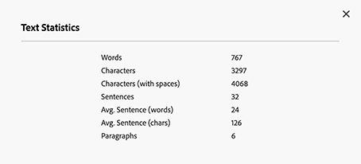
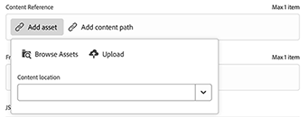
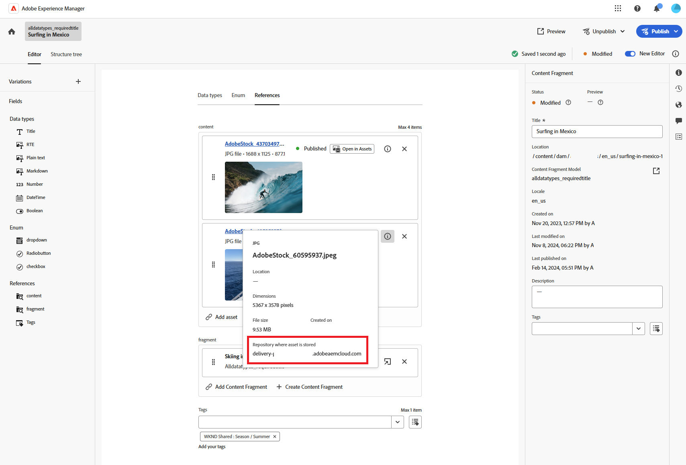
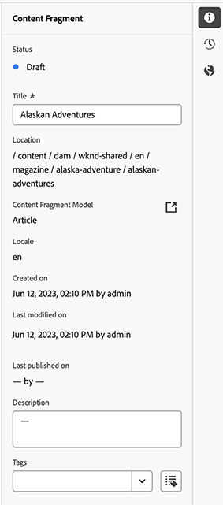
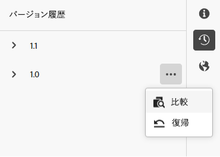
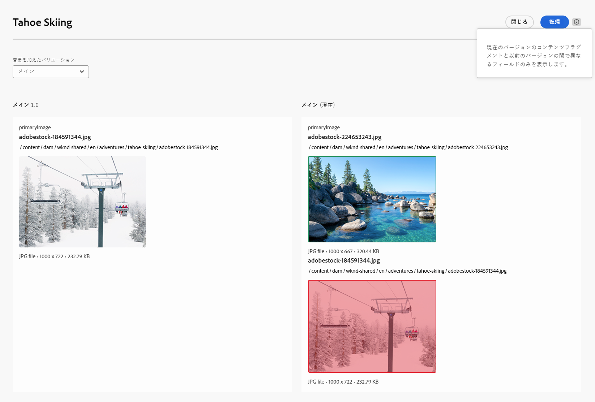
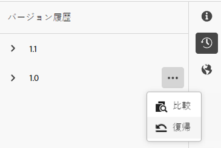
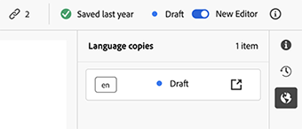

# コンテンツフラグメントのオーサリング {#authoring-content-fragments}

コンテンツフラグメントのオーサリングは、ヘッドレス配信とページオーサリングの両方に焦点を当てています。

コンテンツフラグメントをオーサリングするためのエディターは 2 つあります。 この節で説明するエディターは、

* ヘッドレスコンテンツ配信用に開発されています（ただし、すべてのシナリオで使用できます）。
* **コンテンツフラグメント**&#x200B;コンソールから使用できます。

このエディターで提供する機能は次のとおりです。

* [自動保存](#saving-autosaving)：誤って編集内容が失われることを防ぎます。
* [コンテンツ参照としてのアセットのインラインアップロード](#reference-images)で、最初にアセット DAM にアップロードする必要はありません。
* [バリエーションを生成](#generate-variations-ai)：生成 AI を使用して、プロンプトに基づいたコンテンツ作成を高速化します。
* コンテンツフラグメントによって配信されるレンダリングされたエクスペリエンスの[プレビュー](#preview-content-fragment)。
* エディターから[公開](#publish-content-fragment)および[非公開](#unpublish-content-fragment)する機能。
* エディターで[関連付けられた言語コピーを表示して開く](#view-language-copies)機能。
* エディターで[バージョンの詳細を表示](#view-version-history)する機能。 選択したバージョンに戻すこともできます。
* [親参照を表示して開く](#view-parent-references)機能。
* [構造ツリー](#structure-tree)を使用したコンテンツフラグメントの階層表示とその参照。

>[!NOTE]
>
>コンテンツフラグメントモデルとコンテンツフラグメントを使用する場合は、[ ベストプラクティス ](/help/sites-cloud/administering/content-fragments/overview.md) に注意してください。

>[!WARNING]
>
>この節で説明するエディターは、[統合シェル](/help/overview/aem-cloud-service-on-unified-shell.md)、つまり、ローカルインスタンスではなく、*オンライン*&#x200B;の Adobe Experience Manager（AEM）as a Cloud Service で&#x200B;*のみ*&#x200B;使用できます。

## コンテンツフラグメントエディター {#content-fragment-editor}

コンテンツフラグメントエディターを初めて開くと、次の 4 つの主なエリアが表示されます。

* 上部のツールバー：主要な情報とアクション
   * コンテンツフラグメントコンソールへのリンク（ホームアイコン）
   * モデルとフォルダーに関する情報
   * [ プレビュー ](#preview-content-fragment) へのリンク。モデルにデフォルトのプレビュー URL パターンが設定されている場合
   * [公開](#publish-content-fragment)および[非公開](#unpublish-content-fragment)アクション
   * すべての&#x200B;**親参照**&#x200B;を表示するオプション（リンクアイコン）
   * フラグメント&#x200B;**[ステータス](/help/sites-cloud/administering/content-fragments/managing.md#statuses-content-fragments)**、および最後に保存した情報
   * 元の（アセットベースの）エディターへの切替スイッチ

     >[!WARNING]
     >
     >元のエディターが同じタブに開きます。 両方のエディターを同時に開くことはお勧めしません。

* 左側のパネル：コンテンツフラグメントの&#x200B;**[バリエーション](#variations)**&#x200B;およびその&#x200B;**フィールド**&#x200B;が表示されます。
   * これらのリンクを使用して、[コンテンツフラグメント構造に移動](#navigate-structure)できます。
* 右側のパネル：[プロパティ（メタデータ）とタグを表示](#view-properties-tags)するタブ、[バージョン履歴](#view-version-history)および[言語コピー](#view-language-copies)に関する情報を表示します。
   * 「**プロパティ**」タブでは、フラグメントの&#x200B;**タイトル**&#x200B;および&#x200B;**説明**&#x200B;または&#x200B;**バリエーション**&#x200B;を更新できます
   * 「**コメント**」タブでは、他の作成者との共同作業に役立つコメントを追加および読み取ることができます。
* 中央パネル：選択したバリエーションの実際のフィールドとコンテンツを表示します
   * コンテンツの編集が可能
      * モデルで（複数として）設定した際、様々なデータタイプを使用して、関連するフィールドのインスタンスを&#x200B;**追加**&#x200B;できます。
   * 「**タブプレースホルダー**」フィールドがモデル内で定義されている場合は、ここに表示され、次のようになります。
      * ナビゲーションに使用できます。
      * 水平方向に表示されるか、ドロップダウンリストとして表示されます。

  >[!NOTE]
  >
  >基になるモデルの定義に応じて、フィールドは特定のタイプの[検証](/help/sites-cloud/administering/content-fragments/content-fragment-models.md#validation)の対象となる場合があります。

## コンテンツフラグメント構造のナビゲート {#navigate-structure}

単一のコンテンツフラグメント。

* 次の 2 つのレベルで構成されます。

   * コンテンツフラグメントの&#x200B;**[バリエーション](#variations)**
   * **フィールド** - コンテンツフラグメントモデルで定義され、すべてのバリエーションで使用されます。

* 様々な参照を含めることができます。

### バリエーションおよびフィールド {#variations-and-fields}

左側のパネルには、次の情報が表示されます。

* このフラグメントに作成された&#x200B;**[バリエーション](#variations)**&#x200B;のリスト。
   * **メイン**&#x200B;は、コンテンツフラグメントの最初の作成時に存在するバリエーションです。後で他のバリエーションを追加できます
   * [ バリエーションを生成 ](#generate-variations-ai) を使用して、Adobeが特定のユースケース用に作成したプロンプトベースのテンプレートを使用できます。
   * また、[バリエーションを作成](#create-variation)できます
* フラグメント内の&#x200B;**フィールド**&#x200B;とそのバリエーションは、次のとおりです。
   * アイコンは、[データタイプ](/help/sites-cloud/administering/content-fragments/content-fragment-models.md#data-types)を示します
   * テキストはフィールド名です
   * これらを組み合わせると、（現在のバリエーションの）中央パネルのフィールドコンテンツへの直接リンクが提供されます

### リンクへの移動 {#follow-links}

エディターの様々な部分で、リンクアイコンが表示されます。 このアイコンを使用して、コンテンツフラグメントモデル、親参照または参照されているフラグメントなど表示されている項目を開くことができます。

### 構造ツリー {#structure-tree}

エディターのツールバーから「**構造ツリー**」タブを開いて、コンテンツフラグメントの階層構造とその参照を表示します。 リンクアイコンを使用して参照に移動します。

>[!NOTE]
>
>詳しくは、[コンテンツフラグメント構造の分析 - 構造ツリー](/help/sites-cloud/administering/content-fragments/analysis.md#structure-tree)を参照してください。

## 保存と自動保存 {#saving-autosaving}

<!-- CHECK: cannot be saved, no undo, redo -->

更新を行うたびに、コンテンツフラグメントが自動的に保存されます。 最後に保存した時間が上部のツールバーに表示されます。

## バリエーション {#variations}

[バリエーション](/help/sites-cloud/administering/content-fragments/overview.md#main-and-variations)は、AEM のコンテンツフラグメントの重要な機能です。 これにより、特定のチャネルやシナリオで使用する&#x200B;**メイン**&#x200B;コンテンツのコピーを作成および編集でき、ヘッドレスコンテンツ配信やページオーサリングをより柔軟に行うことができます。

エディターから、次の操作を実行できます。

* **メイン**&#x200B;コンテンツの[バリエーションを作成](#create-variation)

* [「バリエーションを生成」AI を使用](#generate-variations-ai)：生成 AI を使用すると、アドビが特定のユースケース用に作成したプロンプトベースのテンプレートを使用できます。

* コンテンツの編集に必要なバリエーションを選択

* [バリエーションの名前を変更](#rename-variation)

* [バリエーションを削除](#delete-variation)

### バリエーションを作成 {#create-variation}

コンテンツフラグメントのバリエーションを作成するには、次の手順に従います。

1. 左側のパネルで、**バリエーション**&#x200B;の右側にある&#x200B;**プラス記号**（**バリエーションを作成**）を選択します。

   >[!NOTE]
   >
   >最初のバリエーションを作成すると、既存のバリエーションが同じパネルに表示されます。

   

1. ダイアログで、必要に応じて、バリエーションの&#x200B;**タイトル**&#x200B;および&#x200B;**説明**&#x200B;を入力します。

   

1. バリエーションを&#x200B;**作成**&#x200B;します。 作成したバリエーションがリストに表示されます。

### バリエーションの名前の変更 {#rename-variation}

**バリエーション**&#x200B;の名前を変更するには、次の手順に従います。

1. 必要なバリエーションを選択します。

1. 右側のパネルの「**プロパティ**」タブをを開きます。

1. バリエーション&#x200B;**タイトル**&#x200B;を更新します。

1. 「**戻る**」を押すか、別のフィールドに移動して、変更を自動保存します。 左側の&#x200B;**バリエーション**&#x200B;パネルでタイトルが更新されます。

### 「バリエーションを生成」で生成 AI を使用したバリエーションの作成 {#generate-variations-ai}

生成バリエーションを使用して生成 AI を活用し、コンテンツ作成を高速化します。

コンテンツフラグメントエディターを開き、バリエーションを生成するエントリポイントを見つけます。

詳しくは、[バリエーションを生成 – AEM エディターに統合済み](/help/generative-ai/generate-variations-integrated-editor.md)を参照してください。

### バリエーションを削除 {#delete-variation}

コンテンツフラグメントのバリエーションを削除するには、次の手順に従います。

>[!NOTE]
>
>**メイン**&#x200B;は削除できません。

1. 「バリエーション」を選択します。

1. **バリエーション**&#x200B;パネルで、削除アイコン（ごみ箱）を選択します。

   

1. ダイアログが表示されます。 「**作成**」を選択して、アクションを確定します。

## 複数行テキストフィールドの編集 - プレーンテキストまたはマークダウン {#edit-multi-line-text-fields-plaintext-markdown}

**[複数行テキスト](/help/sites-cloud/administering/content-fragments/content-fragment-models.md#data-types)**&#x200B;フィールドは、次の 3 つの形式のいずれかを持つことができます。

* プレーンテキスト
* [マークダウン](/help/sites-cloud/administering/content-fragments/markdown.md)
* [リッチテキスト](#edit-multi-line-text-fields-rich-text)

「プレーンテキスト」または「マークダウン」として定義されたフィールドには、（画面上の）書式設定オプションのないシンプルなテキストボックスがあります。

## 複数行テキストフィールドの編集 - リッチテキスト {#edit-multi-line-text-fields-rich-text}

**リッチテキスト**&#x200B;として定義された&#x200B;**[複数行テキスト](/help/sites-cloud/administering/content-fragments/content-fragment-models.md#data-types)**&#x200B;フィールドでは、様々な機能を使用できます。

* コンテンツを編集します。
   * 取り消し／やり直し
   * ペースト／テキストとしてペースト
   * コピー
   * 段落書式を選択
   * テーブルを作成／管理
   * テキストの書式設定（太字、斜体、下線、色）
   * 段落の整列を設定
   * リスト（箇条書き、番号付き）を作成／管理
   * テキストをインデント（減らす、増やす）
   * 現在の書式設定をクリア
   * リンクを挿入
   * 画像アセットへの参照を選択して挿入
   * 特殊文字を追加
* [全画面表示エディター](#full-screen-editor-rich-text) - 全画面とインフローの切り替え
* [統計](#statistics-rich-text)
* [比較と同期](#compare-and-synchronize-rich-text)

例：

>[!NOTE]
>
>複数行テキストフィールドも、**フィールド**&#x200B;パネルに適切な[アイコン](#fields-datatypes-icons)で示されます。

### 全画面表示エディター - リッチテキスト {#full-screen-editor-rich-text}

全画面表示エディターでは、インフロー時と同じ編集オプションを提供しますが、テキスト用のスペースがより広くなります。

例：

### 統計 - リッチテキスト {#statistics-rich-text}

アクション&#x200B;**統計**&#x200B;は、「複数行」フィールドに、テキストに関する様々な情報を表示します。

例：

### 比較と同期 - リッチテキスト {#compare-and-synchronize-rich-text}

アクション&#x200B;**比較**&#x200B;は、**バリエーション**&#x200B;を開いた際に「複数行」フィールドで使用できます。

これにより、「複数行」フィールドが全画面表示で開き、次のように表示されます。

* **メイン**&#x200B;と現在の&#x200B;**バリエーション**&#x200B;の両方のコンテンツを横に並べ、違いをハイライト表示する

* 違いは色で示されます。

   * 緑は（バリエーションに）追加されたコンテンツを示します
   * 赤は削除されたコンテンツを示します（バリエーションからの削除）
   * 青は置換されたテキストを示します

* **メイン**&#x200B;から現在のバリエーションにコンテンツを同期する&#x200B;**同期**&#x200B;アクションを提供する

   * **メイン**&#x200B;が更新された場合、これらの変更はバリエーションに転送される
   * バリエーションが更新された場合、これらの変更は&#x200B;**メイン**&#x200B;からコンテンツによって上書きされる

  >[!CAUTION]
  >
  >同期を使用できるのは、***メイン**からバリエーションに*&#x200B;変更内容をコピーする場合のみです。
  >
  >*バリエーションから&#x200B;**メイン***への変更内容を転送することはオプションとして使用できません。

例えば、バリエーションコンテンツが完全に書き換えられたシナリオの場合、同期によってその新しいコンテンツが&#x200B;**メイン**&#x200B;からのコンテンツに置き換わります。

## 参照の管理 {#manage-references}

### フラグメント参照 {#fragment-references}

[フラグメント参照](/help/sites-cloud/administering/content-fragments/content-fragment-models.md#fragment-reference-nested-fragments)は、次の目的で使用できます。

* [既存のコンテンツフラグメントへの参照を作成する](#create-reference-existing-content-fragment)
* [コンテンツフラグメントを作成し、それを参照する](#create-reference-content-fragment)

#### 既存のコンテンツフラグメントへの参照を作成する {#create-reference-existing-content-fragment}

既存のコンテンツフラグメントへの参照を作成するには、次の手順に従います。

1. フィールドを選択します。
1. 「**既存のフラグメントを追加**」を選択します。
1. フラグメントセレクターから必要なフラグメントを選択します。

   >[!NOTE]
   >
   >一度に 1 つのフラグメントのみを選択できます。

#### コンテンツフラグメントおよび参照の作成 {#create-reference-content-fragment}

または、[「**新規フラグメントを作成**」を選択して、**作成**&#x200B;ダイアログを開く](/help/sites-cloud/administering/content-fragments/managing.md#creating-a-content-fragment)ことができます。 作成後、このフラグメントは参照されます。

### コンテンツ参照 {#content-references}

[コンテンツ参照](/help/sites-cloud/administering/content-fragments/content-fragment-models.md#content-reference)は、画像、ページ、エクスペリエンスフラグメントなど、他の AEM コンテンツタイプを参照するのに使用されます。

#### 参照画像 {#reference-images}

「**コンテンツ参照**」フィールドでは、次の操作を実行できます。

* ローカルリポジトリに既に存在するアセットを参照する。
* リモートリポジトリに存在するアセットを参照する。
* アセットをフィールドに直接アップロードするので、**アセット**&#x200B;コンソールを使用せずにアップロードする。

  >[!NOTE]
  >
  >画像を直接「**コンテンツ参照**」フィールドにアップロードする際&#x200B;**必須**&#x200B;事項は、次のとおりです。
  >
  >* [コンテンツフラグメントモデル](/help/sites-cloud/administering/content-fragments/content-fragment-models.md#content-reference)に&#x200B;**ルートパス**&#x200B;が定義されていること 画像を保存する場所を指定します。
  >* 許可されたコンテンツタイプのリストに&#x200B;**画像**&#x200B;が含められていること

##### ローカルアセットの参照 {#reference-local-assets}

ローカルアセットを参照するには、次のいずれかを実行します。

* 新しいアセットファイルを（例えば、ファイルシステムから）「**コンテンツ参照**」フィールドに直接ドラッグ＆ドロップします
* **アセットを追加**&#x200B;アクションを選択して、「**アセットを参照**」または「**アップロード**」を選択して、使用する適切なセレクターを開きます。

  

##### リモートアセットの参照 {#reference-remote-assets}

リモートアセットを参照するには：

1. アセットを参照する際にリモート&#x200B;**リポジトリ**&#x200B;を指定します。

   

2. 選択後、アセット情報内に場所が表示されます。

   

###### リモートアセット - 制限事項 {#remote-assets-limitations}

リモートアセットを参照する際、いくつかの制限事項があります。

* リモートアセットリポジトリから参照できるのは、[承認済み](/help/assets/approve-assets.md)アセットのみです。

* 参照されているアセットをリモートリポジトリから削除すると、コンテンツ参照が破損します。

* ユーザーがアクセス権を持つすべての配信アセットリポジトリが選択可能になりますが、使用可能なリストは制限できません。

* AEM インスタンスとリモートアセットリポジトリインスタンスは、両方とも同じバージョンにする必要があります。

* アセットメタデータは、Management API および Delivery API 経由では公開されません。アセットメタデータの詳細を取得するには、Asset Metadata API を使用する必要があります。

   * 個々のアセットメタデータ：[https://developer.adobe.com/experience-cloud/experience-manager-apis/api/stable/assets/delivery/#operation/getAssetMetadata](https://developer.adobe.com/experience-cloud/experience-manager-apis/api/stable/assets/delivery/#operation/getAssetMetadata)

   * 検索 API を使用して一括メタデータ情報を取得（実験用）：[https://developer.adobe.com/experience-cloud/experience-manager-apis/api/stable/assets/delivery/#operation/search](https://developer.adobe.com/experience-cloud/experience-manager-apis/api/stable/assets/delivery/#operation/search)

>[!NOTE]
>
>詳しくは、[コンテンツフラグメントと共に使用する AEM GraphQL API - OpenAPI 用の Dynamic Media アセットのサポート（リモートアセット）](/help/headless/graphql-api/content-fragments.md#dynamic-media-for-openapi-asset-support)も参照してください。

#### 参照ページ {#reference-pages}

AEM ページ、エクスペリエンスフラグメントまたはその他のコンテンツタイプへの参照を追加するには、次の手順を実行します。

1. 「**コンテンツのパスを追加**」を選択します。

1. 入力フィールドに必要なパスを追加します。

1. 「**追加**」で確定します。

>[!NOTE]
>
>次への参照には使用しないでください。
>
>* コンテンツフラグメント - [フラグメント参照 ](#fragment-references)を使用
>* 画像 - [参照画像](#reference-images)を使用

### 親参照の表示 {#view-parent-references}

上部のツールバーでリンクアイコンを選択すると、すべての親参照のリストが開きます。

例：

ウィンドウが開き、関連するすべての参照が表示されます。 参照を開くには、名前、タイトルまたはリンクアイコンを選択します。

例：

## プロパティおよびタグの表示 {#view-properties-tags}

右側のパネルの「プロパティ」タブでは、プロパティ（メタデータ）とタグを表示できます。 プロパティは次のいずれかになります。

* **コンテンツフラグメント** - **メイン**&#x200B;が現在選択されている場合
* 特定の&#x200B;**バリエーション**

### プロパティおよびタグの編集 {#edit-properties-tags}

「プロパティ」タブ（右側のパネル）では、次の項目も編集できます。

* **タイトル**
* **説明**
* **タグ**：ドロップダウンリストまたは選択ダイアログを使用

  

### コンテンツフラグメントモデルを開く {#open-content-fragment-model}

「**メイン**」を選択した場合、基になるコンテンツフラグメントモデルの名前が「プロパティ」セクションに表示されます。 リンクアイコンを選択すると、モデルが別のタブで開きます。

例：

## バージョン履歴の表示 {#view-version-history}

右側のパネルの「**バージョン履歴**」タブに、現在のバージョンと以前のバージョンの詳細が表示されます。

>[!NOTE]
>
>コンテンツフラグメントの公開時に新しいバージョンが作成されます。

### バージョンの比較 {#compare-version}

コンテンツフラグメントについては、以前のバージョンと現在のバージョンを比較できます。

以前のバージョンと現在のバージョンを比較するには、次の手順を実行します。

1. バージョンの横にある 3 点ドットアイコンを選択します。

1. 「**比較**」を選択します。

これで、コンテンツの現在のバージョンとコンテンツフラグメントの選択した以前のバージョンとの違いを表示するビューが開きます。 **変更のあるバリエーション**&#x200B;ドロップダウンで、メインコンテンツやバリエーションのコンテンツとの違いを表示するように選択できます。

違いは色で示されます。

* 緑は（現在のバージョンに）追加されたコンテンツを示します
* 赤は（現在のバージョンから）削除されたコンテンツを示します

### 特定のバージョンに戻す {#revert-version}

どのバージョンにも戻すことができます。

特定のバージョンに戻すには、次の手順に従います。

1. バージョンの横にある 3 点ドットアイコンを選択します。

1. 「**元に戻す**」を選択します。

## 言語コピーの表示 {#view-language-copies}

関連する言語コピーの「**言語プロパティ**」タブの詳細が表示されます。 リンクアイコンを選択すると、そのコピーが別のタブで開きます。

例：

>[!NOTE]
>
>コンテンツフラグメントの翻訳と言語コピーの作成について詳しくは、[AEM ヘッドレス翻訳ジャーニー](/help/journey-headless/translation/overview.md)を参照してください。

## フラグメントへのコメント {#commenting-on-your-fragment}

製品内およびコンテキスト内での共同作業を有効にするには、右側のパネルの「**コメント**」タブに次の機能があります。

* 新しいコメントを追加
* コメントで特定のユーザーをタグ付け
   * フラグメントを直接開くリンクを含む通知が届きます
* 既存のコメントに「いいね！」を付ける
* コメントに返信
* コメントを書式設定。基本的な書式設定が使用できます。
* 既存のコメントを通じてテキスト検索を実行
* 既存のコメントを編集
* コメントを削除

>[!NOTE]
>
>これらのコメントは、[元のエディターでは注釈](/help/assets/content-fragments/content-fragments-managing.md#annotating-a-content-fragment)として表示されず、[アセットコンソールのタイムライン](/help/assets/content-fragments/content-fragments-managing.md#timeline-for-content-fragments)にも表示されません。

## フラグメントのプレビュー {#preview-content-fragment}

コンテンツフラグメントエディターを使用すると、作成者は外部フロントエンドアプリケーションで編集内容をプレビューできます。 これには、エディターの上部のツールバーにある **[プレビュー](/help/sites-cloud/administering/content-fragments/preview.md#preview-url-pattern)** ボタンをアクティブにするために、**デフォルトのプレビュー URL パターン** を定義する必要があります。 このボタンを選択すると、（別のタブで）外部アプリケーションを起動して、コンテンツフラグメントをレンダリングできます。

## フラグメントの公開 {#publish-content-fragment}

フラグメントを次のいずれかに&#x200B;**公開**&#x200B;できます。

* プレビューインスタンス
* パブリッシュインスタンス

フラグメントは、エディターまたはコンソールから公開できます。 詳しくは、[フラグメントの公開とプレビュー](/help/sites-cloud/administering/content-fragments/managing.md#publishing-and-previewing-a-fragment)を参照してください。

## フラグメントを非公開 {#unpublish-content-fragment}

また、フラグメントを次のいずれかで&#x200B;**非公開**&#x200B;にすることができます。

* プレビューインスタンス
* パブリッシュインスタンス

フラグメントは、エディターまたはコンソールから非公開にすることができます。 詳しくは、[フラグメントの非公開](/help/sites-cloud/administering/content-fragments/managing.md#unpublishing-a-fragment)を参照してください。

## フィールド、データタイプおよびアイコン {#fields-datatypes-icons}

**フィールド**&#x200B;パネルには、コンテンツフラグメント内のすべてのフィールドが一覧表示されます。 アイコンは、**[データタイプ](/help/sites-cloud/administering/content-fragments/content-fragment-models.md#data-types)**&#x200B;を示します。

<table style="table-layout:auto">
 <tbody>
  <tr>
   <td>
<b>1 行のテキスト</b>
 </td>
   <td>
  
</td>
  </tr>
  <tr>
   <td>
<b>複数行テキスト</b>
 </td>
   <td>
  
</td>
  </tr>
  <tr>
   <td>
<b>数値</b>
 </td>
   <td>
  
</td>
  </tr>
  <tr>
   <td>
<b>ブーリアン</b>
 </td>
   <td>
  
</td>
  </tr>
  <tr>
   <td>
<b>日時</b>
 </td>
   <td>
  
</td>
  </tr>
  <tr>
   <td>
<b>列挙</b>
 </td>
   <td>
  
</td>
  </tr>
  <tr>
   <td>
<b>タグ</b>
 </td>
   <td>
  
</td>
  </tr>
  <tr>
   <td>
<b>コンテンツ参照</b>
 </td>
   <td>
  
</td>
  </tr>
  <tr>
   <td>
<b>フラグメント参照</b>
 </td>
   <td>
  
</td>
  </tr>
  <tr>
   <td>
<b>JSON オブジェクト</b>
 </td>
   <td>
  
</td>
  </tr>
  <tr>
   <td>
<b>タブプレースホルダー</b>

実際のアイコンでは表されませんが、<b>タブプレースホルダー</b> は左側のパネルに表示されます。  中央のパネルでも、図のように水平方向に表示されるか、ドロップダウンリストで表示されます（水平方向に表示するには数が多すぎる場合）。
 </td>
   <td>
  
</td>
  </tr>
 </tbody>
</table>

## 役に立つ知識 {#good-to-know}

* コンテンツフラグメントを編集するには、[適切な権限](/help/implementing/developing/extending/content-fragments-customizing.md#asset-permissions)が必要になります。 問題が発生している場合は、システム管理者にお問い合わせください。

  例えば、`edit` 権限を持っていない場合、エディターは読み取り専用になります。

* コンテンツフラグメントモデルでは、多くの場合、**タイトル**&#x200B;および **説明**&#x200B;の名前が付けられたデータフィールドを定義できます。 これらのフィールドが存在する場合、それらはユーザー定義のフィールドであり、フラグメントの編集中に&#x200B;*中央パネル*&#x200B;で更新できます。

  コンテンツフラグメントとそのバリエーションには、**タイトル**&#x200B;および **説明**&#x200B;とも呼ばれるメタデータフィールド（バリエーションのプロパティ）もあります。 これらのフィールドは、コンテンツフラグメントの不可欠な部分で、フラグメントの作成時に最初に定義されます。 これらは、フラグメントの編集中に&#x200B;*右パネル*&#x200B;で更新できます。

* [元のコンテンツフラグメントエディター](/help/assets/content-fragments/content-fragments-variations.md)の完全な情報については、Assets ドキュメントを参照してください - **Assets** コンソールと&#x200B;**コンテンツフラグメント**&#x200B;コンソールのどちらからでも利用できます。

* 必要に応じて、プロジェクトチームはエディターをカスタマイズできます。 詳しくは、[コンテンツフラグメントコンソールとエディターのカスタマイズ](/help/implementing/developing/extending/content-fragments-console-and-editor.md)を参照してください。
