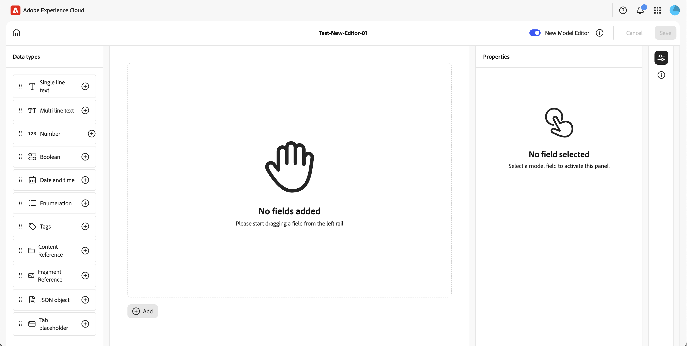
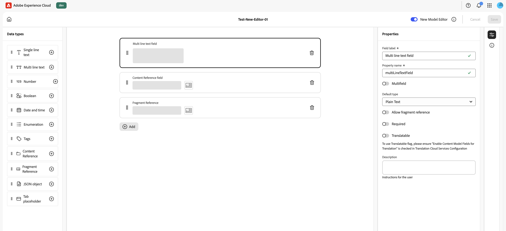
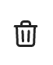
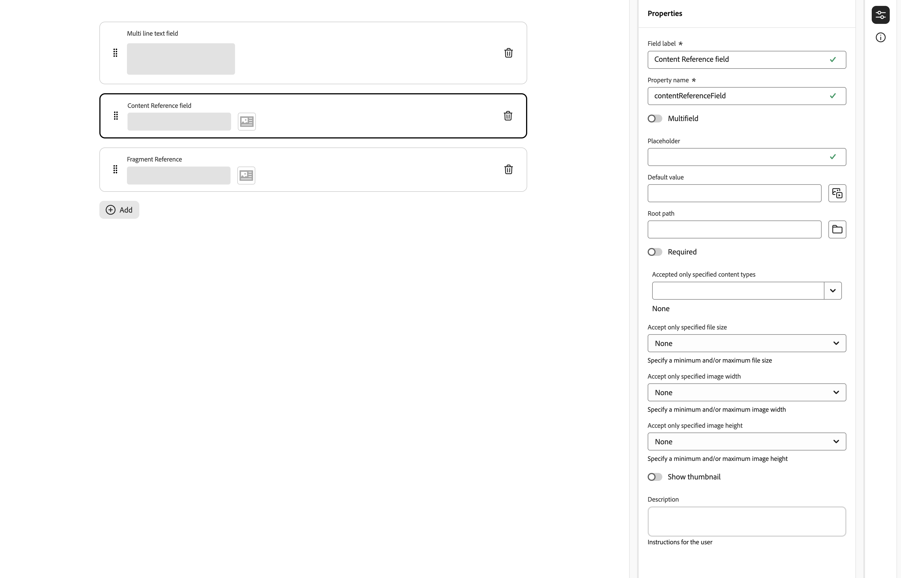
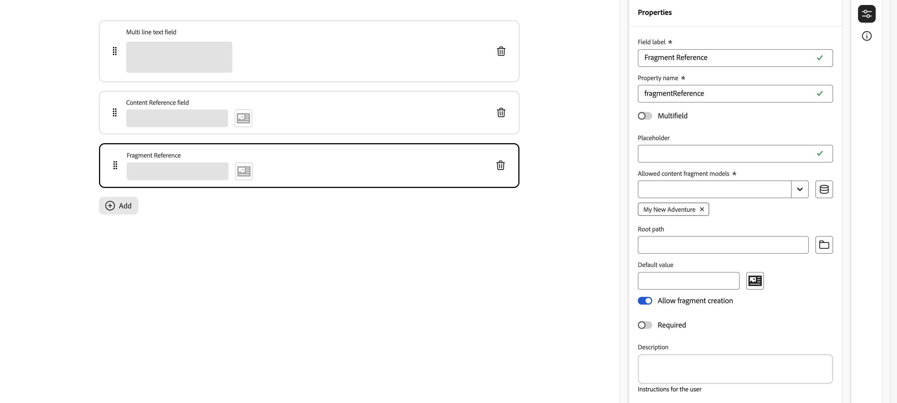

# コンテンツフラグメントモデルの定義 {#defining-content-fragment-models}

Adobe Experience Manager（AEM）as a Cloud Service のコンテンツフラグメントモデルでは、[コンテンツフラグメント](/help/sites-cloud/administering/content-fragments/overview.md)のコンテンツの構造を定義します。これらのフラグメントは、ページオーサリングまたはヘッドレスコンテンツの基盤として使用できます。

このページでは、専用のエディターを使用してコンテンツフラグメントモデルを定義する方法について説明します。[コンテンツフラグメントコンソールから実行できるアクション](/help/sites-cloud/administering/content-fragments/managing-content-fragment-models.md#actions)、[フォルダーでのモデルの許可](/help/sites-cloud/administering/content-fragments/managing-content-fragment-models.md#allowing-content-fragment-models-assets-folder)、[モデルの公開](/help/sites-cloud/administering/content-fragments/managing-content-fragment-models.md#publishing-a-content-fragment-model)など、フラグメントの作成後に実行できるタスクとオプションについて詳しくは、[コンテンツフラグメントモデルの管理](/help/sites-cloud/administering/content-fragments/managing-content-fragment-models.md)を参照してください。

>[!NOTE]
>
>コンテンツフラグメントモデルとコンテンツフラグメントを使用する場合は、[ ベストプラクティス ](/help/sites-cloud/administering/content-fragments/overview.md#best-practices) に注意してください。

>[!CAUTION]
>
>複数の参照されたフラグメントに対してクエリを実行する場合は、様々なフラグメントモデルに同じ名前でタイプが異なるフィールド名を付けることはお勧めしません。
>
>詳しくは、[コンテンツフラグメントと共に使用する AEM GraphQL API - 制限事項](/help/headless/graphql-api/content-fragments.md#limitations)を参照してください。

>[!NOTE]
>
>この新しいエディターでモデルを作成する場合、そのモデルには常にこのエディターを使用する必要があります。
>
>[ 元のモデルエディター ](/help/assets/content-fragments/content-fragments-models.md) でモデルを開くと、次のメッセージが表示されます。
>
>* 「このモデルには、カスタム UI スキーマが設定されています。 この UI に表示されるフィールドの順序は、UI スキーマと一致しない場合があります。 UI スキーマに合わせてフィールドを表示するには、新しいコンテンツフラグメントエディターに切り替える必要があります。」

## コンテンツフラグメントモデルの定義 {#defining-your-content-fragment-model}

コンテンツフラグメントモデルは、**[データタイプ](#data-types)**&#x200B;の選択を使用して、結果として得られるコンテンツフラグメントの構造を効果的に定義します。モデルエディターを使用して、データタイプのインスタンスを追加し、それらを設定して必須フィールドを作成できます。

>[!CAUTION]
>
>既存のコンテンツフラグメントで既に使用されているモデルを編集すると、それらの依存フラグメントに影響を与える可能性があります。

1. コンテンツフラグメントコンソールで、[コンテンツフラグメントモデル](/help/sites-cloud/administering/content-fragments/managing-content-fragment-models.md#basic-structure-handling-content-fragment-models-console)のパネルを選択し、コンテンツフラグメントモデルが格納されているフォルダーに移動します。

   >[!NOTE]
   >
   >また、モデルを[作成](/help/sites-cloud/administering/content-fragments/managing-content-fragment-models.md#creating-a-content-fragment-model)した後に直接開くこともできます。

1. 必要なモデルを **編集** 用に開きます。クイックアクションリンクのいずれかを使用するか、モデルを選択してツールバーからアクションを選択します。


   

   モデルを開くと、モデルエディターに以下の情報が表示されます。

   * 上位：
      * **ホーム** アイコン
      * [ 元の ](/help/assets/content-fragments/content-fragments-models.md) エディターと新しいエディターを切り替えるオプション
      * **キャンセル**
      * **保存**

   * 左：フィールドの作成に使用できる **データタイプ**

   * 中央：「**追加**」オプションとともに既に定義されているフィールド

   * 右：右端のアイコンを使用して、次のいずれかを選択できます。

      * **プロパティ**：選択したフィールドのプロパティを定義および表示します
      * **モデルの詳細**:**有効** ステータス、**モデルタイトル**、**タグ**、**説明** および **プレビュー URL** を表示します

1. **フィールドを追加するには**

   * 以下のいずれかの操作を行います。

      * データタイプを左側のパネルから、中央のパネルのフィールドに必要な場所にドラッグします。
      * データタイプで「**+**」アイコンを選択して、フィールドリストの下部に追加します。
      * 中央のパネルで **追加** を選択し、表示されるドロップダウンリストから必要なデータタイプを選択して、フィールドをリストの下部に追加します。

     >[!NOTE]
     >
     >**タブプレースホルダー** フィールドは、常に既存のフィールドの上に表示する必要があります。

   * フィールドボックスの左側にドットが表示されることで、フィールドの位置を変更することができます。

     

   * フィールドがモデルに追加され、選択されると、右側のパネルに特定のデータタイプに対して定義できる **プロパティ** が表示されます。 ここでは、特定のに必要なものを定義できます
フィールド。

      * 多くのプロパティは自明です。詳しくは、[プロパティ（データタイプ）](#properties)を参照してください。
      * 「**フィールドラベル**」を入力すると、「**プロパティ名**」が空欄の場合は自動入力され、後で手動で更新できます。

        >[!CAUTION]
        >
        >データタイプのプロパティの「**プロパティ名**」を手動で更新する場合、名前には、A～Z、a～z、0～9 および特殊文字のアンダースコア「_」*のみ*&#x200B;を使用することができます。
        >
        >以前のバージョンの AEM で作成されたモデルに不正な文字が含まれている場合は、それらの文字を削除または更新します。

     例：

     

     >[!NOTE]
     >
     >フィールドが **必須** として定義されている場合、中央のウィンドウに表示される **ラベル** にアスタリスク（**&#42;**）が付きます。

1. **フィールドを削除するには**

   中央のパネルの適切なフィールドにごみ箱アイコンを選択します。

   

1. すべての必須フィールドを追加し、必要に応じて関連するプロパティを定義します。

1. 「**保存**」を選択して、定義を保持します。

## データタイプ {#data-types}

モデルの定義には、次のデータタイプを選択できます。

* **1 行のテキスト**
   * 1 行のテキストのフィールドを追加（最大長は定義可能）
   * フィールドは、フラグメント作成者がフィールドの新しいインスタンスを作成できるように設定可能

* **複数行テキスト**
   * リッチテキスト、プレーンテキストまたはマークダウンのテキストエリア
   * フィールドは、フラグメント作成者がフィールドの新しいインスタンスを作成できるように設定可能

  >[!NOTE]
  >
  >テキストエリアがリッチテキスト、プレーンテキストまたはマークダウンのどれであるかは、モデル内で、プロパティの&#x200B;**デフォルトのタイプ**&#x200B;によって定義されます。
  >
  >この形式は、[コンテンツフラグメントエディター](/help/sites-cloud/administering/content-fragments/authoring.md)から変更はできませんが、モデルからのみ変更できます。

* **数値**
   * 数値フィールドを追加
   * フィールドは、フラグメント作成者がフィールドの新しいインスタンスを作成できるように設定可能

* **ブール型**
   * ブール型チェックボックスを追加

* **日時**
   * 日付／時間フィールドを追加

* **列挙**
   * チェックボックス、ラジオボタン、ドロップダウンフィールドのセットを追加
      * フラグメント作成者が使用できるオプションを指定可能

* **タグ**
   * フラグメント作成者がタグの領域にアクセスして選択できるようにする

* **フラグメント参照**
   * 他のコンテンツフラグメントの参照を[ネストされたコンテンツの作成](#using-references-to-form-nested-content)に使用可能
   * このデータタイプは、フラグメント作成者が次の操作を行えるように設定可能です。
      * 参照先フラグメントの直接編集
      * 適切なモデルに基づいた新しいコンテンツフラグメントの作成
      * フィールドの新しいインスタンスの作成
   * 参照は、参照先リソースへのパスを指定します。例：`/content/dam/path/to/resource`

     <!--
    * Internally the reference is held as a universally unique ID (UUID) that references the resource
    * You do not need to know the UUID; in the fragment editor you can browse to the required fragment.
    -->

  <!--
  >[!NOTE]
  >
  >The UUIDs are repository specific. If you use the [Content Copy Tool](/help/implementing/developing/tools/content-copy.md) to copy Content Fragments, the UUIDs will be recalculated in the target environment.
  -->

* **コンテンツ参照**
   * 任意のタイプの他のコンテンツの参照を[ネストされたコンテンツの作成](#using-references-to-form-nested-content)に使用可能
   * 画像が参照されている場合は、サムネールを表示するように選択可能
   * フィールドは、フラグメント作成者がフィールドの新しいインスタンスを作成できるように設定可能
   * 参照は、参照先リソースへのパスを指定します。例：`/content/dam/path/to/resource`

     <!--
    * Internally the reference is held as a universally unique ID (UUID) that references the resource
    * You do not need to know the UUID; in the fragment editor you can browse to the required asset resource
    -->

  <!--
  >[!NOTE]
  >
  >The UUIDs are repository specific. If you use the [Content Copy Tool](/help/implementing/developing/tools/content-copy.md) to copy Content Fragments, the UUIDs will be recalculated in the target environment.
  -->

* **JSON オブジェクト**
   * コンテンツフラグメントの作成者がフラグメントの対応する要素に JSON 構文を入力できます。
      * 別のサービスからコピー＆ペーストした JSON を AEM に直接保存できるようにします。
      * JSON が渡され GraphQL で JSON として出力されます。
      * コンテンツフラグメントエディターに JSON 構文のハイライト表示機能、オートコンプリートおよびエラーのハイライト表示機能が含まれています。

* **タブプレースホルダー**
   * コンテンツフラグメントコンテンツの編集時に使用するタブを導入を許可します。
      * モデルエディターで区切りとして表示され、コンテンツデータタイプのリストをセクションに分割します。各インスタンスは、新しいタブの開始を表します。
      * フラグメントエディターでは、各インスタンスがタブとして表示されます。

     >[!NOTE]
     >
     >このデータタイプは書式設定にのみ使用され、AEM GraphQL スキーマでは無視されます。
     >
     >**タブプレースホルダー** フィールドは、常に既存のフィールドの上に表示する必要があります。

## プロパティ（データタイプ） {#properties}

多くのプロパティは一目瞭然です。プロパティによっては、次に示す追加の詳細情報があります。

* **プロパティ名**

  データタイプのこのプロパティを手動で更新する場合、名前には、A～Z、a～z、0～9 および特殊文字としてアンダースコア「_」*のみ*&#x200B;を使用する&#x200B;**必要があります**。

  >[!CAUTION]
  >
  >以前のバージョンの AEM で作成されたモデルに不正な文字が含まれている場合は、それらの文字を削除または更新します。

* **レンダリング形式**

  フラグメント内のフィールドを実現／レンダリングするための様々なオプション。多くの場合、これにより、オーサーにフィールドの 1 つのインスタンスが表示されるか、オーサーが複数のインスタンスを作成できるかを定義できます。**複数フィールド**&#x200B;を使用する場合、項目の最小数と最大数を定義できます。詳しくは、[検証](#validation)を参照してください。

* **フィールドラベル**
**フィールドラベル**&#x200B;を入力すると、**プロパティ名**&#x200B;を自動生成し、必要に応じて手動で更新できます。

* **検証**基本検証は、
**必須**&#x200B;プロパティなどのメカニズムで使用できます。一部のデータ型には、追加の検証フィールドがあります。詳しくは、「[検証](#validation)」を参照してください。

* データタイプが&#x200B;**複数行テキスト**&#x200B;の場合、「**デフォルトの種類**」を次のいずれかとして定義できます。

   * **リッチテキスト**
   * **Markdown**
   * **プレーンテキスト**

  指定しなかった場合は、デフォルト値の&#x200B;**リッチテキスト**&#x200B;がこのフィールドで使用されます。

  コンテンツフラグメントモデルで&#x200B;**デフォルトのタイプ**&#x200B;を変更した場合、その影響が既存の関連コンテンツフラグメントに及ぶのは、そのフラグメントがエディターで開かれて保存された後です。

* **一意**：
（特定のフィールドの）コンテンツは、現在のモデルから作成されたすべてのコンテンツフラグメントで一意である必要があります。

  これにより、同じモデルの別のフラグメントに既に追加されているコンテンツをコンテンツ作成者が繰り返し作成できないようになります。

  例えば、コンテンツフラグメントモデルの **1 行のテキスト**&#x200B;フィールド `Country` は、2 つの依存するコンテンツフラグメントで同じ `Japan` 値を持つことはできません。2 つ目のインスタンスが試行された場合、警告が表示されます。

  >[!NOTE]
  >
  >言語ルートごとに一意性が確保されます。

  >[!NOTE]
  >
  >バリエーションは、同じフラグメントのバリエーションと同じ&#x200B;*一意の*&#x200B;値を持つことができますが、他のフラグメントのバリエーションで使用されている値とは異なります。

* 特定のデータタイプとそのプロパティについて詳しくは、**[コンテンツ参照](#content-reference)**&#x200B;を参照してください。

* 特定のデータタイプとそのプロパティについて詳しくは、**[フラグメント参照（ネストされたフラグメント）](#fragment-reference-nested-fragments)**&#x200B;を参照してください。

* **変換可能**

  コンテンツフラグメントモデルエディターのフィールドの「**翻訳可能**」チェックボックスをオンにした場合：

   * フィールドのプロパティ名がまだ存在しない場合は、翻訳設定のコンテキスト `/content/dam/<sites-configuration>` に確実に追加されます。
   * GraphQL の場合：「コンテンツフラグメント」フィールドの `<translatable>` プロパティを `yes` に設定して、変換可能なコンテンツのみを含む JSON を出力するための GraphQL クエリフィルターを許可します。

## 検証 {#validation}

様々なデータ型に、結果のフラグメントにコンテンツが入力される際の検証要件を定義できるようになりました。

* **1 行のテキスト**
   * 事前定義された正規表現と比較します。
* **数値**
   * 特定の値を確認します。
* **コンテンツ参照**
   * 特定のタイプのコンテンツをテストします。
   * 指定したファイルサイズ以下のアセットのみを参照できます。
   * 定義済みの幅または高さ（ピクセル単位）の範囲に収まる画像のみを参照できます。
* **フラグメント参照**
   * 特定のコンテンツフラグメントモデルをテストします。
* **最小項目数**／**最大項目数**

  **複数フィールド**&#x200B;として定義されているフィールド（**レンダリング形式**&#x200B;で設定）には、次のオプションがあります。

   * **最小項目数**
   * **最大項目数**

  これらは、[コンテンツフラグメントエディター](/help/sites-cloud/administering/content-fragments/authoring.md)で検証されます。

## 参照の使用によるネストされたコンテンツの作成 {#using-references-to-form-nested-content}

コンテンツフラグメントは、次のいずれかのデータタイプを使用して、ネストされたコンテンツを作成できます。

* [コンテンツ参照](#content-reference)
   * 他のコンテンツへの単純な参照（任意のタイプ）を提供します。
   * **コンテンツ参照** データタイプによって提供されます
   * （結果のフラグメント内で）1 つまたは複数の参照に対して設定できます。

* [フラグメント参照](#fragment-reference-nested-fragments)（ネストされたフラグメント）
   * 指定した特定のモデルに応じて、他のフラグメントを参照します。
   * **フラグメント参照** データタイプによって提供されます
   * 構造化データを包含／取得できます。

     >[!NOTE]
     >
     >このメソッドは、[GraphQL でコンテンツフラグメントを使用したヘッドレスコンテンツ配信](/help/sites-cloud/administering/content-fragments/content-delivery-with-graphql.md)を使用する場合、特に重要になります。
   * （結果のフラグメント内で）1 つまたは複数の参照に対して設定できます。

<!--
>[!NOTE]
>
>See [Upgrade your Content Fragments for UUID References](/help/headless/graphql-api/uuid-reference-upgrade.md) for further information about Content/Fragment Reference and Content/Fragment Reference (UUID), and upgrading to the UUID-based data types.
-->

>[!NOTE]
>
>AEM では次の繰り返しを防止できます。
>
>* コンテンツ参照
>  これにより、ユーザーは現在のフラグメントに参照を追加できなくなり、フラグメント参照ピッカーダイアログが空になる場合があります。
>
>* GraphQL のフラグメント参照
>  相互に参照される複数のコンテンツフラグメントを返すディープクエリを作成する場合、最初に null が返されます。

>[!CAUTION]
>
>複数の参照されたフラグメントに対してクエリを実行する場合は、様々なフラグメントモデルに同じ名前でタイプが異なるフィールド名を付けることはお勧めしません。
>
>詳しくは、[コンテンツフラグメントと共に使用する AEM GraphQL API - 制限事項](/help/headless/graphql-api/content-fragments.md#limitations)を参照してください。

### コンテンツ参照 {#content-reference}

**コンテンツ参照** データタイプを使用すると、画像、ページ、エクスペリエンスフラグメントなどの別のソースからコンテンツをレンダリングできます。

標準プロパティに加えて、以下を指定できます。

* 参照コンテンツを保存する場所を指定または表す&#x200B;**ルートパス**

  >[!NOTE]
  >
  >これは、コンテンツフラグメントエディターの使用時に、このフィールドで画像を直接アップロードして参照する場合に必須です。
  >
  >詳しくは、[参照画像](/help/sites-cloud/administering/content-fragments/authoring.md#reference-images)を参照してください。

* 参照可能なコンテンツタイプ

  >[!NOTE]
  >
  >コンテンツフラグメントエディターの使用時に、このフィールドで画像を直接アップロードして参照する場合は、**画像**&#x200B;を含める必要があります。
  >
  >詳しくは、[参照画像](/help/sites-cloud/administering/content-fragments/authoring.md#reference-images)を参照してください。

* ファイルサイズの制限
* 画像が参照されている場合：

   * サムネールを表示
   * 画像の高さと幅の制限



### フラグメント参照（ネストされたフラグメント） {#fragment-reference-nested-fragments}

**フラグメント参照** データタイプは、1 つ以上のコンテンツフラグメントを参照できます。 複数のレイヤーを持つ構造化データを取得できるようになるので、アプリで使用するコンテンツを取得する場合、この機能は特に重要になります。

例：

* 次が含まれる従業員の詳細を定義するモデルです。
   * 事業主（会社）を定義するモデルへの参照

```xml
type EmployeeModel {
    name: String
    firstName: String
    company: CompanyModel
}

type CompanyModel {
    name: String
    street: String
    city: String
}
```

>[!NOTE]
>
>フラグメント参照は、[GraphQL でコンテンツフラグメントを使用したヘッドレスコンテンツ配信](/help/sites-cloud/administering/content-fragments/content-delivery-with-graphql.md)で特に重要になります。

標準プロパティに加えて、次のものを定義できます。

* **レンダリング時の名前**:

   * **multifield** - フラグメント作成者は個別の参照を複数作成できます。

   * **fragmentreference** - フラグメント作成者はフラグメントへの 1 つの参照を選択できます。

* **モデルタイプ**：
複数のモデルを選択できます。コンテンツフラグメントに参照を追加する場合、これらのモデルを使用して参照先のフラグメントが既に作成されている必要があります。

* **ルートパス**
任意の参照先フラグメントのルートパスを指定または表します。

* **フラグメントの作成を許可**

  これにより、フラグメント作成者は、適切なモデルに基づいてフラグメントを作成できるようになります。

   * **fragmentreferencecomposite** - フラグメント作成者が複数のフラグメントを選択して複合フラグメントを作成できるようになります。

  

>[!NOTE]
>
>繰り返し防止メカニズムが設定されます。これにより、ユーザーがフラグメント参照で現在のコンテンツフラグメントを選択できなくなり、フラグメント参照ピッカーダイアログが空になる場合があります。
>
>GraphQL にも、フラグメント参照の繰り返しを防止する機能があります。相互に参照する 2 つのコンテンツフラグメントにわたるディープクエリを作成すると、null が返されます。
