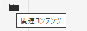
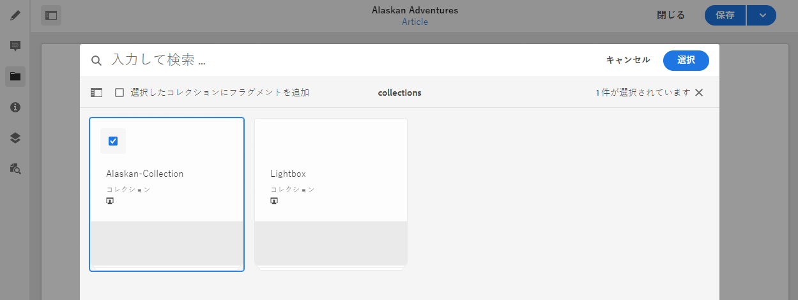
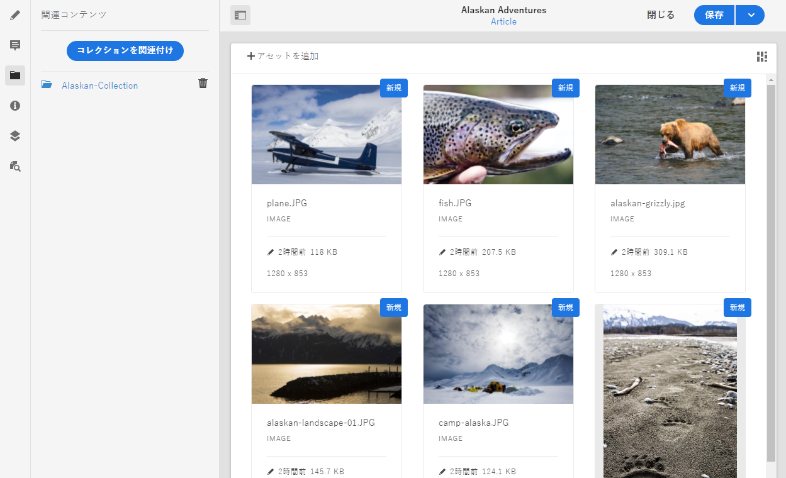

# 関連コンテンツ{#associated-content}

<!--
hide: yes
index: no
hidefromtoc: yes
-->

AEM の関連コンテンツ機能には接続が用意されており、フラグメントをコンテンツページに追加する際に、アセットをオプションでフラグメントと共に使用できます。これは、[ページでコンテンツフラグメントを使用する際にアクセスできる様々なアセットを提供](/help/sites-cloud/authoring/fundamentals/content-fragments.md#using-associated-content)することで行われ、適切なアセットを検索するために必要な時間を短縮させることもできます。これにより、ヘッドレスコンテンツ配信の柔軟性も向上させます。

## 関連コンテンツの追加 {#adding-associated-content}

>[!NOTE]
>
>[ビジュアルアセット（画像など）](/help/sites-cloud/administering/content-fragments/content-fragments.md#fragments-with-visual-assets)をフラグメントやページに追加するための様々な方法があります。

関連付けを作成するには、最初に[メディアアセットをコレクションに追加](/help/assets/manage-collections.md)する必要があります。それが完了した後で以下を実行できます。

1. フラグメントを開き、サイドパネルから「**関連コンテンツ**」を選択します。

   

1. コレクションが既に関連付けられているかどうかに応じて、次のいずれかを選択します。

   * **コンテンツを関連付け**  — 最初に関連付けられたコレクション
   * **コレクションを関連付け**  — 関連付けられたコレクションは既に設定されています

1. 必要なコレクションを選択します。

   選択したコレクションにフラグメント自体をオプションで追加できます。これにより追跡が可能になります。

   

1. 確定します（「**選択**」を使用）。コレクションが関連付けられて一覧表示されます。

   

## 関連コンテンツの編集 {#editing-associated-content}

コレクションを関連付けると、次の操作を実行できます。

* **削除** 関連団体。
* **アセットを追加** をコレクションに追加します。
* 追加のアクションを実行するアセットを選択します。
* アセットを編集します。
