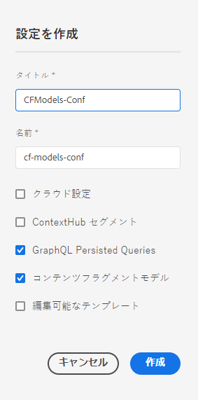
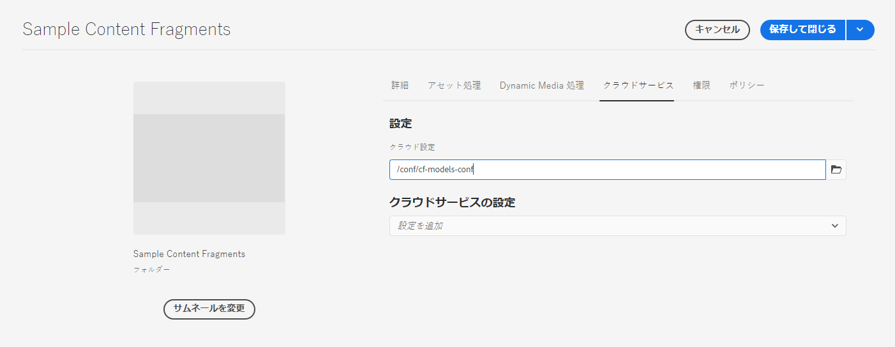

# コンテンツフラグメント - 設定ブラウザー{#content-fragments-configuration-browser}

設定ブラウザーで特定のコンテンツフラグメント機能を有効にする方法を説明します。

## インスタンスに対するコンテンツフラグメント機能の有効化 {#enable-content-fragment-functionality-instance}

コンテンツフラグメントを使用する前に、 **設定ブラウザー** 有効にするには：

* **コンテンツフラグメントモデル** - 必須
* **GraphQL 永続クエリ** - オプション

>[!CAUTION]
>
>**コンテンツフラグメントモデル**&#x200B;を有効にしない場合：
>
>* の **作成** オプションは、モデルの作成には使用できません。
>* できません [サイト設定を選択して関連するエンドポイントを作成します](/help/headless/graphql-api/graphql-endpoint.md).

コンテンツフラグメント機能を有効にするには、次の操作を行う必要があります。

* 設定ブラウザーを使用して、コンテンツフラグメント機能の使用を有効にする
* アセットフォルダーへの設定の適用

### 設定ブラウザーでコンテンツフラグメント機能を有効にする {#enable-content-fragment-functionality-in-configuration-browser}

特定の [コンテンツフラグメント機能](#creating-a-content-fragment-model)、 **必須** 最初に **設定ブラウザー**:

>[!NOTE]
>
>詳しくは、 [設定ブラウザー](/help/implementing/developing/introduction/configurations.md#using-configuration-browser).

>[!NOTE]
>
>[サブ設定](/help/implementing/developing/introduction/configurations.md#configuration-resolution) （別の設定内にネストされた設定）は、コンテンツフラグメント、コンテンツフラグメントモデル、GraphQLクエリで使用できます。
>
>注意：
>
>
>* サブ設定でモデルを作成した後は、モデルを別のサブ設定に移動またはコピーすることはできません。
>
>* GraphQLエンドポイントは、親（ルート）設定に基づいて（まだ）表示されます。
>
>* 永続化されたクエリは、親（ルート）設定に関連して（まだ）保存されます。

1. **ツール**／**一般**&#x200B;に移動し、**設定ブラウザー**&#x200B;を開きます。

1. 「**作成**」を使用してダイアログを開き、次の操作を行います。

   1. 「**タイトル**」を指定します。
   1. この **名前** はリポジトリ内のノード名になります。
      * タイトルに基づいて自動的に生成され、 [AEM命名規則](/help/implementing/developing/introduction/naming-conventions.md).
      * 必要に応じて調整できます。
   1. 使用できるようにするには、以下を選択します。
      * **コンテンツフラグメントモデル**
      * **GraphQL 永続クエリ**

      

1. 「**作成**」を選択して、定義を保存します。

<!-- 1. Select the location appropriate to your website. -->

### フォルダーへの設定の適用 {#apply-the-configuration-to-your-folder}

設定時 **global** はコンテンツフラグメント機能に対して有効で、この機能は、（からアクセス可能な）すべてのアセットフォルダーに適用されます。 **Assets** コンソール。

他の設定（グローバル以外）を同等の Assets フォルダーで使用するには、接続を定義する必要があります。 この接続は、 **設定** 内 **Cloud Services** タブ **フォルダーのプロパティ** 」と入力します。

