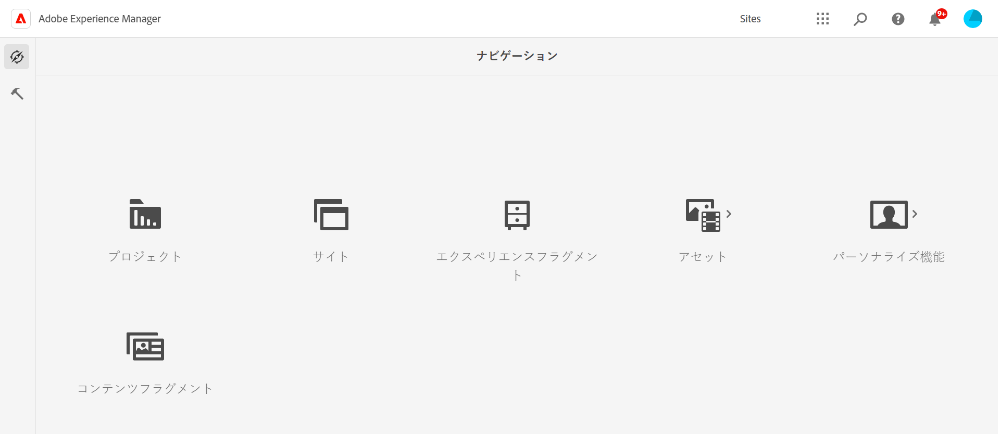
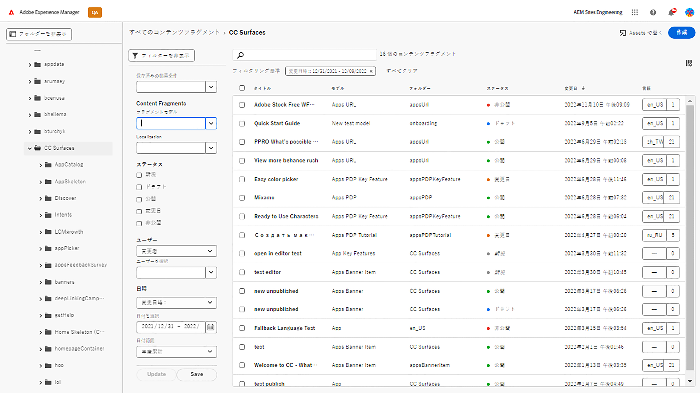

# コンテンツフラグメントコンソール  {#content-fragments-console}

コンテンツフラグメントコンソールを使用してコンテンツフラグメントへのアクセスを最適化する方法を説明します。公開、非公開、コピーなどの管理アクションを実行して、コンテンツフラグメントの作成、検索、管理を支援します。

コンテンツフラグメントコンソールは、コンテンツフラグメントの管理、検索および作成専用です。 ヘッドレスコンテキストでの使用に最適化されていますが、ページオーサリングで使用するコンテンツフラグメントを作成する際にも使用されます。

>[!NOTE]
>
>このコンソールには、コンテンツフラグメントのみが表示されます。 画像やビデオなど、他のアセットタイプは表示されません。

>[!NOTE]
>
>現在、次の場所からコンテンツフラグメントにアクセスできます。
>
>* この **コンテンツフラグメント** コンソール
>* の **Assets** コンソール — 「 [コンテンツフラグメントの管理](/help/assets/content-fragments/content-fragments-managing.md)

コンテンツフラグメントコンソールは、グローバルナビゲーションの最上位レベルから直接アクセスできます。

選択 **コンテンツフラグメント** コンソールを新しいタブで開きます。

ここでは、3 つの主な領域があることを確認できます。

* 上部のツールバー
   * 標準のAEM機能を提供
   * IMS 組織も表示します
* 左側のパネル
   * ここで、フォルダーツリーを非表示（表示）にできます
   * ツリーの特定のブランチを選択できます
* メイン/右パネル — ここから、次の操作を実行できます。
   * ツリーの選択したブランチのすべてのコンテンツフラグメントのリストを表示します
      * 場所はパンくずリストで示されます。これらは、場所を変更するために使用することもできます
      * 選択したフォルダーのコンテンツフラグメントと、すべての子フォルダーのコンテンツフラグメントが表示されます
         * コンテンツフラグメントに関する様々な情報フィールドには、リンクが表示されます。これらは、エディターで適切なフラグメントを開くことができます
      * 列ヘッダーを選択すると、その列に従ってテーブルを並べ替えることができます。「昇順」と「降順」を切り替えるには、再度選択します。
   * **[作成](#creating-new-content-fragment)** 新しいコンテンツフラグメント
   * [フィルター](#filtering-fragments) 選択した述語に従ってコンテンツフラグメントを作成し、後で使用するためにフィルターを保存します。
   * [検索](#searching-fragments) コンテンツフラグメント
   * テーブル表示をカスタマイズして、選択した情報列を表示します
   * 用途 **アセットで開く** 現在の場所を **Assets** コンソール。

      >[!NOTE]
      >
      >この **Assets** コンソールは、画像、ビデオなどのアセットにアクセスするために使用します。  このコンソールには、次の場所からアクセスできます。
      >
      >* の使用 **アセットで開く** リンク（コンテンツフラグメントコンソール内）
      >* グローバルナビゲーションウィンドウから直接

特定のフラグメントを選択すると、そのフラグメントで使用可能なアクションに焦点を当てたツールバーが開きます。 また、複数のフラグメントを選択することもできます。それに応じて、アクションの選択が調整されます。

## 新しいコンテンツフラグメントの作成 {#creating-new-content-fragment}

選択 **作成** コンパクトを開く **新しいコンテンツフラグメント** ダイアログ：

## フィルタリングフラグメント {#filtering-fragments}

フィルターパネルには、次の機能があります。

* 選択および組み合わせが可能な述語の選択
* ～する機会 **保存** 設定
* 保存済みの検索フィルターを再利用用に取得するオプション

## フラグメントの検索 {#searching-fragments}

検索ボックスは全文検索をサポートします。 検索ボックスに検索語句を入力する：

選択した結果が表示されます。

また、検索ボックスから **最近のコンテンツフラグメント** および **保存済みの検索結果**:

