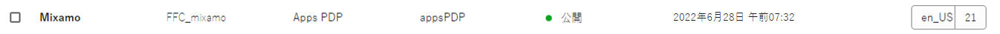
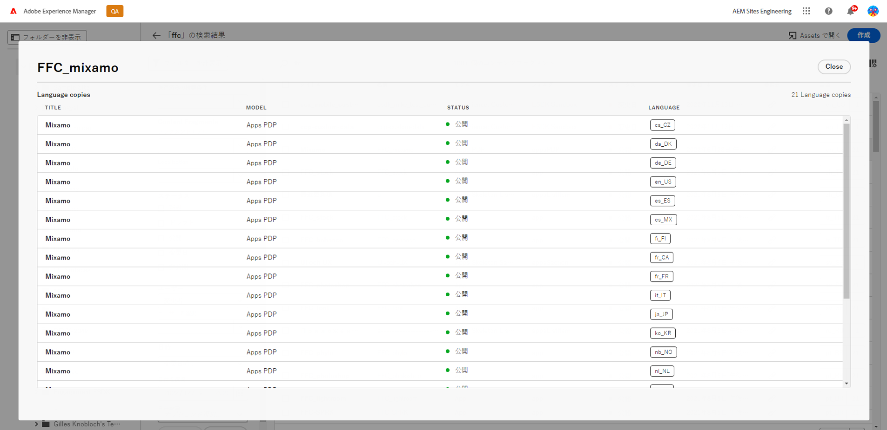

# コンテンツフラグメントコンソール  {#content-fragments-console}

コンテンツフラグメントコンソールを使用してコンテンツフラグメントへのアクセスを最適化する方法を説明します。公開、非公開、コピーなどの管理アクションを実行して、コンテンツフラグメントの作成、検索、管理を支援します。

コンテンツフラグメントコンソールは、コンテンツフラグメントの管理、検索および作成専用です。 ヘッドレスコンテキストでの使用に最適化されていますが、ページオーサリングで使用するコンテンツフラグメントを作成する際にも使用されます。

>[!NOTE]
>
>このコンソールには、コンテンツフラグメントのみが表示されます。 画像やビデオなど、他のアセットタイプは表示されません。

>[!NOTE]
>
>現在、次の場所からコンテンツフラグメントにアクセスできます。
>
>* この **コンテンツフラグメント** コンソール
>* の **Assets** コンソール — 「 [コンテンツフラグメントの管理](/help/assets/content-fragments/content-fragments-managing.md)

>[!NOTE]
>
>次の項目を選択： [このコンソールでは、キーボードショートカットを使用できます](/help/sites-cloud/administering/content-fragments/content-fragments-console-keyboard-shortcuts.md).

コンテンツフラグメントコンソールは、グローバルナビゲーションの最上位レベルから直接アクセスできます。

## コンソールの基本構造と操作 {#basic-structure-handling-content-fragments-console}

選択 **コンテンツフラグメント** コンソールを新しいタブで開きます。

ここでは、3 つの主な領域があることを確認できます。

* 上部のツールバー
   * 標準のAEM機能を提供
   * IMS 組織も表示します
* 左側のパネル
   * ここで、フォルダーツリーを非表示（表示）にできます
   * ツリーの特定のブランチを選択できます
* メイン/右パネル — ここから、次の操作を実行できます。
   * ツリーの選択したブランチ内のすべてのコンテンツフラグメントのリストを表示します。
      * 場所はパンくずリストで示されます。これらは、場所を変更するために使用することもできます
      * 選択したフォルダーのコンテンツフラグメントと、すべての子フォルダーのコンテンツフラグメントが表示されます。
         * [様々な情報フィールド](#selectuse-available-columns) コンテンツフラグメントに関するリンクフィールドに応じて、次のことが可能です。
            * エディターで適切なフラグメントを開きます。
            * 参照に関する情報を表示
            * フラグメントの言語バージョンに関する情報を表示
         * 以下が可能です。 [1 つ以上のコンテンツフラグメントを選択して使用可能なアクションを表示します](#actions-selected-content-fragment)
      * 列ヘッダーを選択すると、その列に従ってテーブルを並べ替えることができます。「昇順」と「降順」を切り替えるには、再度選択します。
   * **[作成](#creating-new-content-fragment)** 新しいコンテンツフラグメント
   * [フィルター](#filtering-fragments) 選択した述語に従ってコンテンツフラグメントを作成し、後で使用するためにフィルターを保存します。
   * [検索](#searching-fragments) コンテンツフラグメント
   * [テーブル表示をカスタマイズして、選択した情報列を表示します](#selectuse-available-columns)
   * 用途 **アセットで開く** 現在の場所を **Assets** コンソール

      >[!NOTE]
      >
      >この **Assets** コンソールは、画像、ビデオなどのアセットにアクセスするために使用します。  このコンソールには、次の場所からアクセスできます。
      >
      >* の使用 **アセットで開く** リンク（コンテンツフラグメントコンソール内）
      >* グローバルナビゲーションウィンドウから直接

## （選択した）コンテンツフラグメントのアクション {#actions-selected-content-fragment}

特定のフラグメントを選択すると、そのフラグメントで使用可能なアクションに焦点を当てたツールバーが開きます。 また、複数のフラグメントを選択することもできます。それに応じて、アクションの選択が調整されます。

* **次を開きます：**
* **公開** ( および **非公開**)
* **コピー**
* **移動**
* **名前を変更**
* **削除**

>[!NOTE]
>
>公開、非公開、削除、移動、名前変更、コピー、非同期ジョブのトリガーなどのアクション。 そのジョブの進行状況は、AEM非同期ジョブ UI で監視できます。

## コンテンツフラグメントに関して提供される情報 {#information-content-fragments}

コンソールのメイン/右パネル（テーブル表示）には、コンテンツフラグメントに関する様々な情報が表示されます。 また、一部の項目には、その他のアクションや情報への直接リンクも含まれます。

* **名前**
   * エディターでフラグメントを開くためのリンクを提供します。
* **モデル**
   * エディターでフラグメントを開くためのリンクを提供します。
* **フォルダー**
   * コンソールでフォルダーを開くためのリンクを提供します。
フォルダー名の上にマウスポインターを置くと、JCR パスが表示されます。
* **ステータス**

   * 情報のみ
* **変更**
   * 情報のみ
* **変更者**
   * 情報のみ
* **公開日時**
   * 情報のみ
* **公開者**
   * 情報のみ
* **参照元**

   * フラグメントのすべての親参照をリストするダイアログを開くリンクを提供します。参照するコンテンツフラグメント、エクスペリエンスフラグメント、ページを含める。 特定の参照を開くには、 **タイトル** をクリックします。

      

* **言語**

   * コンテンツフラグメントのロケールと、コンテンツフラグメントに関連付けられたロケール/言語コピーの合計数を示します。

      

      * カウントをクリックまたはタップして、すべての言語コピーを表示するダイアログを開きます。 特定の言語コピーを開くには、 **タイトル** をクリックします。

         

## 使用可能な列を選択 {#select-available-columns}

他のコンソールと同様に、表示され、アクションに使用できる列を設定できます。

表示または非表示にできる列のリストが表示されます。

## 新しいコンテンツフラグメントの作成 {#creating-new-content-fragment}

選択 **作成** コンパクトを開く **新しいコンテンツフラグメント** ダイアログ：

## フィルタリングフラグメント {#filtering-fragments}

フィルターパネルには、次の機能があります。

* 選択および組み合わせが可能な述語の選択
* ～する機会 **保存** 設定
* 保存済みの検索フィルターを再利用用に取得するオプション

## フラグメントの検索 {#searching-fragments}

検索ボックスは全文検索をサポートします。 検索ボックスに検索語句を入力する：

選択した結果が表示されます。

また、検索ボックスから **最近のコンテンツフラグメント** および **保存済みの検索結果**:

