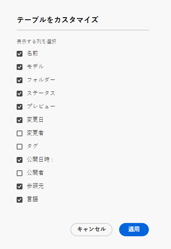

# コンテンツフラグメントコンソール  {#content-fragments-console}

コンテンツフラグメントコンソールを使用してコンテンツフラグメントへのアクセスを最適化する方法を説明します。公開、非公開、コピーなどの管理アクションを実行して、コンテンツフラグメントの作成、検索、管理を支援します。

コンテンツフラグメントコンソールは、コンテンツフラグメントの管理、検索および作成専用です。ヘッドレスコンテキストでの使用に最適化されていますが、ページオーサリングで使用するコンテンツフラグメントを作成する際にも使用されます。

>[!NOTE]
>
>このコンソールには、コンテンツフラグメントのみが表示されます。画像やビデオなど、他のアセットタイプは表示されません。

>[!NOTE]
>
>現在、次の場所からコンテンツフラグメントにアクセスできます。
>
>* この&#x200B;**コンテンツフラグメント**&#x200B;コンソール
>* **Assets** コンソール - [コンテンツフラグメントの管理](/help/assets/content-fragments/content-fragments-managing.md)を参照してください

>[!NOTE]
>
>[このコンソールで使用できるキーボード ショートカット](/help/sites-cloud/administering/content-fragments/content-fragments-console-keyboard-shortcuts.md)の選択。

>[!NOTE]
>
>必要に応じて、プロジェクトチームがコンソールをカスタマイズできます。 詳しくは、[コンテンツフラグメントコンソールのカスタマイズ](/help/implementing/developing/extending/content-fragment-console-customizing.md)を参照してください。

コンテンツフラグメントコンソールは、グローバルナビゲーションの最上位レベルから直接アクセスできます。

## コンソールの基本構造と基本操作 {#basic-structure-handling-content-fragments-console}

**コンテンツフラグメント**&#x200B;を選択すると、コンソールが新しいタブで開きます。

主な領域が 3 つあります。

* 上部のツールバー
   * 標準の AEM 機能を提供します
   * IMS 組織も表示します
* 左側のパネル
   * フォルダーツリーを表示したり非表示にしたりできます
   * ツリーの特定のブランチを選択できます
   * これは、ネストされたフォルダーを表示するようにサイズ変更できます
* 右側のメインパネル
   * 選択したツリーのブランチにあるすべてのコンテンツフラグメントのリストを表示します：
      * 場所はパンくずリストで示されます。これを使用して、場所を変更することもできます
      * 選択したフォルダーのコンテンツフラグメントと、すべての子フォルダーが表示されます：
         * コンテンツフラグメントに関する[様々な情報フィールド](#selectuse-available-columns)のリンクは、フィールドに応じて、次のことが可能です。
            * エディターで適切なフラグメントを開く
            * 参照に関する情報を表示
            * フラグメントの言語バージョンに関する情報を表示
      * 列ヘッダーにマウスオーバーを使用すると、ドロップダウンアクションセレクターと幅スライダーが表示されます。これらを使用すると、次のことができます。
         * 並べ替え - 昇順または降順に適切なアクションを選択します。
これにより、テーブル全体がその列に従って並べ替えられます。並べ替えは、適切な列でのみ使用できます。
         * 列のサイズを変更 - アクションまたは幅スライダーを使用します。

## アクション {#actions}

コンソール内では、直接または特定のフラグメントを選択した後に使用できる様々なアクションがあります。

* 様々なアクションが直接おこなわれます [コンソールから利用可能](#available-actions)
* 以下が可能です。 [コンテンツフラグメントを 1 つ以上選択して適切なアクションを表示します。](#actions-selected-content-fragment)

### アクション（未選択） {#actions-unselected}

特定のコンテンツフラグメントを選択しなくても、コンソールから使用できるアクションがいくつかあります。

* 新しいコンテンツフラグメントを&#x200B;**[作成](/help/sites-cloud/administering/content-fragments/content-fragments-managing.md#creating-a-content-fragment)**&#x200B;します
* 述語の選択に従ってコンテンツフラグメントを[フィルタリング](#filtering-fragments)し、今後の使用のためにフィルターを保存します
* コンテンツフラグメントを[検索](#searching-fragments)します
* [テーブル表示をカスタマイズして、選択した情報列を表示します](#select-available-columns)
* **アセットで開く**&#x200B;を使用して、**アセット**&#x200B;コンソールで現在の場所を直接開きます

   >[!NOTE]
   >
   > **Assets** コンソールは、画像、ビデオなどのアセットにアクセスするために使用します。このコンソールには、次の方法でアクセスできます。
   >
   >* **Assets で開く**&#x200B;のリンクを使用（コンテンツフラグメントコンソール内にあります
   >* グローバルナビゲーションパネルから直接

### （選択された）コンテンツフラグメントのアクション {#actions-selected-content-fragment}

特定のフラグメントを選択すると、そのフラグメントで使用可能なアクションに焦点を当てたツールバーが開きます。複数のフラグメントを選択することもできます。それに応じて、焦点が当たるアクションも変化します。

* **開く**
* **[公開](/help/sites-cloud/administering/content-fragments/content-fragments-managing.md#publishing-and-previewing-a-fragment)**（および **[非公開](/help/sites-cloud/administering/content-fragments/content-fragments-managing.md#unpublishing-a-fragment)**）
* **コピー**
* **移動**
* **名前を変更**
* **[削除](/help/sites-cloud/administering/content-fragments/content-fragments-managing.md#deleting-a-fragment)**

>[!NOTE]
>
>公開、非公開、削除、移動、名前を変更、コピーなどのアクションは、非同期ジョブをトリガーします。そのジョブの進行状況は、AEM 非同期ジョブ UI で監視できます。

## コンテンツフラグメントに関して提供される情報 {#information-content-fragments}

コンソールのメインパネルや右パネル（テーブル表示）には、コンテンツフラグメントに関する様々な情報が表示されます。 また一部の項目には、その他のアクションや情報への直接リンクも含まれます。

* **名前**
   * エディターでフラグメントを開くためのリンクを提供します。
* **モデル**
   * エディターでフラグメントを開くためのリンクを提供します。
* **フォルダー**
   * コンソールでフォルダーを開くためのリンクを提供します。
フォルダー名にカーソルを合わせると、JCR パスが表示されます。
* **ステータス**
   * 情報のみ
* **プレビュー**
   * 情報のみ:
      * **同期中**:コンテンツフラグメントは **作成者** および **プレビュー** サービス。
      * **非同期**:コンテンツフラグメントが **作成者** および **プレビュー** サービス。 以下が必要です。 **公開** から **プレビュー** 2 つのインスタンスが確実に同期状態に戻るようにするには
      * 空白：コンテンツフラグメントが **プレビュー** サービス。
* **変更**
   * 情報のみ
* **変更者**
   * 情報のみ
* **公開時間**
   * 情報のみ
* **公開者**
   * 情報のみ
* **参照元**

   * そのフラグメントのすべての親参照を一覧表示するダイアログを開くリンクを提供します。 コンテンツフラグメント、エクスペリエンスフラグメント、ページの参照が含まれます。特定の参照を開くには、 **タイトル**&#x200B;をクリックします。

      

* **言語**

   * コンテンツフラグメントのロケールと、コンテンツフラグメントに関連付けられたロケール／言語コピーの総数を示します。

      

      * カウントをクリックまたはタップして、すべての言語コピーを表示するダイアログを開きます。 特定の言語コピーを開くには、ダイアログ中の&#x200B;**タイトル**&#x200B;をクリックします。

         

## 使用可能な列を選択 {#select-available-columns}

他のコンソールと同様に、表示する列やアクションに使用できる列を設定できます。

表示または非表示にできる列のリストが表示されます。

## フラグメントのフィルタリング {#filtering-fragments}

フィルターパネルには、次の機能があります。

* 一連の述語。1 つ以上の述語を選択して組み合わせ、フィルターを作成できます
* 設定した内容の&#x200B;**保存**
* 再利用のために保存した検索条件フィルターを取得するオプション

### 高速フィルタリング {#fast-filtering}

リスト内の特定の列の値をクリックして、述語を選択することもできます。1 つ以上の値を選択して、述語を組み合わせることができます。

例えば、**ステータス**&#x200B;列の「**公開済み**」を選択します。

>[!NOTE]
>
>高速フィルターは、**モデル**、**ステータス**、**変更者**、**公開者**&#x200B;列のみサポートしています。

選択すると、フィルターの述語として表示され、それに応じてリストがフィルターされます。

## フラグメントの検索 {#searching-fragments}

検索ボックスは全文検索をサポートします。 検索ボックスに検索語句を入力します。

選択した結果が表示されます。

また、検索ボックスでは&#x200B;**最近のコンテンツフラグメント**&#x200B;と&#x200B;**保存済みの検索結果**&#x200B;へのクイックアクセスも可能です。

