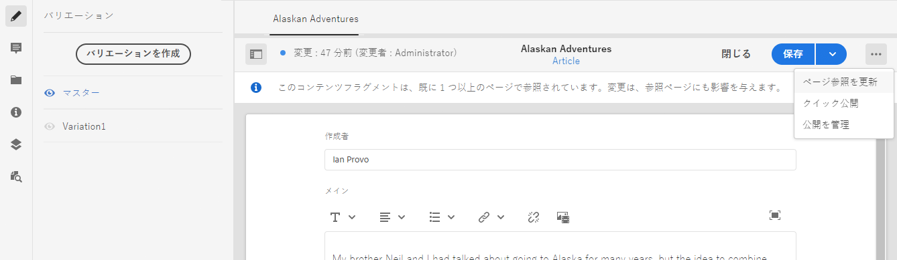

# コンテンツフラグメントの管理 {#managing-content-fragments}

使用方法 **コンテンツフラグメント** コンソールを使用して、AEMコンテンツフラグメントを管理します。 これらは、ページオーサリングやヘッドレスコンテンツの基礎として使用できます。

[コンテンツフラグメントモデル](#creating-a-content-model)を定義した後、それらを使用して[コンテンツフラグメントを作成](#creating-a-content-fragment)できます。

[コンテンツフラグメントエディター](#opening-the-fragment-editor)には、次の操作を行うための様々な[モード](#modes-in-the-content-fragment-editor)が用意されています。

* [コンテンツの編集](#editing-the-content-of-your-fragment)と[バリエーションの管理](#creating-and-managing-variations-within-your-fragment)
* [フラグメントへの注釈の付加](/help/sites-cloud/administering/content-fragments/content-fragments-variations.md#annotating-a-content-fragment)
* [コンテンツとフラグメントの関連付け](#associating-content-with-your-fragment)
* [メタデータの設定](#viewing-and-editing-the-metadata-properties-of-your-fragment)
* [構造ツリーの表示](/help/sites-cloud/administering/content-fragments/content-fragments-structure-tree.md)
* [JSON 表現のプレビュー](/help/sites-cloud/administering/content-fragments/content-fragments-json-preview.md)

>[!NOTE]
>
>コンテンツフラグメントは次に使用できます。
>
>* ページのオーサリング時 -「[コンテンツフラグメントを使用したページオーサリング](/help/sites-cloud/authoring/fundamentals/content-fragments.md)」を参照してください。
>* [GraphQL でコンテンツフラグメントを使用するヘッドレスコンテンツ配信用。](/help/sites-cloud/administering/content-fragments/content-fragments-graphql.md)

>[!NOTE]
>
>コンテンツフラグメントは、 **Assets**. 主に **コンテンツフラグメント** コンソールでは管理できませんが、 **Assets** コンソール。

## コンテンツフラグメントコンソール {#content-fragments-console}

コンテンツフラグメントコンソールを使用すると、フラグメントおよび関連タスクに直接アクセスできます。 詳しくは、以下を参照してください。

* [コンテンツフラグメントコンソールの基本構造と処理](/help/sites-cloud/administering/content-fragments/content-fragments-console.md#basic-structure-handling-content-fragments-console)

* [コンテンツフラグメントに関して提供される情報](/help/sites-cloud/administering/content-fragments/content-fragments-console.md#information-content-fragments)

* [コンテンツフラグメントコンソールでのコンテンツフラグメントのアクション](/help/sites-cloud/administering/content-fragments/content-fragments-console.md#actions-selected-content-fragment)

* [コンテンツフラグメントコンソールで使用可能な列のカスタマイズ](/help/sites-cloud/administering/content-fragments/content-fragments-console.md#select-available-columns)

* [コンテンツフラグメントコンソールでの検索とフィルタリング](/help/sites-cloud/administering/content-fragments/content-fragments-console.md#filtering-fragments)

## コンテンツフラグメントの作成 {#creating-content-fragments}

>[!CONTEXTUALHELP]
>id="aemcloud_sites_trial_admin_content_fragments_create_content"
>title="新しいコンテンツを作成"
>abstract="モジュール 1 で作成したモデルを基に、ページオーサリングに使用できるコンテンツを作成する方法、またはヘッドレスコンテンツの基礎として使用できるコンテンツを作成する方法を学びます。"

### コンテンツモデルの作成 {#creating-a-content-model}

構造化コンテンツを含むコンテンツフラグメントを作成する前に、[コンテンツフラグメントモデル](/help/sites-cloud/administering/content-fragments/content-fragments-models.md)を有効にして作成できます。

### コンテンツフラグメントの作成 {#creating-a-content-fragment}

コンテンツフラグメントを作成するには：

1. 次の **コンテンツフラグメント** コンソール、選択 **作成** （右上）。

   >[!NOTE]
   >
   >新しいフラグメントの場所を事前に定義するには、フラグメントを作成するフォルダーに移動するか、作成プロセス中に場所を指定します。

1. この **新しいコンテンツフラグメント** ダイアログが開き、ここから次の項目を指定できます。

   * **場所**  — 現在の場所で自動入力されますが、必要に応じて別の場所を選択できます
   * **コンテンツフラグメントモデル**  — ドロップダウンリストからフラグメントの基礎として使用するモデルを選択します
   * **タイトル**
   * **名前**  — これは、 **タイトル**&#x200B;必要に応じて編集できます。
   * **説明**

   

1. 選択 **作成**&#x200B;または **作成して開く** 定義を保持する。

## コンテンツフラグメントのステータス {#statuses-content-fragments}

コンテンツフラグメントの存在中は、次のように複数のステータスを持つことができます。 [コンテンツフラグメントコンソール](/help/sites-cloud/administering/content-fragments/content-fragments-console.md):

* **新規**
新しいコンテンツフラグメントはコンテンツフラグメントエディターで作成されましたが、編集も開くこともできません。
* **ドラフト**
誰かがコンテンツフラグメントエディターで（新しい）コンテンツフラグメントを編集したり開いたりしましたが、まだ公開されていません。
* **公開済み**
コンテンツフラグメントが公開されました。
* **変更済み**
コンテンツフラグメントは、公開後（ただし変更が公開される前）に編集されました。
* **非公開**
コンテンツフラグメントが非公開になりました。

## フラグメントエディターを開く {#opening-the-fragment-editor}

編集するためにフラグメントを開くには：

>[!CAUTION]
>
>コンテンツフラグメントを編集するには、[適切な権限](/help/implementing/developing/extending/content-fragments-customizing.md#asset-permissions)が必要になります。問題が発生している場合は、システム管理者にお問い合わせください。

1. 以下を使用： **コンテンツフラグメント** コンソールを使用して、コンテンツフラグメントの場所に移動します。
1. フラグメントを選択して編集するためにフラグメントを開き、次に **開く** をクリックします。

1. フラグメントエディターが開きます。必要に応じて変更を加えます。

   

1. 変更を加えた後、必要に応じて「**保存**」、「**保存して閉じる**」、「**閉じる**」のいずれかを使用します。

   >[!NOTE]
   >
   >「**保存して閉じる**」は、**保存**&#x200B;ドロップダウンからアクセスできます。

   >[!NOTE]
   >
   >「**保存して閉じる**」と「**閉じる**」のどちらをクリックした場合も、エディターが終了します。様々なオプションがコンテンツフラグメントにどのように動作するかについて詳しくは、[保存、閉じる、バージョン](#save-close-and-versions)を参照してください。

## コンテンツフラグメントエディターのモードとアクション {#modes-actions-content-fragment-editor}

コンテンツフラグメントエディターからは、様々なモードとアクションを使用できます。

### コンテンツフラグメントエディターのモード {#modes-in-the-content-fragment-editor}

サイドパネルのアイコンを使用して、様々なモード間を移動できます。

* バリエーション：[コンテンツの編集](#editing-the-content-of-your-fragment)と[バリエーションの管理](#creating-and-managing-variations-within-your-fragment)

* [注釈](/help/sites-cloud/administering/content-fragments/content-fragments-variations.md#annotating-a-content-fragment)
* [関連コンテンツ](#associating-content-with-your-fragment)
* [メタデータ](#viewing-and-editing-the-metadata-properties-of-your-fragment)
* [構造ツリー](/help/sites-cloud/administering/content-fragments/content-fragments-structure-tree.md)
* [プレビュー](/help/sites-cloud/administering/content-fragments/content-fragments-json-preview.md)

### コンテンツフラグメントエディターのツールバーアクション {#toolbar-actions-in-the-content-fragment-editor}

上部のツールバーには、複数のモードから使用できる機能があります。

* フラグメントがコンテンツページで既に参照されている場合は、メッセージが表示されます。このメッセージは&#x200B;**閉じる**&#x200B;ことができます。

* **サイドパネルを切り替え**&#x200B;アイコンを使用してサイドパネルを非表示／表示できます。

* フラグメント名の下に、現在のフラグメントの作成に使用された[コンテンツフラグメントモデル](/help/sites-cloud/administering/content-fragments/content-fragments-models.md)の名前が表示されます。

   * また、この名前はモデルエディターを開くリンクでもあります。

* 例えば、フラグメントの作成、変更、公開の日時については、フラグメントのステータスを参照してください。また、ステータスは次のように色分けもされています。

   * **新規**：灰色
   * **ドラフト**：青
   * **公開済み**：緑
   * **変更**：オレンジ
   * **アクティベートを解除済み**：赤

* 「**保存**」から、「**保存して閉じる**」オプションにアクセスできます。

* 3 つのドット（**...**）ドロップダウンから、以下の追加アクションにアクセスできます。
   * **ページ参照を更新**
      * すべてのページ参照が更新されます。
   * **[クイック公開](#publishing-and-referencing-a-fragment)**
   * **[公開を管理](#publishing-and-referencing-a-fragment)**

<!--
This updates any page references and ensures that the Dispatcher is flushed as required. -->

## 保存、閉じる、バージョン {#save-close-and-versions}

>[!NOTE]
>
>バージョン[を作成／比較したり元に戻したりする操作は、タイムラインから](/help/sites-cloud/administering/content-fragments/content-fragments-managing.md#timeline-for-content-fragments)も行えます。

エディターには、次のような様々なオプションがあります。

* 「**保存**」と「**保存して閉じる**」

   * 「**保存**」を選択すると、最新の変更が保存され、その後もエディターは開いたままです。
   * 「**保存して閉じる**」を選択すると、最新の変更が保存された後、エディターが終了します。

   >[!CAUTION]
   >
   >コンテンツフラグメントを編集するには、[適切な権限](/help/implementing/developing/extending/content-fragments-customizing.md#asset-permissions)が必要になります。問題が発生している場合は、システム管理者にお問い合わせください。

   >[!NOTE]
   >
   >エディターを開いたまま、一連の変更を加えてから保存することもできます。

   >[!CAUTION]
   >
   >これらの操作では、変更を保存するだけでなく、参照もすべて更新し、Dispatcher が必要に応じてフラッシュされます。これらの変更が処理されるまでに時間がかかることがあります。このため、大きなシステムや複雑なシステム、高負荷のシステムのパフォーマンスに影響することがあります。
   >
   >「**保存して閉じる**」を使用する際はこの点に留意し、フラグメントエディターをすぐに開いて、さらに変更を加え保存してください。

* **閉じる**

   最新の変更（前回の「**保存**」操作以降に行った変更）を保存せずにエディターを終了します。

コンテンツフラグメントを編集するとき、AEM によって自動的にバージョンが作成されます。これにより、（保存せずに「**閉じる**」を使用して）変更内容を取り消した場合でも、以前のコンテンツを復元できるようになります。

1. コンテンツフラグメントを開いて編集しようとすると、AEM は&#x200B;*編集セッション*&#x200B;が存在しているかどうかを示す cookie ベースのトークンの存在を確認します。

   1. トークンが見つかると、そのフラグメントは既存の編集セッションの一部であると見なされます。
   2. トークンがないときにユーザーが編集を開始すると、バージョンが作成され、この新しい編集セッションのトークンがクライアントに送られ、cookie に保存されます&#x200B;*。*

2. アクティブな編集セッションがあるとき、編集中のコンテンツは自動的に 600 秒ごとに保存されます（デフォルト）*。*

   >[!NOTE]
   >
   >自動保存間隔は `/conf` メカニズムを使用して設定できます。
   >
   >デフォルト値については、以下を参照してください。
   >  `/libs/settings/dam/cfm/jcr:content/autoSaveInterval`

3. ユーザーが編集をキャンセルした場合は、編集セッションの開始時に作成されたバージョンが復元され、トークンが削除されて編集セッションが終了します。
4. ユーザーが編集内容の「**保存**」を選択すると、更新された要素とバリエーションが保存され、トークンが削除されて編集セッションが終了します。

## フラグメントのコンテンツの編集 {#editing-the-content-of-your-fragment}

フラグメントを開いたら、「[バリエーション](/help/sites-cloud/administering/content-fragments/content-fragments-variations.md)」タブを使用してコンテンツをオーサリングできます。

## フラグメント内のバリエーションの作成と管理 {#creating-and-managing-variations-within-your-fragment}

プライマリコンテンツを作成したら、そのコンテンツの[バリエーション](/help/sites-cloud/administering/content-fragments/content-fragments-variations.md)を作成して管理できます。

## コンテンツをフラグメントと関連付ける {#associating-content-with-your-fragment}

フラグメントに[コンテンツを関連付ける](/help/sites-cloud/administering/content-fragments/content-fragments-assoc-content.md)こともできます。これにより関連性を付加して、フラグメントをコンテンツページに追加するときに、アセット（画像など）を（オプションで）フラグメントと一緒に使用できるようになります。

## フラグメントのメタデータ（プロパティ）の表示と編集 {#viewing-and-editing-the-metadata-properties-of-your-fragment}

「[メタデータ](/help/sites-cloud/administering/content-fragments/content-fragments-metadata.md)」タブを使用し、フラグメントのプロパティを表示して編集できます。

## フラグメントの公開と参照 {#publishing-and-referencing-a-fragment}

>[!CAUTION]
フラグメントがモデルに基づいている場合、その[モデルが公開されている](/help/sites-cloud/administering/content-fragments/content-fragments-models.md#publishing-a-content-fragment-model)ことを確認してください。
まだ公開されていないモデルのコンテンツフラグメントを公開すると、選択リストにそのことが示され、モデルがフラグメントと共に公開されます。

コンテンツフラグメントをパブリッシュ環境で使用するには、公開する必要があります。これは、標準の Assets 機能を使用しておこなわれます

* 次の **公開** 」オプション ( [コンテンツフラグメントコンソール](/help/sites-cloud/administering/content-fragments/content-fragments-console.md#actions-selected-content-fragment)
   * **今すぐ**  — 確認後、フラグメントは直ちに公開されます
   * **スケジュール**  — フラグメントを公開する日時を選択できます

   必要に応じて、 **有効化日** パブリッシュするを参照する 次に例を示します。
   

* 次の [コンテンツフラグメントエディター](#toolbar-actions-in-the-content-fragment-editor)
   * [**クイック公開**](/help/assets/manage-publication.md#quick-publish)
   * [**公開を管理**](/help/assets/manage-publication.md#manage-publication)

さらに、[フラグメントを使用するページを公開](/help/sites-cloud/authoring/fundamentals/content-fragments.md#publishing)するとき。フラグメントはページ参照にリスト表示されます。

>[!CAUTION]
フラグメントが公開または参照（あるいは両方）された後に、作成者がフラグメントを開いて編集しようとすると警告が表示され、フラグメントを変更すると、参照されているページにも影響が及ぶことが警告されます。

## フラグメントの非公開 {#unpublishing-a-fragment}

コンテンツフラグメントを非公開にするには、1 つ以上のフラグメントを選択してから、 **非公開**.

>[!NOTE]
この **非公開** 公開されたフラグメントを使用できる場合は、アクションが表示されます。

>[!CAUTION]
フラグメントが既に別のフラグメントから参照されている場合、またはページから参照されている場合は、警告メッセージが表示され、続行を確認する必要があります。

## フラグメントの削除 {#deleting-a-fragment}

フラグメントを削除するには：

1. 内 **コンテンツフラグメント** コンソールで、コンテンツフラグメントの場所に移動します。
2. フラグメントを選択します。

   >[!NOTE]
   **削除**&#x200B;アクションはクイックアクションとして実行できません。

3. ツールバーから「**削除**」を選択します。
4. 「**削除**」アクションを確認します。

   >[!CAUTION]
   フラグメントが既に別のフラグメントから参照されている場合、またはページから参照されている場合は、警告メッセージが表示され、 **削除を強制**. フラグメントはコンテンツフラグメントコンポーネントと一緒に、すべてのコンテンツページから削除されます。

## フラグメントの親参照の検索 {#parent-references-fragment}

親参照の詳細は、 **参照** 列 [コンテンツフラグメントコンソール](/help/sites-cloud/administering/content-fragments/content-fragments-console.md#information-content-fragments).

## フラグメントの言語コピーの検索 {#language-copies-fragment}

言語コピーの詳細は、 **言語** 列 [コンテンツフラグメントコンソール](/help/sites-cloud/administering/content-fragments/content-fragments-console.md#information-content-fragments).

## コンテンツフラグメントのタイムライン {#timeline-for-content-fragments}

>[!NOTE]
この機能は、 **Assets** コンソール

[タイムライン](/help/assets/manage-digital-assets.md#timeline)では標準のオプションに加え、コンテンツフラグメントに固有の情報とアクションの両方が提供されます。

* バージョン、コメントおよび注釈に関する情報の表示
* バージョンに関するアクション

   * **[このバージョンに戻る](#reverting-to-a-version)**（既存のフラグメントを選択してから特定のバージョンを選択）

   * **[現在のバージョンと比較](#comparing-fragment-versions)**（既存のフラグメントを選択してから特定のバージョンを選択）

   * **ラベル**&#x200B;や&#x200B;**コメント**&#x200B;の追加（既存のフラグメントを選択してから特定のバージョンを選択）

   * **バージョンとして保存**（既存のフラグメントを選択してからタイムライン下部の上矢印を選択）

* 注釈に関するアクション

   * **削除**

>[!NOTE]
コメントは次のとおりです。
* すべてのアセットの標準機能
* タイムラインで追加
* フラグメントアセットに関連付けられる
>
注釈（コンテンツフラグメント用）は次のとおりです。
* フラグメントエディターで入力
* フラグメント内の選択されたテキストセグメントに固有
>

次に例を示します。

## フラグメントのバージョンの比較 {#comparing-fragment-versions}

>[!NOTE]
この機能は、 **Assets** コンソール

特定のバージョンを選択したら、「[タイムライン](/help/sites-cloud/administering/content-fragments/content-fragments-managing.md#timeline-for-content-fragments)」から「**現在のバージョンと比較**」アクションを利用できるようになります。

これにより、次の情報が表示されます。

* **現在**（最新）のバージョン（左）

* 選択されたバージョン **v&lt;*x.y*>**（右）

これらは左右に並んで表示されます。この画面について以下で説明します。

* すべての相違点がハイライト表示されます

   * 削除されたテキスト - 赤
   * 挿入されたテキスト - 緑
   * 置き換えられたテキスト - 青

* 全画面表示アイコンを使用すれば、どちらかのバージョンで開いた後で、並列表示に切り替えることができます
* 特定のバージョンに&#x200B;**戻す**&#x200B;ことができます
* 「**完了**」を選択すると、コンソールに戻ります

>[!NOTE]
フラグメントの比較中にフラグメントコンテンツを編集することはできません。

## 特定のバージョンへの復帰   {#reverting-to-a-version}

>[!NOTE]
この機能は、 **Assets** コンソール

次の方法で特定のバージョンのフラグメントに戻すことができます。

* 直接[タイムライン](/help/sites-cloud/administering/content-fragments/content-fragments-managing.md#timeline-for-content-fragments)から。

   必要なバージョンを選択した後、「**このバージョンに戻す**」アクションを選択します。

* [あるバージョンと現在のバージョンを比較](/help/sites-cloud/administering/content-fragments/content-fragments-managing.md#comparing-fragment-versions)し、選択したバージョンに&#x200B;**戻す**&#x200B;ことができます。
