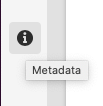
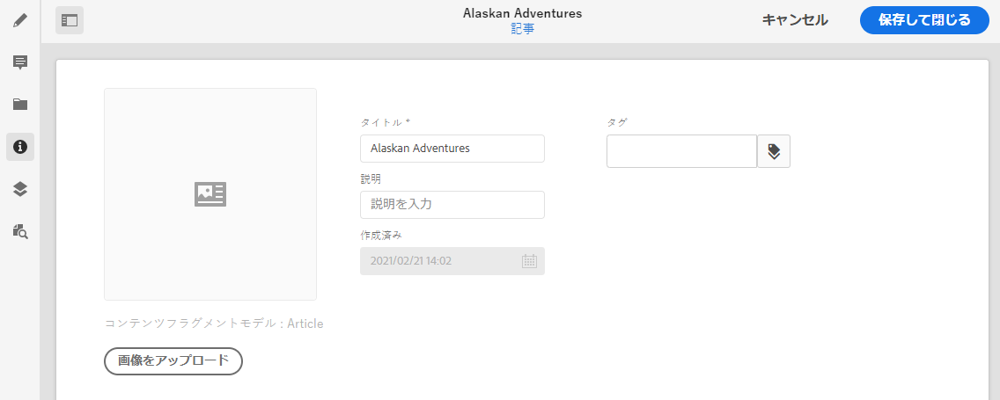

# メタデータ - フラグメントのプロパティ {#metadata-fragment-properties}

AEMコンテンツフラグメントのメタデータプロパティの表示および編集方法について説明します。

## プロパティ／メタデータの編集 {#editing-properties-meta-data}

コンテンツフラグメントのメタデータ（プロパティ）を表示して編集できます。

1. **Assets** コンソールで、コンテンツフラグメントの場所に移動します。
2. 以下のどちらかの操作を行います。

   * [**「プロパティを表示**」を選択してダイアログを開きます](/help/assets/manage-digital-assets.md#editing-properties)。開いて表示されたら、編集することもできます。
   * 編集するコンテンツフラグメントを開き、サイドパネルから「**メタデータ**」を選択します。

   

3. 「**基本**」タブに、表示または編集が可能なオプションが表示されます。

   * 「**画像をアップロード**」の対象となるサムネール
   * **コンテンツフラグメントモデル**&#x200B;は、現在のフラグメントの作成に使用されるモデルを示します
   * **タイトル**
   * **説明**
   * **タグ**
      * [タグ](/help/sites-cloud/authoring/features/tags.md)は、コンテンツの分類に使用できるので、フラグメントを整理する際に特に効果を発揮します。タグは、コンテンツを（タグ別に）検索したり、一括操作を適用する目的で使用できます。
例えば、関係のあるフラグメントを「クリスマスローンチ」としてタグ付けして、これらのフラグメントだけをサブセットとして閲覧できるようにしたり、今後の別のローンチで使用するために新しいフォルダーにコピーしたりできます。
   * 作成済み（表示のみ）
   
