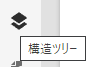
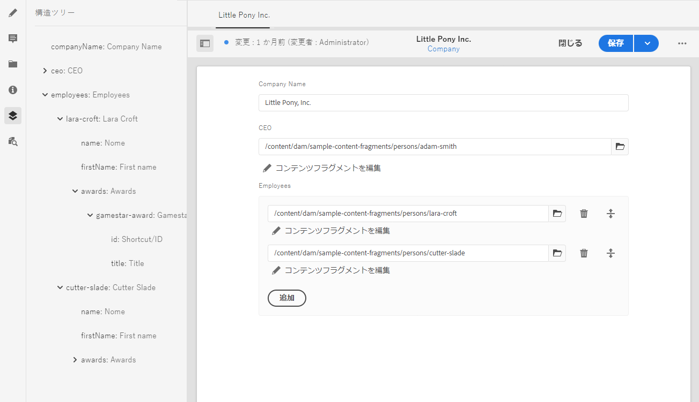

# コンテンツフラグメント構造ツリー {#content-fragment-structure-tree}

AEMのコンテンツフラグメントエディターの構造ツリー機能を使用すると、ヘッドレスコンテンツを理解しやすくなります。

コンテンツフラグメントエディターで「構造ツリー」アイコンを選択できます。

これにより、左側のパネルにフラグメントの構造が表示されます。これを使用して、参照されているフラグメント間を移動したり、参照先に移動したりできます。参照を選択すると、そのフラグメントが編集用に開きます。

>[!NOTE]
>
>メインパネルのパンくずリストを使用して、開始点に戻ることができます。

