# バリエーション - フラグメントコンテンツのオーサリング{#variations-authoring-fragment-content}

<!--
hide: yes
index: no
hidefromtoc: yes
-->

[バリエーション](/help/sites-cloud/administering/content-fragments/content-fragments.md#constituent-parts-of-a-content-fragment)は、特定のチャネルやシナリオで使用するためにマスターコンテンツのコピーを作成して編集できる、AEM のコンテンツフラグメントの重要な機能であり、ページオーサリングとヘッドレスコンテンツ配信の両方をさらに柔軟にします。

「**バリエーション**」タブから、次の操作を実行できます。

* フラグメントの[コンテンツの入力](#authoring-your-content)
* **プライマリ**&#x200B;コンテンツの[バリエーションの作成および管理](#managing-variations)

編集中のデータタイプに応じて他の様々なアクションを実行します。次に例を示します。

* [フラグメントへのビジュアルアセットの挿入](#inserting-assets-into-your-fragment)（画像）

* 次の中から選択： [リッチテキスト](#rich-text), [プレーンテキスト](#plain-text) および [Markdown](#markdown) （編集用）

* [コンテンツのアップロード](#uploading-content)

* [重要な統計の表示](#viewing-key-statistics)（複数行テキストについて）

* [テキストの要約](#summarizing-text)

* [バリエーションとプライマリコンテンツの同期](#synchronizing-with-master)

>[!CAUTION]
>
>フラグメントが公開または参照（あるいは両方）された後に、作成者がフラグメントを開いて編集しようとすると警告が表示され、フラグメントを変更すると、参照されているページにも影響が及ぶことが警告されます。

## コンテンツのオーサリング {#authoring-your-content}

コンテンツフラグメントを編集用に開くと、 **バリエーション** タブはデフォルトで開きます。 このタブで、プライマリまたはバリエーション（ある場合）のコンテンツをオーサリングできます。構造化されたフラグメントには、コンテンツモデルで定義された、様々なデータタイプの各種フィールドが含まれています。

次に例を示します。

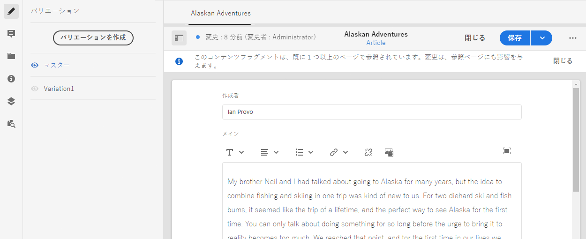

以下の操作を実行できます。

* 「**バリエーション**」タブでコンテンツを直接編集します。データタイプごとに異なる編集オプションが用意されています。次に例を示します。

   * **複数行テキスト**&#x200B;フィールドの場合は、[全画面表示エディター](#full-screen-editor)を開いて次の操作を行うこともできます。

      * [形式](#formats)の選択
      * その他の編集オプションの表示（[リッチテキスト](#rich-text)形式の場合）
      * 様々な[アクション](#actions)へのアクセス

   * **フラグメント参照**&#x200B;フィールドの場合は、モデル定義に応じて、「[コンテンツフラグメントを編集](#fragment-references-edit-content-fragment)」オプションを使用できます。

* **タグ**&#x200B;を現在のバリエーションに割り当てます。タグは、追加、更新、削除できます。

   * [タグ](/help/sites-cloud/authoring/features/tags.md)は、コンテンツの分類に使用できるので、フラグメントを整理する際に特に効果を発揮します。タグは、コンテンツを（タグ別に）検索したり、一括操作を適用する目的で使用できます。

      * タグを検索すると、フラグメントが返され、タグ付きのバリエーションがハイライト表示されます。
      * バリエーション名を使用する代わりに、バリエーションタグを使用して、特定のコンテンツ配信ネットワーク（CDN）プロファイル（CDN キャッシュ用）のバリエーションをグループ化することもできます。

     例えば、関係のあるフラグメントを「クリスマスローンチ」としてタグ付けして、これらのフラグメントだけをサブセットとして閲覧できるようにしたり、今後の別のローンチで使用するために新しいフォルダーにコピーしたりできます。

  >[!NOTE]
  >
  >**タグ**&#x200B;は、[メタデータ](/help/sites-cloud/administering/content-fragments/content-fragments-metadata.md)の一部として（**マスター**&#x200B;バリエーションに）追加することもできます

* [マスター](#managing-variations)コンテンツの&#x200B;**バリエーションの作成および管理.**

### 全画面表示エディター {#full-screen-editor}

複数行テキストフィールドの編集時には、全画面表示エディターを開くことができます。実際のテキスト内でタップまたはクリックしてから、次のアクションアイコンを選択します。

テキストエディターが全画面表示で開きます。

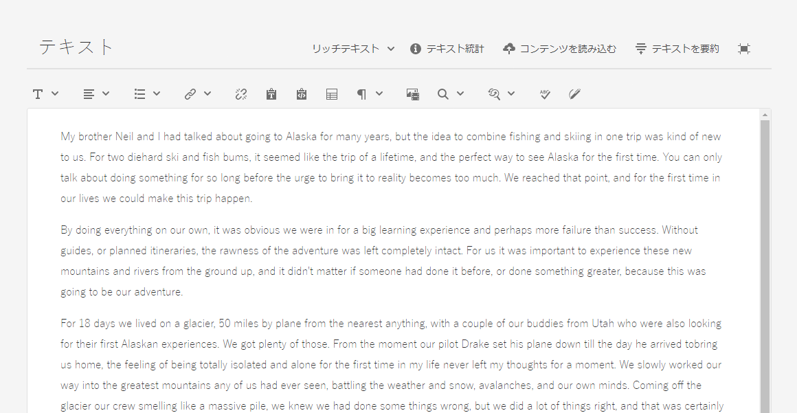

全画面表示テキストエディターでは以下が提供されます。

* 様々な [アクション](#actions)
* に応じて [形式](#formats)、その他の書式設定オプション ([リッチテキスト](#rich-text))

### アクション {#actions}

次のアクションも使用できます ( すべての [形式](#formats)) をクリックします。

* [形式](#formats)（[リッチテキスト](#rich-text)、[プレーンテキスト](#plain-text)、[Markdown](#markdown)）の選択

* [コンテンツのアップロード](#uploading-content)

* [テキスト統計の表示](#viewing-key-statistics)

* [プライマリとの同期](#synchronizing-with-master)（バリエーションの編集時）

* [テキストの要約](#summarizing-text)

### 形式 {#formats}

複数行テキストを編集するためのオプションは、選択した形式によって異なります。

* [リッチテキスト](#rich-text)
* [プレーンテキスト](#plain-text)
* [Markdown](#markdown)

全画面表示エディターでの作業時に形式を選択できます。

### リッチテキスト {#rich-text}

リッチテキストの編集では、以下の書式を設定できます。

* 太字
* 斜体
* 下線
* 整列：左、中央、右
* 箇条書きリスト
* 番号付きリスト
* インデント：増減
* ハイパーリンクの作成/解除
* テキストを貼り付け/Word から貼り付け
* テーブルを挿入
* 段落スタイル：段落、見出し 1/2/3
* [アセットを挿入](#inserting-assets-into-your-fragment)
* 全画面表示エディターを開く。次の書式設定オプションを使用できます。
   * 検索
   * 検索 / 置換
   * スペルチェッカー
   * [注釈](/help/sites-cloud/administering/content-fragments/content-fragments-variations.md#annotating-a-content-fragment)
* [コンテンツフラグメントを挿入](#inserting-content-fragment-into-your-fragment)は、「**複数行テキスト**」フィールドが「**フラグメント参照を許可**」に設定されている場合に使用できます。

[アクション](#actions)は、全画面表示エディターからアクセスすることもできます。

### プレーンテキスト {#plain-text}

プレーンテキストを使用すると、書式設定または Markdown 情報なしでコンテンツをすばやく入力できます。全画面表示エディターを開いて追加の[アクション](#actions)を使用することもできます。

>[!CAUTION]
>
>「**プレーンテキスト**」を選択すると、**リッチテキスト**&#x200B;または **Markdown** に追加した書式、Markdown やアセットは失われます。

### Markdown {#markdown}

>[!NOTE]
>
>詳しくは、 [Markdown](/help/sites-cloud/administering/content-fragments/content-fragments-markdown.md) ドキュメント。

これにより、Markdown を使用してテキストを書式設定できます。 以下を定義できます。

* 見出し
* 段落と改行
* リンク
* 画像
* ブロック引用
* リスト
* 強調
* コードブロック
* バックスラッシュエスケープ

全画面表示エディターを開いて追加の[アクション](#actions)を使用することもできます。

>[!CAUTION]
>
>**リッチテキスト**&#x200B;と **Markdown** を切り替えると、ブロック引用やコードブロックに予期しない影響が出ることがあります。ブロック引用とコードブロックの 2 つの形式は処理方法が異なる場合があるからです。

### フラグメント参照 {#fragment-references}

コンテンツフラグメントモデルにフラグメント参照が含まれる場合、フラグメント作成者には次の追加オプションがあります。

* [コンテンツフラグメントを編集](#fragment-references-edit-content-fragment)
* [新しいコンテンツフラグメント](#fragment-references-new-content-fragment)

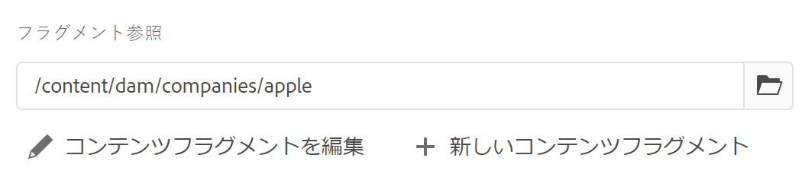

#### コンテンツフラグメントを編集 {#fragment-references-edit-content-fragment}

「**コンテンツフラグメントを編集**」オプションを選択すると、そのフラグメントが新しいエディタータブ（同じブラウザータブ内）で開きます。

元のタブを再度選択すると（例：**Little Pony Inc.**）、このセカンダリタブ（この場合は **Adam Smith**）が閉じます。

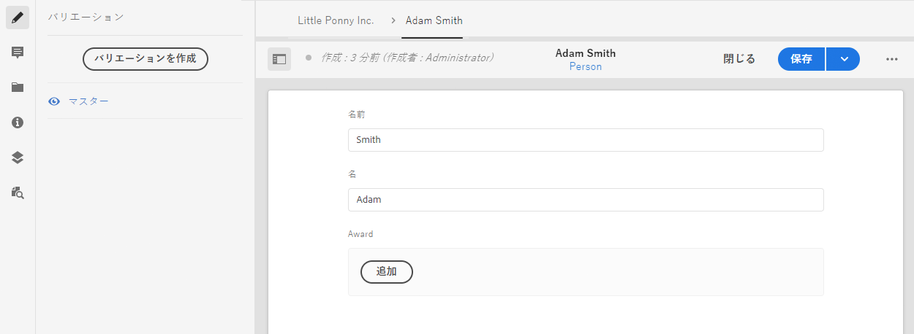

#### 新しいコンテンツフラグメント {#fragment-references-new-content-fragment}

「**新しいコンテンツフラグメント**」オプションを使用すると、完全に新しいフラグメントを作成できます。このために、コンテンツフラグメント作成ウィザードがエディターで開きます。

その後、次の方法で新しいフラグメントを作成できます。

1. 目的のフォルダーに移動して選択します。
1. 「**次へ**」を選択します。
1. プロパティを指定します（例：**タイトル**）
1. 「**作成**」を選択します。
1. 最後に、
   1. **完了**:
      * （元のフラグメントに）を返します。
      * は、新しいフラグメントを参照します
   1. **開く**:
      * は、新しいフラグメントを参照します
      * 新しいフラグメントを編集用に新しいブラウザータブで開く

### 重要な統計の表示 {#viewing-key-statistics}

全画面表示エディターを開くと、「**テキスト統計**」アクションには、テキストに関する様々な情報が表示されます。

次に例を示します。

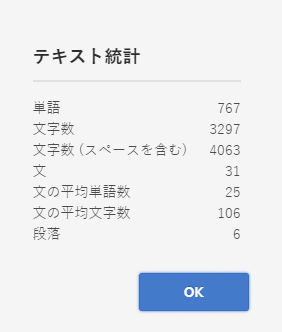

### コンテンツのアップロード {#uploading-content}

コンテンツフラグメントのオーサリングのプロセスを簡易化するため、外部エディターで用意したテキストをアップロードしてフラグメントに直接追加できます。

### テキストの要約 {#summarizing-text}

テキストの要約を使用すると、重要ポイントと全体の意味を保ちながら、テキストの長さを規定の単語数に短縮できます。

>[!NOTE]
>
>より技術的に説明すると、特定のアルゴリズムに従って&#x200B;*情報の密度と独自性が最適な比率*&#x200B;であると評価した文章をシステムが保持します。

>[!CAUTION]
>
>コンテンツフラグメントには、親フォルダー（ISO コード）として有効な言語フォルダーが必要です。使用する言語モデルを決定するためにこれが使用されます。
>
>例えば、次のパスの `en/` です。
>
>  `/content/dam/my-brand/en/path-down/my-content-fragment`

>[!CAUTION]
>
英語版は標準で提供されています。
>
他の言語は、ソフトウェア配布の言語モデルパッケージとして使用できます。
>
* [フランス語（fr）](https://experience.adobe.com/#/downloads/content/software-distribution/en/aem.html?lang=ja?package=/content/software-distribution/en/details.html/content/dam/aem/public/adobe/packages/cq630/product/smartcontent-model-fr)
* [ドイツ語（de）](https://experience.adobe.com/#/downloads/content/software-distribution/en/aem.html?lang=ja?package=/content/software-distribution/en/details.html/content/dam/aem/public/adobe/packages/cq630/product/smartcontent-model-de)
* [イタリア語（it）](https://experience.adobe.com/#/downloads/content/software-distribution/en/aem.html?lang=ja?package=/content/software-distribution/en/details.html/content/dam/aem/public/adobe/packages/cq630/product/smartcontent-model-it)
* [スペイン語（es）](https://experience.adobe.com/#/downloads/content/software-distribution/en/aem.html?lang=ja?package=/content/software-distribution/en/details.html/content/dam/aem/public/adobe/packages/cq630/product/smartcontent-model-es)
>

1. 「**プライマリ**」または必要なバリエーションを選択します。
1. 全画面表示エディターを開きます。

1. ツールバーの「**テキストを要約**」を選択します。

   

1. ターゲットの単語数を指定し、「 」を選択します。 **開始**:
1. 元のテキストが、提案された要約と並べて表示されます。

   * 削除する文は赤でハイライト表示され、取り消し線が付きます。
   * 強調表示された文をクリックして、要約されたコンテンツに保持します。
   * 強調表示されていない文をクリックすると、削除されます。

1. 変更を確定するには、「**要約**」を選択します。

1. 元のテキストが、提案された要約と並べて表示されます。

   * 削除する文は赤でハイライト表示され、取り消し線が付きます。
   * 強調表示された文をクリックして、要約されたコンテンツに保持します。
   * 強調表示されていない文をクリックすると、削除されます。
   * 要約統計（**実際**&#x200B;と&#x200B;**ターゲット**）が表示されます。
   * 変更を&#x200B;**プレビュー**&#x200B;できます。

   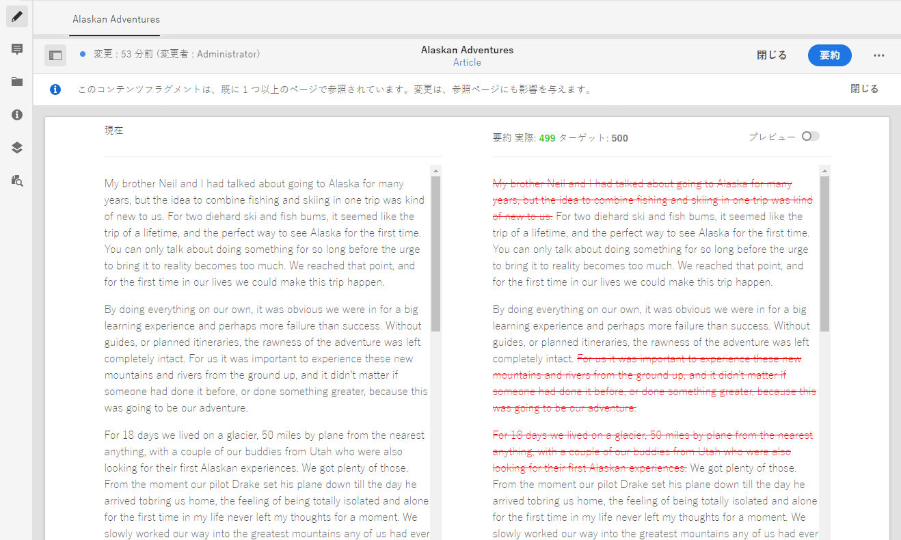

### コンテンツフラグメントへの注釈の追加 {#annotating-a-content-fragment}

フラグメントに注釈を付けるには：

1. 「**プライマリ**」または必要なバリエーションを選択します。

1. 全画面表示エディターを開きます。

1. 上部のツールバーに、**注釈**&#x200B;アイコンが表示されます。必要に応じて、一部のテキストを選択できます。

   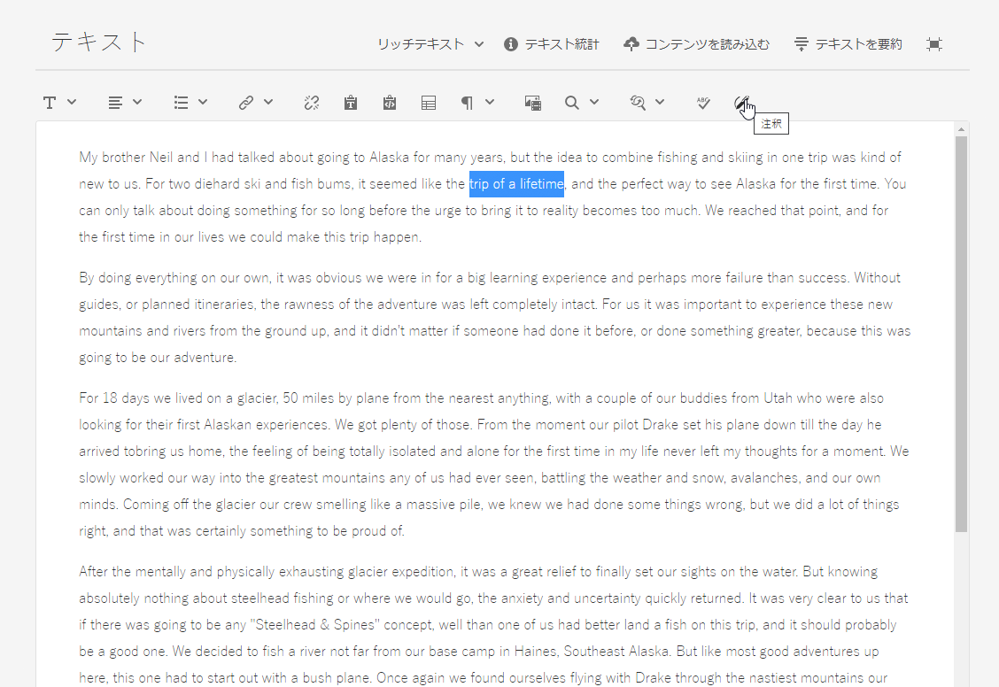

1. ダイアログが開きます。ここで注釈を入力できます。

   

1. ダイアログで「**適用**」をクリックします。

   

   選択したテキストに注釈が適用された場合、そのテキストはハイライト表示されたままになります。

   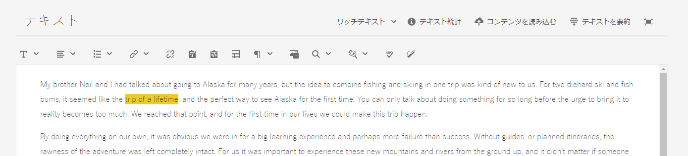

1. 全画面表示エディターを閉じても、注釈はハイライト表示されたままです。それを選択するとダイアログが開くので、そこで注釈をさらに編集できます。

1. 「**保存**」を選択します。

1. 全画面表示エディターを閉じても、注釈はハイライト表示されたままです。それを選択するとダイアログが開くので、そこで注釈をさらに編集できます。

   

### 注釈の表示、編集、削除 {#viewing-editing-deleting-annotations}

注釈：

* エディターの全画面表示モードと通常モードのどちらの場合も、注釈はテキストのハイライトとして示されます。ハイライト表示されたテキストをクリックすると、注釈の詳細が表示、編集または削除され、ダイアログが再度開きます。

  >[!NOTE]
  >
  1 つのテキストに複数の注釈が適用されている場合は、ドロップダウンセレクターが表示されます。

* 注釈が適用されたテキスト全体を削除すると、注釈も削除されます。

* 注釈の一覧表示や削除を行うには、フラグメントエディターで「**注釈**」タブを選択します。

  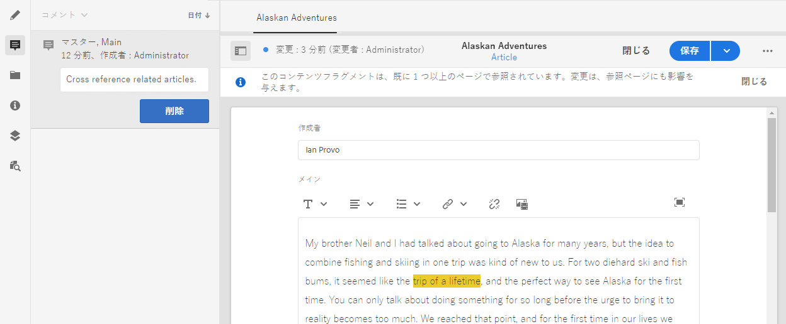

* 選択されたフラグメントの[タイムライン](/help/sites-cloud/administering/content-fragments/content-fragments-managing.md#timeline-for-content-fragments)で、注釈の表示や削除を行えます。

### フラグメントへのアセットの挿入 {#inserting-assets-into-your-fragment}

コンテンツフラグメントのオーサリングプロセスを容易にするには、[アセット](/help/assets/manage-digital-assets.md)（画像）をフラグメントに直接追加します。

書式設定を行わずにフラグメントの段落シーケンスに追加されます。書式設定は、 [フラグメントがページで使用または参照されている](/help/sites-cloud/authoring/fundamentals/content-fragments.md).

>[!CAUTION]
>
参照ページではこれらのアセットの移動や削除はできません。移動や削除にはフラグメントエディターを使用する必要があります。
>
ただし、アセットの書式設定（サイズなど）は、[ページエディター](/help/sites-cloud/authoring/fundamentals/content-fragments.md)で行う必要があります。フラグメントエディターでのアセットの表示は、純粋にコンテンツフローのオーサリング用です。

>[!NOTE]
>
[画像](/help/sites-cloud/administering/content-fragments/content-fragments.md#fragments-with-visual-assets)は様々な方法でフラグメントやページに追加できます。

1. 画像を追加したい位置にカーソルを置きます。
1. **アセットを挿入** アイコンを使用して、検索ダイアログを開きます。

   

1. ダイアログでは以下が可能です。

   * DAM 内の必要なアセットに移動します。
   * DAM 内のアセットを検索します。

   見つかったら、サムネールをクリックして、必要なアセットを選択します。

1. 「**選択**」を使用して、コンテンツフラグメント段落システムの現在の位置にアセットを追加します。

   >[!CAUTION]
   >
   アセットを追加後に形式を変更すると次のようになります。
   >
   * **プレーンテキスト**：アセットがフラグメントから完全に失われます。
   * **Markdown**：アセットは表示されませんが、に戻すとまだ表示されます。 **リッチテキスト**.

### コンテンツフラグメントのフラグメントへの挿入 {#inserting-content-fragment-into-your-fragment}

コンテンツフラグメントの作成プロセスを容易にするために、別のコンテンツフラグメントをフラグメントに追加することもできます。

これらは参照として、フラグメントの現在の場所に追加されます。

>[!NOTE]
>
このオプションは、「**複数行テキスト**」が「**フラグメント参照を許可**」に設定されている場合に使用できます。

>[!CAUTION]
>
参照ページではこれらのアセットの移動や削除はできません。移動や削除にはフラグメントエディターを使用する必要があります。
>
ただし、アセットの書式設定（サイズなど）は、[ページエディター](/help/sites-cloud/authoring/fundamentals/content-fragments.md)で行う必要があります。フラグメントエディターでのアセットの表示は、純粋にコンテンツフローのオーサリング用です。

>[!NOTE]
>
[画像](/help/sites-cloud/administering/content-fragments/content-fragments.md#fragments-with-visual-assets)は様々な方法でフラグメントやページに追加できます。

1. フラグメントを追加したい位置にカーソルを置きます。
1. **コンテンツフラグメントを挿入** アイコンを使用して、検索ダイアログを開きます。

   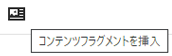

1. ダイアログでは以下が可能です。

   * Assets フォルダー内の必要なフラグメントに移動する
   * フラグメントを検索する

   必要なフラグメントが見つかったら、サムネールをクリックしてフラグメントを選択します。

1. 「**選択**」を使用して、選択したコンテンツフラグメントへの参照を現在のコンテンツフラグメント（現在の場所）に追加します。

   >[!CAUTION]
   >
   別のフラグメントへの参照を追加した後に、形式を変更すると次のようになります。
   >
   * **プレーンテキスト**：参照がフラグメントから完全に失われます。
   * **Markdown**：参照は残ります。

## バリエーションの管理 {#managing-variations}

[!CONTEXTUALHELP]
id="aemcloud_sites_contentfragments_variations"
title="バリエーション - フラグメントコンテンツのオーサリング"
abstract="特定のチャネルで使用するコンテンツのバリエーションを作成する方法を学びます。"
additional-url="https://video.tv.adobe.com/v/333295/?captions=jpn" text="コンテンツフラグメントのバリエーション"

### バリエーションの作成 {#creating-a-variation}

バリエーションでは、**プライマリ**&#x200B;コンテンツをコピーし、目的に応じて変更を加えることができます（必要な場合）。

新しいバリエーションを作成するには：

1. フラグメントを開き、サイドパネルが表示されていることを確認します。
1. サイドパネルのアイコンバーから「**バリエーション**」を選択します。
1. 選択 **バリエーションを作成**.
1. ダイアログが開きます。新しいバリエーションの **タイトル** と **説明** を指定します。
1. 選択 **追加**；フラグメント **マスター** が新しいバリエーションにコピーされ、次のバリエーションで開かれます： [編集中](#editing-a-variation).

   >[!NOTE]
   >
   新しいバリエーションを作成すると、常に&#x200B;**プライマリ**&#x200B;がコピーされます（現在開いているバリエーションではありません）。

   >[!NOTE]
   >
   新しいバリエーションを作成すると、**マスター**&#x200B;バリエーションに現在割り当てられているすべての&#x200B;**タグ**&#x200B;が新しいバリエーションにコピーされます。

### バリエーションの編集 {#editing-a-variation}

次のいずれかの操作を行った後に、バリエーションのコンテンツを変更できます。

* [バリエーションの作成](#creating-a-variation).
* 既存のフラグメントを開き、サイドパネルから必要なバリエーションを選択します。

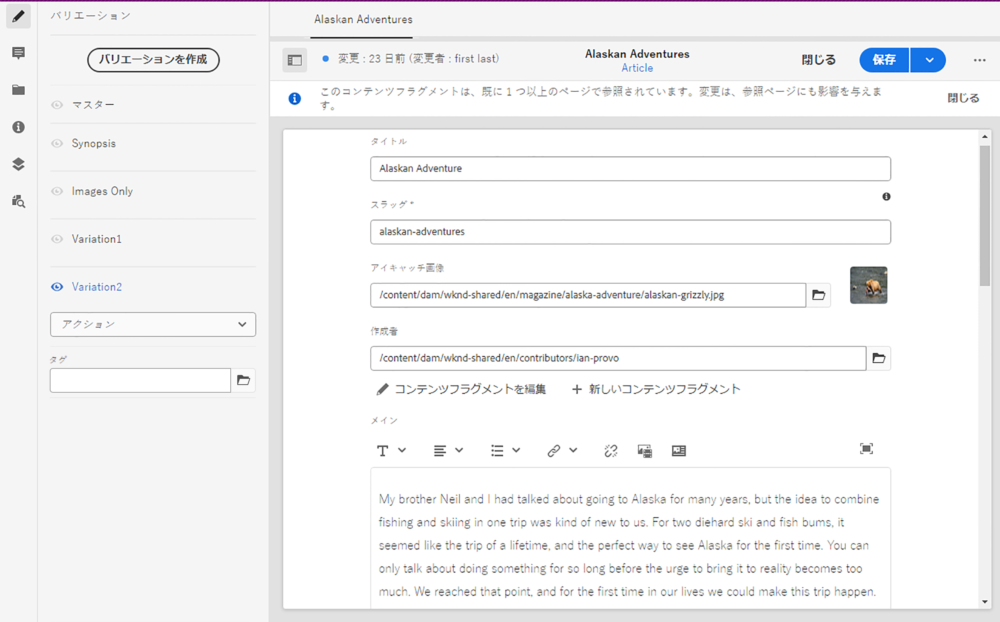

### バリエーションの名前変更 {#renaming-a-variation}

既存のバリエーションの名前を変更するには：

1. フラグメントを開き、サイドパネルから「**バリエーション**」を選択します。
1. 必要なバリエーションを選択します。
1. 選択 **名前を変更** から **アクション** 」ドロップダウンリストから選択できます。

1. 表示されたダイアログボックスで新しい「**タイトル**」や「**説明**」を入力します。

1. を確認します。 **名前を変更** アクション。

>[!NOTE]
>
これはバリエーションにのみ影響します **タイトル**.

### バリエーションの削除 {#deleting-a-variation}

既存のバリエーションを削除するには：

1. フラグメントを開き、サイドパネルから「**バリエーション**」を選択します。
1. 必要なバリエーションを選択します。
1. 選択 **削除** から **アクション** 」ドロップダウンリストから選択できます。

1. ダイアログで「**削除**」アクションを確認します。

>[!NOTE]
>
**プライマリ**&#x200B;は削除できません。

### プライマリとの同期 {#synchronizing-with-master}

**プライマリ**&#x200B;はコンテンツフラグメントの必須の部分であり、定義に従ってコンテンツのプライマリコピーを保持します。一方、バリエーションはそのコンテンツの更新および適合された個別のバージョンを保持します。プライマリを更新した場合、これらの変更はバリエーションにも関連するので、バリエーションに伝播させる必要があります。

バリエーションの編集時には、バリエーションの現在の要素をプライマリと同期させるアクションにアクセスできます。これにより、必要なバリエーションに対してマスターに加えた変更を自動的にコピーできます。

>[!CAUTION]
>
同期を使用できるのは、変更内容&#x200B;*を&#x200B;**プライマリ**からバリエーションに*&#x200B;コピーする場合のみです。
>
バリエーションの現在の要素のみが同期されます。
>
同期は、**複数行テキスト**&#x200B;データタイプでのみ機能します。
>
*バリエーションから&#x200B;**プライマリ***へ変更内容を転送することはできません。

1. フラグメントエディターでコンテンツフラグメントを開きます。**プライマリ**&#x200B;が編集されていることを確認します。

1. 特定のバリエーションを選択し、次のいずれかから適切な同期アクションを選択します。

   * の **アクション** ドロップダウンセレクター — **現在の要素をマスターと同期**

     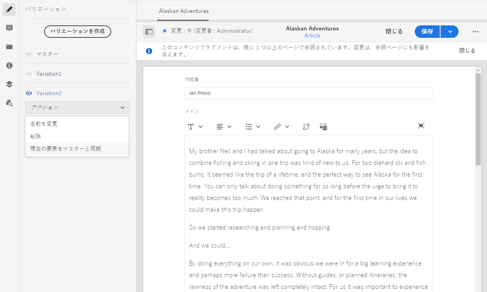

   * 全画面表示エディターのツールバー - **マスターと同期**

     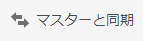

1. マスターとバリエーションが並べて表示されます。

   * 緑は（バリエーションに）追加されたコンテンツを示します
   * 赤は削除されたコンテンツを示します（バリエーションからの削除）
   * 青は置換されたテキストを示します

   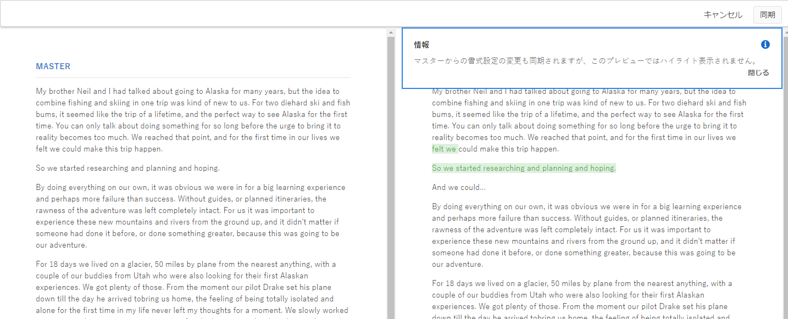

1. 選択 **同期**&#x200B;の場合、バリエーションが更新され、表示されます。
