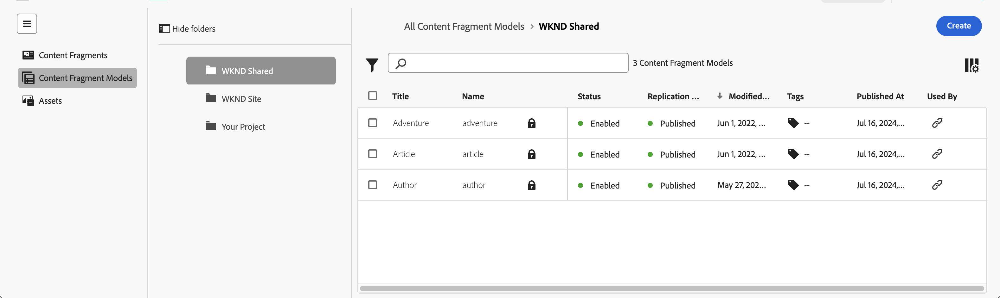
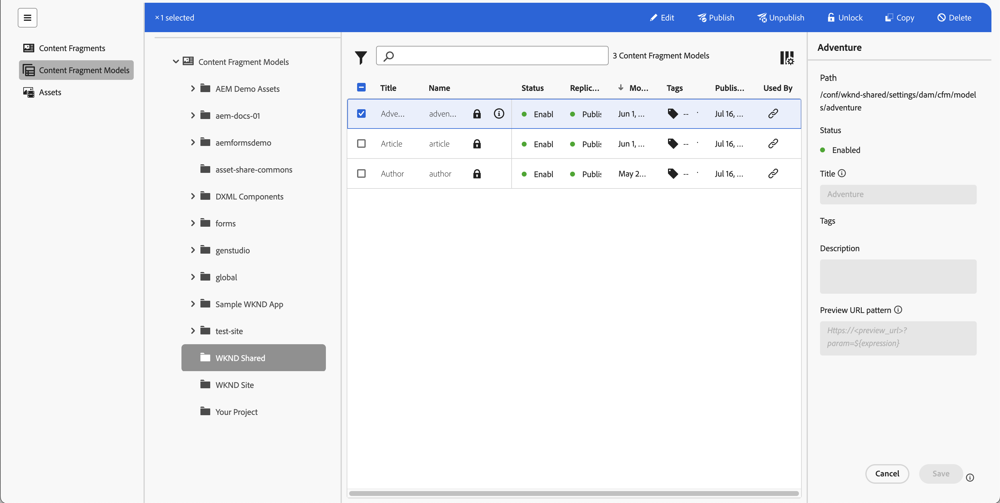
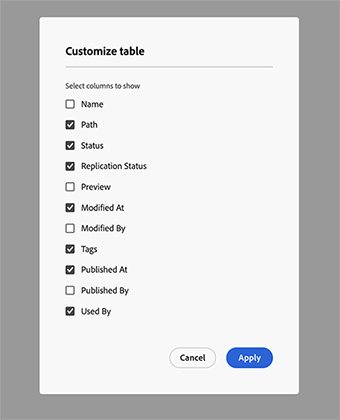
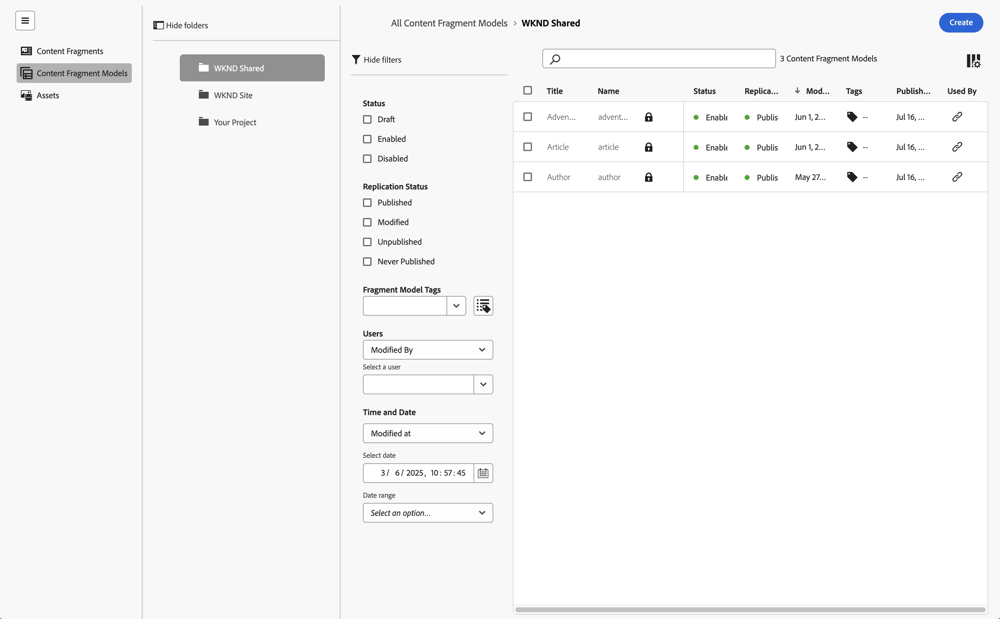
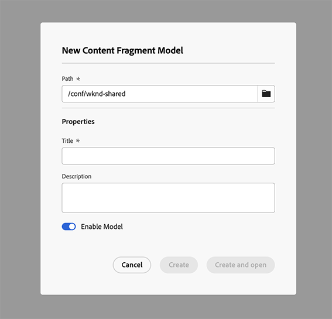
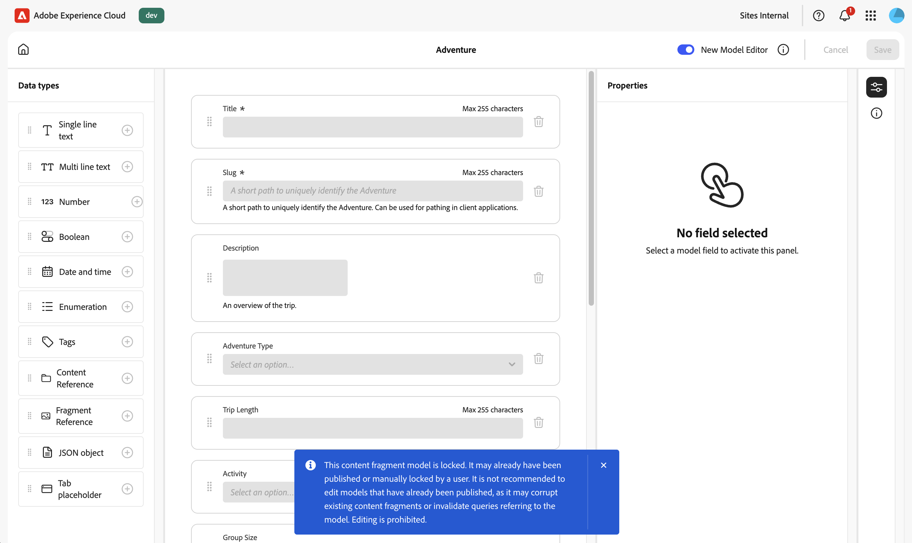

# コンテンツフラグメントモデルの管理 {#managing-content-fragment-models}

コンテンツフラグメントコンソールでは、コンテンツフラグメントモデルを管理でき、さらに[エディターを開いて](/help/sites-cloud/administering/content-fragments/content-fragment-models.md)構造を定義できます。

Adobe Experience Manager（AEM）as a Cloud Service のコンテンツフラグメントモデルでは、[コンテンツフラグメント](/help/sites-cloud/administering/content-fragments/overview.md)のコンテンツの構造を定義します。これらのコンテンツフラグメントは、ヘッドレスコンテンツの基礎として、またはページオーサリングに使用できます。

>[!NOTE]
>
>このページでは、コンテンツフラグメントモデル（のみ）を表示するコンソールのセクションについて説明します。その他のパネルについては、以下を参照してください。
>
>* [コンテンツフラグメントの管理](/help/sites-cloud/administering/content-fragments/managing.md)
>* [コンテンツフラグメントコンソールでのアセットの表示と管理](/help/sites-cloud/administering/content-fragments/assets-content-fragments-console.md)

>[!NOTE]
>
>コンテンツフラグメントは、**アセット**&#x200B;として保存されます。コンテンツフラグメントモデルは主に&#x200B;**コンテンツフラグメント**&#x200B;コンソールから管理しますが、[アセット](/help/assets/content-fragments/content-fragments-managing.md)コンソールおよび **ツール**／**一般**&#x200B;の「](/help/assets/content-fragments/content-fragments-models.md)コンテンツフラグメントモデル[」オプションからも管理できます。

## コンテンツフラグメントモデルの操作方法 {#how-to-work-with-content-fragment-models}

簡単にまとめると、コンテンツフラグメントモデルを操作するには、次の手順を実行します。

1. [インスタンスに対するコンテンツフラグメントモデル機能を有効化します](/help/sites-cloud/administering/content-fragments/setup.md)
1. コンテンツフラグメントモデルを[作成](#creating-a-content-fragment-model)します。
   * この時点で、モデルを&#x200B;**有効にする**&#x200B;こともできます（コンテンツフラグメントの作成時に使用します）。
1. モデルの構造を[定義](/help/sites-cloud/administering/content-fragments/content-fragment-models.md#defining-your-content-fragment-model)します。
1. [コンテンツフラグメントモデルを有効にします](#enabling-a-content-fragment-model)（まだの場合）。
1. **ポリシー**&#x200B;を設定して、[必要なアセットフォルダーでコンテンツフラグメントモデルを許可します](#allowing-content-fragment-models-assets-folder)。

## コンソールのコンテンツフラグメントモデルの基本構造と基本操作 {#basic-structure-handling-content-fragment-models-console}

[コンテンツフラグメントコンソール](/help/sites-cloud/administering/content-fragments/overview.md#content-fragments-console)の左端のパネルを使用して、表示、参照、管理するリソースタイプで「**コンテンツフラグメントモデル**」を選択できます。

これにより、コンテンツフラグメントモデルのビューが開きます。

主な領域が 3 つあります。

* 上部のツールバー
   * 標準の AEM 機能を提供します
   * IMS 組織を表示
   * には様々な [ アクション ](#actions-unselected) が用意されており、1 つ以上のモデルを選択して [ 変更 ](#actions-selected-content-fragment-models) できます。
* 左側のパネル
   * フォルダーとしてリストされた[すべての設定へのパス](/help/sites-cloud/administering/content-fragments/setup.md#enable-content-fragment-functionality-configuration-browser)を表示します
   * フォルダーツリーを表示したり非表示にしたりできます
   * ツリーの特定のフォルダーを選択できます
   * ネストされたフォルダー（サブ設定）が表示されるようにサイズ変更できます
   * コンテンツフラグメントモデルだけでなく、[コンテンツフラグメント](/help/sites-cloud/administering/content-fragments/managing.md)や[アセット](/help/sites-cloud/administering/content-fragments/assets-content-fragments-console.md)も表示できます。また、パネルへのリンクを圧縮または展開することもできます
* 右側のメインパネルでは、次のことが可能です。
   * 選択したフォルダーの下にあるすべてのコンテンツフラグメントモデルのリストを確認します。
      * 選択したフォルダーのコンテンツフラグメントモデルと、すべての子フォルダーが表示されます。
         * 場所はパンくずリストで示されます。これを使用して、場所を変更することもできます。
      * [各モデルに関する情報が表示されます](#information-content-fragment-models)
         * [表示する列を選択できます](#select-columns-console)
      * コンテンツフラグメントにモデル関する[様々な情報フィールド](#information-content-fragment-models)にリンクがあります。このリンクは、フィールドに応じて、次のような機能があります。
         * エディターで適切なフラグメントを開く
         * 設定へのパスに関する情報を表示する
         * モデルのステータスに関する情報を表示する
      * コンテンツフラグメントモデルについての[その他の特定の情報フィールド](#information-content-fragments)は、[高速フィルタリング](#fast-filtering)に使用できます。
         * 列の値を選択すると、直ちにフィルターとして適用されます
         * 高速フィルタリングは、**変更者**、**公開者**、**ステータス**&#x200B;の各列でサポートされています。
      * 列ヘッダーにマウスオーバーを使用すると、ドロップダウンアクションセレクターと幅スライダーが表示されます。これらを使用すると、次のことができます。
         * 並べ替え - 昇順または降順に適切なアクションを選択します。
これにより、テーブル全体がその列に従って並べ替えられます。並べ替えは、適切な列でのみ使用できます。
         * 列のサイズを変更 - アクションまたは幅スライダーを使用します。
      * さらに[アクション](#actions-selected-content-fragment-models)を実行するには、1 つ以上のフラグメントを選択します
   * 「[フィルターパネル](#filter-content-fragment-models)」を開きます
   * このコンソールで使用できる[キーボードショートカット](/help/sites-cloud/administering/content-fragments/keyboard-shortcuts.md)の選択

## コンテンツフラグメントモデルに関して提供される情報 {#information-content-fragment-models}

コンソールのメインパネルや右パネル（テーブル表示）には、コンテンツフラグメントモデルに関する様々な情報が表示されます。また一部の項目には、その他のアクションや情報への直接リンクも含まれます。

* **名前**
   * エディターでモデルを開くためのリンクを提供します。
* **ロック済み**（南京錠アイコン）
   * モデルがロックされている場合、南京錠アイコンが表示されます。
* **パス**
   * コンソールでフォルダーを開くためのリンクが表示されます。
フォルダー名にカーソルを合わせると、JCR パスが表示されます。
* **ステータス**
   * 情報提供のみ。
   * [高速フィルタリング](#fast-filtering)に使用可能
* **レプリケーションステータス**
   * 情報提供のみ。
   * [高速フィルタリング](#fast-filtering)に使用可能。
* **プレビュー**
   * 情報提供のみ。
* **変更日時**
   * 情報提供のみ。
   * [高速フィルタリング](#fast-filtering)に使用可能。
* **変更者**
   * 情報提供のみ。
   * [高速フィルタリング](#fast-filtering)に使用可能。
* **タグ**
   * 情報提供のみ。
   * モデルに関連するすべてのタグを表示するダイアログを開きます。
   * [高速フィルタリング](#fast-filtering)に使用可能
* **公開時間**
   * 情報提供のみ。
   * [高速フィルタリング](#fast-filtering)に使用可能。
* **公開者**
   * 情報提供のみ。
   * [高速フィルタリング](#fast-filtering)に使用可能。
* **使用者**
   * モデルに基づくコンテンツフラグメントを一覧表示するダイアログを開きます。 リストには、フラグメントを直接開くためのリンクが表示されます。

## モデルのプロパティ {#model-properties}

特定のモデルを選択すると、そのモデルのプロパティが（[モデルの作成](#creating-a-content-fragment-model)時に定義したとおりに）表示されます。モデルが&#x200B;**ロック**&#x200B;されていないでない場合、一部の項目は更新できます。また、情報アイコン（モデルの&#x200B;**タイトル**&#x200B;の横）を使用して、この情報パネルの開閉ができます。

* **[パス](/help/sites-cloud/administering/content-fragments/setup.md#enable-content-fragment-functionality-configuration-browser)**
* **[ステータス](#enabling-a-content-fragment-model)**
* **タイトル**
* **タグ**
* **説明**
* **プレビュー URL パターン**

  コンテンツフラグメントモデルを使用すると、作成者は外部フロントエンドアプリケーションでコンテンツを&#x200B;**プレビュー**&#x200B;できます。**プレビューサービス**&#x200B;を設定したら、フロントエンドアプリケーションの URL を追加します。

  プレビュー URL は次のパターンに従う必要があります。
    `https://<preview_url>?param=${expression}`

  使用できる式は次のとおりです。

   * `${contentFragment.path}`
   * `${contentFragment.model.path}`
   * `${contentFragment.model.name}`
   * `${contentFragment.variation}`
   * `${contentFragment.id}`

<!-- CHECK: currently under FT -->
<!--
* **GraphQL**
  Define names relevant for GraphQL.
  Changing the GraphQL API Name, or Query field names will impact client applications.
  * **API Name**
    Represents the GraphQL type and query field names in the GraphQL schema.
  * **Single Query Field Name**
    Represents the GraphQL single query field name in the GraphQL schema.
  * **Multiple Query Field Name**
    Represents the GraphQL multiple query field name in the GraphQL schema.
-->

## アクション {#actions}

フォルダーを（左側のパネルで）選択した後、そのまま直接できるアクション、または特定のモデルを選択した後にできる様々なアクションがあります。

* 様々なアクションを[コンソールから直接実行できます](#actions-unselected)
* [1 つ以上のコンテンツフラグメントを選択して所定のアクションを表示](#actions-selected-content-fragment)できます

### アクション（未選択） {#actions-unselected}

フォルダーの選択後、特定のコンテンツフラグメントモデルを選択しなくても、コンソールから特定のアクションを実行できます。

* 新しいワークフローモデルを&#x200B;**[作成](#creating-a-content-fragment-model)**&#x200B;します

### コンテンツフラグメントコンソールでのコンテンツフラグメントモデルのアクション {#actions-selected-content-fragment-models}

特定のモデルを選択するとツールバーが開き、そのモデルで使用可能なアクションが表示されます。複数のモデルを選択することもできます。それに応じて、使用可能なアクションも変化します。

* **[編集](/help/sites-cloud/administering/content-fragments/content-fragment-models.md)**：コンテンツフラグメントモデルを定義します。
* **[公開](#publishing-a-content-fragment-model)** 層または **[プレビュー](#unpublishing-a-content-fragment-model)** 層に [ 公開 ](/help/implementing/cloud-manager/manage-environments.md#environment-types) および [ 非公開 ](/help/implementing/cloud-manager/manage-environments.md#access-preview-service)。
* **ロック**／**ロック解除**：ユーザーのモデルの変更を許可するかどうかを制御します。
* モデルを **コピー** します。
* **[有効化](#enabling-a-content-fragment-model)**／**[無効化](#disabling-a-content-fragment-model)**：ユーザーがこのモデルを基にコンテンツフラグメントを作成することを許可するかどうかを制御します。

1 つのモデルを選択すると、右側のパネルに[モデルのプロパティ](#properties)も表示されます。

## コンソールに表示される列の選択 {#select-columns-console}

他のコンソールと同様に、表示する列やアクションに使用できる列を設定できます。

表示または非表示にできる列のリストが表示されます。

## コンテンツフラグメントモデルのフィルター {#filter-content-fragment-models}

フィルターパネルには、次の機能があります。

* 一連の述語
   * ステータスフィールド、タグ、ユーザーなど
   * 1 つ以上の述語を選択して組み合わせ、フィルターを作成できます

<!--
* the opportunity to **Save** your filter
* the option to retrieve a saved search filter for reuse
-->

選択した後、メインパネルの上部に「**フィルター条件**」オプションが表示され、そこから選択を解除できます。例：

### 高速フィルタリング {#fast-filtering}

リスト内の特定の列の値をクリックして、述語を選択することもできます。1 つ以上の値を選択して、述語を組み合わせることができます。

例えば、**ステータス**&#x200B;列の「**公開済み**」を選択します。選択すると、フィルターの述語として表示され、それに応じてリストがフィルターされます。

>[!NOTE]
>
>高速フィルターが対応しているのは、「**ステータス**」、「**変更者**、「**タグ**」、「**公開者**」の各列のみです。

>[!NOTE]
>
>高速フィルタリングは、コンソールでの[コンテンツフラグメント](/help/sites-cloud/administering/content-fragments/managing.md#fast-filtering)と同じ方法で動作します。

## コンテンツフラグメントモデルの作成 {#creating-a-content-fragment-model}

1. 目的の[設定またはサブ設定](/help/sites-cloud/administering/content-fragments/setup.md)に適したフォルダーに移動します。
1. 「**作成**」を使用してダイアログを開きます。

   >[!CAUTION]
   >
   >「**作成**」オプションは、次の場合にのみ使用できます。
   >
   >* [コンテンツフラグメントモデルの使用が有効になっている場合](/help/sites-cloud/administering/content-fragments/setup.md)
   >* モデルを作成するフォルダーが選択されている場合。

1. 設定の&#x200B;**パス**&#x200B;を選択し、**名前**&#x200B;を指定します。

   >[!NOTE]
   >
   >設定には、現在の設定（現在のフォルダー）が自動入力されます。
   >
   >フォルダーアイコンをクリックして設定を変更することもできます。

   様々なプロパティも定義できます。

   * **タイトル**
最初に**タイトル**&#x200B;を入力すると、そこから&#x200B;**名前**&#x200B;が生成されます。
   * **説明**
   * **モデルを有効にする**&#x200B;で[モデルを有効にします](#enabling-disabling-a-content-fragment-model)

   >[!NOTE]
   >
   >詳しくは、[コンテンツフラグメントモデル - プロパティ](#model-properties)を参照してください。

   

1. 「**作成**」を使用して空のモデルを保存するか、「**作成して開く**」を使用します。

### コンテンツフラグメントモデルの有効化 {#enabling-a-content-fragment-model}

モデルを作成したら、次のようにモデルを有効にする必要があります。

* コンテンツフラグメントの作成時に選択できます。
* コンテンツフラグメントモデル内から参照する
* GraphQL で使用する（スキーマが生成される）

モデルは次の場合に&#x200B;**有効**&#x200B;にできます。

* モデルを作成するとき
   * オプションがダイアログに表示されます。
* モデルが明確に&#x200B;**無効**&#x200B;になったとき
   * 必要なモデルを選択すると、上部のツールバーで「**有効にする**」アクションを使用できます。

### コンテンツフラグメントモデルの無効化 {#disabling-a-content-fragment-model}

モデルを無効にすると、以下のようになります。

* このモデルは、*新しい*&#x200B;コンテンツフラグメントを作成する際の基盤としては使用できなくなります。
* ただし、
   * GraphQL スキーマは生成され続け、スキーマのクエリも引き続き可能です（JSON API への影響を回避するため）。
   * モデルに基づくコンテンツフラグメントは、引き続き GraphQL エンドポイントからクエリして返すことができます。
* モデルは参照できなくなりますが、既存の参照は変更されず、引き続き GraphQL エンドポイントからクエリして返すことができます。

「**有効**」としてフラグ付けされたモデルを無効にするには、次のいずれかの「**無効にする**」オプションを使用します。

* 上部のツールバー（必要なモデルが選択されている場合）。

## アセットフォルダーでのコンテンツフラグメントモデルの許可 {#allowing-content-fragment-models-assets-folder}

コンテンツのガバナンスを実装するには、アセットフォルダーに&#x200B;**ポリシー**&#x200B;を設定して、そのフォルダーでのフラグメント作成に使用可能なコンテンツフラグメントモデルを管理します。

>[!NOTE]
>
>このメカニズムは、ページの高度なプロパティでページとその子に対して[ページテンプレートを許可する](/help/sites-cloud/authoring/page-editor/templates.md#allowing-a-template-author)ことに似ています。

**許可されているコンテンツフラグメントモデル**&#x200B;に&#x200B;**ポリシー**&#x200B;を設定するには：

1. 必要なアセットフォルダーの&#x200B;**プロパティ**&#x200B;を開きます。

1. 「**ポリシー**」タブを開き、以下を設定します。

   * **継承元`<folder>`**

     ポリシーは、新しい子フォルダーの作成時に自動的に継承されます。サブフォルダーで親フォルダーとは異なるモデルを許可する必要がある場合は、ポリシーを再設定（継承を解除）できます。

   * **許可されているコンテンツフラグメントモデルパス (パス別)**

     複数のモデルを許可できます。

   * **許可されているコンテンツフラグメントモデルタグ (タグ別)**

     複数のモデルを許可できます。

   

1. 変更内容を&#x200B;**保存**&#x200B;します。

フォルダーに対して許可されるコンテンツフラグメントモデルは、次の順序で解決されます。

* **許可されているコンテンツフラグメントモデル**&#x200B;の&#x200B;**ポリシー**。
* 空の場合は、継承ルールを使用してポリシーの決定を試みます。
* 継承チェーンを使用しても結果が得られない場合は、そのフォルダーの **Cloud Services** 設定を調べます（最初は直接、次に継承を使用して調べます）。
* 上記のいずれでも結果が得られない場合、そのフォルダーに許可されるモデルはありません。

## コンテンツフラグメントモデルの削除 {#deleting-a-content-fragment-model}

>[!CAUTION]
>
>コンテンツフラグメントモデルを削除すると、依存するフラグメントに影響を与える場合があります。

コンテンツフラグメントモデルを削除するには、次の操作を実行します。

1. コンテンツフラグメントモデルに移動して選択します。複数のモデルを選択できます。

1. ツールバーから「**削除**」を選択します。

   >[!NOTE]
   >
   >モデルが参照されている場合は、適切なアクションを実行できるように警告が表示されます。

## コンテンツフラグメントモデルの公開 {#publishing-a-content-fragment-model}

コンテンツフラグメントモデルは、そのモデルに依存するコンテンツフラグメントの公開時または公開前に公開する必要があります。

コンテンツフラグメントモデルを公開するには：

1. コンテンツフラグメントモデルに移動して選択します。複数のモデルを選択できます。

1. ツールバーの「**公開**」を選択します。

1. 公開ダイアログで、「**宛先**」を選択します。

   * **パブリッシュサービス**
   * **プレビューサービス**

1. 選択したモデルとその参照を公開するワークフローが開始されます。公開ステータスがコンソールに示されます。

## コンテンツフラグメントモデルを非公開にする {#unpublishing-a-content-fragment-model}

コンテンツフラグメントモデルがフラグメントによって参照されていない場合は、そのモデルを非公開にできます。

コンテンツフラグメントモデルを非公開するには、次の操作を実行します。

1. コンテンツフラグメントモデルに移動して選択します。
公開ステータスがコンソールに表示されます。

1. ツールバーの **非公開** を選択します。

1. 非公開ダイアログで、**宛先** を選択します。

   * **パブリッシュサービス**
   * **プレビューサービス**

1. 選択したモデルとその参照を非公開にするワークフローが開始されます。 非公開ステータスがコンソールに表示されます。

1 つ以上のフラグメントで現在使用されているモデルを非公開にしようとすると、エラーメッセージが表示されます。このメッセージでは、[参照](/help/sites-cloud/authoring/basic-handling.md#references)パネルを確認して詳細を調べるよう提案されます。

## コンテンツフラグメントモデルのロック {#locked-content-fragment-models}

この機能を使用すると、モデルを更新できるかどうかを制御できますが、公開済みのコンテンツフラグメントモデルに対するガバナンスもできるようになります。

### 課題 {#the-challenge}

* コンテンツフラグメントモデルは、AEM における GraphQL クエリのスキーマを決定します。

   * AEM GraphQL スキーマは、コンテンツフラグメントモデルが作成されると同時に作成され、オーサー環境とパブリッシュ環境の両方に存在できます。

   * 公開上のスキーマは、JSON 形式のコンテンツフラグメントコンテンツをライブ配信する場合の基盤となるので、非常に重要です。

* コンテンツフラグメントモデルが変更つまり編集された場合には、問題が発生する可能性があります。つまり、スキーマの変更が既存の GraphQL クエリに影響を与える可能性があります。

* コンテンツフラグメントモデルに新しいフィールドを追加する場合は、（通常は）悪影響はありません。ただし、既存のデータフィールド（名前など）を変更したり、フィールド定義を削除したりすると、既存の GraphQL クエリでこれらのフィールドをリクエストする際に、クエリが機能しなくなります。

### 要件 {#the-requirements}

* ライブコンテンツ配信に既に使用されているモデル（つまり、公開済みのモデル）を編集する際のリスクをユーザーに認識させる。

* 意図しない変更を避ける。

いずれにせよ、変更されたモデルが再公開されると、クエリが機能しなくなる可能性があります。

### 解決策 {#the-solution}

これらの問題に対処するために、コンテンツフラグメントモデルは、公開され次第、オーサー環境では読み取り専用モードに&#x200B;*ロック*&#x200B;されます。このステータスは、**ロック済み**&#x200B;と表示されます。

モデルが&#x200B;**ロック済み**（読み取り専用モード）の場合、モデルの内容と構造は表示できますが、モデルを編集することはできません。

**ロック済み**&#x200B;モデルは、コンソールまたはモデルエディターで管理できます。

* コンソール

  コンソールで、ツールバーの「**ロック解除**」および「**ロック**」アクションを使用して、読み取り専用モードを管理できます。

   * モデルを&#x200B;**ロック解除**&#x200B;して編集を有効にすることができます。

     「**ロック解除**」を選択した場合、警告が表示されるので、「**ロック解除**」アクションを確定する必要があります。

     その後、モデルを編集用に開くことができます。

   * 編集後にまたモデルを&#x200B;**ロック**&#x200B;することもできます。
   * モデルを再公開すると、すぐに&#x200B;**ロック済み**（読み取り専用）モードに戻ります。

* モデルエディター

   * ロックされているモデルを開くと、警告が表示され、「**キャンセル**」、「**読み取り専用で表示**」、「**編集**」の 3 つのアクションが提示されます。

   * 「**読み取り専用で表示**」を選択した場合、モデルの内容と構造が表示されます。

   * 「**編集**」を選択すると、更新内容を編集して保存できます。

     

     >[!NOTE]
     >
     >まだ上部に警告が表示される場合がありますが、その場合は、モデルが既存のコンテンツフラグメントで既に使用されています。

   * 「**キャンセル**」を選択すると、コンソールに戻ります。
