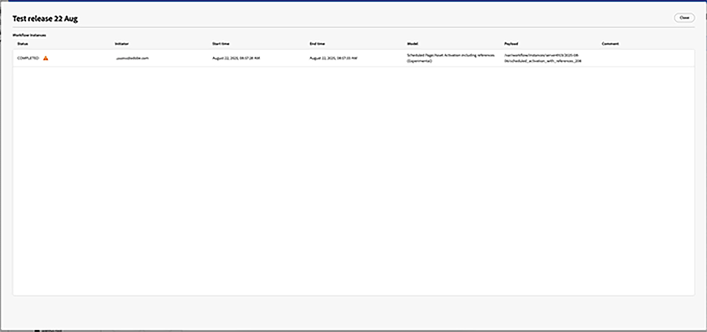
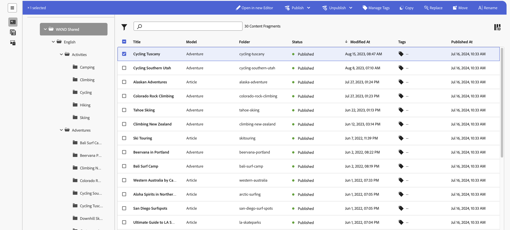

# コンテンツフラグメントの管理 {#managing-content-fragments}

専用の [コンテンツフラグメントコンソール](#content-fragments-console)および [コンテンツフラグメントエディター](/help/sites-cloud/administering/content-fragments/authoring.md#content-fragment-editor)から、Adobe Experience Manager (AEM) as a Cloud Serviceの&#x200B;**コンテンツフラグメント**&#x200B;の管理方法を説明します。これらのコンテンツフラグメントは、ヘッドレスコンテンツの基礎として、またはページオーサリングに使用できます。

>[!NOTE]
>
>このページでは、コンテンツフラグメント（のみ）を表示するコンソールのセクションについて説明します。その他のパネルについては、以下を参照してください。
>
>* [コンテンツフラグメントモデルの管理](/help/sites-cloud/administering/content-fragments/managing-content-fragment-models.md)
>* [コンテンツフラグメントコンソールでのアセットの表示と管理](/help/sites-cloud/administering/content-fragments/assets-content-fragments-console.md)

[コンテンツフラグメントモデル](#creating-a-content-model)を定義した後、これらを使用して、次のことができます。

* [コンテンツフラグメントを作成する](#creating-a-content-fragment).
* 次に、[コンテンツフラグメントエディター](#opening-the-fragment-editor) を開いて、[コンテンツを作成しバリエーションを管理します](#editing-the-content-of-your-fragment)。
* [タグを管理](#manage-tags)
* [プロパティ（メタデータ）を表示および編集する](#viewing-and-editing-properties)
* [構造ツリーの表示](/help/sites-cloud/administering/content-fragments/authoring.md#structure-tree)

>[!NOTE]
>
>コンテンツフラグメントは次に使用できます。
>
>* [GraphQL でコンテンツフラグメントを使用するヘッドレスコンテンツ配信用。](/help/sites-cloud/administering/content-fragments/content-delivery-with-graphql.md)
>* ページのオーサリング時 -「[コンテンツフラグメントを使用したページオーサリング](/help/sites-cloud/authoring/fragments/content-fragments.md)」を参照してください。

>[!NOTE]
>
>コンテンツフラグメントは&#x200B;**アセット**&#x200B;として保存されます。これらは主に&#x200B;**コンテンツフラグメント**&#x200B;コンソールから管理しますが、[Assets](/help/assets/content-fragments/content-fragments-managing.md) コンソールからも管理できます。

## コンソールのコンテンツフラグメントの基本構造と基本操作 {#basic-structure-handling-content-fragments-console}

[コンテンツフラグメントコンソール](/help/sites-cloud/administering/content-fragments/overview.md#content-fragments-console)の左端のパネルを使用して、表示、参照、管理するリソースタイプとして「**コンテンツフラグメント**」を選択できます。


**コンテンツフラグメント**&#x200B;を選択すると、コンソールが新しいタブで開きます。


主な領域が 3 つあります。

* 上部のツールバー
   * 標準の AEM 機能を提供します
   * IMS 組織も表示します
   * 様々な[アクション](#actions-unselected)の提供
* 左側のパネル
   * パネルへのリンクを圧縮または展開できます
   * フォルダーツリーを表示したり非表示にしたりできます
   * ツリーの特定のブランチを選択できます
   * これは、ネストされたフォルダーを表示するようにサイズ変更できます
   * コンテンツフラグメントと同様に、次のことができます。
      * [ コンテンツフラグメントモデル ](/help/sites-cloud/administering/content-fragments/managing-content-fragment-models.md) または [Assets](/help/sites-cloud/administering/content-fragments/assets-content-fragments-console.md) を表示します。パネルへのリンクを圧縮または展開することもできます
      * [ コンテンツフラグメントのローンチ ](/help/sites-cloud/administering/content-fragments/launches-for-content-fragments.md) を作成および管理
* 右側のメインパネル
   * 選択したツリーのブランチにあるすべてのコンテンツフラグメントのリストを表示します。
      * 選択したフォルダーのコンテンツフラグメントと、すべての子フォルダーが表示されます:
         * 場所はパンくずリストで示されます。これを使用して、場所を変更することもできます:
      * [各フラグメントに関する情報が表示されます](#information-content-fragments)
         * [表示する列を選択できます](#select-columns-console)
      * コンテンツフラグメントに関する[様々な情報フィールド](#information-content-fragments)のリンクは、フィールドに応じて、次のことが可能です。
         * エディターで適切なフラグメントを開く
         * 参照に関する情報を表示
         * フラグメントの言語バージョンに関する情報を表示
      * コンテンツフラグメントについての[その他の特定の情報フィールド](#information-content-fragments)は、[高速フィルタリング](#fast-filtering)に使用できます。
         * 列の値を選択すると、直ちにフィルターとして適用されます
         * 高速フィルターは、「**モデル**」、「**ステータス**」、「**変更者**」、「**タグ**」、「**公開者**」列のみに対応しています。
      * 列ヘッダーにマウスオーバーを使用すると、ドロップダウンアクションセレクターと幅スライダーが表示されます。これらを使用すると、次のことができます。
         * 並べ替え - 昇順または降順に適切なアクションを選択します。
これにより、テーブル全体がその列に従って並べ替えられます。並べ替えは、適切な列でのみ使用できます。
         * 列のサイズを変更 - アクションまたは幅スライダーを使用します。
      * さらに[アクション](#actions-selected-content-fragment)を実行するには、1 つ以上のフラグメントを選択します
   * 「[検索](#searching-fragments)」ボックスを使用します
   * 「[フィルターパネル](#filtering-fragments)」を開きます
   * このコンソールで使用できる[キーボードショートカット](/help/sites-cloud/administering/content-fragments/keyboard-shortcuts.md)の選択

## コンテンツフラグメントに関して提供される情報 {#information-content-fragments}

コンソールのメインパネルや右パネル（テーブル表示）には、コンテンツフラグメントに関する様々な情報が表示されます。 また一部の項目には、その他のアクションや情報への直接リンクも含まれます。

* **名前**
   * エディターでフラグメントを開くためのリンクを提供します。
* **モデル**
   * 情報提供のみ。
   * [高速フィルタリング](#fast-filtering)に使用可能
* **フォルダー**
   * コンソールでフォルダーを開くためのリンクを提供します。
フォルダー名にカーソルを合わせると、JCR パスが表示されます。
* **ステータス**
   * 情報提供のみ。
   * [高速フィルタリング](#fast-filtering)に使用可能
* **プレビュー**
   * 情報のみ:
      * **同期中**：コンテンツフラグメントは、**オーサー**&#x200B;サービスおよび&#x200B;**プレビュー**&#x200B;サービスは同期されます。
      * **非同期**：コンテンツフラグメントは、**オーサー**&#x200B;サービスおよび&#x200B;**プレビュー**&#x200B;サービスと同期されません。**公開**&#x200B;から&#x200B;**プレビュー**&#x200B;を実行して、2 つのインスタンスが確実に同期状態に戻るようにします。
      * 空白：コンテンツフラグメントが&#x200B;**プレビュー**&#x200B;サービスに存在しません。
* **変更**
   * 情報提供のみ。
* **変更者**
   * 情報提供のみ。
   * [高速フィルタリング](#fast-filtering)に使用可能。
* **タグ**
   * 情報提供のみ。
   * コンテンツフラグメントに関連するすべてのタグ（メインとバリエーションの両方）を表示します。
   * [高速フィルタリング](#fast-filtering)に使用可能
* **公開時間**
   * 情報提供のみ。
* **公開者**
   * 情報提供のみ。
   * [高速フィルタリング](#fast-filtering)に使用可能。
* **参照元**:
   * フラグメントのすべての[親参照](#parent-references-fragment)を一覧表示するダイアログを開くリンクを提供します。コンテンツフラグメント、エクスペリエンスフラグメント、ページの参照が含まれます。特定の参照を開くには、ダイアログで「**タイトル**」をクリックします。

     

* **言語**：[言語](#language-copies-fragment)コピーを示します

   * コンテンツフラグメントのロケールと、コンテンツフラグメントに関連付けられたローカル／[言語](#language-copies-fragment)コピーの総数を示します。

     

   * カウントを選択して、すべての言語コピーが表示されるダイアログを開きます。特定の言語コピーを開くには、ダイアログで「**タイトル**」をクリックします。

     

* **ワークフロー**

   * 情報のみ

   * 特定のフラグメントのアイコンを選択します。

     

     フラグメントのワークフロー（過去と現在）に関する詳細情報を含むダイアログを開くには。：

     

## アクション {#actions}

コンソール内には、直接または特定のフラグメントを選択した後に使用できる様々なアクションがあります。

* 様々なアクションを[コンソールから直接実行できます](#actions-unselected)
* [1 つ以上のコンテンツフラグメントを選択して、適切なアクションを表示](#actions-selected-content-fragment)することができます。

### アクション（未選択） {#actions-unselected}

特定のコンテンツフラグメントを選択しなくても、特定のアクションはコンソールから実行できます。

* 新しいコンテンツフラグメントを&#x200B;**[作成](#creating-a-content-fragment)**&#x200B;します
* 述語の選択に従ってコンテンツフラグメントを[フィルタリング](#filtering-fragments)し、今後の使用のためにフィルターを保存します
* コンテンツフラグメントを[検索](#searching-fragments)します
* [テーブル表示をカスタマイズして、選択した情報列を表示します](#select-columns-console)
* **アセットで開く**&#x200B;を使用して、**アセット**&#x200B;コンソールで現在の場所を直接開きます

  >[!NOTE]
  >
  >**Assets** のコンソールでは、画像やビデオなどのアセットにアクセスできます。このコンソールには、次の方法でアクセスできます。
  >
  >* **Assets で開く**&#x200B;のリンクを使用（コンテンツフラグメントコンソール内にあります
  >* グローバル&#x200B;**ナビゲーション**&#x200B;パネルから直接

### （選択された）コンテンツフラグメントのアクション {#actions-selected-content-fragment}

特定のフラグメントを選択するとツールバーが開き、そのフラグメントで使用可能なアクションが表示されます。複数のフラグメントを選択することもできます。それに応じて、焦点が当たるアクションも変化します。



* **[新しいエディターで開く](#editing-the-content-of-your-fragment)**
* **[公開](#publishing-and-previewing-a-fragment)**（および&#x200B;**[非公開](#unpublishing-a-fragment)**）
* **[タグを管理](#manage-tags)**
* **[コピー](#copy-a-content-fragment)**
* **[置換](#find-and-replace)**
* **移動**
* **名前の変更**
* **[削除](#deleting-a-fragment)**（非公開のフラグメントでのみ使用できます）


>[!NOTE]
>
>「**開く**」を使用し、選択したフラグメントを&#x200B;*元の*&#x200B;エディターで開きます。

>[!NOTE]
>
>公開、非公開、削除、移動、名前の変更、コピーなどのアクションは、非同期ジョブをトリガーします。そのジョブの進行状況は、AEM 非同期ジョブ UI で監視できます。

## コンテンツフラグメントの作成 {#creating-content-fragments}

コンテンツフラグメントを作成する前に、基になるコンテンツフラグメントモデルを作成する必要があります。

### コンテンツモデルの作成 {#creating-a-content-model}

構造化コンテンツを含むコンテンツフラグメントを作成する前に、[コンテンツフラグメントモデル](/help/sites-cloud/administering/content-fragments/managing-content-fragment-models.md)を有効にして作成する必要があります。

### コンテンツフラグメントの作成 {#creating-a-content-fragment}

コンテンツフラグメントを作成するには：

1. **コンテンツフラグメント**&#x200B;コンソールから、「**作成**」（右上）を選択します。

   >[!NOTE]
   >
   >新しいフラグメントの場所を事前に定義するには、フラグメントを作成するフォルダーに移動するか、作成プロセス中に場所を指定します。

1. **新しいコンテンツフラグメント**&#x200B;ダイアログが開き、ここから次の項目を指定できます。

   * **場所** - 現在の場所がオートコンプリートされますが、必要に応じて別の場所を選択できます。
   * **コンテンツフラグメントモデル** - ドロップダウンリストからフラグメントの基礎として使用するモデルを選択します。
   * **自動タグ** - このオプションを選択すると、コンテンツフラグメントモデルに割り当てられたすべてのタグが新しいコンテンツフラグメントに継承され、追加されます。
   * **タイトル**
   * **名前** - **タイトル**&#x200B;に基づいてオートコンプリートされますが、必要に応じて編集できます。
   * **説明**

   

1. 「**作成**」または「**作成して開く**」を選択して、定義を保持します。

## コンテンツフラグメントのステータス {#statuses-content-fragments}

[コンテンツフラグメントコンソール](/help/sites-cloud/administering/content-fragments/overview.md#content-fragments-console)と[コンテンツフラグメントエディター](/help/sites-cloud/administering/content-fragments/authoring.md)に表示されるように、コンテンツフラグメントは、存在中、複数のステータスを持つことができます。

* **新規**（グレー）
新しいコンテンツフラグメントは作成されましたが、コンテンツフラグメントエディターで編集も開いたこともないので、このコンテンツフラグメントはコンテンツを持ちません。
* **ドラフト**（ブルー）
誰かがコンテンツフラグメントエディターで（新しい）コンテンツフラグメントを編集または開きましたが、まだ公開されていません。
* **公開済み**（グリーン）
コンテンツフラグメントが公開されています。
* **変更済み**（オレンジ）
コンテンツフラグメントが公開後（ただし、変更を公開する前）に編集されています。
* **非公開**（レッド）
コンテンツフラグメントが公開されていません。

## フラグメント（およびバリエーション）のコンテンツの編集 {#editing-the-content-of-your-fragment}

>[!IMPORTANT]
>
>詳しくは、[コンテンツフラグメントのオーサリングを参照してください](/help/sites-cloud/administering/content-fragments/authoring.md)

編集するためにフラグメントを開くには：

1. **コンテンツフラグメント**&#x200B;コンソールを使用して、コンテンツフラグメントの場所に移動します。
1. フラグメントを選択して編集用に開き、ツールバーから「**新しいエディターで開く**」を選択します。

1. フラグメントエディターが開きます。必要な&#x200B;**バリエーション**&#x200B;を選択して、必要に応じて変更を加えます（変更は自動保存されます）。

   

## コンテンツフラグメントのコピー {#copy-a-content-fragment}

**コピー**&#x200B;では、選択したフラグメントのコピーをその場所に作成します。

* **コピー**&#x200B;アクションでは、**参照されているコンテンツフラグメントもコピー**&#x200B;するかどうかを選択できます。これにより、選択したコンテンツフラグメントとすべての参照フラグメントの両方をコピーできます。AEM：

   * 選択したコンテンツフラグメントのコピーをその場所に作成します。
   * 選択したフラグメントによって参照されているすべてのフラグメントのコピーを作成します。

     [参照されているフラグメントがコピーされる場所](#locations-that-the-referenced-fragments-are-copied-to)は、選択したオプションによって異なります。

      * **選択したフォルダーにコピー**
選択すると、参照されているフラグメントは、元の選択したフラグメントと同じ場所にコピーされます。

      * **元の場所にコピー**
参照されているフラグメントは、元の参照されているフラグメントと同じ場所にコピーされます。これはデフォルトで、オプションを選択しない場合に使用されます。

* 選択したフラグメントのコピーは、参照フラグメントのコピーを参照します。

* ディープコピーが作成されます。したがって、参照コンテンツフラグメントもフラグメントを参照している場合は、これらもコピーされます。

* **コピー**&#x200B;アクションは、アセットや画像などの他の参照コンテンツには影響しません。参照（コンテンツ参照）は、新しいフラグメントの一部としてコピーされますが、アセット／画像コンテンツ自体はコピーされません。

### 参照されているフラグメントがコピーされる場所 {#locations-that-the-referenced-fragments-are-copied-to}

コンテンツフラグメントをコピーする際に、「**参照されているコンテンツフラグメントもコピー**」および関連オプションを使用して、参照されているフラグメントがコピーされる場所を指定できます。


#### 元の場所にコピー {#copy-to-their-original-locations}

「**元の場所にコピー**」を選択すると、参照されているフラグメントは元の参照されているフラグメントと同じ場所にコピーされます。また、これは、選択しない場合のデフォルトのアクションです。

それでは、次を開始します。

```xml
FolderA 
    FragmentA (inside FolderA)
    | 
    |___FolderB/FragmentB (referenced by FragmentA)

FolderB
   FragmentB
```

FragmentA を FolderC にコピーすると、次の結果になります。

```xml
FolderA 
    FragmentA (inside FolderA)
    | 
    |___FolderB/FragmentB (referenced by FragmentA)

FolderB
    FragmentB
    Copy_of_FragmentB

FolderC
    Copy_of_FragmentA
    | 
    |___FolderB/Copy_of_FragmentB (referenced by Copy_of_FragmentA)
```

#### 選択したフォルダーにコピー {#copy-to-the-selected-folder}

選択すると、参照されているフラグメントは、元の選択したフラグメントと同じ場所にコピーされます。

それでは、次を開始します。

```xml
FolderA 
    FragmentA (inside FolderA)
    | 
    |___FolderB/FragmentB (referenced by FragmentA)


FolderB
   FragmentB
```

FragmentA を FolderC にコピーすると、次の結果になります。

```xml
FolderA 
    FragmentA (inside FolderA) 
    | 
    |___FolderB/FragmentB (referenced by FragmentA) 

FolderB 
    FragmentB


FolderC
   Copy_of_FragmentA
   | 
   |___./Copy_of_FragmentB (referenced by FragmentA)
   Copy_of_FragmentB
```

## タグを表示および管理 {#manage-tags}

[列が表示されている](#select-columns-console)ことを確認した後、コンテンツフラグメントコンソールから、適用されたタグを&#x200B;**タグ**&#x200B;列で確認できます。

### タグ（コンソール）を管理 {#manage-tags-console}

タグを管理するには：

1. コンテンツフラグメントコンソールに移動します。
1. コンテンツフラグメントを選択します。
1. ツールバーで「**タグを管理**」を選択します。
1. タグセレクターを使用して、適用または削除するタグを選択します。

   

1. 更新を&#x200B;**保存**&#x200B;します。これによりコンソールに戻ります。

### 表示、編集、タグ（エディター） {#viewing-and-editing-tags}

また、エディターの「[プロパティ](/help/sites-cloud/administering/content-fragments/authoring.md) 」タブを使用して、フラグメントに適用されたタグを表示し編集できます。表示される情報は&#x200B;**メイン**&#x200B;と&#x200B;**バリエーション**&#x200B;の間で異なります。

## 表示、編集、プロパティ（エディター） {#viewing-and-editing-properties}

エディターの「[プロパティ](/help/sites-cloud/administering/content-fragments/authoring.md)」タブを使用して、フラグメントのプロパティ（メタデータ）を表示し編集できます。表示される情報は&#x200B;**メイン**&#x200B;といずれの&#x200B;**バリエーション**&#x200B;の間で異なります。

## フラグメントの公開およびプレビュー {#publishing-and-previewing-a-fragment}

コンテンツフラグメントは次の場所に公開できます。

* **[パブリッシュサービス](/help/headless/deployment/architecture.md)** - フル、パブリックアクセス用

* **[プレビューサービス](/help/headless/deployment/architecture.md)** – 完全に使用可能になる前にコンテンツを [ プレビュー ](/help/sites-cloud/administering/content-fragments/preview.md#preview-instance) します

  >[!CAUTION]
  >
  >**プレビューサービス**&#x200B;へのコンテンツフラグメントの公開は、**公開**&#x200B;アクションを使用して、コンテンツフラグメントコンソールからのみ使用できます。

  >[!NOTE]
  >
  >プレビュー環境について詳しくは、[環境の管理](/help/implementing/cloud-manager/manage-environments.md#access-preview-service)を参照してください。

>[!CAUTION]
>
>フラグメントがモデルに基づいている場合、その[モデルが公開されている](/help/sites-cloud/administering/content-fragments/managing-content-fragment-models.md#publishing-a-content-fragment-model)ことを確認してください。
>
>まだ公開されていないモデルのコンテンツフラグメントを公開すると、選択リストにそのことが示され、モデルがフラグメントと共に公開されます。

### 公開 {#publishing}

コンテンツフラグメントは、次のいずれかから「**公開**」オプションを使用して公開します。

* [コンテンツフラグメントコンソール](#actions-selected-content-fragment)のツールバー

   * リストから 1 つ以上のフラグメントを選択します。

* [コンテンツフラグメントエディター](/help/sites-cloud/administering/content-fragments/authoring.md#content-fragment-editor)のツールバー

「**公開**」アクションを選択した後：

1. 次のいずれかのオプションを選択して、適切なダイアログを開きます。

   * **今すぐ** - **公開サービス**&#x200B;または&#x200B;**プレビューサービス**&#x200B;を選択して確定すると、フラグメントがすぐに公開されます
   * **スケジュール** - 必要なサービスに加えて、フラグメントが公開される日時を選択できます

1. すべての詳細をダイアログに入力します。例えば、スケジュールされた公開リクエストの場合は、次のようになります。

   

   >[!NOTE]
   >
   >必要に応じて、公開する参照を指定する必要があります。デフォルトでは、参照はプレビューサービスにも公開され、コンテンツに壊れが生じないようになります。

1. 公開アクションを確認します。

公開後、フラグメントのステータスが更新され、エディターとコンソールに表示されます。公開のスケジュールを指定した場合は、その情報も表示されます。

>[!NOTE]
>
>さらに、[フラグメントを使用するページを公開](/help/sites-cloud/authoring/fragments/content-fragments.md#publishing)するとき。フラグメントはページ参照にリスト表示されます。

## フラグメントの非公開 {#unpublishing-a-fragment}

コンテンツフラグメントは非公開にすることもできます。

* [コンテンツフラグメントコンソール](#actions-selected-content-fragment)のツールバー

   * リストから 1 つ以上のフラグメントを選択します。

* [コンテンツフラグメントエディター](/help/sites-cloud/administering/content-fragments/authoring.md#content-fragment-editor)のツールバー

どちらの場合も、ツールバーの「**非公開**」の次に「**今すぐ**」または「**スケジュール済み**」のいずれかを選択します。

関連するダイアログが開いたら、適切なサービスを選択できます。


>[!NOTE]
>
>公開されたフラグメントが利用可能になると、**非公開**&#x200B;アクションが表示されます。

>[!CAUTION]
>
>フラグメントが既に別のフラグメントから参照されている場合、またはページから参照されている場合は、警告メッセージが表示され、続行を確認する必要があります。

## 検索と置換 {#find-and-replace}

**置換**&#x200B;アクション（上部のツールバーにある）を使用すると、選択したコンテンツフラグメント内の指定したテキストを検索して置換できます。


置換前に検証条件がチェックされ、競合がある場合は通知されるので、置換文字列を変更するか、検証済みのインスタンスのみを置換できます。

>[!NOTE]
>
>検索と置換アクションは、選択したコンテンツフラグメントに対して（一度に）最大 20 個のみ実行できます。
>
>20 個を超えるコンテンツフラグメントを選択すると、**検索と置換を実行できません**&#x200B;というメッセージが表示されます。


## フラグメントの削除 {#deleting-a-fragment}

レポートを削除する手順は次のとおりです。

1. **コンテンツフラグメント**&#x200B;コンソールで、コンテンツフラグメントの場所に移動します。
1. フラグメントを選択します。
1. ツールバーから「**削除**」を選択します。
1. 「**削除**」アクションを確認します。

>[!NOTE]
>
>公開されているフラグメントはまず非公開にしない限り、「**削除**」を使用できません。

## フラグメントの親参照の検索 {#parent-references-fragment}

親参照の詳細は、以下を参照してください。

* コンテンツフラグメントコンソールの&#x200B;**参照**&#x200B;列
* [コンテンツフラグメントエディターの上部のツールバーにある親参照のリンク](/help/sites-cloud/administering/content-fragments/authoring.md#view-parent-references)

フラグメントのすべての親参照を一覧表示するダイアログへのリンクが両方に提供されています（コンテンツフラグメント、エクスペリエンスフラグメント、ページの参照が含まれます）。特定の参照を開くには、ダイアログで「**タイトル**」またはリンクアイコンをクリックしてください。

例：


## フラグメントの言語コピーの検索 {#language-copies-fragment}

言語コピーの詳細には以下からアクセスできます。

* [コンテンツフラグメントコンソール](#information-content-fragments)の&#x200B;**言語**&#x200B;列
* [コンテンツフラグメントエディターの「言語コピー」タブ](/help/sites-cloud/administering/content-fragments/authoring.md#view-language-copies)

コンテンツフラグメントのロケールと、コンテンツフラグメントに関連付けられたロケール/言語コピーの総数を示します。例えば、コンソールで次の操作を実行できます。


カウントを選択して、すべての言語コピーが表示されるダイアログを開きます。特定の言語コピーを開くには、ダイアログで「**タイトル**」をクリックします。


## コンソールに表示される列の選択 {#select-columns-console}

他のコンソールと同様に、表示する列やアクションに使用できる列を設定できます。


表示または非表示にできる列のリストが表示されます。


## フラグメントのフィルタリング {#filtering-fragments}

フィルターパネルには、次の機能があります。

* 一連の述語
   * コンテンツフラグメントモデル、ローカライゼーション、タグ、ステータスフィールドなど
   * 1 つ以上の述語を選択して組み合わせ、フィルターを作成できます
* **サブフォルダー項目を除外**&#x200B;を使用すると、サブフォルダーに保存されているコンテンツフラグメントを除外できます
* 設定した内容の&#x200B;**保存**
* 再利用のために保存した検索条件フィルターを取得するオプション

選択した後、「検索」ボックスの下に「**フィルター条件**」オプションが表示され、そこから選択を解除できます。例：


### 高速フィルタリング {#fast-filtering}

リスト内の特定の列の値をクリックして、述語を選択することもできます。1 つ以上の値を選択して、述語を組み合わせることができます。

例えば、**ステータス**&#x200B;列の「**公開済み**」を選択します。

>[!NOTE]
>
>高速フィルターが対応しているのは、「**モデル**」、「**ステータス**」、「**変更者**、「**タグ**」、「**公開者**」の列のみです。


選択すると、フィルターの述語として表示され、それに応じてリストがフィルターされます。


## フラグメントの検索 {#searching-fragments}

検索ボックスは全文検索をサポートします。 検索ボックスに検索語句を入力します。


選択した結果が表示されます。


また、検索ボックスでは&#x200B;**最近のコンテンツフラグメント**&#x200B;と&#x200B;**保存済みの検索結果**&#x200B;へのクイックアクセスも可能です。


