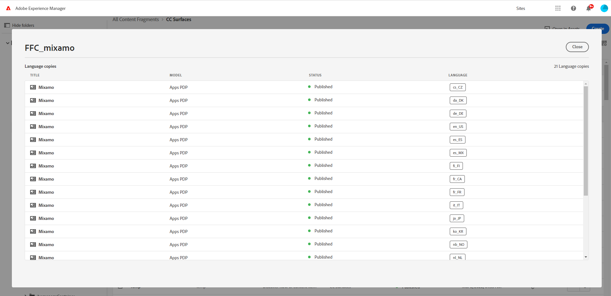
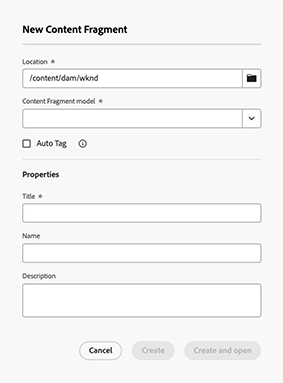
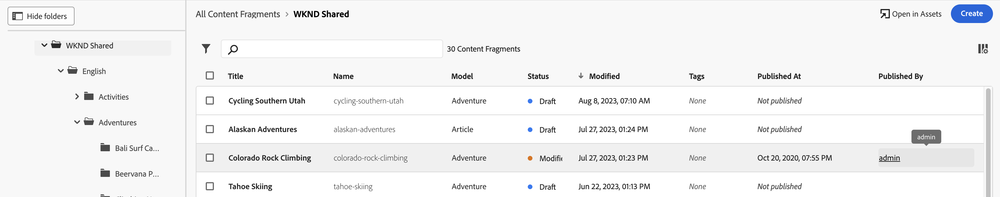

# コンテンツフラグメントの管理 {#managing-content-fragments}

管理方法を学ぶ **コンテンツフラグメント** Adobe Experience Manager(AEM)as a Cloud Serviceの、専用の [コンテンツフラグメントコンソール](#content-fragments-console)、および [コンテンツフラグメントエディター](/help/sites-cloud/administering/content-fragments/authoring.md#content-fragment-editor). これらのコンテンツフラグメントは、ヘッドレスコンテンツの基礎として、またはページオーサリングに使用できます。

>[!NOTE]
>
>必要に応じて、プロジェクトチームがコンソールとエディターをカスタマイズできます。 詳しくは、 [コンテンツフラグメントコンソールおよびエディターのカスタマイズ](/help/implementing/developing/extending/content-fragments-console-and-editor.md) 詳しくは、を参照してください。

を定義した後、 [コンテンツフラグメントモデル](#creating-a-content-model) これらを使用して、次のことができます。

* [コンテンツフラグメントを作成する](#creating-a-content-fragment).
* 次に、 [コンテンツフラグメントエディター](#opening-the-fragment-editor) から [コンテンツの作成とバリエーションの管理](#editing-the-content-of-your-fragment).
* [タグを管理](#manage-tags)
* [プロパティ（メタデータ）を表示、編集する](#viewing-and-editing-properties)
* [構造ツリーの表示](/help/sites-cloud/administering/content-fragments/authoring.md#structure-tree)

>[!NOTE]
>
>コンテンツフラグメントは次に使用できます。
>
>* 対象： [GraphQLでコンテンツフラグメントを使用したヘッドレスコンテンツ配信](/help/sites-cloud/administering/content-fragments/content-delivery-with-graphql.md),
>* ページのオーサリング時 -「[コンテンツフラグメントを使用したページオーサリング](/help/sites-cloud/authoring/fundamentals/content-fragments.md)」を参照してください。

>[!NOTE]
>
>コンテンツフラグメントは&#x200B;**アセット**&#x200B;として保存されます。これらは主に&#x200B;**コンテンツフラグメント**&#x200B;コンソールから管理しますが、[Assets](/help/assets/content-fragments/content-fragments-managing.md) コンソールからも管理できます。

## コンテンツフラグメントコンソール {#content-fragments-console}

コンテンツフラグメントコンソールは、コンテンツフラグメントの管理、検索および作成専用です。ヘッドレスコンテキストでの使用に最適化されていますが、ページオーサリングで使用するコンテンツフラグメントを作成する際にも使用されます。

コンテンツフラグメントコンソールを使用すると、フラグメントおよび関連タスクに直接アクセスできます。 コンソールは、グローバルナビゲーションの最上位レベルから直接アクセスできます。

詳しくは、以下を参照してください。

* [コンテンツフラグメントコンソールの基本構造と処理](#basic-structure-handling-content-fragments-console)

* [コンテンツフラグメントに関して提供される情報](#information-content-fragments)

* [コンテンツフラグメントコンソールでのコンテンツフラグメントのアクション](#actions-selected-content-fragment)

* [コンソールに表示される列を選択](#select-columns-console)

* [コンテンツフラグメントコンソールでの検索とフィルタリング](#filtering-fragments)

* 次の項目を選択： [キーボードショートカット](/help/sites-cloud/administering/content-fragments/keyboard-shortcuts.md) は、このコンソールで使用できます

>[!NOTE]
>
>このコンソールには、コンテンツフラグメントのみが表示されます。画像やビデオなど、他のアセットタイプは表示されません。

>[!CAUTION]
>
>このコンソールは、 *のみ* オンラインAdobe Experience Manager(AEM)as a Cloud Serviceで利用できます。

### コンソールの基本構造と基本操作 {#basic-structure-handling-content-fragments-console}

選択 **コンテンツフラグメント** コンソールを新しいタブで開きます。

主な領域が 3 つあります。

* 上部のツールバー
   * 標準の AEM 機能を提供します
   * IMS 組織も表示します
   * 様々な [アクション](#actions-unselected)
* 左側のパネル
   * フォルダーツリーを表示したり非表示にしたりできます
   * ツリーの特定のブランチを選択できます
   * これは、ネストされたフォルダーを表示するようにサイズ変更できます
* 右側のメインパネル
   * 選択したツリーのブランチにあるすべてのコンテンツフラグメントのリストを表示します：
      * 選択したフォルダーのコンテンツフラグメントと、すべての子フォルダーが表示されます:
         * 場所はパンくずリストで示されます。これを使用して、場所を変更することもできます:
      * [各フラグメントに関する情報が表示されます。](#information-content-fragments)
         * [表示する列を選択できます](#select-columns-console)
      * コンテンツフラグメントに関する[様々な情報フィールド](#information-content-fragments)のリンクは、フィールドに応じて、次のことが可能です。
         * エディターで適切なフラグメントを開く
         * 参照に関する情報を表示
         * フラグメントの言語バージョンに関する情報を表示
      * [その他の特定の情報フィールド](#information-content-fragments) コンテンツフラグメントについて [高速フィルタリング](#fast-filtering):
         * 列の値を選択し、直ちにフィルターとして適用されます
         * 高速フィルターは、 **モデル**, **ステータス**, **変更者**, **タグ** および **公開者** 列。
      * 列ヘッダーにマウスオーバーを使用すると、ドロップダウンアクションセレクターと幅スライダーが表示されます。これらを使用すると、次のことができます。
         * 並べ替え - 昇順または降順に適切なアクションを選択します。
これにより、テーブル全体がその列に従って並べ替えられます。並べ替えは、適切な列でのみ使用できます。
         * 列のサイズを変更 - アクションまたは幅スライダーを使用します。
      * 1 つ以上のフラグメントを選択して、さらに詳しくします [アクション](#actions-selected-content-fragment)
   * 以下を使用します。 [検索](#searching-fragments) ボックス
   * を開きます。 [フィルターパネル](#filtering-fragments)

### アクション {#actions}

コンソール内には、直接または特定のフラグメントを選択した後に使用できる様々なアクションがあります。

* 様々なアクションを[コンソールから直接実行できます](#actions-unselected)
* [1 つ以上のコンテンツフラグメントを選択して、適切なアクションを表示](#actions-selected-content-fragment)することができます。

#### アクション（未選択） {#actions-unselected}

特定のコンテンツフラグメントを選択しなくても、特定のアクションはコンソールから実行できます。

* 新しいコンテンツフラグメントを&#x200B;**[作成](#creating-a-content-fragment)**&#x200B;します
* 述語の選択に従ってコンテンツフラグメントを[フィルタリング](#filtering-fragments)し、今後の使用のためにフィルターを保存します
* コンテンツフラグメントを[検索](#searching-fragments)します
* [テーブル表示をカスタマイズして、選択した情報列を表示します](#select-columns-console)
* **アセットで開く**&#x200B;を使用して、**アセット**&#x200B;コンソールで現在の場所を直接開きます

  >[!NOTE]
  >
  >The **Assets** コンソールは、画像、ビデオなどのアセットにアクセスするために使用します。  このコンソールには、次の方法でアクセスできます。
  >
  >* **Assets で開く**&#x200B;のリンクを使用（コンテンツフラグメントコンソール内にあります
  >* グローバルから直接 **ナビゲーション** パネル

#### （選択された）コンテンツフラグメントのアクション {#actions-selected-content-fragment}

特定のフラグメントを選択すると、そのフラグメントで使用可能なアクションに焦点を当てたツールバーが開きます。 複数のフラグメントを選択することもできます。それに応じて、焦点が当たるアクションも変化します。

* **[新しいエディターで開く](#editing-the-content-of-your-fragment)**
* **[開く](/help/assets/content-fragments/content-fragments-variations.md)** （元のエディタで）
* **[公開](#publishing-and-previewing-a-fragment)**（および **[非公開](#unpublishing-a-fragment)**）
* **[タグを管理](#manage-tags)**
* **[コピー](/help/assets/manage-digital-assets.md)**
* **[移動](/help/assets/manage-digital-assets.md)**
* **[名前を変更](/help/assets/manage-digital-assets.md)**
* **[削除](#deleting-a-fragment)**

<!--
* **[Replace](#find-and-replace)**
-->

>[!NOTE]
>
>用途 **開く** 選択したフラグメントを *オリジナル* 編集者です。

>[!NOTE]
>
>「公開」、「非公開」、「削除」、「移動」、「名前変更」、「各トリガーを非同期ジョブにコピー」などのアクション。 そのジョブの進行状況は、AEM 非同期ジョブ UI で監視できます。

### コンテンツフラグメントに関して提供される情報 {#information-content-fragments}

コンソールのメインパネルや右パネル（テーブル表示）には、コンテンツフラグメントに関する様々な情報が表示されます。 また一部の項目には、その他のアクションや情報への直接リンクも含まれます。

* **名前**
   * エディターでフラグメントを開くためのリンクを提供します。
* **モデル**
   * 情報のみ.
   * 使用可能な対象 [高速フィルタリング](#fast-filtering)
* **フォルダー**
   * コンソールでフォルダーを開くためのリンクを提供します。
フォルダー名にカーソルを合わせると、JCR パスが表示されます。
* **ステータス**
   * 情報のみ。
   * 使用可能な対象 [高速フィルタリング](#fast-filtering)
* **プレビュー**
   * 情報のみ:
      * **同期中**：コンテンツフラグメントは、**オーサー**&#x200B;サービスおよび&#x200B;**プレビュー**&#x200B;サービスは同期されます。
      * **非同期**：コンテンツフラグメントは、**オーサー**&#x200B;サービスおよび&#x200B;**プレビュー**&#x200B;サービスと同期されません。**公開**&#x200B;から&#x200B;**プレビュー**&#x200B;を実行して、2 つのインスタンスが確実に同期状態に戻るようにします。
      * 空白：コンテンツフラグメントが&#x200B;**プレビュー**&#x200B;サービスに存在しません。
* **変更**
   * 情報のみ。
* **変更者**
   * 情報のみ。
   * 使用可能な対象 [高速フィルタリング](#fast-filtering).
* **タグ**
   * 情報のみ.
   * コンテンツフラグメントに関連するすべてのタグ（メインとバリエーションの両方）を表示します。
   * 使用可能な対象 [高速フィルタリング](#fast-filtering).
* **公開時間**
   * 情報のみ。
* **公開者**
   * 情報のみ。
   * 使用可能な対象 [高速フィルタリング](#fast-filtering).
* **参照元**:
   * すべてをリストするダイアログを開くリンクを提供します [親参照](#parent-references-fragment)  コンテンツフラグメント、エクスペリエンスフラグメント、ページの参照を含む、そのフラグメントの。 特定の参照を開くには、 **タイトル** 」と入力します。

     

* **言語**：任意を示します [言語](#language-copies-fragment) コピー

   * コンテンツフラグメントのロケールと、ローカル/[言語](#language-copies-fragment)  コンテンツフラグメントに関連付けられたコピー。

     

   * カウントを選択して、すべての言語コピーを表示するダイアログを開きます。 特定の言語コピーを開くには、 **タイトル** 」と入力します。

     

## コンテンツフラグメントの作成 {#creating-content-fragments}

コンテンツフラグメントを作成する前に、基になるコンテンツフラグメントモデルを作成する必要があります。

### コンテンツモデルの作成 {#creating-a-content-model}

[コンテンツフラグメントモデル](/help/sites-cloud/administering/content-fragments/content-fragment-models.md) 構造化コンテンツを含むコンテンツフラグメントを作成する前に、を有効にして作成する必要があります。

### コンテンツフラグメントの作成 {#creating-a-content-fragment}

コンテンツフラグメントを作成するには：

1. **コンテンツフラグメント**&#x200B;コンソールから、「**作成**」（右上）を選択します。

   >[!NOTE]
   >
   >新しいフラグメントの場所を事前に定義するには、フラグメントを作成するフォルダーに移動するか、作成プロセス中に場所を指定します。

1. The **新しいコンテンツフラグメント** ダイアログが開きます。ここから、次の項目を指定できます。

   * **場所**  — 現在の場所で自動入力されますが、必要に応じて別の場所を選択できます
   * **コンテンツフラグメントモデル** - ドロップダウンリストからフラグメントの基礎として使用するモデルを選択します
   * **タイトル**
   * **名前**  — これは、 **タイトル**&#x200B;必要に応じて編集できます。
   * **説明**

   

1. 「**作成**」または「**作成して開く**」を選択して、定義を保持します。

## コンテンツフラグメントのステータス {#statuses-content-fragments}

コンテンツフラグメントの存在中は、次のように複数のステータスを持つことができます。 [コンテンツフラグメントコンソール](/help/sites-cloud/administering/content-fragments/managing.md#content-fragments-console) および [コンテンツフラグメントエディター](/help/sites-cloud/administering/content-fragments/authoring.md):

* **新規** （グレー）新しいコンテンツフラグメントは作成されましたが、コンテンツフラグメントエディターで編集も開いたこともないので、コンテンツを持ちません。
* **ドラフト** （青）誰かがコンテンツフラグメントエディターで（新しい）コンテンツフラグメントを編集したか開いたかのどちらかですが、まだ公開されていません。
* **公開済み** （緑）コンテンツフラグメントが公開されました。
* **変更済み** （オレンジ）コンテンツフラグメントは、公開後（ただし変更を公開する前）に編集されました。
* **非公開** （赤）コンテンツフラグメントが非公開になりました。

## フラグメントのコンテンツの編集（およびバリエーション） {#editing-the-content-of-your-fragment}

>[!IMPORTANT]
>
>詳しくは、 [コンテンツフラグメントのオーサリングを参照](/help/sites-cloud/administering/content-fragments/authoring.md)

編集するためにフラグメントを開くには：

1. **コンテンツフラグメント**&#x200B;コンソールを使用して、コンテンツフラグメントの場所に移動します。
1. フラグメントを選択して編集するためにフラグメントを開き、次に **新しいエディターで開く** をクリックします。

1. フラグメントエディターが開きます。 必要な項目を選択 **バリエーション** 必要に応じて変更を加えます（変更は自動保存されます）。

   

## タグを表示および管理 {#manage-tags}

コンテンツフラグメントコンソールから、適用されたタグを **タグ** 列；確実に [列が表示されています](#select-columns-console).

### タグを管理（コンソール） {#manage-tags-console}

タグを管理するには：

1. コンテンツフラグメントコンソールに移動します。
1. コンテンツフラグメントを選択します。
1. 選択 **タグを管理** 」と入力します。
1. タグセレクターを使用して、適用または削除するタグを選択します。

   

1. **保存** 更新。 コンソールに戻ります。

### 表示、編集、タグ（エディター） {#viewing-and-editing-tags}

また、 [プロパティ](/help/sites-cloud/administering/content-fragments/authoring.md) 」タブをクリックします。 表示される情報は、次の点で異なります： **メイン** および **バリエーション**.

## 表示、編集、プロパティ（エディタ） {#viewing-and-editing-properties}

フラグメントのプロパティ（メタデータ）を表示および編集するには、 [プロパティ](/help/sites-cloud/administering/content-fragments/authoring.md) 」タブをクリックします。 表示される情報は、次の点で異なります： **メイン** および **バリエーション**.

## フラグメントの公開およびプレビュー {#publishing-and-previewing-a-fragment}

コンテンツフラグメントは次の場所に公開できます。

* **[パブリッシュサービス](/help/headless/deployment/architecture.md)** - フル、パブリックアクセス用

* **[プレビューサービス](/help/headless/deployment/architecture.md)** - 完全に使用可能になる前にコンテンツをプレビューします

  >[!CAUTION]
  >
  >**プレビューサービス**&#x200B;へのコンテンツフラグメントの公開は、**公開**&#x200B;アクションを使用して、コンテンツフラグメントコンソールからのみ使用できます。

  >[!NOTE]
  >
  >プレビュー環境について詳しくは、次を参照してください。
  >
  >* [環境を管理](/help/implementing/cloud-manager/manage-environments.md#access-preview-service)
  >* [プレビュー層の OSGi 設定の指定](/help/implementing/preview-tier/preview-tier-configuring-osgi.md#configuring-osgi-settings-for-the-preview-tier)
  >* [開発者コンソールを使用したプレビューのデバッグ](/help/implementing/preview-tier/preview-tier-configuring-osgi.md#debugging-preview-using-the-developer-console)

>[!CAUTION]
>
>フラグメントがモデルに基づいている場合、その[モデルが公開されている](/help/sites-cloud/administering/content-fragments/content-fragment-models.md#publishing-a-content-fragment-model)ことを確認してください。
>
>まだ公開されていないモデルのコンテンツフラグメントを公開すると、選択リストにそのことが示され、モデルがフラグメントと共に公開されます。

### 公開 {#publishing}

コンテンツフラグメントは、 **公開** 次のいずれかのオプション：

* のツールバー [コンテンツフラグメントコンソール](#actions-selected-content-fragment)

   * リストから 1 つ以上のフラグメントを選択します。

* のツールバー [コンテンツフラグメントエディター](/help/sites-cloud/administering/content-fragments/authoring.md#content-fragment-editor)

次を選択した後： **公開** アクション：

1. 次のいずれかのオプションを選択して、適切なダイアログを開きます。

   * **今すぐ**  — 次のいずれかを選択します。 **パブリッシュサービス**、または **プレビューサービス**；確認後、フラグメントは直ちに公開されます
   * **スケジュール**  — 必要なサービスに加えて、フラグメントを公開する日時も選択できます

1. すべての詳細をダイアログに入力します。 例えば、スケジュールされた公開リクエストの場合は、次のようになります。

   

   >[!NOTE]
   >
   >必要に応じて、パブリッシュする参照を指定する必要があります。 デフォルトでは、参照はプレビューサービスにも公開され、コンテンツに壊れが生じないようになります。

1. 公開アクションを確認します。

公開後、フラグメントのステータスが更新され、エディターとコンソールに表示されます。 スケジュールされた公開を指定した場合は、情報が表示されます。

>[!NOTE]
>
>さらに、[フラグメントを使用するページを公開](/help/sites-cloud/authoring/fundamentals/content-fragments.md#publishing)するとき。フラグメントはページ参照にリスト表示されます。

## フラグメントの非公開 {#unpublishing-a-fragment}

コンテンツフラグメントを非公開にできます。

* のツールバー [コンテンツフラグメントコンソール](#actions-selected-content-fragment)

   * リストから 1 つ以上のフラグメントを選択します。

* のツールバー [コンテンツフラグメントエディター](/help/sites-cloud/administering/content-fragments/authoring.md#content-fragment-editor)

どちらの場合も、「 **非公開** ツールバーから、次のいずれかが続く。 **今すぐ** または **Scheduled**.

関連するダイアログが開いたら、適切なサービスを選択できます。

>[!NOTE]
>
>The **非公開** アクションは、公開されたフラグメントを使用できる場合にのみ表示されます。

>[!CAUTION]
>
>フラグメントが既に別のフラグメントから参照されている場合、またはページから参照されている場合は、警告メッセージが表示され、続行を確認する必要があります。

<!--
## Find and Replace {#find-and-replace}

The **Replace** option is available to find, and replace, specified text in your selected Content Fragment:

-->

## フラグメントの削除 {#deleting-a-fragment}

レポートを削除する手順は次のとおりです。

1. **コンテンツフラグメント**&#x200B;コンソールで、コンテンツフラグメントの場所に移動します。
1. フラグメントを選択します。
1. ツールバーから「**削除**」を選択します。
1. 「**削除**」アクションを確認します。

>[!NOTE]
>
>The **削除** は、現在公開されているフラグメントに対しては使用できません。まず非公開にする必要があります。

## フラグメントの親参照の検索 {#parent-references-fragment}

親参照の詳細は、

* **参照** コンテンツフラグメントコンソールの列
* の [コンテンツフラグメントエディターの上部のツールバーにある親参照リンク](/help/sites-cloud/administering/content-fragments/authoring.md#view-parent-references)

どちらも、コンテンツフラグメント、エクスペリエンスフラグメント、ページの参照を含め、そのフラグメントのすべての親参照をリストするダイアログを開くリンクを提供します。 特定の参照を開くには、 **タイトル**&#x200B;またはリンクアイコンを使用して、ダイアログ内で設定できます。

次に例を示します。

## フラグメントの言語コピーの検索 {#language-copies-fragment}

言語コピーの詳細は、次の場所からアクセスできます。

* の **言語** 列 [コンテンツフラグメントコンソール](#information-content-fragments)
* の [コンテンツフラグメントエディターの「言語コピー」タブ](/help/sites-cloud/administering/content-fragments/authoring.md#view-language-copies)

このアイコンは、コンテンツフラグメントのロケールと、コンテンツフラグメントに関連付けられたロケール/言語コピーの合計数を示します。 例えば、コンソールから次の操作を実行します。

カウントを選択して、すべての言語コピーを表示するダイアログを開きます。 特定の言語コピーを開くには、 **タイトル** 」と入力します。

## コンソールに表示される列を選択 {#select-columns-console}

他のコンソールと同様に、表示する列やアクションに使用できる列を設定できます。

表示または非表示にできる列のリストが表示されます。

## フラグメントのフィルタリング {#filtering-fragments}

フィルターパネルには、次の機能があります。

* 一連の述語；
   * コンテンツフラグメントモデル、ローカライゼーション、タグ、ステータスフィールドなどを含めます。
   * 1 つ以上の述語を選択し、組み合わせて、フィルターを作成できます
* 設定した内容の&#x200B;**保存**
* 再利用のために保存した検索条件フィルターを取得するオプション

選択した後、 **フィルター条件** オプションが表示されます（「検索」ボックスの下）。 これらは、そこから選択を解除できます。 次に例を示します。

### 高速フィルタリング {#fast-filtering}

リスト内の特定の列の値をクリックして、述語を選択することもできます。1 つ以上の値を選択して、述語を組み合わせることができます。

例えば、**ステータス**&#x200B;列の「**公開済み**」を選択します。

>[!NOTE]
>
>高速フィルターは、 **モデル**, **ステータス**, **変更者**, **タグ**、および **公開者** 列。

選択すると、フィルターの述語として表示され、それに応じてリストがフィルターされます。

## フラグメントの検索 {#searching-fragments}

検索ボックスは全文検索をサポートします。 検索ボックスに検索語句を入力します。

選択した結果が表示されます。

また、検索ボックスでは&#x200B;**最近のコンテンツフラグメント**&#x200B;と&#x200B;**保存済みの検索結果**&#x200B;へのクイックアクセスも可能です。

