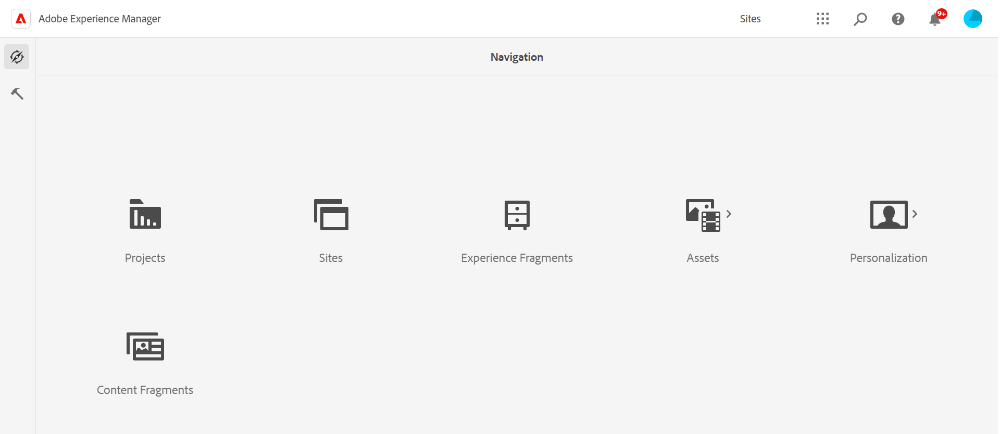

# コンテンツフラグメントの操作 – 概念とベストプラクティス {#working-with-content-fragments-concepts-and-best-practices}

Adobe Experience Manager（AEM）as a Cloud Service のコンテンツフラグメントを使用すると、ページに依存しないコンテンツを設計、作成、キュレーション、公開できます。 複数の場所、複数のチャネル上で使用可能なコンテンツを用意でき、[ヘッドレス配信](/help/headless/what-is-headless.md)や[ページオーサリング](/help/sites-cloud/authoring/fragments/content-fragments.md)に理想的です。

>[!TIP]
>
>コンテンツフラグメントは[Edge Delivery Servicesに公開できます。](https://www.aem.live/developer/content-fragment-overlay)

>[!IMPORTANT]
>
>この節で説明する多くの機能は、[統合シェル](/help/overview/aem-cloud-service-on-unified-shell.md)、つまり、ローカルインスタンスではなく、*オンライン*&#x200B;の Adobe Experience Manager（AEM）as a Cloud Service で&#x200B;*のみ*&#x200B;使用できます。

>[!IMPORTANT]
>
>コンテンツフラグメントには、**コンテンツフラグメント**&#x200B;と **Assets** の 2 つのコンソールからアクセスできます。
>
>また、コンテンツフラグメントをオーサリングするエディターは 2 つあります。基本機能は同じですが、いくつか違いがあります。 両方のエディターは、両方のコンソールからアクセスできます。
>
>この節では、**コンテンツフラグメント**&#x200B;コンソールと&#x200B;*新しい*&#x200B;コンテンツフラグメントエディターについて説明します。 これらはヘッドレスコンテンツ配信用に開発されています（ただし、すべてのシナリオで使用できます）。
>
>詳しくは、次のセクションを参照してください。
>
>* [コンテンツフラグメントの管理](/help/assets/content-fragments/content-fragments-managing.md)のための **Assets** コンソールの使用
>* [*元の*&#x200B;コンテンツフラグメントエディター](/help/assets/content-fragments/content-fragments-variations.md)の使用
>* [ページオーサリング用のコンテンツフラグメント](/help/sites-cloud/authoring/fragments/content-fragments.md)の使用

コンテンツフラグメントには、構造化コンテンツが含まれます。

* 各フラグメントは、[コンテンツフラグメントモデル](/help/sites-cloud/administering/content-fragments/managing-content-fragment-models.md)に基づいています。
   * [コンテンツフラグメントモデルは、生成されるフラグメントの構造を定義](/help/sites-cloud/administering/content-fragments/content-fragment-models.md)します。
* すべてのフラグメントは、次の要素で構成されます。
   * **[メイン](#main-and-variations)** - コアコンテンツを保持するフラグメントの不可欠な部分であり、常に存在し、削除できません
   * **[バリエーション](#main-and-variations)** - オーサーが作成したコンテンツの 1 つまたは複数の配列
* 構造の範囲は次のとおりです。
   * 基本
      * 例えば、1 つの複数行テキストフィールドです。
      * ページオーサリングで使用する単純なコンテンツを用意するのに使用できます。
      * また、アプリケーションへのヘッドレス配信にも使用できます。
   * 複合
      * テキスト、数値、ブーリアン、日時などの様々なデータタイプのフィールドを多数組み合わせたもの。
      * ページオーサリング用のより構造化コンテンツを用意するためや、アプリケーションにヘッドレス配信するために使用できます。
   * 入れ子
      * 使用可能な参照データタイプを使用して、コンテンツをネストできます。
      * アプリケーションへのヘッドレス配信に使用される傾向があります。

コンテンツフラグメントは、次の場所でも配信できます。

* AEM コアコンポーネントのSling Model （JSON）書き出し機能を使用したJSON フォーマット。 この形式の配信では次のことが可能です。

   * コンポーネントを使用して、配信するフラグメントの要素を管理できます。
   * API 配信に使用されるページで複数の[コンテンツフラグメントコアコンポーネント](https://experienceleague.adobe.com/docs/experience-manager-core-components/using/wcm-components/content-fragment-component.html?lang=ja)を追加して、一括配信できます。

* [&#128279;](/help/implementing/developing/extending/content-fragments-visualization-templates.md)HTML テンプレートでレンダリングされた[&#x200B; ビジュアルコンテンツフラグメント &#x200B;](/help/sites-cloud/administering/content-fragments/visual-content-fragments.md)を使用したHTML形式。Handlebarsで開発。 この形式の配信では次のことが可能です。

   * は、コンテンツのプレビューとレビューに役立つ視覚的な表現を提供します
   * 外部チャネルやアプリケーションによる直接的かつ即座な使用を視覚的に表現します

  <!-- CQDOC-23232 - remove when GA -->

  >[!NOTE]
  >
  >ビジュアルコンテンツフラグメントは現在、限定的でご利用いただけます。
  >
  >参加を希望される場合は、公式メールアドレスから[experience-production-agent@adobe.com](mailto:experience-production-agent@adobe.com)にリクエストを送信してください。

通信チャネルの数は年々増加しています。 通常、チャネルとは配信メカニズムのことであり、次のどちらも指します。

* 物理チャネル：例えば、デスクトップ、モバイルなど。
* 物理チャネルでの配信形式：デスクトップ用の「製品詳細ページ」や「製品カテゴリーページ」、モバイル用の「モバイル web」や「モバイルアプリ」など。

ただし、すべてのチャネルでの&#x200B;*まったく*&#x200B;同じコンテンツの使用はお勧めしません。特定のチャネルに合わせてコンテンツを最適化する必要があります。

コンテンツフラグメントを使用すると、次のことが可能になります。

* 複数のチャネルでターゲットオーディエンスに効率よくリーチする方法を検討する。
* チャネルに依存しないエディトリアルコンテンツを作成、管理する。
* 多様なチャネル向けのコンテンツプールを構築する。
* 特定のチャネル向けにコンテンツのバリエーションをデザインする。
* アセットを挿入することでテキストに画像を追加します。
* データの複雑さを反映して、ネストされたコンテンツを作成します。

さらにこうしたコンテンツフラグメントを集めて組み立てることで、多様なチャネルにエクスペリエンスを提供できます。

>[!NOTE]
>
>**コンテンツフラグメント**&#x200B;と&#x200B;**[エクスペリエンスフラグメント](/help/sites-cloud/authoring/fragments/content-fragments.md)**&#x200B;は、AEM 内の異なる機能です。
>
>* **コンテンツフラグメント**&#x200B;は、定義と構造を備えたエディトリアルコンテンツですが、視覚的なデザインやレイアウトは追加されていません。 テキスト、数値、日付などの構造化データにアクセスするために使用できます。
>* **エクスペリエンスフラグメント**&#x200B;は完全にレイアウトされたコンテンツであり、web ページのフラグメントです。
>
>エクスペリエンスフラグメントには、コンテンツフラグメントの形式でコンテンツを含めることができますが、その逆はできません。
>
>詳しくは、[AEM のコンテンツフラグメントとエクスペリエンスフラグメントについて](https://experienceleague.adobe.com/docs/experience-manager-learn/sites/content-fragments/understand-content-fragments-and-experience-fragments.html?lang=ja#content-fragments)を参照してください。

このページおよび次のページでは、コンテンツフラグメントを作成、設定、維持管理および使用するためのタスクについて説明します。

* [お使いのインスタンスでコンテンツフラグメント機能を有効にする](/help/sites-cloud/administering/content-fragments/setup.md)
* [コンテンツフラグメントモデル](/help/sites-cloud/administering/content-fragments/managing-content-fragment-models.md) - モデルを有効化、作成および[定義](/help/sites-cloud/administering/content-fragments/content-fragment-models.md)します
* [コンテンツフラグメントを作成](/help/sites-cloud/administering/content-fragments/managing.md#creating-a-content-fragment)（コンテンツフラグメントコンソールを使用）

フラグメントが作成されたら、次の操作を実行できます。

* [コンテンツフラグメントコンソールを使用](/help/sites-cloud/administering/content-fragments/managing.md) - 次の操作を実行できます。
   * フラグメントにアクセスし、それを公開（プレビューまたは実稼動へ）、参照する
* [コンテンツフラグメントエディターを使用](/help/sites-cloud/administering/content-fragments/authoring.md) - 次の操作を実行できます。
   * フラグメントを編集、公開（プレビューまたは実稼動へ）し、参照する
   * コメントを使用して他の作成者と共同作業する
* [分析](/help/sites-cloud/administering/content-fragments/analysis.md)  エディターを使用したコンテンツフラグメントの構造
* [GraphQL を使用してフラグメントにアクセスし、アプリケーションへのヘッドレス配信を実現します](/help/sites-cloud/administering/content-fragments/content-delivery-with-graphql.md)。
* [Adobe Journey Optimizer でのコンテンツフラグメントの統合と使用](/help/sites-cloud/administering/content-fragments/content-fragments-with-journey-optimizer.md)
* コンテンツフラグメントの[&#x200B; ローンチを作成および管理](/help/sites-cloud/administering/content-fragments/launches-for-content-fragments.md)
* [または、フラグメントをページオーサリングに使用します。](/help/sites-cloud/authoring/fragments/content-fragments.md)
* フラグメントの[&#x200B; ビジュアル（HTML）表現](/help/sites-cloud/administering/content-fragments/visual-content-fragments.md)を配信します

>[!NOTE]
>
>これらのページと併せて、次のページも参照してください。
>
>* [コンテンツフラグメントのカスタマイズと拡張](/help/implementing/developing/extending/content-fragments-customizing.md)
>* [レンダリングコンポーネントのコンテンツフラグメントの設定](/help/implementing/developing/extending/content-fragments-configuring-components-rendering.md)
>* [AEM Assets HTTP API でのコンテンツフラグメントのサポート](/help/assets/content-fragments/assets-api-content-fragments.md)
>* [コンテンツフラグメントと共に使用する AEM GraphQL API](/help/headless/graphql-api/content-fragments.md)
>* [コンテンツフラグメントを使用したページのオーサリング](/help/sites-cloud/authoring/fragments/content-fragments.md)
>* [コンテンツフラグメントおよびコンテンツフラグメントモデルの OpenAPI](/help/headless/content-fragment-openapis.md) も利用できます。

## メインとバリエーション {#main-and-variations}

バリエーションは、AEM のコンテンツフラグメントの重要な機能です。 これにより、特定のチャネルやシナリオで使用する&#x200B;**メイン**&#x200B;コンテンツのコピーを作成および編集でき、ヘッドレスコンテンツ配信やページオーサリングをより柔軟に行うことができます。

* **メイン**

   * **メイン**&#x200B;はバリエーションそのものではありませんが、すべてのバリエーションの基礎となります。
   * フラグメントの不可欠な構成要素

      * どのコンテンツフラグメントにも&#x200B;**メイン**&#x200B;のインスタンスが 1 つあります。
      * **メイン**&#x200B;は削除できません。

   * **メイン**&#x200B;には、フラグメントエディターの「**[バリエーション](/help/sites-cloud/administering/content-fragments/authoring.md#variations)**」の下でアクセスできます。

  >[!NOTE]
  >
  >**Assets** コンソールから利用できるエディターでは、**メイン**&#x200B;は&#x200B;**マスター**&#x200B;としてラベル付けされています。

* **バリエーション**

   * 編集の目的に特化したフラグメントテキストのレンディション。チャンネルに関連させることができますが、これは強制ではありません。アドホックローカルの変更にも使用できます。
   * **メイン**&#x200B;のコピーとして作成しますが、その後、必要に応じて編集できます。多くの場合、バリエーション同士にはコンテンツの重複があります。
   * フラグメントのオーサリング中に、左のパネルから定義できます。
   * コンテンツコピーの分散を避けるために、フラグメントに格納されます。
   * バリエーションは、**メイン**&#x200B;と[比較および同期](/help/sites-cloud/administering/content-fragments/authoring.md#compare-and-synchronize-rich-text)できます。
  <!--
  * Can be [Summarized](/help/sites-cloud/administering/content-fragments/authoring.md#summarizing-text) to quickly truncate the text to a predefined length.
  -->

## コンテンツフラグメントとコンテンツサービス {#content-fragments-and-content-services}

AEM コンテンツサービスは、web ページだけに焦点を置かずに AEM のコンテンツの記述と配信を一般化するように設計されています。

AEM コンテンツサービスにより、あらゆるクライアントで使用できる標準化された方法で、従来の AEM web ページとは異なるチャネルにコンテンツを配信できます。 そうしたチャネルの例を次に示します。

* 単一ページアプリケーション
* ネイティブモバイルアプリケーション
* AEMの外部チャネルやタッチポイントは

配信は、JSON エクスポーターを使用して JSON 形式で行われます。

AEM コンテンツフラグメントを使用して構造化コンテンツを記述し、管理できます。 構造化コンテンツは、テキスト、数値データ、ブール値、日付と時刻など、様々なコンテンツタイプを含めることができるモデルを使用して定義します。

AEM コアコンポーネントの JSON 書き出し機能と共にこの構造化コンテンツを使用して、AEM コンテンツを AEM ページ以外のチャネルに配信できます。

>[!NOTE]
>
>AEM Sites as a Cloud Service 向けヘッドレス開発の概要については、[AEM Sites as a Cloud Service 向けヘッドレス開発](/help/headless/introduction.md)を参照してください。

>[!NOTE]
>
>AEM はフラグメントコンテンツの翻訳もサポートしています。 詳しくは、「[アセットの翻訳](/help/assets/translate-assets.md)」を参照してください。

## コンテンツタイプ {#content-type}

コンテンツフラグメントとは、次のようなものです。

* **Sites** 機能。

* **Assets** として格納されます。

   * コンテンツフラグメント（とバリエーション）は、[コンテンツフラグメントコンソール](#content-fragments-console)で作成および管理できます。
   * [コンテンツフラグメントエディター](/help/sites-cloud/administering/content-fragments/authoring.md)でオーサリングおよび編集されます。

* [AEM GraphQL API](/help/headless/graphql-api/content-fragments.md) を使用したコンテンツ配信用にアクセスできます。

* [コンテンツフラグメントコンポーネント（参照コンポーネント）を使用することで、ページエディター内で](/help/sites-cloud/authoring/fragments/content-fragments.md)使用できます。

   * [コンテンツフラグメントのコアコンポーネント](https://experienceleague.adobe.com/docs/experience-manager-core-components/using/wcm-components/content-fragment-component.html?lang=ja)は、ページの作成者が使用できます。 作成者は、コンテンツフラグメントコンポーネントを使用して、必要なコンテンツフラグメントを HTML または JSON 形式で参照し、配信できます。

コンテンツフラグメントは、次のようなコンテンツ構造です。

* レイアウトやデザインを伴いません（テキストフィールドに対してテキストの書式設定が可能です）。
* 配信メカニズム（ページやチャネルなど）に依存しません。
* 1 つ以上の[構成要素](#constituent-parts-of-a-content-fragment)を含みます。
* [画像を含めたり、関連付けたりする](#fragments-with-visual-assets)ことができます。

### ビジュアルアセットを含むフラグメント {#fragments-with-visual-assets}

作成者がより柔軟にコンテンツをコントロールできるように、画像をコンテンツフラグメントに追加したり、コンテンツフラグメントと統合したりできます。

コンテンツフラグメントアセットは、（直接的または間接的に）次の構成要素からなります。

* **コンテンツ参照**&#x200B;として
* **複数行テキスト**&#x200B;フィールド内に

### コンテンツフラグメントの構成要素 {#constituent-parts-of-a-content-fragment}

コンテンツフラグメントアセットは、（直接的または間接的に）次の構成要素からなります。

* **フラグメントの要素**

   * 要素は、コンテンツを含むデータフィールドと相関関係にあります。
   * [コンテンツフラグメントモデル](/help/sites-cloud/administering/content-fragments/managing-content-fragment-models.md)を使用して、コンテンツフラグメントを作成します。 [モデルで指定された要素（フィールド）は、フラグメントの構造を定義します](/help/sites-cloud/administering/content-fragments/content-fragment-models.md)。 このような要素（フィールド）には様々なデータタイプがあります。

* **フラグメントの段落**

   * 個々のエンティティとして区切られたテキストのブロック（多くの場合は複数行）。

   * ページ作成中にコンテンツを制御できます。

* **フラグメントのメタデータ**

   * [アセットメタデータスキーマ](/help/assets/metadata-schemas.md)を使用します。
   * タグは、次のことを行うときに作成できます。

      * フラグメントを作成してオーサリングするとき。
      * または後で、フラグメントエディターで[プロパティを表示または編集する](/help/sites-cloud/administering/content-fragments/authoring.md#view-properties-tags)場合。

  >[!CAUTION]
  >
  >メタデータ処理プロファイルは、コンテンツフラグメントには適用されません。

  >[!CAUTION]
  >
  >コンテンツフラグメントモデルでは、多くの場合、**タイトル**&#x200B;および&#x200B;**説明**&#x200B;の名前が付けられたデータフィールドを定義できます。 これらの 2 つのフィールドが存在する場合、それらはユーザー定義のフィールドであり、エディターのコンテンツ領域で更新できます。
  >
  >コンテンツフラグメントとそのバリエーションには、**タイトル**&#x200B;および&#x200B;**説明**&#x200B;と呼ばれるメタデータ（プロパティ）フィールドもあります。 これらの 2 つのメタデータフィールドは、コンテンツフラグメントとバリエーションの不可欠な部分で、フラグメントの作成時に最初に定義されます。 これらは、エディターのプロパティ／メタデータ領域で更新できます。

* **[メイン](#main-and-variations)**
* **[バリエーション](#main-and-variations)**

### フラグメントを利用するための要件 {#required-by-fragments}

コンテンツフラグメントを作成するには、次が必要です。

* **コンテンツフラグメントモデル**

   * は、設定ブラウザー[&#128279;](/help/sites-cloud/administering/content-fragments/setup.md)を使用して有効になっています。
   * は[&#x200B; コンテンツフラグメントコンソール &#x200B;](/help/sites-cloud/administering/content-fragments/managing-content-fragment-models.md#creating-a-content-fragment-model)を使用して作成されました。
   * [フラグメントを作成](/help/sites-cloud/administering/content-fragments/managing.md#creating-content-fragments)するために必要です。
   * フラグメントの構造（タイトル、コンテンツ要素、タグ定義）を定義します。
   * コンテンツフラグメントモデル定義にはタイトルと 1 つのデータ要素が必要です。その他すべてはオプションです。
   * 該当する場合、モデルはデフォルトコンテンツを定義できます。
   * オーサーは、フラグメントコンテンツのオーサリング時に定義された構造を変更できません。ただし、フラグメントエディターからモデルエディターを開くことはできます。
   * 依存コンテンツフラグメントの作成後にモデルに対して行った変更は、これらのコンテンツフラグメントに影響を与える可能性があります。

コンテンツフラグメントをヘッドレスコンテンツ配信に使用するには、次のものも必要です。

* 必要なコンテンツをリクエストするための [GraphQL クエリ](/help/headless/graphql-api/content-fragments.md)
* このコンテンツは、AEM 向けの独自の SPA を開発する際に使用できます。詳しくは、次のドキュメントを参照してください。

   * [SPA WKND チュートリアル](/help/implementing/developing/hybrid/wknd-tutorial.md)
   * [React の使用を開始する](/help/implementing/developing/hybrid/getting-started-react.md)
   * [Angular の使用を開始する](/help/implementing/developing/hybrid/getting-started-angular.md)

コンテンツフラグメントをページオーサリングに使用するには、次のものも必要です。

* **コンテンツフラグメントコンポーネント**

   * フラグメントを HTML 形式や JSON 形式で配信するのに役立ちます。
   * [ページ上でフラグメントを参照](/help/sites-cloud/authoring/fragments/content-fragments.md)するために必要です。
   * フラグメントのレイアウトと配信（チャネルなど）に対応します。
   * フラグメントは、レイアウトを定義し、一部またはすべての要素／バリエーションと関連するコンテンツを配信するために、1 つ以上の専用コンポーネントを必要とします。
   * 作成時にフラグメントをページにドラッグすると、必須コンポーネントが自動的に関連付けられます。
   * [コンテンツフラグメントのコアコンポーネント](https://experienceleague.adobe.com/docs/experience-manager-core-components/using/wcm-components/content-fragment-component.html?lang=ja)を参照してください。

## コンテンツフラグメントコンソール {#content-fragments-console}

コンテンツフラグメントコンソールは、[コンテンツフラグメント](/help/sites-cloud/administering/content-fragments/managing.md)、[コンテンツフラグメントモデル](/help/sites-cloud/administering/content-fragments/managing-content-fragment-models.md)および[アセット](/help/sites-cloud/administering/content-fragments/assets-content-fragments-console.md)の管理、検索および作成専用です。 ヘッドレスコンテキストでの使用に最適化されていますが、ページオーサリングで使用するコンテンツフラグメントとコンテンツフラグメントモデルを作成する際にも使用されます。

コンソールは、グローバルナビゲーションの最上位レベルから直接アクセスできます。

左端のパネルを使用して、表示、参照、管理するリソースタイプを選択できます。

詳しくは、以下を参照してください。

* [コンテンツフラグメント](/help/sites-cloud/administering/content-fragments/managing.md)
* [コンテンツフラグメントモデル](/help/sites-cloud/administering/content-fragments/managing-content-fragment-models.md)
* [アセット](/help/sites-cloud/administering/content-fragments/assets-content-fragments-console.md)

* このコンソールで使用できる[キーボードショートカット](/help/sites-cloud/administering/content-fragments/keyboard-shortcuts.md)の選択

>[!CAUTION]
>
>このコンソールは、オンラインAdobe Experience Manager (AEM) as a Cloud Serviceで&#x200B;*のみ*&#x200B;利用できます。

>[!NOTE]
>
>必要に応じて、プロジェクトチームがコンソールとエディターをカスタマイズできます。 詳しくは、[コンテンツフラグメントコンソールとエディターのカスタマイズ](/help/implementing/developing/extending/content-fragments-console-and-editor.md)を参照してください。

## 使用例 {#example-usage}

フラグメントと、その要素およびバリエーションを一緒に使用すると、複数のチャネルに対応した一貫性のあるコンテンツを作成できます。 フラグメントを設計するときは、何をどこで使用するかを考慮する必要があります。

### WKND のサンプル {#wknd-sample}

AEM as a Cloud Service について学ぶのに役立つ [WKND サイトと WKND 共有](/help/implementing/developing/introduction/develop-wknd-tutorial.md)サンプルが用意されています。

<!-- CHECK: which links can/should be used these days? -->

WKND プロジェクトには、次のものが含まれます。

* 次の URL で入手できるコンテンツフラグメントモデル：

   * `.../libs/dam/cfm/models/console/content/models.html/conf/wknd`

   * `.../ui#/aem/libs/dam/cfm/models/console/content/models.html/conf/wknd-shared`

* 次の URL で入手できるコンテンツフラグメント（およびその他のコンテンツ）：

   * `.../assets.html/content/dam/wknd/en`

## ベストプラクティス {#best-practices}

コンテンツフラグメントは、複雑な構造を形成するために使用できます。 Adobeでは、モデルとフラグメントの両方を定義および使用する際のベストプラクティスに関する推奨事項を提供しています。

### シンプルに {#keep-it-simple}

AEMで構造化コンテンツをモデリングする場合は、コンテンツ構造をできるだけシンプルにして、強力なシステムパフォーマンスと合理化されたガバナンスを確保します。

### モデル数 {#number-of-models}

必要な数のコンテンツモデルを作成しても、それ以上は作成しません。

モデルが多すぎると、ガバナンスが複雑になり、GraphQLクエリの実行が遅くなる可能性があります。 通常、モデルの小さなセット、最大の低い数十人で十分です。 数十かそれ以上の数値に近づいている場合は、モデリング戦略を見直します。

### モデルとフラグメントのネスト（非常に重要） {#nesting-models-and-fragments}

コンテンツフラグメント参照を使用して、コンテンツフラグメントを深く入れ子にしたり、過剰に入れ子にしたりすることを避けます。これにより、フラグメントを複数のレベルで参照したりできます。

コンテンツフラグメント参照を頻繁に使用すると、システムパフォーマンス、UIの応答性、GraphQL クエリの実行に大きな影響を与える可能性があります。 ネストを10 レベル以下に維持することを目指します。

### モデルごとのデータフィールドとタイプの数 {#number-of-data-fields-and-types-per-model}

モデルに本当に必要なデータフィールドとタイプのみを含めます。

過度に複雑なモデルは、過度に複雑なフラグメントにつながり、オーサリングが困難になり、エディターのパフォーマンスが低下する可能性があります。

### リッチテキストフィールド {#rich-text-fields}

リッチテキストフィールド（**複数行テキスト** データタイプ）を使用する場合は、次の点を考慮してください。

* フィールド

  モデルごとのリッチテキストフィールドの数を制限します。 パフォーマンス上の理由から、1つのモデルに10個を超えるリッチテキストフィールドを持つことはお勧めできません。 必要に応じて、[ネストされたコンテンツフラグメント](/help/sites-cloud/administering/content-fragments/content-fragment-models.md#using-references-to-form-nested-content)を使用することをお勧めします。

* コンテンツ

  また、各フラグメントに保存されるテキストの量とHTMLの書式設定の量を制限する必要があります。 非常に大きなリッチテキストコンテンツは、システムのパフォーマンスに悪影響を及ぼす可能性があります。

### バリエーション数 {#number-of-variations}

必要な数のフラグメントバリエーションを作成しても、それ以上は作成しません。

バリエーションを利用すれば、オーサー環境や配信時に、コンテンツフラグメントの処理時間を節約できます。

次のことをお勧めします。

* バリエーションの数は管理しやすい最小限に抑えましょう
* コンテンツフラグメントごとに10個を超えないバリエーション

### 本番前にテスト {#test-before-production}

確信がない場合は、本番環境に導入する前に、意図したコンテンツ構造をプロトタイプ作成します。 初期の概念実証と、適切なテスト（技術的テストとユーザー受け入れテスト）の両方を組み合わせることで、納期が近づくときに発生する問題を回避することができます。