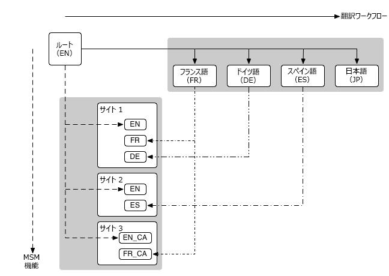

# マルチサイトマネージャと翻訳 {#msm-and-translation}

Adobe Experience Manager に組み込まれているマルチサイトマネージャと翻訳ツールを使用すると、コンテンツのローカライズが簡単になります。

* マルチサイトマネージャ（MSM）とそのライブコピー機能を使用すると、同じサイトコンテンツを複数の場所で使用できると同時に、バリエーションを作成することもできます。
   * [コンテンツの再利用：マルチサイトマネージャとライブコピー](msm/overview.md)
* 翻訳を使用すると、ページコンテンツの翻訳を自動化して、多言語の Web サイトを作成および管理できます。
   * [多言語サイトのコンテンツの翻訳](translation/overview.md)

これらの 2 つの機能を組み合わせることで、Web サイトを[多国籍化かつ多言語化](#multinational-and-multilingual-sites)することができます。

>[!TIP]
>
>コンテンツの翻訳を初めて行う場合は、[AEM Sites 翻訳ジャーニー](/help/journey-sites/translation/overview.md)を参照してください。これは、AEM の強力な翻訳ツールを使用して AEM Sites コンテンツを翻訳する手順を示すガイドです。AEM や翻訳の経験がないユーザーに最適です。

## 多国籍な多言語サイト {#multinational-and-multilingual-sites}

マルチサイトマネージャと翻訳ワークフローを併せて使用することで、多国籍な多言語サイトのコンテンツを効率的に作成できます。

通常は、特定の国向けのマスターサイトを 1 つの言語で作成し、そのコンテンツを使用し、必要に応じて翻訳を使用して他のサイトを作成します。

1. マスターサイトを別の言語に[翻訳](translation/overview.md)します。
1. [マルチサイトマネージャ](msm/overview.md)を次の用途で使用します。
   1. マスターサイトのコンテンツを再利用し、翻訳を使って他の国や文化のサイトを作成します。
   1. 必要に応じて、ライブコピーの要素を分離してローカライゼーションの詳細を追加します。

>[!TIP]
>
>マルチサイトマネージャの使用を、1 つの言語のコンテンツに制限します。
>
>例えば、英語のマスターを使用して、米国、カナダ、英国など向けに英語版のページを作成し、フランス語のマスターページを使用して、フランス、スイス、カナダなど向けにフランス語版のページを作成します。

次の図に、主な概念がどのように関連するかを示します（関連するレベルや要素のすべてが表示されているわけではありません）。

このようなシナリオでは、MSM は異なる言語バージョン管理することはありません。

* [MSM](msm/overview.md) は言語の境界内で、ブループリント（グローバルマスター）からライブコピー（ローカルサイト）への翻訳コンテンツのデプロイメントを管理します。
* AEM の[翻訳](translation/overview.md)統合機能は、サードパーティの翻訳管理サービスと連係して、各言語およびそれらの言語へのコンテンツの翻訳を管理します。

より高度な使用事例の場合は、MSM を複数の言語マスターにまたがって使用することもできます。

>[!TIP]
>
>いずれの使用例の場合も、次のベストプラクティスをお読みになることをお勧めします。
>
>* [MSM のベストプラクティス](msm/best-practices.md)
>* [翻訳のベストプラクティス](translation/best-practices.md)

