# ライブコピーの作成と同期 {#creating-and-synchronizing-live-copies}

ページまたはブループリントの設定からライブコピーを作成して、サイトをまたいでそのコンテンツを再利用できます。継承と同期を管理すると、コンテンツに対する変更の反映方法を制御できます。

## ブループリント設定の管理 {#managing-blueprint-configurations}

ブループリント設定では、1 つ以上のライブコピーページのソースとして使用する既存の Web サイトを指定します。

>[!TIP]
>
>ブループリント設定を使用すると、コンテンツの変更をライブコピーに適用できます。[コンテンツの再利用：マルチサイトマネージャとライブコピー](overview.md#source-blueprints-and-blueprint-configurations)を参照してください。

ブループリント設定を作成する場合は、ブループリントの内部構造を定義するテンプレートを選択します。デフォルトのブループリントテンプレートは、ソース web サイトに次の特性があることを前提としています。

* Web サイトにルートページがあります。
* ルートの直下の子ページが Web サイトの言語ブランチである。ライブコピーを作成する場合は、そのコピーに含めるオプションのコンテンツとして言語が指定されます。
* 各言語ブランチのルートに 1 つ以上の子ページがある。ライブコピーを作成する場合は、そのライブコピーに含めることのできる子ページが指定されます。

>[!NOTE]
>
>構造ごとに別のブループリントテンプレートが必要です。

ブループリント設定を作成したら、次のプロパティを設定します。

* **名前**：ブループリント設定の名前
* **ソースパス**：ソース（ブループリント）として使用するサイトのルートページの
* **説明**。（オプション）ブループリントのこの説明は、サイトの作成時にブループリント設定を選択するためのリストに表示されます

ブループリント設定が使用されると、それをソースやブループリントのライブコピーの同期方法を指定するロールアウト設定に関連付けることができます。[使用するロールアウト設定の指定](live-copy-sync-config.md#specifying-the-rollout-configurations-to-use)を参照してください。

### ブループリント設定の作成と編集 {#creating-editing-blueprint-configurations}

ブループリント設定は不変データと見なされ、実行時には編集できません。この理由から、設定の変更は CI／CD パイプラインを使用して Git を介してデプロイする必要があります。

詳しくは、[Adobe Experience Manager（AEM）as a Cloud Service の主な変更点](/help/release-notes/aem-cloud-changes.md)を参照してください。

以下の手順は、管理者インスタンス上で、ローカル開発および開発目的でのみ使用できます。これらのオプションは、AEMaaCS クラウドインスタンスでは使用できません。

#### ローカルでのブループリント設定の作成 {#creating-a-blueprint-configuration}

ブループリント設定を作成するには、以下を実行します。

1. **ツール**&#x200B;メニューに移動し、**Sites** メニューを選択します。
1. 「**ブループリント**」を選択し、**ブループリント設定**&#x200B;コンソールを開きます。

   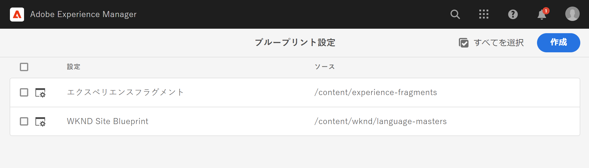

1. 「**作成**」を選択します。
1. ブループリントテンプレートを選択し、「**次へ**」をクリックして続行します。
1. ブループリントとして使用するソースページを選択し、「**次へ**」をクリックして続行します。
1. 定義：

   * **タイトル**：ブループリントの必須タイトル
   * **説明**：詳細を提供するオプションの説明。

1. **作成**&#x200B;では、仕様に基づいてブループリント設定を作成します。

### ブループリント設定のローカルでの編集または削除{#editing-or-deleting-a-blueprint-configuration}

以下の手順で、既存のブループリント設定を編集または削除できます。

1. **ツール**&#x200B;メニューに移動し、**Sites** メニューを選択します。
1. 「**ブループリント**」を選択し、**ブループリント設定**&#x200B;コンソールを開きます。

   

1. 必要なブループリント設定を選択します。ツールバー上の該当するアクションが使用可能になります。

   * **プロパティ**：設定のプロパティを表示して編集するために使用します。
   * **削除**

## ライブコピーの作成 {#creating-a-live-copy}

ライブコピーを作成するいくつかの方法があります。

### ページのライブコピーの作成 {#creating-a-live-copy-of-a-page}

任意のページやブランチのライブコピーを作成できます。ライブコピーを作成する場合は、コンテンツの同期に使用するロールアウト設定を指定できます。

* 選択したロールアウト設定は、ライブコピーページとその子ページに適用されます。
* ロールアウト設定を指定しない場合に、MSM が使用するロールアウト設定を決定します。[使用するロールアウト設定の指定](live-copy-sync-config.md#specifying-the-rollout-configurations-to-use)を参照してください。

以下のような任意のページのライブコピーを作成できます。

* [ブループリント設定](#creating-a-blueprint-configuration)によって参照されるページ
* ブループリント設定に接続されていないページ
* 別のライブコピーのページ内のライブコピー（[ネストされたライブコピー](overview.md#nested-live-copies)）

唯一の違いは、ソースページやブループリントページの&#x200B;**ロールアウト**&#x200B;コマンドの使用可否が、ソースがブループリント設定によって参照されているかどうかで決まります。

* ブループリント設定で参照&#x200B;**される**&#x200B;ソースページからライブコピーを作成すると、ロールアウトコマンドをソースページやブループリントページで使用できます。
* ブループリント設定で参照&#x200B;**されていない**&#x200B;ソースページからライブコピーを作成すると、ロールアウトコマンドをソースページやブループリントページで使用できません。

ライブコピーを作成するには：

1. **Sites** コンソールで「**作成**」、「**ライブコピー**」の順に選択します。

   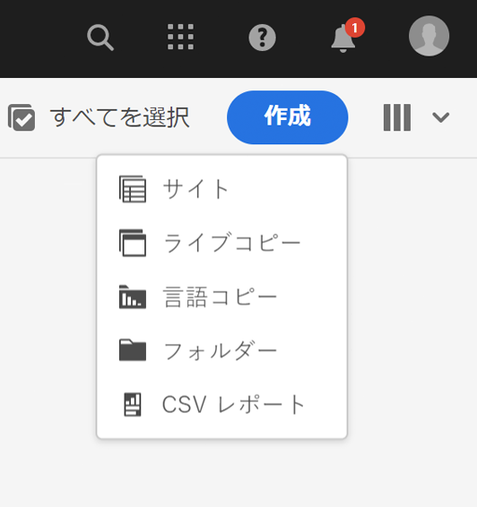

1. ソースページを選択し、「**次へ**」を選択します。次に例を示します。

   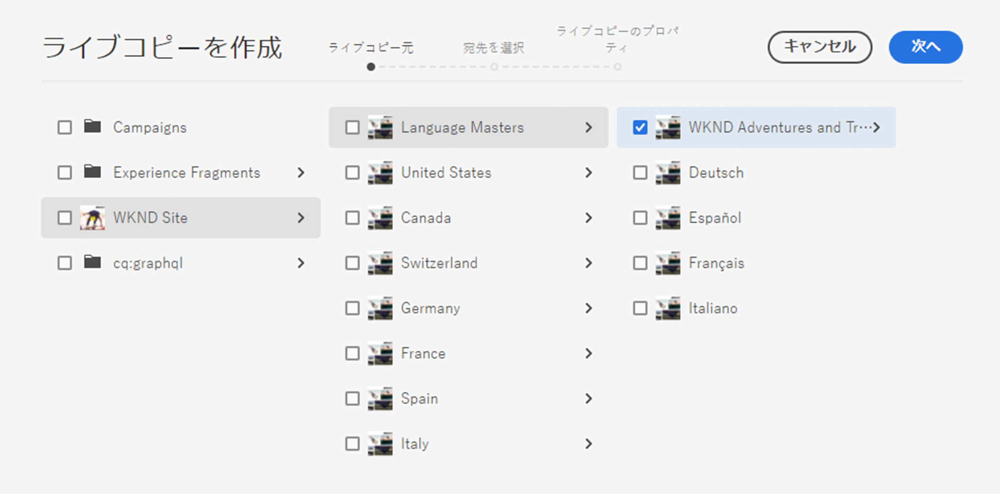

1. （ライブコピーの親フォルダーまたはページを開いて）ライブコピーの宛先のパスを指定し、「**次へ**」を選択します。

   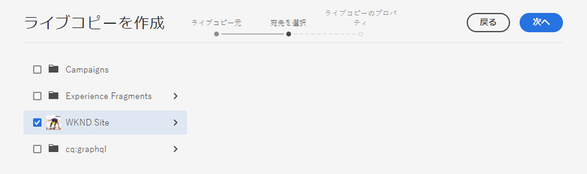

   >[!NOTE]
   >
   >宛先のパスをソースパスに含めることはできません。

1. 次を入力 :

   * ページの&#x200B;**タイトル**。
   * URL で使用される&#x200B;**名前**。

   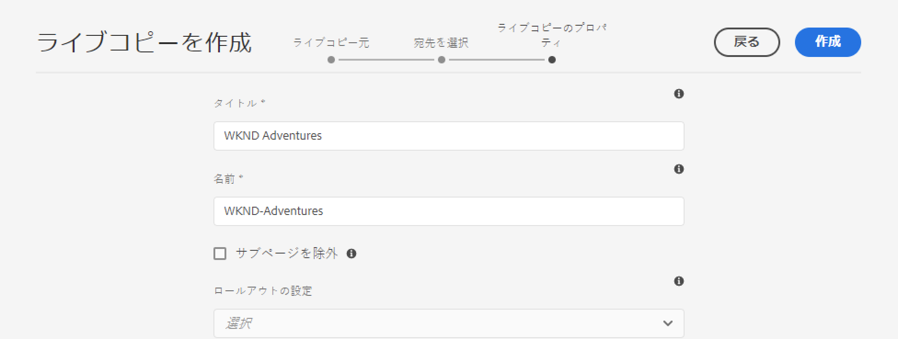

1. 「**サブページを除外**」チェックボックスを次のように使用します。

   * オン：選択したページのライブコピーのみが作成されます（シャローライブコピー）
   * オフ：選択したページとそのすべての子を含んだライブコピーが作成されます（ディープライブコピー）

1. （オプション）ライブコピーコピーに使用する 1 つ以上のロールアウト設定を指定するには、「**ロールアウトの設定**」ドロップダウンリストを使用して選択します。選択した設定がドロップダウンセレクターの下に表示されます。
1. 「**作成**」を選択します。確認メッセージが表示されます。ここで「**開く**」または「**完了**」のいずれかを選択できます。

   >[!NOTE]
   >
   >「フォームの送信に失敗しました」というメッセージを含むエラーダイアログが表示される場合があります。これは、ネットワークのタイムアウトが原因で発生します。ただし、ライブコピーを作成するプロセスはバックグラウンドで実行されています。数分待ってから、ライブコピーのページが正しく作成されたことを確認します。

### ブループリント設定からの Site のライブコピーの作成 {#creating-a-live-copy-of-a-site-from-a-blueprint-configuration}

ブループリント設定を使用してライブコピーを作成し、ブループリント（ソース）コンテンツに基づくサイトを作成します。ブループリント設定からライブコピーを作成する場合は、コピーするブループリントのソースの言語ブランチを 1 つ以上選択し、その言語ブランチからコピーするチャプターを選択します。[ブループリント設定の作成](#creating-a-blueprint-configuration)を参照してください。

一部の言語ブランチまたはライブコピーから削除した場合は、後から追加できます。詳しくは、[ライブコピー内でのライブコピーの作成（ブループリント設定）](#creating-a-live-copy-inside-a-live-copy-blueprint-configuration)を参照してください。

>[!CAUTION]
>
>別のブランチの段落をターゲットとするリンクと参照がブループリントのソースに含まれている場合、ライブコピーページではそのターゲットが更新されず、元の宛先を参照したままになります。

サイトを作成する場合は、以下のプロパティに値を指定します。

* **初期言語**：ライブコピーに含めるブループリントソースの言語
* **初期の章**：ライブコピーに含めるブループリントの言語ブランチの子
* **宛先のパス**：ライブコピーサイトのルートページの場所
* **タイトル**：ライブコピーサイトのルートページのタイトル
* **名前**：（オプション）ライブコピーのルートページを格納する JCR ノードの名前。デフォルト値はタイトルに基づいて指定されます。
* **サイト所有者**：（オプション）ライブコピーの責任者に関する情報
* **ライブコピー**：ソースサイトとのライブ関係を確立するには、このオプションを選択します。このオプションを選択しない場合、ブループリントのコピーは作成されますが、その後ソースと同期されません。
* **ロールアウトの設定**：（オプション）ライブコピーの同期に使用するロールアウト設定を 1 つ以上選択します。デフォルトでは、ロールアウト設定はブループリントから継承されます。詳しくは、[使用するロールアウト設定の指定](live-copy-sync-config.md#specifying-the-rollout-configurations-to-use)を参照してください。

ブループリント設定からサイトのライブコピーを作成するには：

1. **Sites** コンソールで「**作成**」を選択し、ドロップダウンセレクターから「**サイト**」を選択します。
1. ライブコピーのソースとして使用するブループリント設定を選択し、「**次へ**」で先に進みます。

   

1. **初期言語**&#x200B;セレクターを使用して、ライブコピーに使用するブループリントサイトの言語を選択します。

   デフォルトでは、使用可能なすべての言語が選択されます。言語を削除するには、言語の横に表示される **X** を選択します。

   次に例を示します。

   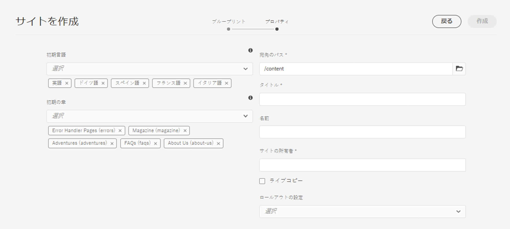

1. 「**最初の章**」ドロップダウンを使用して、ライブコピーに含めるブループリントのセクションを選択します。ここでも、デフォルトでは使用可能なすべての章が含まれますが、削除できます。
1. 残りのプロパティの値を指定して「**作成**」を選択します。確認のダイアログボックスで、「**完了**」を選択して **Sites** コンソールに戻るか、「**サイトを開く**」を選択してサイトのルートページを開きます。

### ライブコピー内でのライブコピーの作成（ブループリント設定） {#creating-a-live-copy-inside-a-live-copy-blueprint-configuration}

ライブコピーを（ブループリント設定を使用して作成した）既存のライブコピー内に作成する場合は、ライブコピーが最初に作成されたときには含まれていなかった任意の言語コピーまたはチャプターを挿入できます。

## ライブコピーの監視 {#monitoring-your-live-copy}

### ライブコピーのステータスの確認 {#seeing-the-status-of-a-live-copy}

ライブコピーページのプロパティには、ライブコピーに関する以下の情報が表示されます。

* **ソース**：ライブコピーページのソースページ
* **ステータス**：ライブコピーの同期のステータス。このステータスには、ライブコピーが最新の（ソースと同じ）状態であるかどうか、前回の同期が実行された日時および同期を実行したユーザーが含まれます。
* **設定**:

   * ページがまだライブコピーの継承の対象であるかどうか
   * 設定が親ページから継承されるかどうか
   * ライブコピーが使用するすべてのロールアウト設定

プロパティを表示するには：

1. **Sites** コンソールで、ライブコピーページを選択してプロパティを開きます。
1. 「**ライブコピー**」タブを選択します。

   次に例を示します。

   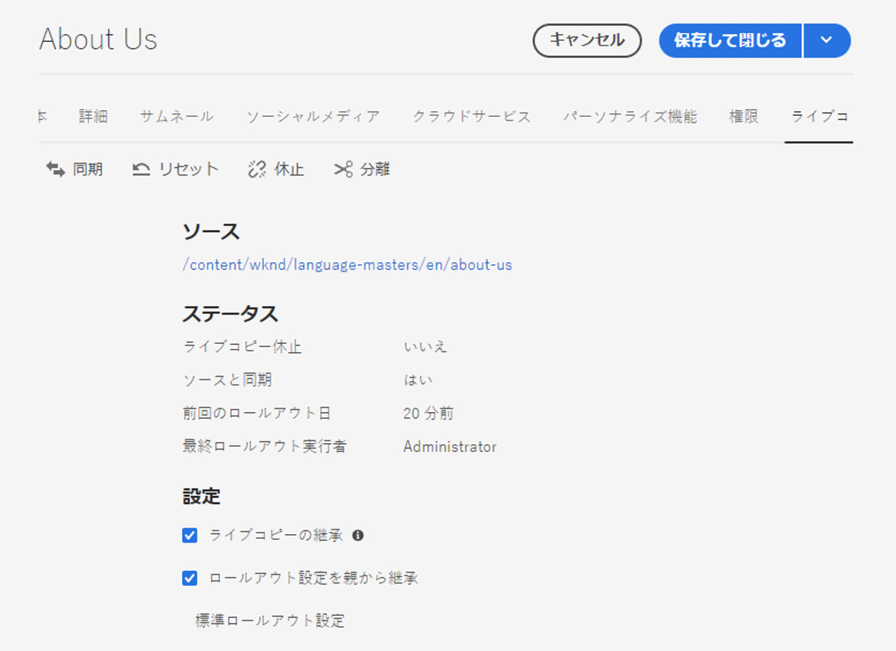

   詳しくは、「ライブコピーの概要コンソール」の記事の、](live-copy-overview.md#using-the-live-copy-overview)ライブコピーの概要の使用[を参照してください。

### ブループリントページのライブコピーの確認 {#seeing-the-live-copies-of-a-blueprint-page}

（ブループリント設定で参照される）ブループリントのページには、現在の（ブループリント）ページをソースとして使用するライブコピーページのリストが表示されます。このリストを使用してライブコピーを追跡します。このリストは[ページプロパティ](/help/sites-cloud/authoring/sites-console/page-properties.md)の「**ブループリント**」タブに表示されます。

## ライブコピーの同期 {#synchronizing-your-live-copy}

ライブコピーを同期するいくつかの方法があります。

### ブループリントのロールアウト {#rolling-out-a-blueprint}

ブループリントのページをロールアウトして、コンテンツの変更をライブコピーにプッシュします。**ロールアウト**&#x200B;アクションでは、「[ロールアウト時](live-copy-sync-config.md#rollout-triggers)」のトリガーを使用するロールアウト設定が実行されます。

>[!NOTE]
>
>ブループリントのブランチと依存するライブコピーのブランチの両方で同じ名前の新しいページが作成されると、競合が発生することがあります。
>
>このような[競合は、ロールアウト時に処理および解決する必要があります](rollout-conflicts.md)。

#### ページプロパティからのブループリントのロールアウト {#rolling-out-a-blueprint-from-page-properties}

1. **Sites** コンソールで、ブループリント内のページを選択してプロパティを開きます。
1. 「**ブループリント**」タブを開きます。
1. 「**ロールアウト**」を選択します。

   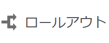

1. ページとサブページを指定し、チェックマークを付けて確定します。

   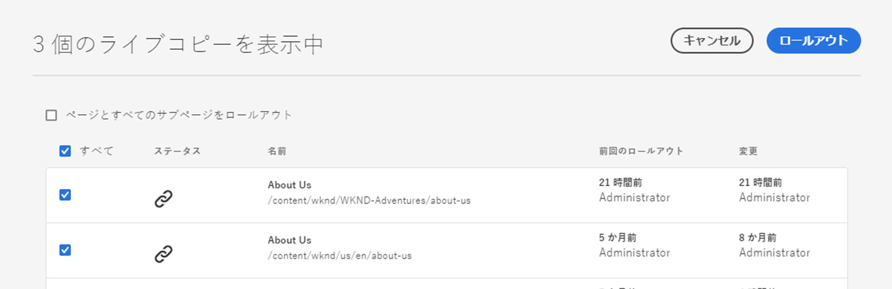

1. ロールアウトジョブを直ちに実行するか（**今すぐ**）、別の日時に実行するか（**後で**）を指定します。

   

ロールアウトは非同期ジョブとして処理され、[***非同期ジョブステータス**&#x200B;ページ](/help/operations/asynchronous-jobs.md#monitor-the-status-of-asynchronous-operations)で確認できます。

#### 参照レールからのブループリントのロールアウト {#roll-out-a-blueprint-from-the-reference-rail}

1. **Sites** コンソールで、ライブコピー内のページを選択して（ツールバーの）**[参照](/help/sites-cloud/authoring/basic-handling.md#references)**&#x200B;パネルを開きます。
1. リストから「**ブループリント**」オプションを選択し、このページに関連付けられているブループリントを表示します。
1. リストから必要なブループリントを選択します。
1. 「**ロールアウト**」を選択します。

   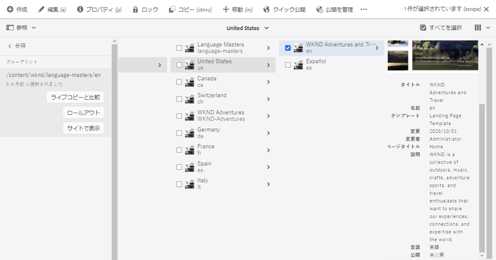

1. ロールアウトについて、次の詳細の確認を求められます。

   * **範囲をロールアウト**：

     選択したページのみを範囲にするか、サブページを含める必要があるかを指定します。

   * **スケジュール**：

     ロールアウトジョブをすぐに実行するか（**今すぐ**）、または後日実行するか（**後で**）を指定します。

     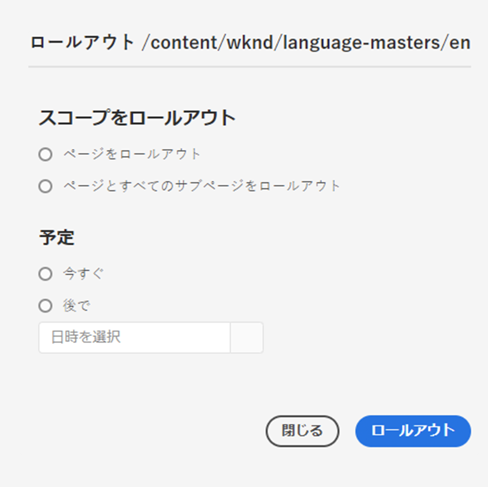

1. これらの詳細を確認したら、「**ロールアウト**」を選択してアクションを実行します。

ロールアウトは非同期ジョブとして処理され、[**非同期ジョブのステータス**&#x200B;ページ](/help/operations/asynchronous-jobs.md#monitor-the-status-of-asynchronous-operations)で確認できます。

#### ライブコピーの概要からのブループリントのロールアウト {#roll-out-a-blueprint-from-the-live-copy-overview}

ライブコピーの概要では、ブループリントページを選択して、[**ロールアウトア**&#x200B;クションを実行することもできます](live-copy-overview.md#using-the-live-copy-overview)。

1. [ライブコピーの概要](live-copy-overview.md#using-the-live-copy-overview)を開き、ブループリントページを選択します。
1. ツールバーの「**ロールアウト**」を選択します。

   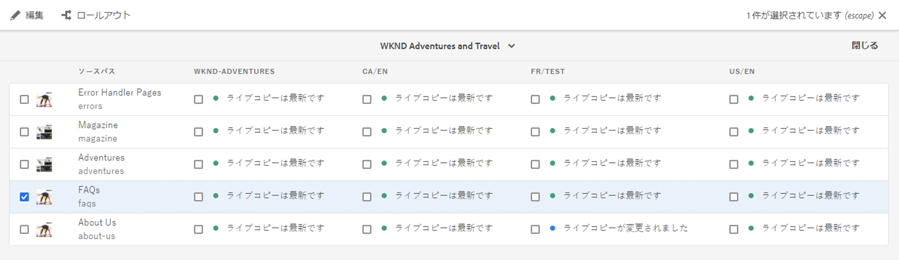

1. ページとサブページを指定し、チェックマークを付けて確定します。

   

1. ロールアウトジョブを直ちに実行するか（**今すぐ**）、別の日時に実行するか（**後で**）を指定します。

   

ロールアウトは非同期ジョブとして処理され、[**非同期ジョブのステータス**&#x200B;ページ](/help/operations/asynchronous-jobs.md#monitor-the-status-of-asynchronous-operations)で確認できます。

### ライブコピーの同期 {#synchronizing-a-live-copy}

ライブコピーページを同期して、ソースからライブコピーにコンテンツの変更をプルします。

#### ページプロパティからのライブコピーの同期 {#synchronize-a-live-copy-from-page-properties}

ライブコピーを同期して、ソースからライブコピーに変更をプルします。

>[!NOTE]
>
>同期では、「[ロールアウト時](live-copy-sync-config.md#rollout-triggers)」のトリガーを使用するロールアウト設定が実行されます。

1. **Sites** コンソールで、ライブコピーページを選択してプロパティを開きます。
1. 「**ライブコピー**」タブを開きます。
1. 「**同期**」を選択します。

   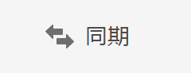

   確認が求められるので、「**同期**」を使用して先に進みます。

#### ライブコピーの概要からのライブコピーの同期 {#synchronize-a-live-copy-from-the-live-copy-overview}

ライブコピーページが選択されている場合、[同期アクションは、ライブコピーの概要からも使用できます](live-copy-overview.md#using-the-live-copy-overview)。

1. [ライブコピーの概要](live-copy-overview.md#using-the-live-copy-overview)を開き、ライブコピーページを選択します。
1. ツールバーの「**同期**」を選択します。
1. ダイアログで次のどちらを含めるかを指定し、**ロールアウト**&#x200B;アクションを確定します。

   * **ページとサブページ**
   * **ページのみ**

   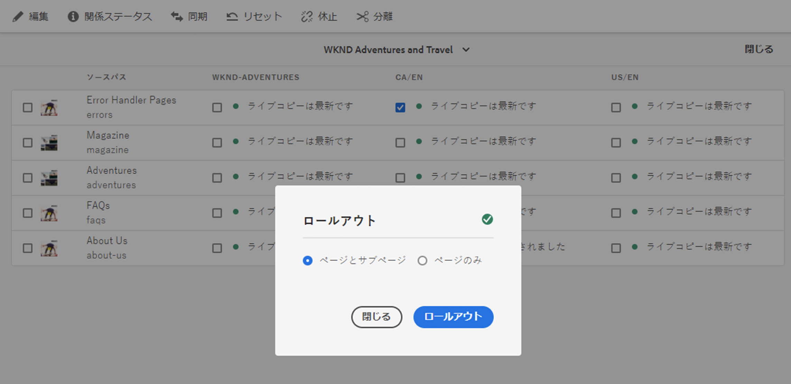

## ライブコピーのコンテンツの変更 {#changing-live-copy-content}

ライブコピーのコンテンツを変更するには、以下を行います。

* ページを段落に追加します。
* 任意のページやコンポーネントのライブコピーの継承を削除して既存のコンテンツを更新します。

>[!TIP]
>
>ライブコピー内にページを手動で作成すると、その新しいページはライブコピーのローカルになります。つまり、関連付けられた対応のソースページがありません。
>
>関連付けられたローカルページを作成する場合のベストプラクティスは、ソース内にローカルページを作成し、ディープロールアウトを実行することです。これにより、ページがライブコピーとしてローカルに作成されます。

>[!NOTE]
>
>ブループリントのブランチと依存するライブコピーのブランチの両方で同じ名前の新しいページが作成されると、競合が発生することがあります。
>
>このような[競合はロールアウト時に処理および解決する必要があります](rollout-conflicts.md)。

### ライブコピーページへのコンポーネントの追加 {#adding-components-to-a-live-copy-page}

ライブコピーページにはいつでもコンポーネントを追加できます。ライブコピーとその段落システムの継承ステータスにより、コンポーネント追加の動作が変わることはありません。

ライブコピーページがソースページに同期されても、追加されたコンポーネントは変わらず残ります。詳しくは、[ライブコピーページ上のコンポーネントの順序の変更](#changing-the-order-of-components-on-a-live-copy-page)も参照してください。

>[!TIP]
>
>コンテナとしてマークされたコンポーネントへのローカルでの変更は、ロールアウト上のブループリントのコンテンツによって上書きされません。詳しくは、[MSM のベストプラクティス](best-practices.md#components-and-container-synchronization)を参照してください。

### ページの継承の休止 {#suspending-inheritance-for-a-page}

ライブコピーを作成する場合、ライブコピーの設定はコピーされたページのルートページに保存されます。ルートページのすべての子ページは、ライブコピーの設定を継承します。また、ライブコピーページ上のコンポーネントもライブコピー設定を継承します。

ライブコピーページのライブコピーの継承を休止して、ページのプロパティやコンポーネントを変更できます。継承を休止すると、ページプロパティとコンポーネントがソースと同期されなくなります。

>[!TIP]
>
>ブループリントから[ライブコピーを分離](#detaching-a-live-copy)してすべての関係を削除することもできます。継承の休止とは異なり、分離操作は恒久的で非可逆的です。

#### ページプロパティからの継承の休止 {#suspending-inheritance-from-page-properties}

ページの継承を休止するには：

1. **Sites** コンソールの「**プロパティを表示**」コマンドまたはページツールバーの「**ページ情報**」を使用して、ライブコピーページのプロパティを開きます。
1. 「**ライブコピー**」タブを選択します。
1. ツールバーの「**休止**」を選択します。その後、次のいずれかを選択します。

   * **休止**：現在のページのみを休止します。
   * **子ページも休止**：現在のページとすべての子ページを休止します。

1. 確認ダイアログの「**休止**」を選択します。

#### ライブコピーの概要からの継承の休止 {#suspending-inheritance-from-the-live-copy-overview}

ライブコピーの概要では、ライブコピーページを選択して、[休止アクションを実行することもできます](live-copy-overview.md#using-the-live-copy-overview)。

1. [ライブコピーの概要](live-copy-overview.md#using-the-live-copy-overview)を開き、ライブコピーページを選択します。
1. ツールバーの「**休止**」を選択します。
1. 次のいずれかから適切なオプションを選択します。

   * **休止**
   * **子ページも休止**

   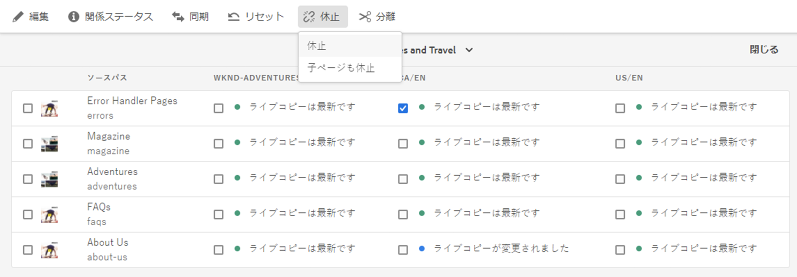

1. **ライブコピーを休止**&#x200B;ダイアログで&#x200B;**休止**&#x200B;アクションを確定します。

   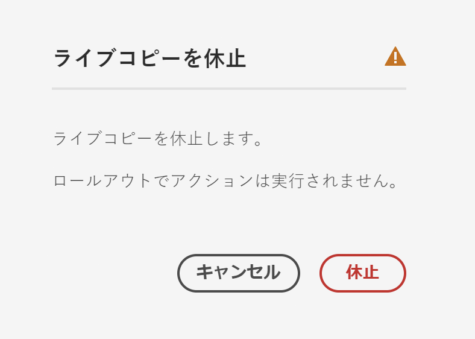

### ページの継承の再開 {#resuming-inheritance-for-a-page}

ページのライブコピーの継承の休止は、一時的なアクションです。休止すると、ライブ関係を元に戻すための&#x200B;**再開**&#x200B;アクションが使用可能になります。

継承を再度有効にしても、ページはソースと自動的には同期されません。必要に応じて、次のいずれかの方法で同期を要求できます。

* 次に示すような&#x200B;**再開**／**元に戻す**&#x200B;ダイアログを使用します。

  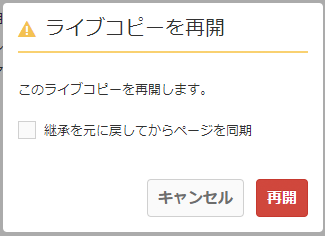

* 後から、同期アクションを手動で選択します。

>[!NOTE]
>
>継承を再度有効にしても、ページはソースと自動的には同期されません。これが必要な場合は、再開時または後で手動で同期をリクエストできます。

#### ページプロパティからの継承の再開 {#resuming-inheritance-from-page-properties}

[休止](#suspending-inheritance-from-page-properties)すると、ページプロパティのツールバーで&#x200B;**再開**&#x200B;アクションが使用可能になります。

選択すると、ダイアログボックスが表示されます。必要に応じて、同期を選択し、アクションを確定できます。

#### ライブコピーの概要からのライブコピーページの再開 {#resume-a-live-copy-page-from-the-live-copy-overview}

[ライブコピーの概要では、ライブコピーページを選択して、再開アクションを実行することもできます](live-copy-overview.md#using-the-live-copy-overview)。

1. [ライブコピーの概要](live-copy-overview.md#using-the-live-copy-overview)を開き、休止中のライブコピーページを選択します。ページには、**継承がキャンセルされました**&#x200B;と表示されます。
1. ツールバーの「**再開**」を選択します。
1. 継承を元に戻した後にページを同期するかどうかを指定し、**ライブコピーを再開**&#x200B;ダイアログで&#x200B;**再開**&#x200B;アクションを確定します。

### 継承の深度の変更（シャロー／ディープ） {#changing-inheritance-depth-shallow-deep}

既存のライブコピーで、ページの深度、つまり子ページが含まれるかどうかを変更できます。

* シャローライブコピーに切り替えた場合：

   * 効果は即座に現れ、元に戻すことはできません。

   * ライブコピーから子ページを明示的に分離します。元に戻した場合、子に対する追加の変更内容は保持されません。

   * ネストされた `LiveRelationships` がある場合でも、下位の `LiveCopies` はすべて削除されます。

* ディープライブコピーに切り替えた場合：

   * 子ページはそのまま残します。
   * 切り替えの影響を確認するには、ロールアウトを実行します。コンテンツに対するすべての変更がロールアウト設定に従って適用されます。

* シャローライブコピーに切り替えた後、ディープライブコピーに戻した場合：

   * シャロー（であった）ライブコピーのすべての子は手動で作成されたものとしてわれるので、`[oldname]_msm_moved name` を使用して変更されます。

深度を指定または変更するには：

1. **Sites** コンソールの「**プロパティを表示**」コマンドまたはページツールバーの「**ページ情報**」を使用して、ライブコピーページのプロパティを開きます。
1. 「**ライブコピー**」タブを選択します。
1. 「**設定**」セクションで、子ページが含まれているかどうかによって、「**ライブコピーの継承**」オプションをオンまたはオフにします。

   * オン：ディープライブコピー（子ページが含まれる）
   * オフ：シャローライブコピー（子ページは除外される）

   >[!CAUTION]
   >
   >シャローライブコピーへの切り替えは即座に反映され、元に戻すことはできません。
   >
   >詳しくは、[ライブコピー - 構成](overview.md#live-copies-composition)を参照してください。

1. 「**保存**」を選択して、更新内容を保持します。

### コンポーネントの継承のキャンセル {#cancelling-inheritance-for-a-component}

コンポーネントについてライブコピーの継承をキャンセルして、コンポーネントがソースコンポーネントと同期されないようにします。必要に応じて、後で継承を有効にすることができます。

>[!NOTE]
>
>継承を再度有効にしても、コンポーネントはソースと自動的には同期されません。必要な場合は、手動で同期をリクエストできます。

継承をキャンセルして、コンポーネントのコンテンツを変更するか、コンポーネントを削除するには：

1. 継承をキャンセルするコンポーネントを選択します。

   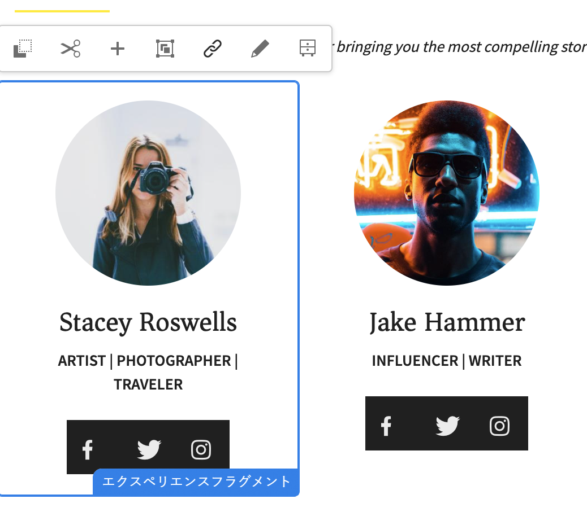

1. コンポーネントツールバーで、**継承をキャンセル**&#x200B;アイコンを選択します。

   

1. 継承をキャンセルダイアログボックスで、「**はい**」を使用してアクションを確定します。

   コンポーネントツールバーが更新されて、すべての（該当する）編集コマンドが表示されます。

### コンポーネントの継承の再有効化 {#re-enabling-inheritance-for-a-component}

コンポーネントの継承を有効にするには、コンポーネントツールバーの&#x200B;**継承を再度有効にする**&#x200B;アイコンを選択します。

### ライブコピーページ上のコンポーネントの順序の変更 {#changing-the-order-of-components-on-a-live-copy-page}

あるライブコピーに段落システムの一部であるコンポーネントが含まれている場合、段落システムの継承は次のルールに従います。

* 段落システム内のコンポーネントの順序は、継承が確立していても変更できます。
* ロールアウト時に、コンポーネントの順序がブループリントから復元されます。ロールアウト前に新しいコンポーネントがライブコピーに追加された場合、それらは追加先にあるコンポーネントと共に並べ替えられます。
* 段落システムの継承がキャンセルされた場合、コンポーネントの順序はロールアウト時に復元されず、ライブコピーにそのまま残ります。

>[!NOTE]
>
>段落システムでキャンセルされた継承を元に戻しても、コンポーネントの順序はブループリントから&#x200B;**自動的には復元されません**。必要な場合は、手動で同期をリクエストできます。

次の手順に従って、段落システムの継承をキャンセルします。

1. ライブコピーページを開きます。
1. 既存のコンポーネントをページの別の場所にドラッグします。
1. **継承をキャンセル**&#x200B;ダイアログボックスで、「**はい**」を使用してアクションを確定します。

### ライブコピーページのプロパティの上書き {#overriding-properties-of-a-live-copy-page}

デフォルトでは、ライブコピーページのページプロパティはソースページから継承され、編集できません。

ライブコピーのプロパティ値を変更する必要がある場合は、プロパティの継承をキャンセルします。リンクアイコンは、プロパティの継承が有効なことを示しています。

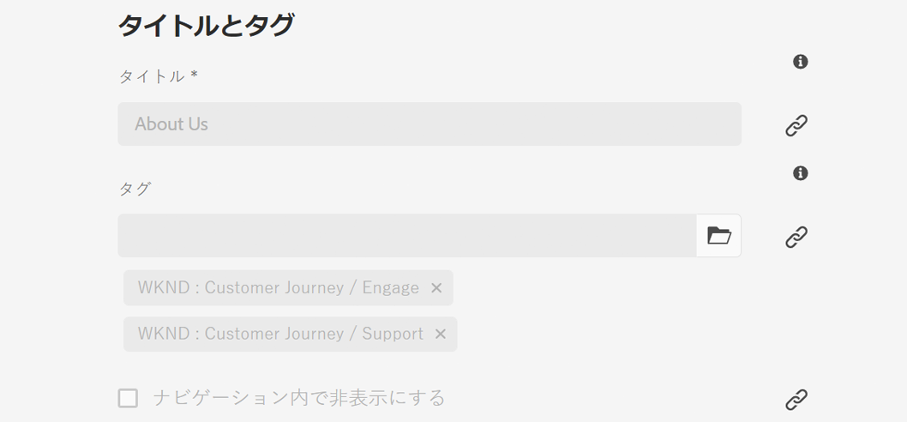

継承をキャンセルすると、プロパティ値を変更できます。リンク切れアイコンは、継承がキャンセルされたことを示しています。

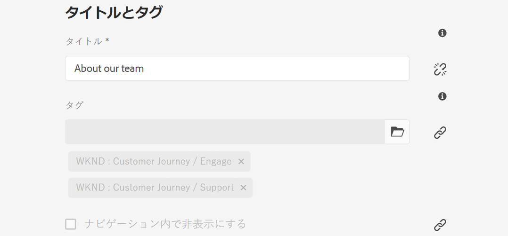

必要に応じて、プロパティの継承を後から再度有効にすることができます。

>[!NOTE]
>
>継承を再度有効にしても、ライブコピーページのプロパティはソースのプロパティとは自動的には同期されません。必要な場合は、手動で同期をリクエストできます。

1. **Sites** コンソールの「**プロパティを表示**」オプションまたはページツールバーの「**ページ情報**」アイコンを使用して、ライブコピーページのプロパティを開きます。
1. プロパティの継承をキャンセルするには、プロパティの右側に表示されるリンクアイコンを選択します。

   

1. **継承をキャンセル**&#x200B;確認ダイアログで、「**はい**」を選択します。

### ライブコピーページのプロパティの復帰 {#revert-properties-of-a-live-copy-page}

プロパティの継承を有効にするには、プロパティの横に表示される&#x200B;**継承を元に戻す**&#x200B;アイコンを選択します。

### ライブコピーページのリセット {#resetting-a-live-copy-page}

ライブコピーページをリセットして、次の操作を実行できます。

* すべての継承のキャンセルが削除され、かつ
* ページをソースページと同じ状態に戻します。

リセットは、ページプロパティ、段落システムおよびコンポーネントに対して行った変更に適用されます。

#### ページプロパティからのライブコピーページのリセット {#reset-a-live-copy-page-from-the-page-properties}

1. **Sites** コンソールで、ライブコピーページを選択して「**プロパティを表示**」を選択します。
1. 「**ライブコピー**」タブを開きます。
1. ツールバーの「**リセット**」を選択します。

   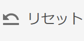

1. **ライブコピーをリセット**&#x200B;ダイアログボックスで、「**リセット**」を選択して確定します。

#### ライブコピーの概要からのライブコピーページをリセット {#reset-a-live-copy-page-from-the-live-copy-overview}

ライブコピーの概要では、ライブコピーページを選択して、[**リセット**&#x200B;アクションを実行することもできます](live-copy-overview.md#using-the-live-copy-overview)。

1. [ライブコピーの概要](live-copy-overview.md#using-the-live-copy-overview)を開き、ライブコピーページを選択します。
1. ツールバーの「**リセット**」を選択します。
1. **ライブコピーをリセット**&#x200B;ダイアログで&#x200B;**リセット**&#x200B;アクションを確定します。

   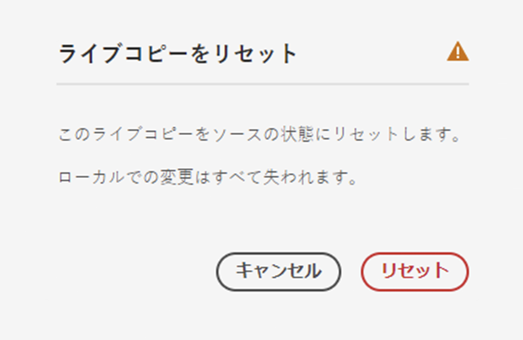

## ライブコピーページとブループリントページの比較 {#comparing-a-live-copy-page-with-a-blueprint-page}

加えた変更をトラックするには、**参照**&#x200B;でブループリントページを確認し、ライブコピーページと比較します。

1. **Sites** コンソールで、[ブループリントページまたはライブコピーページに移動し、ページを選択します](/help/sites-cloud/authoring/basic-handling.md#viewing-and-selecting-resources)。
1. 「**[参照](/help/sites-cloud/authoring/basic-handling.md#references)**」パネルを開き、状況に応じて次のいずれかを選択します。

   * **ブループリント**
   * **ライブコピー**

1. コンテキストに応じて、特定のライブコピーを選択し、次のいずれかを選択します。

   * **ブループリントと比較**
   * **ライブコピーと比較**

   次に例を示します。

   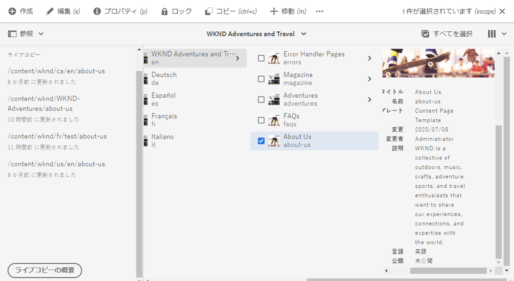

1. ライブコピーページとブループリントページが横に並んで表示されます。

   比較機能の使用方法について詳しくは、[ページの差分](/help/sites-cloud/authoring/sites-console/page-diff.md)を参照してください。

## ライブコピーの分離 {#detaching-a-live-copy}

分離アクションは、ライブコピーとそのソースやブループリントページの間のライブ関係を永続的に削除します。ライブコピーから MSM に関連するすべてのプロパティが削除され、そのライブコピーページがスタンドアロンのコピーになります。

>[!CAUTION]
>
>ライブコピーを分離した後にライブ関係を元に戻すことはできません。
>
>ライブ関係を削除し、必要に応じて後で元に戻すには、ページの[ライブコピーの継承をキャンセル](#suspending-inheritance-for-a-page)します。

ツリー内で&#x200B;**分離**&#x200B;を使用する場所によって異なる処理が行われます。

* **ライブコピーコピーのルートページで分離する**

  ライブコピーのルートページでこの操作を実行した場合は、ブループリントとライブコピーのすべてのページのライブ関係が削除されます。

  ブループリントのページにさらに変更を加えても、ライブコピーには&#x200B;**影響しません。**

* **ライブコピーコピーのサブページで分離する**

  ライブコピー内のサブページ（またはブランチ）でこの操作を実行した場合は、次のようになります。

   * そのサブページ（またはブランチ）のライブ関係が削除され、
   * ライブコピーブランチの（サブ）ページは手動で作成されたかのように扱われます。

  ただし、サブページは引き続き親ブランチのライブ関係の対象であり、ブループリントページの今後のロールアウトでは、次のように処理されます。

   1. 分離されたページの名前が変更されます。

      * これは、手動で作成されたページは作成するライブコピーコピーページと同じ名前を持つので、競合が発生すると MSM が判断するためです。

   1. ロールアウトからの変更を含む新しい（ライブコピー）ページが元の名前で作成されます。

  >[!NOTE]
  >
  >このような状況について詳しくは、[MSM ロールアウトの競合](rollout-conflicts.md)を参照してください。

### ページプロパティからのライブコピーページの分離 {#detach-a-live-copy-page-from-the-page-properties}

ライブコピーを分離するには：

1. **Sites** コンソールで、ライブコピーページを選択して「**プロパティを表示**」を選択します。
1. 「**ライブコピー**」タブを開きます。
1. ツールバーで「**分離**」を選択します。

   

1. 確認ダイアログが表示されたら、「**分離**」を選択してアクションを完了します。

### ライブコピーの概要からのライブコピーページの分離 {#detach-a-live-copy-page-from-the-live-copy-overview}

ライブコピーの概要では、ライブコピーページを選択して、[分離アクションを実行することもできます](live-copy-overview.md#using-the-live-copy-overview)。

1. [ライブコピーの概要](live-copy-overview.md#using-the-live-copy-overview)を開き、ライブコピーページを選択します。
1. ツールバーの「**分離**」を選択します。
1. **ライブコピーの分離**&#x200B;ダイアログで&#x200B;**分離**&#x200B;アクションを確定します。

   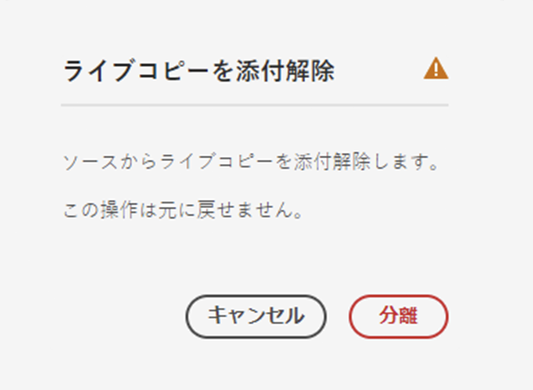
