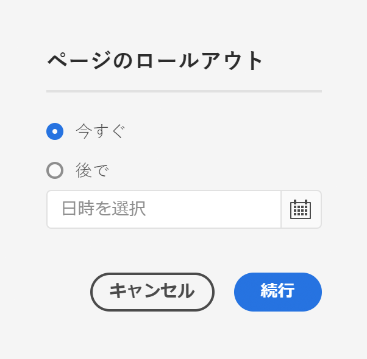
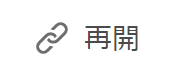

# ライブコピーの作成と同期 {#creating-and-synchronizing-live-copies}

サイト全体でそのコンテンツを再利用するために、ページまたはブループリント設定からライブコピーを作成できます。 継承と同期を管理し、コンテンツに対する変更の反映方法を制御できます。

## ブループリント設定の管理 {#managing-blueprint-configurations}

ブループリント設定は、1つ以上のライブコピーページのソースとして使用する既存のWebサイトを識別します。

>[!TIP]
>
>ブループリント設定を使用すると、コンテンツの変更をライブコピーにプッシュできます。 [コンテンツの再利用：マルチサイトマネージャーとライブコピー](overview.md#source-blueprints-and-blueprint-configurations)を参照してください。

ブループリント設定を作成するには、ブループリントの内部構造を定義するテンプレートを選択します。デフォルトのブループリントテンプレートでは、ソースの Web サイトに以下の特徴があることを前提としています。

* Web サイトにルートページがある。
* ルートの直下の子ページは、Webサイトの言語ブランチです。ライブコピーを作成する際、言語は、コピーに含めるオプションのコンテンツとして表示されます。
* 各言語ブランチのルートに 1 つ以上の子ページがある。ライブコピーを作成すると、ライブコピーに含めることができる子ページが表示されます。

>[!NOTE]
>
>構造が異なれば、別のブループリントテンプレートが必要になります。

ブループリント設定を作成したら、次のプロパティを設定します。

* **名前**:ブループリント設定の名前
* **ソースパス**:ソース（ブループリント）として使用するサイトのルートページのパス
* **説明**. （オプション）ブループリント設定の説明。サイトの作成時にブループリント設定のリストに表示され、選択できます。

ブループリント設定を使用する場合、ソース/ブループリントのライブコピーを同期する方法を決定するロールアウト設定に関連付けることができます。 [使用するロールアウト設定の指定](live-copy-sync-config.md#specifying-the-rollout-configurations-to-use)を参照してください。

### ブループリント設定の作成と編集{#creating-editing-blueprint-configurations}

ブループリント設定は不変データと見なされ、実行時には編集できません。 この理由から、設定の変更はCI/CDパイプラインを使用してGitを介してデプロイする必要があります。

詳しくは、「Adobe Experience Manager(AEM)の主なCloud Serviceの変更点」を参照してください。

以下の手順は、管理者インスタンス上で、ローカル開発および開発目的でのみ使用できます。 これらのオプションは、AEMaCSクラウドインスタンスでは使用できません。

#### ブループリント設定のローカル作成{#creating-a-blueprint-configuration}

ブループリント設定を作成するには：

1. **ツール**&#x200B;メニューに[移動](/help/sites-cloud/authoring/getting-started/basic-handling.md#global-navigation)し、**サイト**&#x200B;メニューを選択します。
1. 「**ブループリント**」を選択して、**ブループリント設定**&#x200B;コンソールを開きます。

   

1. 「**作成**」を選択します。
1. ブループリントテンプレートを選択し、「**次へ**」を選択して先に進みます。
1. ブループリントとして使用するソースページを選択し、「**次へ**」を選択して先に進みます。
1. 次の項目を定義します。

   * **タイトル**：ブループリントのタイトル（必須）
   * **説明**：詳細を示す説明（オプション）

1. 「**作成**」を選択すると、指定した内容に基づいてブループリント設定が作成されます。

### ブループリント設定の編集または削除 ローカル{#editing-or-deleting-a-blueprint-configuration}

既存のブループリント設定を編集または削除できます。

1. **ツール**&#x200B;メニューに[移動](/help/sites-cloud/authoring/getting-started/basic-handling.md#global-navigation)し、**サイト**&#x200B;メニューを選択します。
1. 「**ブループリント**」を選択して、**ブループリント設定**&#x200B;コンソールを開きます。

   

1. 必要なブループリント設定を選択します。ツールバー上の該当するアクションが使用可能になります。

   * **プロパティ**：設定のプロパティを表示して編集するために使用します。
   * **削除**

## ライブコピーの作成 {#creating-a-live-copy}

ライブコピーを作成する方法はいくつかあります。

### ページのライブコピーの作成 {#creating-a-live-copy-of-a-page}

任意のページまたはブランチのライブコピーを作成できます。 ライブコピーを作成する際に、コンテンツの同期に使用するロールアウト設定を指定できます。

* 選択したロールアウト設定は、ライブコピーページとその子ページに適用されます。
* ロールアウト設定を指定しない場合は、使用するロールアウト設定を MSM が決定します。[使用するロールアウト設定の指定](live-copy-sync-config.md#specifying-the-rollout-configurations-to-use)を参照してください。

任意のページのライブコピーを作成できます。

* [ブループリント設定](#creating-a-blueprint-configuration)で参照されるページ
* 設定に接続していないページ
* 別のライブコピー（[ネストされたライブコピー](overview.md#nested-live-copies)）のページ内のライブコピー

唯一の違いは、ソースページやブループリントページの&#x200B;**ロールアウト**&#x200B;コマンドの使用可否が、ソースがブループリント設定によって参照されているかどうかで決まります。

* ブループリント設定で&#x200B;**が**&#x200B;参照されるソースページからライブコピーを作成した場合、ロールアウトコマンドはソース/ブループリントページで使用できます。
* ブループリント設定で&#x200B;**参照されていない**&#x200B;ソースページからライブコピーを作成した場合、ロールアウトコマンドはソースページやブループリントページでは使用できません。

ライブコピーを作成するには：

1. **サイト**&#x200B;コンソールで「**作成**」、「**ライブコピー**」の順に選択します。

   

1. ソースページを選択して、「**次へ**」をクリックまたはタップします。以下に例を示します。

   

1. ライブコピーの宛先パスを指定し（ライブコピーの親フォルダーまたはページを開く）、「**次へ**」をクリックまたはタップします。

   

   >[!NOTE]
   >
   >宛先のパスをソースパスに含めることはできません。

1. 次の項目を入力します。

   * ページの&#x200B;**タイトル**。
   * URL で使用される&#x200B;**名前**。

   

1. 「**サブページを除外**」チェックボックスを次のように使用します。

   * 選択：選択したページのライブコピーのみを作成する（シャローライブコピー）
   * 未選択：選択したページのすべての子孫を含むライブコピーの作成（ディープライブコピー）

1. （オプション）ライブコピーに使用する1つ以上のロールアウト設定を指定するには、**ロールアウト設定**&#x200B;ドロップダウンリストを使用して選択します。 選択した設定がドロップダウンセレクターの下に表示されます。
1. 「**作成**」をクリックまたはタップします。確認メッセージが表示されます。ここで「**開く**」または「**完了**」のいずれかを選択します。

### ブループリント設定からのサイトのライブコピーの作成  {#creating-a-live-copy-of-a-site-from-a-blueprint-configuration}

ブループリント設定を使用してライブコピーを作成し、ブループリント（ソース）コンテンツに基づいてサイトを作成します。 ブループリント設定からライブコピーを作成する場合は、コピーするブループリントソースの1つ以上の言語ブランチを選択し、言語ブランチからコピーするチャプターを選択します。 [ブループリント設定の作成](#creating-a-blueprint-configuration)を参照してください。

一部の言語ブランチをライブコピーから省略した場合は、後で追加できます。 詳しくは、 [ライブコピー内でのライブコピーの作成（ブループリント設定）](#creating-a-live-copy-inside-a-live-copy-blueprint-configuration)を参照してください。

>[!CAUTION]
>
>別のブランチの段落をターゲットにするリンクと参照がブループリントソースに含まれている場合、ライブコピーページではターゲットは更新されず、元の宛先を指すままになります。

サイトを作成する場合は、以下のプロパティに値を指定します。

* **初期言語**:ライブコピーに含めるブループリントソースの言語ブランチ
* **最初の章**:ライブコピーに含めるブループリント言語ブランチの子ページ
* **宛先パス**:ライブコピーサイトのルートページの場所
* **タイトル**:ライブコピーサイトのルートページのタイトル
* **名前**:（オプション）ライブコピーのルートページを保存するJCRノードの名前（デフォルト値はタイトルに基づきます）
* **サイトの所有者**:（オプション）ライブコピーの担当者に関する情報
* **ライブコピー**：ソースサイトとのライブの関係を確立する場合にこのオプションを選択します。このオプションを選択しない場合、ブループリントのコピーは作成されますが、後でソースと同期されることはありません。
* **ロールアウトの設定**:（オプション）ライブコピーの同期に使用するロールアウト設定を1つ以上選択します。デフォルトでは、ロールアウト設定はブループリントから継承されます。詳しくは、 [使用するロールアウト設定の指定](live-copy-sync-config.md#specifying-the-rollout-configurations-to-use)を参照してください。

ブループリント設定からサイトのライブコピーを作成するには：

1. **サイト**&#x200B;コンソールで「**作成**」を選択し、ドロップダウンセレクターから「**ライブコピー**」を選択します。
1. ライブコピーのソースとして使用するブループリント設定を選択し、「**次へ**」を選択して次に進みます。

   

1. **初期言語**&#x200B;セレクターを使用して、ライブコピーに使用するブループリントサイトの言語を指定します。

   デフォルトでは、使用可能なすべての言語が選択されます。言語を削除するには、言語の横に表示される **X** をクリックまたはタップします。

   以下に例を示します。

   

1. **初期の章**&#x200B;ドロップダウンを使用して、ライブコピーに含めるブループリントのセクションを選択します。 使用可能なすべての章はデフォルトで含まれていますが、削除できます。
1. 残りのプロパティの値を指定して「**作成**」を選択します。確認のダイアログボックスで、「**完了**」を選択して&#x200B;**サイト**&#x200B;コンソールに戻るか、「**サイトを開く**」を選択してサイトのルートページを開きます。

### ライブコピー内でのライブコピーの作成（ブループリント設定）  {#creating-a-live-copy-inside-a-live-copy-blueprint-configuration}

（ブループリント設定を使用して作成された）既存のライブコピー内にライブコピーを作成する場合、ライブコピーが最初に作成されたときに含まれていなかった任意の言語コピーまたはチャプターを挿入できます。

## ライブコピーの監視 {#monitoring-your-live-copy}

### ライブコピーのステータスの確認 {#seeing-the-status-of-a-live-copy}

ライブコピーページのプロパティには、ライブコピーに関する次の情報が表示されます。

* **ソース**:ライブコピーページのソースページ
* **ステータス**:ライブコピーの同期ステータス。ライブコピーがソースに最新かどうか、前回の同期が発生した日時、同期を実行したユーザーなど。
* **設定**:

   * ページがまだライブコピーの継承の対象かどうか
   * 設定が親ページから継承されるかどうか
   * ライブコピーが使用するロールアウト設定

プロパティを表示するには：

1. **サイト**&#x200B;コンソールで、ライブコピーページを選択してプロパティを開きます。
1. 「**ライブコピー**」タブを選択します。

   以下に例を示します。

   

   詳しくは、記事のライブコピーの概要コンソールの「[ライブコピーの概要](live-copy-overview.md#using-the-live-copy-overview)の使用」の節を参照してください。

### ブループリントページのライブコピーの確認 {#seeing-the-live-copies-of-a-blueprint-page}

ブループリントページ（ブループリント設定で参照）には、現在の（ブループリント）ページをソースとして使用するライブコピーページのリストが表示されます。 このリストを使用して、ライブコピーを追跡します。 このリストは[ページプロパティ](/help/sites-cloud/authoring/fundamentals/page-properties.md)の「**ブループリント**」タブに表示されます。

## ライブコピーの同期 {#synchronizing-your-live-copy}

ライブコピーを同期する方法はいくつかあります。

### ブループリントのロールアウト {#rolling-out-a-blueprint}

ブループリントページをロールアウトして、コンテンツの変更をライブコピーにプッシュします。 **ロールアウト**&#x200B;アクションでは、「[ロールアウト時](live-copy-sync-config.md#rollout-triggers)」のトリガーを使用するロールアウト設定が実行されます。

>[!NOTE]
>
>ブループリントブランチと依存するライブコピーブランチの両方に同じページ名の新しいページが作成されると、競合が発生する可能性があります。
>
>このような[競合はロールアウト時に処理および解決](rollout-conflicts.md)する必要があります。

#### ページプロパティからのブループリントのロールアウト  {#rolling-out-a-blueprint-from-page-properties}

1. **サイト**&#x200B;コンソールで、ブループリントのページを選択し、プロパティを開きます。
1. 「**ブループリント**」タブを開きます。
1. 「**ロールアウト**」を選択します。

   

1. ページとサブページを指定し、チェックマークで確定します。

   

1. ロールアウトジョブを直ちに実行する(**Now**)か、別の日時に実行する(**Later**)かを指定します。

   

ロールアウトは非同期ジョブとして処理され、[***非同期ジョブステータス**&#x200B;ページでチェックできます。](/help/operations/asynchronous-jobs.md#monitor-the-status-of-asynchronous-operations)

#### 参照レールからのブループリントのロールアウト {#roll-out-a-blueprint-from-the-reference-rail}

1. **サイト**&#x200B;コンソールで、ライブコピーのページを選択し、**[参照](/help/sites-cloud/authoring/getting-started/basic-handling.md#references)**&#x200B;パネルを（ツールバーから）開きます。
1. リストから「**ブループリント**」オプションを選択し、このページに関連付けられているブループリントを表示します。
1. リストから必要なブループリントを選択します。
1. 「**ロールアウト**」をクリックまたはタップします。

   

1. ロールアウトについて、次の詳細の確認が求められます。

   * **スコープをロールアウト**:

      範囲を選択したページのみに適用するか、サブページを含めるかを指定します。

   * **スケジュール**：

      ロールアウトジョブを直ちに実行する（**今すぐ**）か、後で実行する（**後で**）かを指定します。

      

1. これらの詳細を確認したら、「**ロールアウト**」を選択してアクションを実行します。

ロールアウトは非同期ジョブとして処理され、[**非同期ジョブステータス**&#x200B;ページでチェックできます。](/help/operations/asynchronous-jobs.md#monitor-the-status-of-asynchronous-operations)

#### ライブコピーの概要からのブループリントのロールアウト {#roll-out-a-blueprint-from-the-live-copy-overview}

ライブコピーの概要では、ブループリントページを選択して、[****&#x200B;ロールアウトアクションを実行することもできます](live-copy-overview.md#using-the-live-copy-overview)。

1. [ライブコピーの概要](live-copy-overview.md#using-the-live-copy-overview)を開き、ブループリントページを選択します。
1. ツールバーの「**ロールアウト**」を選択します。

   

1. ページとサブページを指定し、チェックマークで確定します。

   

1. ロールアウトジョブを直ちに実行する(**Now**)か、別の日時に実行する(**Later**)かを指定します。

   

ロールアウトは非同期ジョブとして処理され、[**非同期ジョブステータス**&#x200B;ページでチェックできます。](/help/operations/asynchronous-jobs.md#monitor-the-status-of-asynchronous-operations)

### ライブコピーの同期 {#synchronizing-a-live-copy}

ライブコピーページを同期して、ソースからライブコピーにコンテンツの変更をプルします。

#### ページプロパティからのライブコピーの同期 {#synchronize-a-live-copy-from-page-properties}

ライブコピーを同期して、ソースからライブコピーに変更をプルします。

>[!NOTE]
>
>同期では、「[ロールアウト時](live-copy-sync-config.md#rollout-triggers)」のトリガーを使用するロールアウト設定が実行されます。

1. **サイト**&#x200B;コンソールで、ライブコピーページを選択してプロパティを開きます。
1. 「**ライブコピー**」タブを開きます。
1. 「**同期**」をクリックまたはタップします。

   

   確認が求められます。「**同期**」を使用して先に進みます。

#### ライブコピーの概要からのライブコピーの同期  {#synchronize-a-live-copy-from-the-live-copy-overview}

ライブコピーの概要では、ライブコピーページを選択して、[同期アクションを実行することもできます](live-copy-overview.md#using-the-live-copy-overview)。

1. [ライブコピーの概要](live-copy-overview.md#using-the-live-copy-overview)を開き、ライブコピーページを選択します。
1. ツールバーの「**同期**」を選択します。
1. 含めるかどうかを指定した後、ダイアログで&#x200B;**ロールアウト**&#x200B;アクションを確認します。

   * **ページとサブページ**
   * **ページのみ**

   

## ライブコピーのコンテンツの変更 {#changing-live-copy-content}

ライブコピーのコンテンツを変更するには、次の操作を行います。

* ページに段落を追加します。
* 任意のページまたはコンポーネントのライブコピーの継承を解除して、既存のコンテンツを更新します。

>[!TIP]
>
>ライブコピーで新しいページを手動で作成した場合、新しいページはライブコピーに対してローカルに配置されます。つまり、新しいページには、関連付けられている対応するソースページがありません。
>
>関係の一部となるローカルページを作成するためのベストプラクティスは、ソース内にローカルページを作成し、ディープロールアウトを実行することです。 これにより、ページがライブコピーとしてローカルに作成されます。

>[!NOTE]
>
>ブループリントブランチと依存するライブコピーブランチの両方に同じページ名の新しいページが作成されると、競合が発生する可能性があります。
>
>このような[競合はロールアウト時に処理および解決](rollout-conflicts.md)する必要があります。

### ライブコピーページへのコンポーネントの追加  {#adding-components-to-a-live-copy-page}

コンポーネントは、ライブコピーページにいつでも追加できます。 ライブコピーとその段落システムの継承ステータスは、コンポーネントを追加する機能を制御しません。

ライブコピーページがソースページと同期されても、追加されたコンポーネントは変更されません。 [ライブコピーページ上のコンポーネントの順序の変更も参照してください。](#changing-the-order-of-components-on-a-live-copy-page)

>[!TIP]
>
>コンテナとしてマークされたコンポーネントへのローカルでの変更は、ロールアウト上のブループリントのコンテンツによって上書きされません。詳しくは、[MSM のベストプラクティス](best-practices.md#components-and-container-synchronization)を参照してください。

### ページの継承の休止 {#suspending-inheritance-for-a-page}

ライブコピーを作成すると、ライブコピーの設定はコピーされたページのルートページに保存されます。ルートページのすべての子ページがライブコピー設定を継承します。 ライブコピーページ上のコンポーネントもライブコピー設定を継承します。

ライブコピーページのライブコピーの継承を休止して、ページのプロパティやコンポーネントを変更できます。 継承を休止すると、ページプロパティとコンポーネントがソースと同期されなくなります。

>[!TIP]
>
>[ライブコピー](#detaching-a-live-copy)をブループリントから分離して、すべての接続を削除することもできます。 継承の休止とは異なり、分離アクションは永続的で非可逆的です。

#### ページプロパティからの継承の休止 {#suspending-inheritance-from-page-properties}

ページの継承を休止するには：

1. **サイト**&#x200B;コンソールの「**プロパティを表示**」コマンドを使用するか、ページツールバーの「**ページ情報**」を使用して、ライブコピーページのプロパティを開きます。
1. 「**ライブコピー**」タブをクリックまたはタップします。
1. ツールバーの「**休止**」を選択します。その後、次のいずれかを選択します。

   * **休止**:現在のページのみを休止します。
   * **子で休止**:をクリックすると、現在のページが子ページと共に休止されます。

1. 確認ダイアログの「**休止**」を選択します。

#### ライブコピーの概要からの継承の休止 {#suspending-inheritance-from-the-live-copy-overview}

ライブコピーの概要では、ライブコピーページを選択して、[休止アクションを実行することもできます](live-copy-overview.md#using-the-live-copy-overview)。

1. [ライブコピーの概要](live-copy-overview.md#using-the-live-copy-overview)を開き、ライブコピーページを選択します。
1. ツールバーの「**休止**」を選択します。
1. 次のいずれかから適切なオプションを選択します。

   * **休止**
   * **子ページも休止**

   

1. **ライブコピーを休止**&#x200B;ダイアログで、**休止**&#x200B;アクションを確認します。

   

### ページの継承の再開 {#resuming-inheritance-for-a-page}

ページのライブコピーの継承の休止は、一時的なアクションです。 休止すると、ライブ関係を元に戻すための&#x200B;**再開**&#x200B;アクションが使用可能になります。

継承を再度有効にしても、ページはソースと自動的には同期されません。必要に応じて、次のいずれかの方法で同期を要求できます。

* 次に示すような&#x200B;**再開**／**元に戻す**&#x200B;ダイアログを使用します。

   

* 後の段階で同期アクションを手動で選択します。

>[!NOTE]
>
>継承を再度有効にしても、ページはソースと自動的には同期されません。これが必要な場合は、再開時または後で同期を手動でリクエストできます。

#### ページプロパティからの継承の再開 {#resuming-inheritance-from-page-properties}

[休止](#suspending-inheritance-from-page-properties)すると、ページプロパティのツールバーで&#x200B;**再開**&#x200B;アクションが使用可能になります。

これを選択すると、ダイアログが表示されます。必要に応じて同期を選択し、アクションを確定できます。

#### ライブコピーの概要からのライブコピーページの再開 {#resume-a-live-copy-page-from-the-live-copy-overview}

[ライブコピーの概要では、ライブコピーページを選択して、再開アクションを実行することもできます](live-copy-overview.md#using-the-live-copy-overview)。

1. [ライブコピーの概要](live-copy-overview.md#using-the-live-copy-overview)を開き、休止されているライブコピーページを選択します。 ページが&#x200B;**INHERITANCE CANCELLED**&#x200B;と表示されます。
1. ツールバーの「**再開**」を選択します。
1. 継承を元に戻した後でページを同期するかどうかを指定し、**ライブコピーを再開**&#x200B;ダイアログで&#x200B;**再開**&#x200B;アクションを確認します。

### 継承の深さの変更（浅い/深い） {#changing-inheritance-depth-shallow-deep}

既存のライブコピーでは、ページの深さを変更できます（子ページが含まれるかどうかなど）。

* シャローライブコピーに切り替える：

   * 効果は即座に現れ、元に戻すことはできません。

   * ライブコピーから子ページを明示的に切り離します。 元に戻した場合、子に対する追加の変更内容は保持されません。

   * ネストされた `LiveRelationships` がある場合でも、下位の `LiveCopies` はすべて削除されます。

* ディープライブコピーへの切り替え：

   * 子ページは変更されません。
   * 切り替えの影響を確認するには、ロールアウトを実行します。コンテンツに対するすべての変更がロールアウト設定に従って適用されます。

* シャローライブコピーに切り替えてから、ディープに戻る：

   * シャロー（以前の）ライブコピーのすべての子を、手動で作成されたものと同じように扱い、`[oldname]_msm_moved name`を使用して移動します。

深度を指定または変更するには：

1. **サイト**&#x200B;コンソールの「**プロパティを表示**」コマンドを使用するか、ページツールバーの「**ページ情報**」を使用して、ライブコピーページのプロパティを開きます。
1. 「**ライブコピー**」タブをクリックまたはタップします。
1. 「**設定**」セクションで、子ページが含まれているかどうかによって、「**ライブコピーの継承**」オプションをオンまたはオフにします。

   * オン — ディープライブコピー（子ページが含まれます）
   * オフ — シャローライブコピー（子ページは除外）

   >[!CAUTION]
   >
   >シャローライブコピーに切り替えると、すぐに有効になり、元に戻すことはできません。
   >
   >詳しくは、[ライブコピー - 構成](overview.md#live-copies-composition)を参照してください。

1. 「**保存**」をクリックまたはタップして更新内容を保持します。

### コンポーネントの継承のキャンセル  {#cancelling-inheritance-for-a-component}

コンポーネントがソースコンポーネントと同期されなくなるように、コンポーネントのライブコピーの継承をキャンセルします。 必要な場合は後で継承を有効にすることができます。

>[!NOTE]
>
>継承を再度有効にしても、コンポーネントはソースと自動的には同期されません。必要な場合は、手動で同期をリクエストできます。

継承をキャンセルして、コンポーネントのコンテンツを変更するか、コンポーネントを削除するには：

1. 継承をキャンセルするコンポーネントをクリックまたはタップします。

   

1. コンポーネントツールバーの&#x200B;**継承をキャンセル**&#x200B;アイコンをクリックまたはタップします。

   

1. 継承をキャンセルダイアログボックスで、「**はい**」を使用してアクションを確定します。

   コンポーネントツールバーが更新されて、すべての（該当する）編集コマンドが表示されます。

### コンポーネントの継承の再有効化{#re-enabling-inheritance-for-a-component}

コンポーネントの継承を有効にするには、コンポーネントツールバーの「**継承を再有効化**」アイコンをクリックまたはタップします。

### ライブコピーページ上のコンポーネントの順序の変更 {#changing-the-order-of-components-on-a-live-copy-page}

ライブコピーに段落システムの一部であるコンポーネントが含まれている場合、その段落システムの継承は次のルールに従います。

* 段落システム内のコンポーネントの順序は、継承が確立していても変更できます。
* ロールアウト時に、コンポーネントの順序はブループリントから復元されます。ロールアウト前に新しいコンポーネントがライブコピーに追加された場合は、そのコンポーネントが追加された上のコンポーネントと共に並べ替えられます。
* 段落システムの継承がキャンセルされた場合、コンポーネントの順序はロールアウト時に復元されず、ライブコピー内にそのまま残ります。

>[!NOTE]
>
>段落システムでキャンセルされた継承を元に戻しても、コンポーネントの順序はブループリントから&#x200B;**自動的には復元されません**。必要な場合は、手動で同期をリクエストできます。

次の手順を使用して、段落システムの継承をキャンセルします。

1. ライブコピーページを開きます。
1. 既存のコンポーネントをページの別の場所にドラッグします。
1. **継承をキャンセル**&#x200B;ダイアログボックスで、「**はい**」を使用してアクションを確定します。

### ライブコピーページのプロパティの上書き  {#overriding-properties-of-a-live-copy-page}

ライブコピーページのページプロパティは、デフォルトでソースページから継承され、編集できません。

ライブコピーのプロパティ値を変更する必要がある場合は、プロパティの継承をキャンセルできます。 リンクアイコンは、プロパティの継承が有効なことを示しています。

継承をキャンセルすると、プロパティ値を変更できます。リンク切れアイコンは、継承がキャンセルされたことを示しています。

必要に応じて、プロパティの継承を後から再度有効にすることができます。

>[!NOTE]
>
>継承を再度有効にした場合、ライブコピーページのプロパティはソースプロパティと自動的には同期されません。 必要な場合は、手動で同期をリクエストできます。

1. ページツールバーの&#x200B;**サイト**&#x200B;コンソールの「**プロパティを表示**」オプションまたは&#x200B;**ページ情報**&#x200B;アイコンを使用して、ライブコピーページのプロパティを開きます。
1. プロパティの継承をキャンセルするには、プロパティの右側に表示されるリンクアイコンをクリックまたはタップします。

   

1. **継承をキャンセル**&#x200B;確認ダイアログで、「**はい**」をクリックまたはタップします。

### ライブコピーページのプロパティの復帰  {#revert-properties-of-a-live-copy-page}

プロパティの継承を有効にするには、プロパティの横に表示される「**継承を元に戻す**」アイコンをクリックまたはタップします。

### ライブコピーページのリセット {#resetting-a-live-copy-page}

ライブコピーページは、次の目的でリセットできます。

* すべての継承のキャンセルが削除され、かつ
* ページをソースページと同じ状態に戻します。

リセットは、ページプロパティ、段落システムおよびコンポーネントに対して行った変更に適用されます。

#### ページプロパティからのライブコピーページのリセット {#reset-a-live-copy-page-from-the-page-properties}

1. **サイト**&#x200B;コンソールで、ライブコピーページを選択し、「**プロパティを表示**」を選択します。
1. 「**ライブコピー**」タブを開きます。
1. ツールバーの「**リセット**」を選択します。

   

1. **ライブコピーをリセット**&#x200B;ダイアログボックスで、「**リセット**」を選択して確定します。

#### ライブコピーの概要からのライブコピーページのリセット  {#reset-a-live-copy-page-from-the-live-copy-overview}

ライブコピーの概要では、ライブコピーページを選択して、[****&#x200B;リセットアクションを実行することもできます](live-copy-overview.md#using-the-live-copy-overview)。

1. [ライブコピーの概要](live-copy-overview.md#using-the-live-copy-overview)を開き、ライブコピーページを選択します。
1. ツールバーの「**リセット**」を選択します。
1. **ライブコピーをリセット**&#x200B;ダイアログで、**リセット**&#x200B;アクションを確認します。

   

## ライブコピーページとブループリントページの比較 {#comparing-a-live-copy-page-with-a-blueprint-page}

おこなった変更を追跡するには、**参照**&#x200B;でブループリントページを表示し、ライブコピーページと比較します。

1. **サイト**&#x200B;コンソールで、[ブループリントまたはライブコピーページに移動して選択します。](/help/sites-cloud/authoring/getting-started/basic-handling.md#viewing-and-selecting-resources)
1. **[参照](/help/sites-cloud/authoring/getting-started/basic-handling.md#references)**&#x200B;パネルを開き、コンテキストに応じて次のいずれかを選択します。

   * **ブループリント**
   * **ライブコピー**

1. コンテキストに応じて特定のライブコピーを選択します。次のいずれかを選択します。

   * **ブループリントと比較**
   * **ライブコピーと比較**

   以下に例を示します。

   

1. ライブコピーページとブループリントページが並べて開きます。

   比較機能の使用に関する詳細は、[ページの差分](/help/sites-cloud/authoring/features/page-diff.md)を参照してください。

## ライブコピーの分離 {#detaching-a-live-copy}

分離アクションは、ライブコピーとそのソース/ブループリントページとのライブ関係を完全に削除します。 MSM関連のすべてのプロパティがライブコピーから削除され、ライブコピーページはスタンドアロンコピーになります。

>[!CAUTION]
>
>ライブコピーを分離した後で、ライブ関係を元に戻すことはできません。
>
>後で元に戻すオプションを使用してライブ関係を削除するには、ページの[ライブコピーの継承](#suspending-inheritance-for-a-page)をキャンセルします。

ツリー内で&#x200B;**分離**&#x200B;を使用する場所によって異なる処理がおこなわれます。

* **ライブコピーのルートページで分離する**

   この操作をライブコピーのルートページで実行すると、ブループリントのすべてのページとそのライブコピーとのライブ関係が削除されます。

   ブループリント&#x200B;**内のページに対するその他の変更は、ライブコピーには影響しません。**

* **ライブコピーのサブページで分離する**

   ライブコピー内のサブページ（またはブランチ）に対してこの操作を実行する場合：

   * そのサブページ（またはブランチ）のライブ関係が削除され、
   * ライブコピーブランチ内の（サブ）ページは、手動で作成されたものと同じように扱われます。

   ただし、サブページは引き続き親ブランチのライブ関係の対象であり、ブループリントページの今後のロールアウトでは、次のように処理されます。

   1. 分離されたページの名前が変更されます。

      * これは、MSMが作成しようとしているライブコピーページと同じ名前を持つので、MSMが手動で作成したページと見なすからです。
   1. 元の名前を使用して、ロールアウトの変更を含む新しいライブコピーページを作成します。

   >[!NOTE]
   >
   >このような状況について詳しくは、[MSM ロールアウトの競合](rollout-conflicts.md)を参照してください。

### ページプロパティからのライブコピーページの分離 {#detach-a-live-copy-page-from-the-page-properties}

ライブコピーを分離するには：

1. **サイト**&#x200B;コンソールで、ライブコピーページを選択し、「**プロパティを表示**」をクリックまたはタップします。
1. 「**ライブコピー**」タブを開きます。
1. ツールバーで、「**分離**」を選択します。

   

1. 確認ダイアログが表示されたら、「**分離**」を選択してアクションを完了します。

### ライブコピーの概要からのライブコピーページの分離  {#detach-a-live-copy-page-from-the-live-copy-overview}

ライブコピーの概要では、ライブコピーページを選択して、[分離アクションを実行することもできます](live-copy-overview.md#using-the-live-copy-overview)。

1. [ライブコピーの概要](live-copy-overview.md#using-the-live-copy-overview)を開き、ライブコピーページを選択します。
1. ツールバーの「**分離**」を選択します。
1. **ライブコピーを分離**&#x200B;ダイアログで、**分離**&#x200B;アクションを確認します。

   
