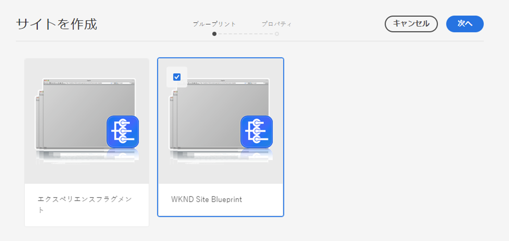
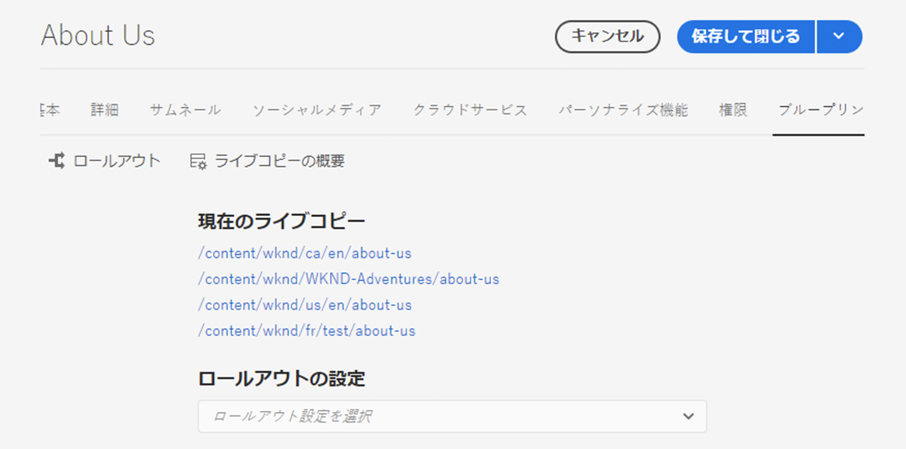
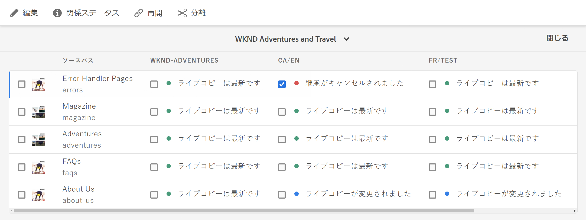

# ライブコピーの作成と同期 {#creating-and-synchronizing-live-copies}

ページまたはブループリントの設定からライブコピーを作成して、サイト全体でそのコンテンツを再利用できます。 継承と同期を管理すると、コンテンツへの変更の反映方法を制御できます。

## ブループリント設定の管理 {#managing-blueprint-configurations}

ブループリント設定は、1つ以上のライブコピーページのソースとして使用する既存のWebサイトを識別します。

>[!TIP]
>
>Blueprint設定を使用すると、コンテンツの変更をライブコピーにプッシュできます。 [コンテンツの再利用：マルチサイトマネージャーとライブコピー](overview.md#source-blueprints-and-blueprint-configurations)を参照してください。

ブループリント設定を作成するには、ブループリントの内部構造を定義するテンプレートを選択します。デフォルトのブループリントテンプレートでは、ソースの Web サイトに以下の特徴があることを前提としています。

* Web サイトにルートページがある。
* ルートの直接の子ページは、Webサイトの言語ブランチです。ライブコピーを作成する場合、言語はコピーに含めるオプションのコンテンツとして表示されます。
* 各言語ブランチのルートに 1 つ以上の子ページがある。ライブコピーを作成すると、子ページが表示され、ライブコピーに含めることができます。

>[!NOTE]
>
>異なる構造には異なる設計図テンプレートが必要です。

ブループリント設定を作成したら、次のプロパティを設定します。

* **名前**:ブループリント構成の名前
* **ソースパス**:ソースとして使用するサイトのルートページのパス(Blueprint)
* **説明**. （オプション）Blueprint構成の説明。Blueprint構成のリストに表示され、サイトの作成時に選択できます。

設計図の設定を使用する場合、ソース/設計図のライブコピーを同期する方法を決定するロールアウト設定に関連付けることができます。 [使用するロールアウト設定の指定](live-copy-sync-config.md#specifying-the-rollout-configurations-to-use)を参照してください。

### ブループリント設定の作成  {#creating-a-blueprint-configuration}

ブループリント設定を作成するには：

1. **ツール**&#x200B;メニューに[移動](/help/sites-cloud/authoring/getting-started/basic-handling.md#global-navigation)し、**サイト**&#x200B;メニューを選択します。
1. 「**ブループリント**」を選択して、**ブループリント設定**&#x200B;コンソールを開きます。

   

1. 「**作成**」を選択します。
1. ブループリントテンプレートを選択し、「**次へ**」を選択して先に進みます。
1. ブループリントとして使用するソースページを選択し、「**次へ**」を選択して先に進みます。
1. 次の項目を定義します。

   * **タイトル**：ブループリントのタイトル（必須）
   * **説明**：詳細を示す説明（オプション）

1. 「**作成**」を選択すると、指定した内容に基づいてブループリント設定が作成されます。

### ブループリント設定の編集または削除  {#editing-or-deleting-a-blueprint-configuration}

既存のブループリント設定を編集または削除できます。

1. **ツール**&#x200B;メニューに[移動](/help/sites-cloud/authoring/getting-started/basic-handling.md#global-navigation)し、**サイト**&#x200B;メニューを選択します。
1. 「**ブループリント**」を選択して、**ブループリント設定**&#x200B;コンソールを開きます。

   

1. 必要なブループリント設定を選択します。ツールバー上の該当するアクションが使用可能になります。

   * **プロパティ**：設定のプロパティを表示して編集するために使用します。
   * **削除**

## ライブコピーの作成 {#creating-a-live-copy}

ライブコピーを作成する方法はいくつかあります。

### ページのライブコピーの作成 {#creating-a-live-copy-of-a-page}

ページやブランチのライブコピーを作成できます。 ライブコピーを作成する場合、コンテンツの同期に使用するロールアウト設定を指定できます。

* 選択したロールアウトの設定は、ライブコピーページとその子ページに適用されます。
* ロールアウト設定を指定しない場合は、使用するロールアウト設定を MSM が決定します。[使用するロールアウト設定の指定](live-copy-sync-config.md#specifying-the-rollout-configurations-to-use)を参照してください。

任意のページのライブコピーを作成できます。

* [ブループリント構成](#creating-a-blueprint-configuration)で参照されるページ
* 設定に接続していないページ
* 別のライブコピーのページ内のライブコピー（[ネストされたライブコピー](overview.md#nested-live-copies)）

唯一の違いは、ソースページやブループリントページの&#x200B;**ロールアウト**&#x200B;コマンドの使用可否が、ソースがブループリント設定によって参照されているかどうかで決まります。

* **がBluePrint設定で**&#x200B;参照されているソースページからライブコピーを作成する場合、[ロールアウト]コマンドは、source/blueprintページで使用できます。
* Live Copyを、BluePrint設定で&#x200B;**参照されていない**&#x200B;ソースページから作成した場合、Rolloutコマンドは、Source/BluePrintページでは使用できません。

ライブコピーを作成するには：

1. **サイト**&#x200B;コンソールで「**作成**」、「**ライブコピー**」の順に選択します。

   

1. ソースページを選択して、「**次へ**」をクリックまたはタップします。次に例を示します。

   

1. ライブコピーのコピー先のパスを指定し（ライブコピーの親フォルダーまたはページを開く）、「**次へ**」をクリックまたはタップします。

   

   >[!NOTE]
   >
   >宛先のパスをソースパスに含めることはできません。

1. 次の項目を入力します。

   * ページの&#x200B;**タイトル**。
   * URL で使用される&#x200B;**名前**。

   

1. 「**サブページを除外**」チェックボックスを次のように使用します。

   * 選択済み：選択したページのみのライブコピーを作成する（浅いライブコピー）
   * 未選択：選択したページのすべての子孫を含むライブコピーの作成（ディープライブコピー）

1. （オプション）ライブコピーに使用する1つ以上のロールアウト設定を指定するには、**ロールアウト設定**&#x200B;ドロップダウンリストを使用して選択します。 選択した設定がドロップダウンセレクターの下に表示されます。
1. 「**作成**」をクリックまたはタップします。確認メッセージが表示されます。ここで「**開く**」または「**完了**」のいずれかを選択します。

### ブループリント設定からのサイトのライブコピーの作成  {#creating-a-live-copy-of-a-site-from-a-blueprint-configuration}

Blueprint設定を使用してLive Copyを作成し、BluePrint（ソース）コンテンツに基づくサイトを作成します。 ブループリント構成からライブコピーを作成する場合、コピーするブループリントソースの1つ以上の言語ブランチを選択し、言語ブランチからコピーするチャプターを選択します。 [Blueprint設定の作成](#creating-a-blueprint-configuration)を参照してください。

ライブコピーから一部の言語の分岐を省略した場合は、後で追加できます。 詳しくは、[ライブコピー内でのライブコピーの作成（Blueprint設定）](#creating-a-live-copy-inside-a-live-copy-blueprint-configuration)を参照してください。

>[!CAUTION]
>
>別の分岐にある段落のターゲットにリンクと参照が含まれているブループリントソースの場合、ターゲットはライブコピーページで更新されず、元の保存先を指したままになります。

サイトを作成する場合は、以下のプロパティに値を指定します。

* **初期言語**:ライブコピーに含めるブループリントソースの言語ブランチ
* **初期チャプター**:BluePrint言語の子ページは、ライブコピーに含める分岐を持ちます
* **宛先パス**:ライブコピーサイトのルートページの場所
* **タイトル**:ライブコピーサイトのルートページのタイトル
* **名前**:（オプション）ライブコピーのルートページを格納するJCRノードの名前（デフォルト値はタイトルに基づきます）
* **サイト所有者**:（オプション）ライブコピーの責任者に関する情報
* **ライブコピー**：ソースサイトとのライブの関係を確立する場合にこのオプションを選択します。このオプションを選択しない場合、ブループリントのコピーは作成されますが、後でソースと同期されることはありません。
* **ロールアウト設定**:（オプション）ライブコピーの同期に使用する1つまたは複数のロールアウト設定を選択します。既定では、ロールアウト設定は設計図から継承されます。詳細については、[使用するロールアウト設定の指定](live-copy-sync-config.md#specifying-the-rollout-configurations-to-use)を参照してください。

設計図構成からサイトのライブコピーを作成するには：

1. **サイト**&#x200B;コンソールで「**作成**」を選択し、ドロップダウンセレクターから「**ライブコピー**」を選択します。
1. ライブコピーのソースとして使用するBluePrint構成を選択し、**次へ**&#x200B;に進みます。

   

1. **初期言語**&#x200B;セレクターを使用して、ライブコピーに使用するブループリントサイトの言語を指定します。

   デフォルトでは、使用可能なすべての言語が選択されます。言語を削除するには、言語の横に表示される **X** をクリックまたはタップします。

   次に例を示します。

   

1. **初期チャプター**&#x200B;ドロップダウンを使用して、ライブコピーに含める青写真のセクションを選択します。 デフォルトでは、使用可能なすべてのチャプターが含まれていますが、削除できます。
1. 残りのプロパティの値を指定して「**作成**」を選択します。確認のダイアログボックスで、「**完了**」を選択して&#x200B;**サイト**&#x200B;コンソールに戻るか、「**サイトを開く**」を選択してサイトのルートページを開きます。

### ライブコピー内でのライブコピーの作成（ブループリント設定）  {#creating-a-live-copy-inside-a-live-copy-blueprint-configuration}

既存のライブコピー（BluePrint設定を使用して作成）内にライブコピーを作成する場合、ライブコピーが最初に作成されたときに含まれなかった任意の言語コピーまたはチャプターを挿入できます。

## ライブコピーの監視 {#monitoring-your-live-copy}

### ライブコピーのステータスの確認 {#seeing-the-status-of-a-live-copy}

ライブコピーページのプロパティは、ライブコピーに関する次の情報を表示します。

* **ソース**:Live Copyページのソースページ
* **ステータス**:ライブコピーがソースの最新の状態か、最後の同期が発生した日時、および同期を実行したユーザーを含む、ライブコピーの同期ステータス。
* **設定**:

   * ページが引き続きライブコピーの継承の対象かどうか
   * 設定が親ページから継承されるかどうか
   * ライブコピーで使用されるロールアウト設定

プロパティを表示するには：

1. **サイト**&#x200B;コンソールで、ライブコピーページを選択し、プロパティを開きます。
1. 「**ライブコピー**」タブを選択します。

   次に例を示します。

   

   詳しくは、Live Copyの概要コンソールの「Using the Live Copy Overview](live-copy-overview.md#using-the-live-copy-overview)」を参照してください。[

### ブループリントページのライブコピーの確認 {#seeing-the-live-copies-of-a-blueprint-page}

Blueprintページ（BluePrint設定で参照）は、現在の(BluePrint)ページをソースとして使用するLive Copyページのリストを提供します。 このリストを使用して、ライブコピーを追跡します。 このリストは[ページプロパティ](/help/sites-cloud/authoring/fundamentals/page-properties.md)の「**ブループリント**」タブに表示されます。

## ライブコピーの同期 {#synchronizing-your-live-copy}

ライブコピーを同期する方法はいくつかあります。

### ブループリントのロールアウト {#rolling-out-a-blueprint}

コンテンツの変更をライブコピーにプッシュするための青写真ページを展開します。 **ロールアウト**&#x200B;アクションでは、「[ロールアウト時](live-copy-sync-config.md#rollout-triggers)」のトリガーを使用するロールアウト設定が実行されます。

>[!NOTE]
>
>同じページ名を持つ新しいページがBlueprintブランチと依存するLive Copyブランチの両方で作成された場合、競合が発生する可能性があります。
>
>このような[競合はロールアウト時に処理および解決](rollout-conflicts.md)する必要があります。

#### ページプロパティからのブループリントのロールアウト  {#rolling-out-a-blueprint-from-page-properties}

1. **サイト**&#x200B;コンソールで、ブループリントのページを選択し、プロパティを開きます。
1. 「**ブループリント**」タブを開きます。
1. 「**ロールアウト**」を選択します。

   

1. ページとサブページを指定し、次にチェックマークを付けて確認します。

   

1. ロールアウトジョブを直ちに実行するか（**今すぐ**）、別の日時に実行するか（**後で**）を指定します。

   

ロールアウトは非同期ジョブとして処理され、[***非同期ジョブの状態**&#x200B;ページでチェックできます。](/help/operations/asynchronous-jobs.md#monitor-the-status-of-asynchronous-operations)

#### 参照レールからのブループリントのロールアウト {#roll-out-a-blueprint-from-the-reference-rail}

1. **サイト**&#x200B;コンソールで、ライブコピーのページを選択し、**[参照](/help/sites-cloud/authoring/getting-started/basic-handling.md#references)**&#x200B;パネルを開きます（ツールバーから）。
1. リストから「**ブループリント**」オプションを選択し、このページに関連付けられているブループリントを表示します。
1. リストから必要なブループリントを選択します。
1. 「**ロールアウト**」をクリックまたはタップします。

   

1. ロールアウトについて、次の詳細の確認が求められます。

   * **スコープをロールアウト**:

      範囲を選択したページのみに適用するか、サブページを含めるかを指定します。

   * **スケジュール**：

      ロールアウトジョブをすぐに実行するか（**今すぐ**）、または後日実行するか（**後で**）を指定します。

      

1. これらの詳細を確認したら、「**ロールアウト**」を選択してアクションを実行します。

ロールアウトは非同期ジョブとして処理され、[**非同期ジョブステータス**&#x200B;ページでチェックできます。](/help/operations/asynchronous-jobs.md#monitor-the-status-of-asynchronous-operations)

#### ライブコピーの概要からのブループリントのロールアウト {#roll-out-a-blueprint-from-the-live-copy-overview}

ライブコピーの概要では、ブループリントページを選択して、[****&#x200B;ロールアウトアクションを実行することもできます](live-copy-overview.md#using-the-live-copy-overview)。

1. [ライブコピーの概要](live-copy-overview.md#using-the-live-copy-overview)を開き、ブループリントページを選択します。
1. ツールバーの「**ロールアウト**」を選択します。

   

1. ページとサブページを指定し、次にチェックマークを付けて確認します。

   

1. ロールアウトジョブを直ちに実行するか（**今すぐ**）、別の日時に実行するか（**後で**）を指定します。

   

ロールアウトは非同期ジョブとして処理され、[**非同期ジョブステータス**&#x200B;ページでチェックできます。](/help/operations/asynchronous-jobs.md#monitor-the-status-of-asynchronous-operations)

### ライブコピーの同期 {#synchronizing-a-live-copy}

Live Copyページを同期して、ソースからLive Copyに変更内容を引き出します。

#### ページプロパティからのライブコピーの同期 {#synchronize-a-live-copy-from-page-properties}

ライブ・コピーを同期して、ソースからライブ・コピーに変更を引き出します。

>[!NOTE]
>
>同期では、「[ロールアウト時](live-copy-sync-config.md#rollout-triggers)」のトリガーを使用するロールアウト設定が実行されます。

1. **サイト**&#x200B;コンソールで、ライブコピーページを選択し、プロパティを開きます。
1. 「**ライブコピー**」タブを開きます。
1. 「**同期**」をクリックまたはタップします。

   

   確認が求められます。「**同期**」を使用して先に進みます。

#### ライブコピーの概要からのライブコピーの同期  {#synchronize-a-live-copy-from-the-live-copy-overview}

ライブコピーの概要では、ライブコピーページを選択して、[同期アクションを実行することもできます](live-copy-overview.md#using-the-live-copy-overview)。

1. [ライブコピーの概要](live-copy-overview.md#using-the-live-copy-overview)を開き、ライブコピーページを選択します。
1. ツールバーの「**同期**」を選択します。
1. 含めるかどうかを指定した後、ダイアログで&#x200B;**ロールアウト**&#x200B;操作を確認します。

   * **ページとサブページ**
   * **ページのみ**

   

## ライブコピーのコンテンツの変更 {#changing-live-copy-content}

ライブコピーのコンテンツを変更するには、次の操作を行います。

* 追加段落を設定します。
* ページまたはコンポーネントのライブコピーの継承を無効にして、既存のコンテンツを更新します。

>[!TIP]
>
>ライブコピーで新しいページを手動で作成した場合、新しいページはライブコピーに対してローカルになります。つまり、新しいページには、対応するソースページが割り当てられていません。
>
>関係の一部となるローカルページを作成する場合のベストプラクティスは、ソース内にローカルページを作成し、詳細なロールアウトを実行することです。 これにより、ページはライブコピーとしてローカルに作成されます。

>[!NOTE]
>
>同じページ名を持つ新しいページがBlueprintブランチと依存するLive Copyブランチの両方で作成された場合、競合が発生する可能性があります。
>
>このような[競合はロールアウト時に処理および解決](rollout-conflicts.md)する必要があります。

### ライブコピーページへのコンポーネントの追加  {#adding-components-to-a-live-copy-page}

コンポーネントは、いつでもライブコピーページに追加できます。 ライブコピーとその段落システムの継承ステータスによって、コンポーネントの追加機能が制御されません。

ライブコピーページがソースページと同期されると、追加されたコンポーネントは変更されません。 「[ライブコピーページのコンポーネント順序の変更」も参照してください。](#changing-the-order-of-components-on-a-live-copy-page)

>[!TIP]
>
>コンテナとしてマークされたコンポーネントへのローカルでの変更は、ロールアウト上のブループリントのコンテンツによって上書きされません。詳しくは、[MSM のベストプラクティス](best-practices.md#components-and-container-synchronization)を参照してください。

### ページの継承の休止 {#suspending-inheritance-for-a-page}

ライブコピーを作成する場合、ライブコピーの設定はコピーされたページのルートページに保存されます。ルートページのすべての子ページは、ライブコピーの設定を継承します。 ライブコピーページのコンポーネントもライブコピーの設定を継承します。

ライブコピーページのライブコピーの継承を中断して、ページのプロパティやコンポーネントを変更できるようにすることができます。 継承を休止すると、ページプロパティとコンポーネントがソースと同期されなくなります。

>[!TIP]
>
>また、Live Copy](#detaching-a-live-copy)を設計図から[デタッチして、すべての接続を削除することもできます。 継承の中断とは異なり、デタッチ操作は恒久的で非可逆的です。

#### ページプロパティからの継承の休止 {#suspending-inheritance-from-page-properties}

ページの継承を休止するには：

1. **サイト**&#x200B;コンソールの&#x200B;**表示のプロパティ**&#x200B;コマンドを使用するか、ページツールバーの&#x200B;**ページ情報**&#x200B;を使用して、ライブコピーページのプロパティを開きます。
1. 「**ライブコピー**」タブをクリックまたはタップします。
1. ツールバーの「**休止**」を選択します。その後、次のいずれかを選択します。

   * **休止**:を指定します。
   * **子で休止**:をクリックすると、現在のページが子ページと共に停止します。

1. 確認ダイアログの「**休止**」を選択します。

#### ライブコピーの概要からの継承の休止 {#suspending-inheritance-from-the-live-copy-overview}

ライブコピーの概要では、ライブコピーページを選択して、[休止アクションを実行することもできます](live-copy-overview.md#using-the-live-copy-overview)。

1. [ライブコピーの概要](live-copy-overview.md#using-the-live-copy-overview)を開き、ライブコピーページを選択します。
1. ツールバーの「**休止**」を選択します。
1. 次のいずれかから適切なオプションを選択します。

   * **休止**
   * **子ページも休止**

   

1. **ライブコピーを中断**&#x200B;ダイアログで、**中断**&#x200B;操作を確認します。

   

### ページの継承の再開 {#resuming-inheritance-for-a-page}

ページのライブコピーの継承を一時的に停止する操作です。 休止すると、ライブ関係を元に戻すための&#x200B;**再開**&#x200B;アクションが使用可能になります。

継承を再度有効にしても、ページはソースと自動的には同期されません。必要に応じて、次のいずれかの方法で同期を要求できます。

* 次に示すような&#x200B;**再開**／**元に戻す**&#x200B;ダイアログを使用します。

   

* 後の段階で同期アクションを手動で選択します。

>[!NOTE]
>
>継承を再度有効にしても、ページはソースと自動的には同期されません。これが必要な場合は、再開時または後で手動で同期をリクエストできます。

#### ページプロパティからの継承の再開 {#resuming-inheritance-from-page-properties}

[休止](#suspending-inheritance-from-page-properties)すると、ページプロパティのツールバーで&#x200B;**再開**&#x200B;アクションが使用可能になります。

これを選択すると、ダイアログが表示されます。必要に応じて、同期を選択し、操作を確認できます。

#### ライブコピーの概要からのライブコピーページの再開 {#resume-a-live-copy-page-from-the-live-copy-overview}

[ライブコピーの概要では、ライブコピーページを選択して、再開アクションを実行することもできます](live-copy-overview.md#using-the-live-copy-overview)。

1. [ライブコピーの概要](live-copy-overview.md#using-the-live-copy-overview)を開き、中断されたライブコピーページを選択します。 ページは&#x200B;**INHERITANCE CANCELLED**&#x200B;と表示されます。
1. ツールバーの「**再開**」を選択します。
1. 継承を元に戻した後にページを同期するかどうかを指定し、**ライブコピーの再開**&#x200B;ダイアログで「**再開**」操作を確認します。

### 継承深度の変更（浅い/深い） {#changing-inheritance-depth-shallow-deep}

既存のライブコピーでは、ページの深さ（子ページを含めるかどうか）を変更できます。

* シャロー・ライブ・コピーに切り替える：

   * 効果は即座に現れ、元に戻すことはできません。

   * ライブコピーから子ページを明示的に切り離します。 元に戻した場合、子に対する追加の変更内容は保持されません。

   * ネストされた `LiveRelationships` がある場合でも、下位の `LiveCopies` はすべて削除されます。

* ディープライブコピーに切り替える：

   * 子ページはそのまま残します。
   * 切り替えの影響を確認するには、ロールアウトを実行します。コンテンツに対するすべての変更がロールアウト設定に従って適用されます。

* 浅いライブ・コピーに切り替えてから、ディープに戻る：

   * （以前の）浅いライブコピーのすべての子を、手動で作成されたかのように扱い、`[oldname]_msm_moved name`を使って移動します。

深度を指定または変更するには：

1. **サイト**&#x200B;コンソールの&#x200B;**表示のプロパティ**&#x200B;コマンドを使用するか、ページツールバーの&#x200B;**ページ情報**&#x200B;を使用して、ライブコピーページのプロパティを開きます。
1. 「**ライブコピー**」タブをクリックまたはタップします。
1. 「**設定**」セクションで、子ページが含まれているかどうかによって、「**ライブコピーの継承**」オプションをオンまたはオフにします。

   * チェック済み — ディープライブコピー（子ページが含まれます）
   * チェック解除済み — 浅いライブコピー（子ページは除外される）

   >[!CAUTION]
   >
   >浅いライブコピーに切り替えると、すぐに有効になり、元に戻すことはできません。
   >
   >詳しくは、[ライブコピー - 構成](overview.md#live-copies-composition)を参照してください。

1. 「**保存**」をクリックまたはタップして更新内容を保持します。

### コンポーネントの継承のキャンセル  {#cancelling-inheritance-for-a-component}

コンポーネントがソースコンポーネントと同期されなくなるように、コンポーネントのライブコピーの継承をキャンセルします。 必要な場合は後で継承を有効にすることができます。

>[!NOTE]
>
>継承を再度有効にしても、コンポーネントはソースと自動的には同期されません。必要な場合は、手動で同期をリクエストできます。

継承をキャンセルして、コンポーネントのコンテンツを変更するか、コンポーネントを削除するには：

1. 継承をキャンセルするコンポーネントをクリックまたはタップします。

   

1. コンポーネントツールバーの&#x200B;**継承をキャンセル**&#x200B;アイコンをクリックまたはタップします。

   

1. 継承をキャンセルダイアログボックスで、「**はい**」を使用してアクションを確定します。

   コンポーネントツールバーが更新されて、すべての（該当する）編集コマンドが表示されます。

### コンポーネントの継承の再有効化{#re-enabling-inheritance-for-a-component}

コンポーネントの継承を有効にするには、コンポーネントツールバーの&#x200B;**継承を再有効化**&#x200B;アイコンをクリックまたはタップします。

### ライブコピーページ上のコンポーネントの順序の変更 {#changing-the-order-of-components-on-a-live-copy-page}

ライブコピーに段落システムの一部であるコンポーネントが含まれる場合、その段落システムの継承は次の規則に従います。

* 段落システム内のコンポーネントの順序は、継承が確立していても変更できます。
* ロールアウト時に、コンポーネントの順序はブループリントから復元されます。ロールアウト前に新しいコンポーネントがライブコピーに追加された場合は、追加されたコンポーネントと共に順序が変更されます。
* 段落システムの継承がキャンセルされると、コンポーネントの順序はロールアウト時に復元されず、ライブコピーにそのまま残ります。

>[!NOTE]
>
>段落システムでキャンセルされた継承を元に戻しても、コンポーネントの順序はブループリントから&#x200B;**自動的には復元されません**。必要な場合は、手動で同期をリクエストできます。

段落システムの継承をキャンセルするには、次の手順を実行します。

1. Live Copyページを開きます。
1. 既存のコンポーネントをページの別の場所にドラッグします。
1. **継承をキャンセル**&#x200B;ダイアログボックスで、「**はい**」を使用してアクションを確定します。

### ライブコピーページのプロパティの上書き  {#overriding-properties-of-a-live-copy-page}

ライブコピーページのページプロパティは、デフォルトでソースページから継承され、編集できません。

ライブコピーのプロパティ値を変更する必要がある場合は、プロパティの継承をキャンセルできます。 リンクアイコンは、プロパティの継承が有効なことを示しています。

継承をキャンセルすると、プロパティ値を変更できます。リンク切れアイコンは、継承がキャンセルされたことを示しています。

必要に応じて、プロパティの継承を後から再度有効にすることができます。

>[!NOTE]
>
>継承を再度有効にした場合、Live Copyページのプロパティは、ソースプロパティと自動的に同期されません。 必要な場合は、手動で同期をリクエストできます。

1. Live Copyページのプロパティを開くには、ページツールバーの&#x200B;**サイト**&#x200B;コンソールの&#x200B;**表示のプロパティ**&#x200B;オプションまたは&#x200B;**ページ情報**&#x200B;アイコンを使用します。
1. プロパティの継承をキャンセルするには、プロパティの右側に表示されるリンクアイコンをクリックまたはタップします。

   

1. **継承をキャンセル**&#x200B;確認ダイアログで、「**はい**」をクリックまたはタップします。

### ライブコピーページのプロパティの復帰  {#revert-properties-of-a-live-copy-page}

プロパティの継承を有効にするには、プロパティの横に表示される「**継承を元に戻す**」アイコンをクリックまたはタップします。

### ライブコピーページのリセット {#resetting-a-live-copy-page}

ライブコピーページは次の目的でリセットできます。

* すべての継承のキャンセルが削除され、かつ
* ページをソースページと同じ状態に戻します。

リセットは、ページプロパティ、段落システムおよびコンポーネントに対して行った変更に適用されます。

#### ページプロパティからのライブコピーページのリセット {#reset-a-live-copy-page-from-the-page-properties}

1. **サイト**&#x200B;コンソールで、ライブコピーページを選択し、「**表示のプロパティ**」を選択します。
1. 「**ライブコピー**」タブを開きます。
1. ツールバーの「**リセット**」を選択します。

   

1. **ライブコピーをリセット**&#x200B;ダイアログボックスで、「**リセット**」を選択して確定します。

#### ライブコピーの概要からのライブコピーページのリセット  {#reset-a-live-copy-page-from-the-live-copy-overview}

ライブコピーの概要では、ライブコピーページを選択して、[****&#x200B;リセットアクションを実行することもできます](live-copy-overview.md#using-the-live-copy-overview)。

1. [ライブコピーの概要](live-copy-overview.md#using-the-live-copy-overview)を開き、ライブコピーページを選択します。
1. ツールバーの「**リセット**」を選択します。
1. **ライブコピーをリセット**&#x200B;ダイアログで、**リセット**&#x200B;操作を確認します。

   

## ライブコピーページとブループリントページの比較 {#comparing-a-live-copy-page-with-a-blueprint-page}

加えた変更を追跡するには、**参照**&#x200B;のBlueprintページを表示し、ライブコピーページと比較します。

1. **サイト**&#x200B;コンソールで、[青写真またはライブコピーのページに移動して選択します。](/help/sites-cloud/authoring/getting-started/basic-handling.md#viewing-and-selecting-resources)
1. **[参照](/help/sites-cloud/authoring/getting-started/basic-handling.md#references)**&#x200B;パネルを開き、状況に応じて次のいずれかを選択します。

   * **ブループリント**
   * **ライブコピー**

1. コンテキストに応じて、特定のライブコピーを選択します。次のいずれかを選択します。

   * **ブループリントと比較**
   * **ライブコピーと比較**

   次に例を示します。

   

1. Live CopyページとBluePrintページが並べて開きます。

   比較機能の使用に関する詳細は、[ページの相違](/help/sites-cloud/authoring/features/page-diff.md)を参照してください。

## ライブコピーの分離 {#detaching-a-live-copy}

デタッチアクションは、ライブコピーとそのソース/ブループリントページとの間のライブリレーションシップを完全に削除します。 MSMに関連するすべてのプロパティがライブコピーから削除され、ライブコピーページはスタンドアロンのコピーになります。

>[!CAUTION]
>
>ライブコピーをデタッチした後は、ライブリレーションシップを元に戻すことはできません。
>
>後で元に戻すオプションを使用してライブリレーションシップを削除するには、そのページのライブコピーの継承](#suspending-inheritance-for-a-page)を[キャンセルします。

ツリー内で&#x200B;**分離**&#x200B;を使用する場所によって異なる処理がおこなわれます。

* **ライブコピーのルートページでのデタッチ**

   この操作をライブコピーのルートページで実行すると、ブループリントのすべてのページとライブコピーの間のライブ関係が削除されます。

   設計図&#x200B;**のページに対するさらなる変更は、ライブコピーには影響しません。**

* **ライブコピーのサブページでデタッチする**

   この操作がライブコピー内のサブページ（またはブランチ）で実行された場合：

   * そのサブページ（またはブランチ）のライブリレーションシップが削除され、
   * ライブコピーブランチの（サブ）ページは、手動で作成されたものと同じように扱われます。

   ただし、サブページは引き続き親ブランチのライブ関係の対象であり、ブループリントページの今後のロールアウトでは、次のように処理されます。

   1. 分離されたページの名前が変更されます。

      * これは、MSMが、作成しようとするライブコピーページと同じ名前を持つのと同じ名前を持つ場合に、ページを手動で作成したものと見なすためです。
   1. 元の名前で新しいLive Copyページを作成します。このページにはロールアウトの変更が含まれます。

   >[!NOTE]
   >
   >このような状況について詳しくは、[MSM ロールアウトの競合](rollout-conflicts.md)を参照してください。

### ページプロパティからのライブコピーページの分離 {#detach-a-live-copy-page-from-the-page-properties}

ライブコピーをデタッチするには：

1. **サイト**&#x200B;コンソールで、ライブコピーページを選択し、「**表示のプロパティ**」をクリックまたはタップします。
1. 「**ライブコピー**」タブを開きます。
1. ツールバーで、「**分離**」を選択します。

   ![[デタッチ]ボタン](../assets/detach-button.png)

1. 確認ダイアログが表示されたら、「**分離**」を選択してアクションを完了します。

### ライブコピーの概要からのライブコピーページの分離  {#detach-a-live-copy-page-from-the-live-copy-overview}

ライブコピーの概要では、ライブコピーページを選択して、[分離アクションを実行することもできます](live-copy-overview.md#using-the-live-copy-overview)。

1. [ライブコピーの概要](live-copy-overview.md#using-the-live-copy-overview)を開き、ライブコピーページを選択します。
1. ツールバーの「**分離**」を選択します。
1. **ライブコピーをデタッチ**&#x200B;ダイアログで、**デタッチ**&#x200B;操作を確認します。

   
