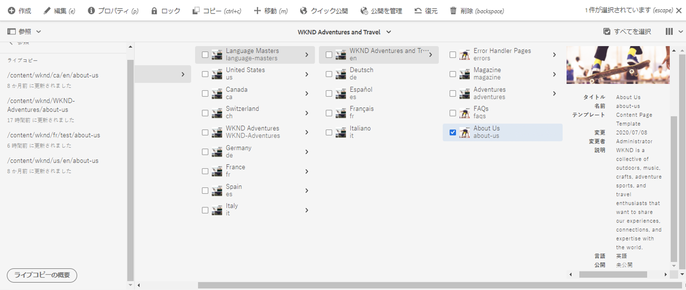
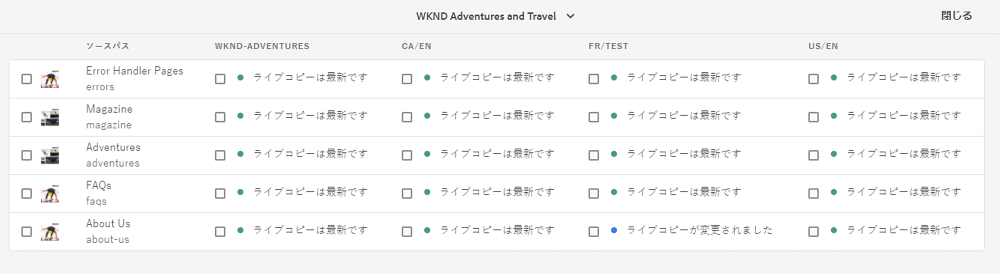
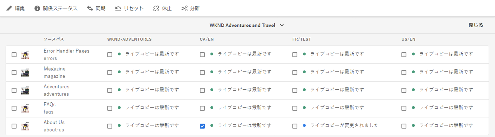
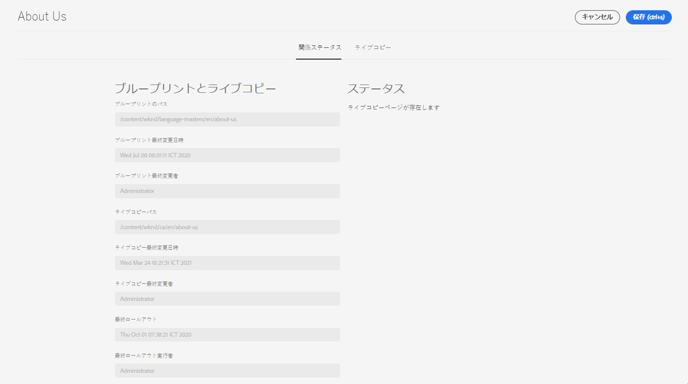
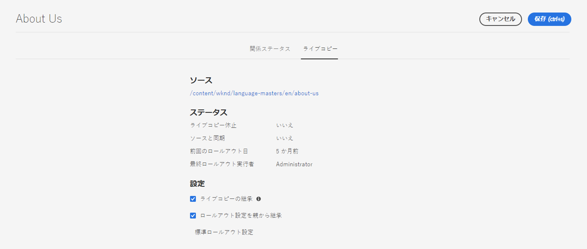

# ライブコピーの概要コンソール {#live-copy-overview-console}

**ライブコピーの概要**&#x200B;コンソールでは、次のことが可能です。

* サイト全体での継承の表示／管理：
   * ブループリントツリーと対応するライブコピー構造、およびそれらの継承ステータスの表示
   * 継承ステータスの変更（休止や再開など）
   * ブループリントおよびライブコピーのプロパティの表示
* ロールアウトアクションの実行.

## ライブコピーの概要を開く {#opening-the-live-copy-overview}

ライブコピーの概要は、以下から開くことができます。

* [ブループリントページの参照サイドパネル（Sites コンソール）](#opening-live-copy-overview-references-for-a-blueprint-page)
* [ブループリントページのプロパティ](#opening-live-copy-overview-properties-of-a-blueprint-page)

### ブループリントページへの参照 {#references-to-a-blueprint-page}

「**ライブコピーの概要**」は、**Sites** コンソールの&#x200B;**参照**&#x200B;サイドパネルから開くことができます。

1. **Sites** コンソールで、[ブループリントページに移動して選択します。](/help/sites-cloud/authoring/getting-started/basic-handling.md#viewing-and-selecting-resources)
1. **[参照](/help/sites-cloud/authoring/getting-started/basic-handling.md#references)**&#x200B;パネルを開き、「**ライブコピー**」を選択します。

   

   >[!TIP]
   >
   >また、先に参照を開いてからブループリントを選択することもできます。

1. 「**ライブコピーの概要**」を選択して、選択したブループリントに関連するすべてのライブコピーの概要を表示および使用します。
1. 「**閉じる**」を使用して終了し、**Sites** コンソールに戻ります。

### ブループリントページのプロパティ {#properties-of-a-blueprint-page}

**ライブコピーの概要**&#x200B;は、ブループリントページのプロパティを表示しているときに開くことができます。

1. 該当するブループリントページの&#x200B;**プロパティ**&#x200B;を開きます。
1. 「**ブループリント**」タブを開きます。「**ライブコピーの概要**」オプションが上部のツールバーに表示されます。

   

1. 「**ライブコピーの概要**」を選択して、現在のブループリントに関連するすべてのライブコピーの概要を表示および使用します。

1. 「**閉じる**」を使用して終了し、**Sites** コンソールに戻ります。

## ライブコピーの概要の使用 {#using-the-live-copy-overview}

**ライブコピーの概要**&#x200B;ウィンドウには、選択したページに関連するライブコピーのステータスと概要が表示されます。

ロールアウトは、特定のロールアウト設定で定義された同期アクションに依存します。一部のアクションは、コンテンツの変更に依存します。ただし、コンテンツの変更に依存はしないが、ページのアクティベーションなどのイベントに依存するアクションも多数あります。このようなイベントでは、コンテンツは変更されませんが、コンテンツに関連する内部プロパティは変更されます。

ステータスフィールドも、特定のロールアウト設定で定義された同期アクションに依存し、最後に成功したロールアウト以降にブループリントまたはライブコピーに対してそれらのアクションが行われたかどうかを示します。ステータスフィールドには、特定のロールアウト設定内のアクションのみが反映されます。ライブコピーでロールアウトが成功しなかった場合は、ステータスは常に最新になります。

例えば、ロールアウト設定は `targetActivate` と定義されます。したがって、ロールアウトはアクティベーションのイベントにのみ依存します。ステータスフィールドは、最後に成功したロールアウト以降にアクティベーションイベントが発生したかどうかのみを示します。

**ライブコピーの概要**&#x200B;を使用して、ライブコピーに対するアクションを実行することもできます。

1. **ライブコピーの概要**&#x200B;を開きます。
1. 必要なブループリントページまたはライブコピーページを選択します。ツールバーが更新され、使用できるアクションが表示されます。使用できる[アクション](overview.md#terms-used)は、[ブループリント](#actions-for-a-blueprint-page)ページと[ライブコピー](#actions-for-a-live-copy-page)ページのどちらを選択したかによって異なります。

### ブループリントページのアクション {#actions-for-a-blueprint-page}

ブループリントページを選択した場合は、以下のアクションを使用できます。

* **編集**：ブループリントページを編集用に開きます。
* **[ロールアウト](overview.md#rollout-and-synchronize)**：ロールアウトを実行して、ソースからライブコピーコピーに変更をプッシュします。

### ライブコピーページのアクション {#actions-for-a-live-copy-page}

ライブコピーページを選択した場合は、以下のアクションを使用できます。

* **編集**：ライブコピーページを編集用に開きます。
* **[関係ステータス](#relationship-status)**：ステータスおよび継承に関する情報を表示します。
* **[同期](overview.md#rollout-and-synchronize)**：ライブコピーを同期して、ソースからライブコピー同期に変更をプルします。
* **[リセット](creating-live-copies.md#resetting-a-live-copy-page)**：ライブコピーページをリセットしてすべての継承のキャンセルを削除し、ソースページと同じ状態に戻します。
* **[休止](overview.md#suspending-and-cancelling-inheritance-and-synchronization)**：ライブコピーとそのブループリントページの間のライブ関係を一時的にアクティベート解除します。
* **[再開](creating-live-copies.md#resuming-inheritance-for-a-page)**：再開すると、休止状態の関係を復帰できます。
* **[分離](overview.md#detaching-a-live-copy)**：ライブコピーとブループリントページのライブ関係を完全に削除します。

## 関係ステータス {#relationship-status}

**関係ステータス**&#x200B;コンソールには、様々な機能を提供する 2 つのタブがあります。

* [関係ステータス](#relationship-status-tab)
* [ライブコピー](#live-copy-tab)

### 関係ステータス {#relationship-status-tab}

このタブには、ブループリントとライブコピーの間の関係のステータスに関する詳細情報が表示されます。

### ライブコピー {#live-copy-tab}

このタブでは、ライブコピー設定を表示および編集できます。

