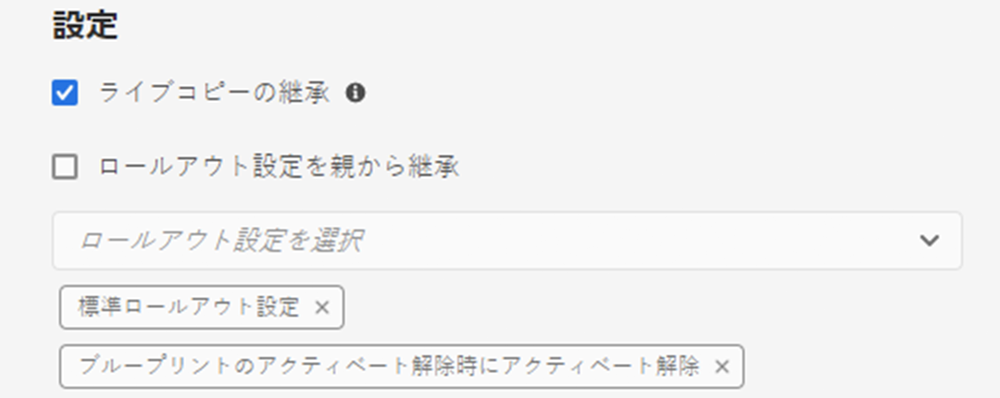

# ライブコピーの同期の設定  {#configuring-live-copy-synchronization}

Adobe Experience Manager には、すぐに使用できる複数の同期設定が用意されています。ライブコピーを使用する前に、次の事項を考慮して、ライブコピーをソースコンテンツと同期させる方法とタイミングを定義しておいてください。

1. 既存のロールアウト設定が要件を満たしているかどうかを判断します。
1. 既存のロールアウト設定が要件を満たしていない場合は、独自のロールアウト設定を作成する必要があるかどうかを判断します。
1. ライブコピーに使用するロールアウト設定を指定します。

## インストールされるロールアウト設定とカスタムロールアウト設定 {#installed-and-custom-rollout-configurations}

この節では、インストールされるロールアウト設定、それらの設定で使用する同期アクションおよびカスタム設定の作成方法（必要な場合）に関する情報を示します。

>[!CAUTION]
>
>あらかじめ用意されているロールアウト設定を更新または変更することは&#x200B;**お勧めしません**。カスタムのライブアクションが必要な場合は、カスタムロールアウトの設定で追加してください。

### ロールアウトトリガー {#rollout-triggers}

各ロールアウト設定では、ロールアウトトリガーを使用してロールアウトを発生させます。ロールアウト設定では、以下のいずれかのトリガーを使用できます。

* **ロールアウト時**：**ロールアウト**&#x200B;コマンドがブループリントページで使用されます。または&#x200B;**同期**&#x200B;コマンドがライブコピーページで使用されます。
* **変更時**：ソースページが変更されます。
* **アクティベート時**：ソースページがアクティベートされます。
* **アクティベート解除時**：ソースページがアクティベート解除されます。

>[!NOTE]
>
>**変更時**&#x200B;トリガーを使用すると、パフォーマンスに影響を及ぼす可能性があります。詳しくは、[MSM のベストプラクティス](best-practices.md#onmodify)を参照してください。

### ロールアウト設定 {#rollout-configurations}

AEM に標準で用意されているロールアウト設定の一覧を次の表に示します。表には各ロールアウト設定のトリガーと同期アクションが含まれます。

インストールされたロールアウト設定のアクションが要件を満たさない場合は、[ロールアウト設定を作成](#creating-a-rollout-configuration)できます。

| 名前 | 説明 | トリガー | [同期アクション](#synchronization-actions) |
|---|---|---|---|
| 標準ロールアウト設定 | ロールアウトトリガーでロールアウトプロセスを開始するのを許可したり、アクション（コンテンツの作成、更新、削除や子ノードの整理）を実行したりする標準のロールアウト設定です。 | ロールアウト時 | `contentUpdate` `contentCopy` `contentDelete` `referencesUpdate` `productUpdate` `orderChildren` |
| ブループリントのアクティベート時にアクティベート | ソースが公開されたときにライブコピーを公開します。 | アクティベート時 | `targetActivate` |
| ブループリントのアクティベート解除時にアクティベート解除 | ソースがアクティベート解除されたときにライブコピーをアクティベート解除します。 | アクティベート解除時 | `targetDeactivate` |
| 変更時にプッシュ | ソースが変更されたときに、ライブコピーにコンテンツをプッシュします。 このロールアウト設定は慎重に使用してください（「変更時」トリガーを使用するので）。 | 変更時 | `contentUpdate` `contentCopy` `contentDelete` `referencesUpdate` `orderChildren` |
| 変更時にプッシュ（シャロー） | ブループリントページが変更された場合に、参照を更新せずにコンテンツをライブコピーにプッシュします（シャローコピーの場合など）。 このロールアウト設定は、変更時トリガーを使用するため、慎重に使用してください。 | 変更時 | `contentUpdate` `contentCopy` `contentDelete` `orderChildren` |
| ローンチを昇格 | ローンチページを昇格するための標準ロールアウト設定です。 | ロールアウト時 | `contentUpdate` `contentCopy` `contentDelete` `referencesUpdate` `orderChildren` `markLiveRelationship` |

### 同期アクション {#synchronization-actions}

AEM で標準として用意されている同期アクションの一覧を次の表に示します。

インストールされているアクションが要件を満たさない場合は、[新しい同期アクションを作成](/help/implementing/developing/extending/msm.md#creating-a-new-synchronization-action)できます。

| アクション名 | 説明 | プロパティ |
|---|---|---|
| `contentCopy` | ソースのノードがライブコピーに存在しない場合は、ライブコピーにノードをコピーします。[**CQ MSM Content Copy Action** サービスを設定](#excluding-properties-and-node-types-from-synchronization)して、除外するノードタイプ、段落項目、ページプロパティを指定してください。 |  |
| `contentDelete` | ソースに存在しないライブコピーのノードを削除します。[**CQ MSM Content Delete Action** サービスを設定](#excluding-properties-and-node-types-from-synchronization)して、除外するノードタイプ、段落項目、ページプロパティを指定してください。 |  |
| `contentUpdate` | ソースからの変更を使用してライブコピーのコンテンツを更新します。[**CQ MSM Content Update Action** サービスを設定](#excluding-properties-and-node-types-from-synchronization)して、除外するノードタイプ、段落項目、ページプロパティを指定してください。 |  |
| `editProperties` | ライブコピーのプロパティを編集します。編集するプロパティとその値は `editMap` プロパティで指定します。`editMap` プロパティの値は次の形式にしてください。 `[property_name_n]#[current_value]#[new_value]` `current_value` と `new_value` は正規表現で、`n` は増分される整数です。 例えば、`editMap` の値が  `sling:resourceType#/(contentpage`‖`homepage)#/mobilecontentpage,cq:template#/contentpage#/mobilecontentpage`  の場合を考えてみましょう。この場合は、ライブコピーノードのプロパティは次のように編集されます。 `contentpage` または `homepage` に設定されている `sling:resourceType` プロパティは `mobilecontentpage` に設定されます。 `contentpage` に設定されている `cq:template` プロパティは `mobilecontentpage` に設定されます。 | `editMap: (String)` でプロパティ、現在の値、新しい値を指定します。詳しくは、説明を参照してください。 |
| `notify` | ページがロールアウトされたページイベントを送信します。通知を受け取るには、最初にロールアウトイベントを購読する必要があります。 |  |
| `orderChildren` | ブループリントの順序に基づいて、子ノードの順序を決定します。 |  |
| `referencesUpdate` | ライブコピー上の参照を更新します。 ライブコピーページ内のパスのうち、ブループリント内のリソースを指すものを検索します。パスが見つかったら、ライブコピー内の関連リソースを指すようにそのパスを更新します。ブループリント外のターゲットを持つ参照は変更されません。 [**CQ MSM References Update Action** サービスを設定](#excluding-properties-and-node-types-from-synchronization)して、除外するノードタイプ、段落項目、ページプロパティを指定してください。 |  |
| `targetVersion` | ライブコピーのバージョンを作成します。 このアクションは、ロールアウト設定に含まれる唯一の同期アクションである必要があります。 |  |
| `targetActivate` | ライブコピーをアクティベートします。 このアクションは、ロールアウト設定に含まれる唯一の同期アクションである必要があります。 |  |
| `targetDeactivate` | ライブコピーをアクティベート解除します。 このアクションは、ロールアウト設定に含まれる唯一の同期アクションである必要があります。 |  |
| `workflow` | target プロパティで指定されたワークフローを開始し（ページの場合のみ）、ライブコピーをペイロードと見なします。 モデルノードのパスがターゲットパスになります。 | `target: (String)` はワークフローモデルのパスです。 |
| `mandatory` | ライブコピーページ上の複数の ACL の権限を、特定のユーザーグループに対して読み取り専用に設定します。次の ACL が設定されています。 `ActionSet.ACTION_NAME_REMOVE` `ActionSet.ACTION_NAME_SET_PROPERTY` `ActionSet.ACTION_NAME_ACL_MODIFY` このアクションはページにのみ使用してください。 | `target: (String)` は、権限を設定するグループの ID です。 |
| `mandatoryContent` | ライブコピーページ上の複数の ACL の権限を、特定のユーザーグループに対して読み取り専用に設定します。次の ACL が設定されています。 `ActionSet.ACTION_NAME_SET_PROPERTY` `ActionSet.ACTION_NAME_ACL_MODIFY` このアクションはページにのみ使用してください。 | `target: (String)` は、権限を設定するグループの ID です。 |
| `mandatoryStructure` | ライブコピーページ上の `ActionSet.ACTION_NAME_REMOVE` ACL の権限を、特定のユーザーグループに対して読み取り専用に設定します。 このアクションはページにのみ使用してください。 | `target: (String)` は、権限を設定するグループの ID です。 |
| `VersionCopyAction` | ブループリント／ソースページが少なくとも 1 回公開された場合は、公開されたバージョンを使用してライブコピーページを作成します。メモ：このアクションは、公開されたソースページに基づくライブコピーページの作成でのみ使用できます。既存のライブコピーページの更新では使用できません。 |  |
| `PageMoveAction` | `PageMoveAction` は、ページがブループリント内に移動されたときに適用されます。 （関連する）ライブコピーページは、移動前の場所から移動後の場所に、（移動ではなく）コピーされます。 `PageMoveAction` によって、移動前の場所にあるライブコピーページが変更されることはありません。このため、結果のロールアウト設定では、ステータスはブループリントなしのライブ関係になります。 [**CQ MSM Page Move Action** サービスを設定](#excluding-properties-and-node-types-from-synchronization)して、除外するノードタイプ、段落項目およびページプロパティを指定してください。 このアクションは、ロールアウト設定に含まれる唯一の同期アクションである必要があります。 | 参照を更新するには、`prop_referenceUpdate: (Boolean)` を true（デフォルト）に設定します。 |
| `markLiveRelationship` | ローンチで作成されたコンテンツのライブ関係が存在することを示します。 |  |

### ロールアウト設定の作成 {#creating-a-rollout-configuration}

インストールされたロールアウト設定がアプリケーションの要件を満たさない場合は、次の手順を実行して[ロールアウト設定を作成](/help/implementing/developing/extending/msm.md#creating-a-new-rollout-configuration)できます。

1. [ロールアウト設定を作成します。](/help/implementing/developing/extending/msm.md#create-the-rollout-configuration)
1. [ロールアウト設定に同期アクションを追加します](/help/implementing/developing/extending/msm.md#add-synchronization-actions-to-the-rollout-configuration)。

ブループリントまたはライブコピーページでロールアウト設定を指定すると、新しいロールアウト設定を使用できるようになります。

### プロパティとノードタイプの同期からの除外 {#excluding-properties-and-node-types-from-synchronization}

対応する同期アクションをサポートする複数の OSGi サービスを設定して、特定のノードタイプやプロパティに影響を与えないようにすることができます。例えば、AEM の内部機能に関連する多くのプロパティとサブノードは、ライブコピーに含めるべきではありません。コピーする必要があるのは、ページのユーザーに関連するコンテンツだけです。

AEM と連携する場合は、いくつかの方法でこのようなサービスの設定を管理できます。詳細と推奨プラクティスについては、[OSGi の設定](/help/implementing/deploying/configuring-osgi.md)を参照してください。

次の表に、除外するノードを指定できる同期アクションを示します。この表には、Web コンソールを使用して設定する場合のサービスの名前とリポジトリーノードを使用して設定する場合の PID が示されています。

| 同期アクション | Web コンソールでのサービス名 | サービス PID |
|---|---|---|
| `contentCopy` | CQ MSM Content Copy Action | `com.day.cq.wcm.msm.impl.actions.ContentCopyActionFactory` |
| `contentDelete` | CQ MSM Content Delete Action | `com.day.cq.wcm.msm.impl.actions.ContentDeleteActionFactory` |
| `contentUpdate` | CQ MSM Content Update Action | `com.day.cq.wcm.msm.impl.actions.ContentUpdateActionFactory` |
| `PageMoveAction` | CQ MSM Page Move Action | `com.day.cq.wcm.msm.impl.actions.PageMoveActionFactory` |
| `referencesUpdate` | CQ MSM References Update Action | `com.day.cq.wcm.msm.impl.actions.ReferencesUpdateActionFactory` |

次の表は、設定可能なプロパティを示しています。

| Web コンソールのプロパティ | OSGi のプロパティ | 説明 |
|---|---|---|
| Excluded Nodetypes | `cq.wcm.msm.action.excludednodetypes` | 同期アクションから除外するノードタイプに一致する正規表現 |
| Excluded Paragraph Items | `cq.wcm.msm.action.excludedparagraphitems` | 同期アクションから除外する段落項目に一致する正規表現 |
| Excluded Page Properties | `cq.wcm.msm.action.excludedprops` | 同期アクションから除外するページプロパティに一致する正規表現 |
| Ignored Mixin NodeTypes | `cq.wcm.msm.action.ignoredMixin` | 同期アクションから除外する Mixin ノードタイプの名前に一致する正規表現（`contentUpdate` アクションでのみ使用可能） |

#### CQ MSM Content Update Action - 除外 {#cq-msm-content-update-action-exclusions}

いくつかのプロパティとノードタイプは、デフォルトで除外されます。これらは、**除外ページのプロパティ**&#x200B;の **CQ MSM CQ コンテンツ更新アクション**&#x200B;の OSGi 設定で定義されています。

デフォルトでは、次の正規表現に一致するプロパティがロールアウト時に除外されます（更新されません）。

必要に応じて、除外リストを定義する表現を変更できます。

例えば、ロールアウトで考慮される変更にページ&#x200B;**タイトル**&#x200B;を含めるには、除外から `jcr:title` を削除します。正規表現は次のようになります。

`jcr:(?!(title)$).*`

### 参照を更新するための同期の設定 {#configuring-synchronization-for-updating-references}

参照の更新に関連する、対応する同期アクションをサポートする複数の OSGi サービスを設定できます。

AEM と連携する場合は、いくつかの方法でこのようなサービスの設定を管理できます。詳細と推奨プラクティスについては、[OSGi の設定](/help/implementing/deploying/configuring-osgi.md)を参照してください。

次の表は、参照の更新を指定できる同期アクションを示します。この表には、Web コンソールを使用して設定する場合のサービスの名前とリポジトリーノードを使用して設定する場合の PID が示されています。

| Web コンソールのプロパティ | OSGi のプロパティ | 説明 |
|---|---|---|
| ネストされたライブコピー全体での参照を更新 | `cq.wcm.msm.impl.action.referencesupdate.prop_updateNested` | 最上位ライブコピーのブランチ内にあるリソースをターゲットとする参照を置き換えるには、Web コンソールでこのオプションを選択するか、リポジトリー設定を使用してこのブール値プロパティを `true` に設定します。`referencesUpdate` アクションでのみ使用可能です。 |
| Update Referencing Pages | `cq.wcm.msm.impl.actions.pagemove.prop_referenceUpdate` | 元のページを使用する参照を、ライブコピーページを参照するように更新するには、Web コンソールでこのオプションを選択するか、リポジトリー設定を使用してこのブール値プロパティを `true` に設定します。`PageMoveAction` でのみで使用可能です。 |

## 使用するロールアウト設定の指定 {#specifying-the-rollout-configurations-to-use}

MSM を使用すると、通常使用するロールアウト設定のセットを指定できます。必要に応じて、特定のライブコピー用にロールアウト設定を上書きすることもできます。MSM では、使用するロールアウト設定を複数の場所で指定できます。この場所では、特定のライブコピーに設定を適用するかどうかを指定します。

使用するロールアウト設定を指定できる場所を以下に示します。また、ライブコピーに使用するロールアウト設定を MSM がどのように決定するかについても説明します。

* **[ライブコピーページのプロパティ](live-copy-sync-config.md#setting-the-rollout-configurations-for-a-live-copy-page)：** 1 つ以上のロールアウト設定を使用するようにライブコピーページが設定される場合、MSM ではそれらのロールアウト設定を使用します。
* **[ブループリントページのプロパティ](live-copy-sync-config.md#setting-the-rollout-configuration-for-a-blueprint-page)：**&#x200B;ライブコピーがブループリントに基づいており、ライブコピーページがロールアウト設定を使用して設定されない場合は、ブループリントのソースページに関連付けられているロールアウト設定が使用されます。
* **ライブコピーの親ページプロパティ：**&#x200B;ライブコピーページもブループリントのソースページもロールアウト設定を使用して設定されない場合は、ライブコピーページの親ページに適用されるロールアウト設定が使用されます。
* **[システムのデフォルト](live-copy-sync-config.md#setting-the-system-default-rollout-configuration)：**&#x200B;ライブコピーの親ページのロールアウト設定を特定できない場合は、システムのデフォルトのロールアウト設定が使用されます。

例えば、ブループリントで [WKND チュートリアル](/help/implementing/developing/introduction/develop-wknd-tutorial.md)サイトをソースコンテンツとして使用しているとします。サイトはブループリントから作成されます。次のリスト内の各項目では、ロールアウト設定の使用に関する様々なシナリオについて説明します。

* ロールアウト設定を使用するようにブループリントページやライブコピーページは設定されていません。MSM では、すべてのライブコピーページに対してシステムのデフォルトのロールアウト設定が使用されます。
* WKND サイトのルートページが複数のロールアウト設定を使用して設定されている。MSM では、これらのロールアウト設定をすべてのライブコピーページに使用します。
* WKND サイトのルートページが複数のロールアウト設定を使用して設定されており、ライブコピーサイトのルートページが別のロールアウト設定のセットを使用して設定されている。この場合、MSM では、ライブコピーサイトのルートページで設定されたロールアウト設定を使用します。

### ライブコピーページ用のロールアウト設定の指定 {#setting-the-rollout-configurations-for-a-live-copy-page}

ソースページがロールアウトされる場合に使用するロールアウト設定を使用してライブコピーページを設定します。デフォルトでは、子ページは設定を継承します。使用するロールアウト設定を指定する場合は、ライブコピーページがその親から継承する設定を上書きします。

[ライブコピーの作成](creating-live-copies.md#creating-a-live-copy-of-a-page)時に、ライブコピーページ用のロールアウト設定を指定することもできます。

1. **Sites** コンソールを使用してライブコピーページを選択します。
1. ツールバーの「**プロパティ**」を選択します。
1. 「**ライブコピー**」タブを開きます。

   「**設定**」セクションには、ページが継承するロールアウト設定が表示されます。

   

1. 必要に応じて、「**ライブコピーの継承**」フラグを調整します。オンにした場合、ライブコピー設定がすべての子で有効になります。

1. 「**ロールアウト設定を親から継承**」プロパティをオフにして、1 つ以上のロールアウト設定をリストから選択します。

   選択したロールアウト設定がドロップダウンリストの下に表示されます。

   

1. 「**保存して閉じる**」を選択します。

### ブループリントページ用のロールアウト設定の指定 {#setting-the-rollout-configuration-for-a-blueprint-page}

ブループリントページのロールアウト時に使用するロールアウト設定を使用して、ブループリントページを設定します。

ブループリントページの子ページはその設定を継承します。使用するロールアウト設定を指定する場合は、ページがその親から継承する設定を上書きする場合があります。

1. **サイト**&#x200B;コンソールを使用してブループリントのルートページを選択します。
1. ツールバーの「**プロパティ**」を選択します。
1. 「**ブループリント**」タブを開きます。
1. ドロップダウンセレクターを使用して、**ロールアウト設定**&#x200B;を 1 つ以上選択します。
1. 「**保存**」を選択して更新内容を保持します。

### システムのデフォルトのロールアウト設定の指定 {#setting-the-system-default-rollout-configuration}

システムのデフォルトとして使用するロールアウト設定を指定するには、次の OSGi サービスを設定します。

* `com.day.cq.wcm.msm.impl.LiveRelationshipManagerImpl` のサービス PID を持つ **Day CQ WCM Live Relationship Manager**

[Web コンソール](/help/implementing/deploying/configuring-osgi.md#osgi-configuration-with-the-web-console)または[リポジトリーノード](/help/implementing/deploying/configuring-osgi.md#osgi-configuration-in-the-repository)を使用してサービスを設定します。

* Web コンソールの場合、設定するプロパティの名前は **Default rollout config** です。
* リポジトリーノードを使用する場合、設定するプロパティの名前は `liverelationshipmgr.relationsconfig.default` です。

このプロパティの値を、システムのデフォルトとして使用するロールアウト設定のパスに指定します。デフォルト値は `/libs/msm/wcm/rolloutconfigs/default` です。これは&#x200B;**標準のロールアウト設定**&#x200B;です。
