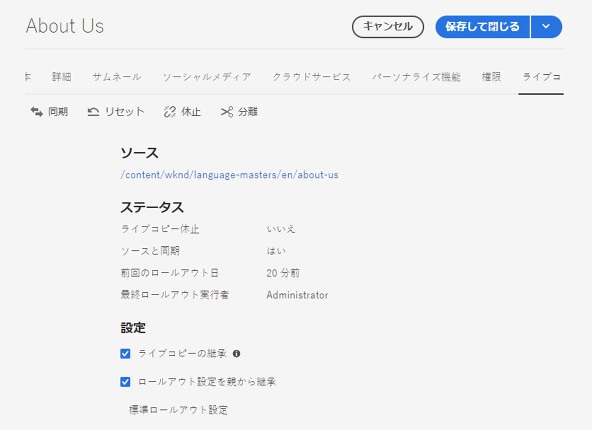

# ライブコピーの同期の設定 {#configuring-live-copy-synchronization}

Adobe Experience Managerでは、すぐに使用できる多数の同期設定を提供しています。 ライブコピーを使用する前に、次の事項を考慮して、ライブコピーがソースコンテンツとどのように、いつ同期されるかを定義する必要があります。

1. 既存のロールアウト設定が要件を満たすかどうかを決定する
1. 既存のロールアウト設定がない場合は、独自のロールアウト設定を作成する必要があるかどうかを決定します。
1. ライブコピーに使用するロールアウト設定を指定します。

## インストールされるロールアウト設定とカスタムロールアウト設定 {#installed-and-custom-rollout-configurations}

ここでは、インストールされるロールアウト設定、それらの設定で使用する同期アクションおよびカスタム設定の作成方法（必要な場合）に関する情報を示します。

>[!CAUTION]
>
>すぐに使用できるロールアウト設定の更新または変更は、**推奨されません**。 カスタムのライブアクションが必要な場合は、カスタムのロールアウト設定に追加する必要があります。

### ロールアウトトリガー {#rollout-triggers}

各ロールアウト設定では、ロールアウトトリガーを使用してロールアウトを発生させます。ロールアウト設定では、以下のいずれかのトリガーを使用できます。

* **ロールアウト時**:青い印刷ページでは **** Rolloutコマンドが使用され、ライブコピーページでは **** Synchronizeコマンドが使用されます。
* **変更時**:ソースページが変更された。
* **アクティベート時**：ソースページがアクティベートされます。
* **アクティベート解除時**：ソースページがアクティベート解除されます。

>[!NOTE]
>
>**変更時**&#x200B;トリガーを使用すると、パフォーマンスに影響を与える可能性があります。 詳しくは、[MSM のベストプラクティス](best-practices.md#onmodify)を参照してください。

### ロールアウト設定 {#rollout-configurations}

次の表に、AEMに付属のロールアウト設定を示します。 表には各ロールアウト設定のトリガーと同期アクションが含まれます。インストールされるロールアウト設定のアクションが要件を満たさない場合は、[新しいロールアウト設定を作成](#creating-a-rollout-configuration)できます。

| 名前 | 説明 | トリガー | [同期アクション](#synchronization-actions) |
|---|---|---|---|
| 標準のロールアウト設定 | ロールアウトトリガー時の開始ロールアウト処理を可能にし、次の操作を実行する標準的なロールアウト設定コンテンツの作成、更新、削除、子ノードの順序付け | ロールアウト時 | `contentUpdate` `contentCopy` `contentDelete` `referencesUpdate` `productUpdate` `orderChildren` |
| ブループリントのアクティベート時にアクティベート | ソースが公開されたときにライブコピーを公開します。 | アクティベート時 | `targetActivate` |
| ブループリントのアクティベート解除時にアクティベート解除 | ソースが非アクティブ化された場合にライブコピーを非アクティブ化 | 非アクティブ化時 | `targetDeactivate` |
| 変更時にプッシュ | ソースが変更されたときにコンテンツをライブコピーにプッシュ このロールアウト設定は、変更時トリガーを使用する場合と同様に慎重に使用します。 | 変更時 | `contentUpdate` `contentCopy` `contentDelete` `referencesUpdate` `orderChildren` |
| 変更時にプッシュ (シャロー) | 参照（浅いコピーなど）を更新せずに、設計図ページが変更されたときにコンテンツをライブコピーにプッシュ このロールアウト設定は、変更時トリガーを使用する場合と同様に慎重に使用します。 | 変更時 | `contentUpdate` `contentCopy` `contentDelete` `orderChildren` |
| ローンチを昇格 | ローンチページを昇格するための標準のロールアウト設定。 | ロールアウト時 | `contentUpdate` `contentCopy` `contentDelete` `referencesUpdate` `orderChildren` `markLiveRelationship` |

### 同期アクション{#synchronization-actions}  

次の表に、AEMですぐに使用できる同期アクションを示します。

<!--If the installed actions do not meet your requirements, you can [Create a New Synchronization Action](/help/sites-developing/extending-msm.md#creating-a-new-synchronization-action).-->

| アクション名 | 説明 | プロパティ |
|---|---|---|
| `contentCopy` | ソースのノードがライブコピーに存在しない場合、このアクションはノードをライブコピーにコピーします。 [除外するノードタイプ、段落項目およびページプロパティを指定するには、 **CQ MSM Content Copy** ](#excluding-properties-and-node-types-from-synchronization) Actionserviceを設定します。 |  |
| `contentDelete` | この操作により、ソースに存在しないライブコピーのノードが削除されます。 [除外するノードタイプ、段落項目およびページプロパティを指定するには、 **CQ MSM Content Delete** ](#excluding-properties-and-node-types-from-synchronization) Actionserviceを設定します。 |  |
| `contentUpdate` | この操作により、ライブコピーのコンテンツがソースの変更内容で更新されます。 [除外するノードタイプ、段落項目およびページプロパティを指定するには、 **CQ MSM Content Update** ](#excluding-properties-and-node-types-from-synchronization) Actionserviceを設定します。 |  |
| `editProperties` | このアクションは、ライブコピーのプロパティを編集します。 `editMap`プロパティは、編集するプロパティとその値を決定します。 `editMap`プロパティの値は、 `[property_name_n]#[current_value]#[new_value]` `current_value`と`new_value`の形式を使用する必要があります。`n`は増分整数です。 例えば、次の値を考えてみま `editMap`しょう： `sling:resourceType#/(contentpage`この値`homepage)#/mobilecontentpage,cq:template#/contentpage#/mobilecontentpage` でLive Copyノードのプロパティを次のように編集します。 次の `sling:resourceType` プロパティは、に設定されるか、に設定される `contentpage`  `homepage`  `mobilecontentpage`かのどちらかです。 に設定される `cq:template` プロパティ `contentpage` で `mobilecontentpage`す。 | `editMap: (String)` プロパティ、現在の値、新しい値を識別します。詳しくは、説明を参照してください。 |
| `notify` | この操作により、ページがロールアウトされたことを示すページイベントが送信されます。 通知が送信されるようにするには、最初にロールアウトイベントを購読する必要があります。 |  |
| `orderChildren` | このアクションは、Blueprintの順序に基づいて子ノードに順序付けられます。 |  |
| `referencesUpdate` | この同期アクションは、ライブコピー上の参照を更新します。 Live Copyページで、設計図内のリソースを指すパスを検索します。見つかると、ライブコピー内の関連リソースを指すパスが更新されます。 ブループリント外のターゲットを持つ参照は変更されません。 [除外するノードタイプ、段落項目、ページプロパティを指定するには、 **CQ MSM References Update** ](#excluding-properties-and-node-types-from-synchronization) Actionserviceを設定します。 |  |
| `targetVersion` | この操作により、ライブコピーのバージョンが作成されます。 このアクションは、ロールアウト設定に含まれる唯一の同期アクションである必要があります。 |  |
| `targetActivate` | この操作により、ライブコピーがアクティブになります。 このアクションは、ロールアウト設定に含まれる唯一の同期アクションである必要があります。 |  |
| `targetDeactivate` | この操作により、ライブコピーが非アクティブになります。 このアクションは、ロールアウト設定に含まれる唯一の同期アクションである必要があります。 |  |
| `workflow` | このアクションは、ターゲットプロパティで定義されたワークフローを開始し（ページのみ）、ライブコピーをペイロードとして使用します。 ターゲットパスは、モデルノードのパスです。 | `target: (String)` は、ワークフローモデルへのパスです。 |
| `mandatory` | この操作により、ライブコピーページの複数のACLの権限が、特定のユーザーグループに対して読み取り専用に設定されます。 次のACLが設定されています： `ActionSet.ACTION_NAME_REMOVE` `ActionSet.ACTION_NAME_SET_PROPERTY` `ActionSet.ACTION_NAME_ACL_MODIFY` このアクションはページに対してのみ使用してください。 | `target: (String)` は、権限を設定する対象のグループのIDです。 |
| `mandatoryContent` | この操作により、ライブコピーページの複数のACLの権限が、特定のユーザーグループに対して読み取り専用に設定されます。 次のACLが設定されています： `ActionSet.ACTION_NAME_SET_PROPERTY` `ActionSet.ACTION_NAME_ACL_MODIFY` このアクションはページに対してのみ使用してください。 | `target: (String)` は、権限を設定する対象のグループのIDです。 |
| `mandatoryStructure` | この操作により、ライブコピーページの`ActionSet.ACTION_NAME_REMOVE` ACLの権限が、特定のユーザーグループに対して読み取り専用に設定されます。 このアクションはページにのみ使用してください。 | `target: (String)` は、権限を設定する対象のグループのIDです。 |
| `VersionCopyAction` | ブループリント/ソースページが少なくとも1回は公開されている場合、この操作により、公開されているバージョンを使用してライブコピーページが作成されます。 注意：このアクションは、発行されたソースページに基づいてLive Copyページを作成する場合にのみ使用でき、既存のLive Copyページを更新する場合には使用できません。 |  |
| `PageMoveAction` | `PageMoveAction`は、ページが設計図内で移動された場合に適用されます。 このアクションによって、（関連する）ライブコピーページが移動前の場所から移動後の場所に移動されるのではなく、コピーされます。 移動前の場所のLive Copyページ `PageMoveAction` は変更されません。したがって、連続したロールアウト設定では、設計図なしのライブリレーションシップのステータスになります。 [**** CQ MSM Page Move Action サービスを設定](#excluding-properties-and-node-types-from-synchronization)して、除外するノードタイプ、段落項目およびページプロパティを指定してください。 このアクションは、ロールアウト設定に含まれる唯一の同期アクションである必要があります。 | `prop_referenceUpdate: (Boolean)`をtrue（デフォルト）に設定して参照を更新します。 |
| `markLiveRelationship` | このアクションは、開始が作成したコンテンツに対してライブの関係が存在することを示します。 |  |

<!--
### Creating a Rollout Configuration {#creating-a-rollout-configuration}

You can [create a rollout configuration](/help/sites-developing/extending-msm.md#creating-a-new-rollout-configuration) when the installed rollout configurations do not meet your application requirements by performing the following steps.

1. [Create the rollout configuration](/help/sites-developing/extending-msm.md#create-the-rollout-configuration).
1. [Add synchronization actions to the rollout configuration](/help/sites-developing/extending-msm.md#add-synchronization-actions-to-the-rollout-configuration).

The new rollout configuration is then available to you when configuring rollout configurations on a blueprint or Live Copy page.
-->

### プロパティとノードタイプの同期からの除外 {#excluding-properties-and-node-types-from-synchronization}

特定のノードタイプおよびプロパティに影響を与えないように、対応する同期操作をサポートする複数のOSGiサービスを設定できます。例えば、AEMの内部機能に関連する多くのプロパティおよびサブノードは、ライブコピーに含めないでください。 ページのユーザーに関連するコンテンツのみをコピーします。

AEM と連携する場合は、いくつかの方法でこのようなサービスの設定を管理できます。詳細および推奨事項については、[OSGi の設定](/help/implementing/deploying/configuring-osgi.md)を参照してください。

以下の表は、除外するノードを指定できる同期アクションを示しています。この表には、Web コンソールを使用して設定する場合のサービスの名前とリポジトリノードを使用して設定する場合の PID が示されています。

| 同期アクション | Web コンソールでのサービス名 | サービス PID |
|---|---|---|
| `contentCopy` | CQ MSM Content Copy Action | `com.day.cq.wcm.msm.impl.actions.ContentCopyActionFactory` |
| `contentDelete` | CQ MSM Content Delete Action | `com.day.cq.wcm.msm.impl.actions.ContentDeleteActionFactory` |
| `contentUpdate` | CQ MSM Content Update Action | `com.day.cq.wcm.msm.impl.actions.ContentUpdateActionFactory` |
| `PageMoveAction` | CQ MSM Page Move Action | `com.day.cq.wcm.msm.impl.actions.PageMoveActionFactory` |
| `referencesUpdate` | CQ MSM References Update Action | `com.day.cq.wcm.msm.impl.actions.ReferencesUpdateActionFactory` |

次の表は、設定可能なプロパティを示しています。

| Web コンソールのプロパティ | OSGi のプロパティ | 説明 |
|---|---|---|
| 除外されるノードの種類 | `cq.wcm.msm.action.excludednodetypes` | 同期アクションから除外されるノードタイプと一致する正規式 |
| Excluded Paragraph Items | `cq.wcm.msm.action.excludedparagraphitems` | 同期アクションから除外される段落項目と一致する正規式 |
| Excluded Page Properties | `cq.wcm.msm.action.excludedprops` | 同期アクションから除外されるページプロパティに一致する正規式 |
| Ignored Mixin NodeTypes | `cq.wcm.msm.action.ignoredMixin` | 同期アクションから除外するmixinノードタイプの名前と一致する正規式（`contentUpdate`アクションでのみ使用可能） |

#### CQ MSM Content Update Action - 除外 {#cq-msm-content-update-action-exclusions}

いくつかのプロパティやノードタイプはデフォルトで除外されています。これらは **CQ MSM Content Update Action** の OSGi の設定の、**Excluded Page Properties** の下に定義されています。

デフォルトでは、次の正規表現に一致するプロパティがロールアウト時に除外されます（更新されません）。

必要に応じて、除外リストを定義する表現を変更できます。

例えば、ロールアウトで考慮される変更にページ&#x200B;**タイトル**&#x200B;を含めるには、除外から `jcr:title` を削除します。正規表現は次のようになります。

`jcr:(?!(title)$).*`

### 参照を更新するための同期の設定 {#configuring-synchronization-for-updating-references}

参照の更新に関連する、対応する同期アクションをサポートする複数の OSGi サービスを設定できます。

AEM と連携する場合は、いくつかの方法でこのようなサービスの設定を管理できます。詳細および推奨事項については、[OSGi の設定](/help/implementing/deploying/configuring-osgi.md)を参照してください。

次の表は、参照の更新を指定できる同期アクションを示します。この表には、Web コンソールを使用して設定する場合のサービスの名前とリポジトリノードを使用して設定する場合の PID が示されています。

| Web コンソールのプロパティ | OSGi のプロパティ | 説明 |
|---|---|---|
| Update Reference across nested LiveCopies | `cq.wcm.msm.impl.action.referencesupdate.prop_updateNested` | Webコンソールでこのオプションを選択するか、リポジトリ設定を使用して、最上位のLive Copyのブランチに含まれるターゲットの参照を置き換えるために、このブール値のプロパティを`true`に設定します。 `referencesUpdate`アクションでのみ使用できます。 |
| Update Referencing Pages | `cq.wcm.msm.impl.actions.pagemove.prop_referenceUpdate` | Webコンソールでこのオプションを選択するか、リポジトリ設定を使用して、Live Copyページを参照する代わりに元のページを使用する参照を更新する場合は、このブール値プロパティを`true`に設定します。 `PageMoveAction`のみで使用できます。 |

## 使用するロールアウト設定の指定 {#specifying-the-rollout-configurations-to-use}

MSMを使用すると、一般的に使用されるロールアウト設定のセットを指定でき、必要に応じて、特定のライブコピーに対してそれらの設定を上書きできます。MSMには、使用するロールアウト設定を指定する場所がいくつか用意されています。場所によって、設定が特定のライブコピーに適用されるかどうかが決まります。

使用するロールアウト設定を指定できる場所のリストを次に示します。ここでは、ライブコピーに使用するロールアウト設定をMSMが決定する方法について説明します。

* **[Live Copyページのプロパティ](live-copy-sync-config.md#setting-the-rollout-configurations-for-a-live-copy-page)** :1つ以上のロールアウト設定を使用するようにLive Copyページが設定されている場合、MSMはそれらのロールアウト設定を使用します。
* **[Blueprintページプロパティ](live-copy-sync-config.md#setting-the-rollout-configuration-for-a-blueprint-page)** ：ライブコピーがBluePrintに基づいており、Live Copyページがロールアウト設定で設定されていない場合、BluePrintソースページに関連付けられているロールアウト設定が使用されます。
* **Live Copyの親ページプロパティ：Live CopyページもBluePrintソースページもロールアウト設定を使用して設定されていない** 場合、Live Copyページの親ページに適用されるロールアウト設定が使用されます。
* **[システムの既定値](live-copy-sync-config.md#setting-the-system-default-rollout-configuration)** ：ライブコピーの親ページのロールアウト設定を決定できない場合は、システムの既定のロールアウト設定が使用されます。

例えば、Blueprintは、[WKNDチュートリアル](/help/implementing/developing/introduction/develop-wknd-tutorial.md)サイトをソースコンテンツとして使用します。 サイトはブループリントから作成されます。次のリスト内の各項目は、ロールアウト設定の使用に関する様々なシナリオを示しています。

* 設計図ページやライブコピーページは、ロールアウト設定を使用するように設定されていません。MSMは、すべてのライブコピーページに対して、システムのデフォルトのロールアウト設定を使用します。
* WKNDサイトのルートページは、いくつかのロールアウト設定で設定します。 MSMは、すべてのライブコピーページに対して、これらのロールアウト設定を使用します。
* WKNDサイトのルートページは複数のロールアウト設定で構成され、ライブコピーサイトのルートページは別のロールアウト設定で構成されます。 MSMは、Live Copyサイトのルートページで設定されたロールアウト設定を使用します。

### ライブコピーページ用のロールアウト設定の指定 {#setting-the-rollout-configurations-for-a-live-copy-page}

ソースページがロールアウトされるときに使用するロールアウト設定を含むLive Copyページを設定します。 子ページは、デフォルトで設定を継承します。使用するロールアウト設定を設定すると、ライブコピーページが親から継承する設定を上書きします。

また、ライブコピー[を作成する際に、ライブコピーページのロールアウト設定を設定することもできます。](creating-live-copies.md#creating-a-live-copy-of-a-page)

1. **サイト**&#x200B;コンソールを使用して、ライブコピーページを選択します。
1. ツールバーの「**プロパティ**」を選択します。
1. 「**ライブコピー**」タブを開きます。

   「**設定**」セクションには、ページが継承するロールアウト設定が表示されます。

   

1. 必要に応じて、「**ライブコピーの継承**」フラグを変更します。オンにすると、ライブコピーの設定がすべての子に対して有効になります。

1. 「**ロールアウト設定を親から継承**」プロパティをオフにして、1 つ以上のロールアウト設定をリストから選択します。

   選択したロールアウト設定がドロップダウンリストの下に表示されます。

   

1. 「**保存して閉じる**」をクリックまたはタップします。

### ブループリントページ用のロールアウト設定の指定 {#setting-the-rollout-configuration-for-a-blueprint-page}

ブループリントページがロールアウトされる場合に使用するロールアウト設定を使用してブループリントページを設定します。

ブループリントページの子ページがその設定を継承します。使用するロールアウト設定を指定する場合は、ページがその親から継承する設定を上書きできます。

1. **サイト**&#x200B;コンソールを使用して、設計図のルートページを選択します。
1. ツールバーの「**プロパティ**」を選択します。
1. 「**ブループリント**」タブを開きます。
1. ドロップダウンセレクターを使用して&#x200B;**ロールアウト設定**&#x200B;を 1 つ以上選択します。
1. 「**保存**」を選択して更新内容を保持します。

### システムのデフォルトのロールアウト設定の指定 {#setting-the-system-default-rollout-configuration}

システムの既定値として使用するロールアウト設定を指定するには、次のOSGiサービスを設定します。

* **Day CQ WCM Live Relationship** Manager with the service PID  `com.day.cq.wcm.msm.impl.LiveRelationshipManagerImpl`

[Webコンソール](/help/implementing/deploying/configuring-osgi.md#osgi-configuration-with-the-web-console)または[リポジトリノード](/help/implementing/deploying/configuring-osgi.md#osgi-configuration-in-the-repository)を使用して、サービスを設定します。

* Webコンソールでは、設定するプロパティの名前は&#x200B;**既定のロールアウト設定**&#x200B;です。
* リポジトリノードを使用して、設定するプロパティの名前は`liverelationshipmgr.relationsconfig.default`です。

このプロパティの値を、システムのデフォルトとして使用するロールアウト設定のパスに指定します。デフォルト値は`/libs/msm/wcm/rolloutconfigs/default`で、**標準ロールアウト設定**&#x200B;です。
