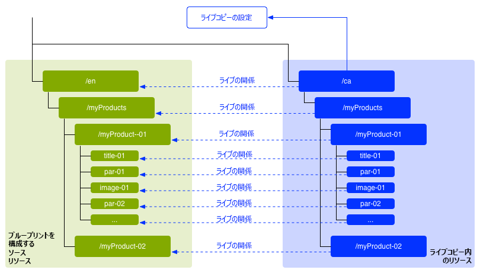
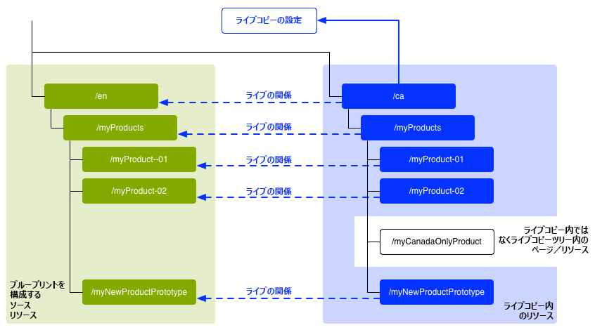
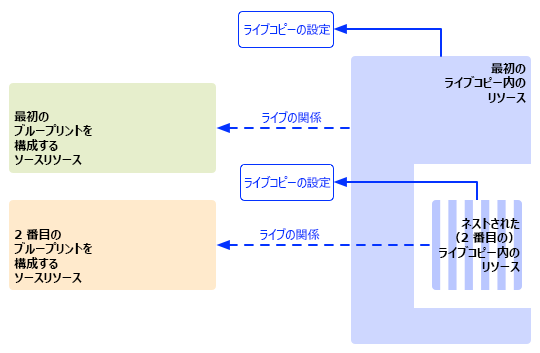
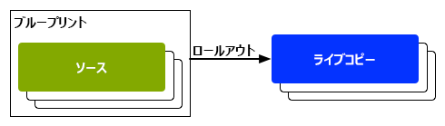
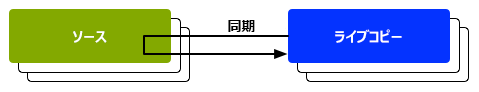

# コンテンツの再利用：マルチサイトマネージャーとライブコピー {#multi-site-manager-and-live-copy}

マルチサイトマネージャー（MSM）を使用すると、同じサイトコンテンツを複数の場所で使用できます。MSM ではライブコピー機能を使用してこれを行います。

* MSM では、次の操作を実行できます。
   * コンテンツを 1 回作成してから
   * （[ライブコピー](#live-copies)を介して）このコンテンツを、同じサイトまたは他のサイトの他の領域で再利用します。
* その後、MSM は次の目的でソースコンテンツとライブコピーの間のライブ関係を維持します。
   * ソースコンテンツを変更すると、ソースコピーとライブコピーが同期されます。
   * 個々のサブページやコンポーネントのライブ関係を解除して、ライブコピーのコンテンツのみを調整できます。

このページでは、MSM でのコンテンツの再利用の概要を説明します。以下のページでは、関連する問題について詳しく説明します。

* [ライブコピーの作成と同期](creating-live-copies.md)
* [ライブコピーの概要コンソール](live-copy-overview.md)
* [ライブコピーの同期の設定](live-copy-sync-config.md)
* [MSM ロールアウトの競合](rollout-conflicts.md)
* [MSM のベストプラクティス](best-practices.md)

>[!NOTE]
>
>MSM は、コンテンツフラグメントを含むアセットにも使用できます。[MSM for Assets を使用したコンテンツフラグメントの再利用](/help/assets/reuse-assets-using-msm.md)（Assets コンソールを介してのみ利用可能）を参照してください。

## 考えられるシナリオ {#possible-scenarios}

MSM およびライブコピーの使用例は多数あります。次のようなシナリオがあります。

* **多国籍企業 - グローバル企業から現地企業へ**

  MSM がサポートする一般的なユースケースは、複数の多国籍の同じ言語サイトでコンテンツを再利用することです。これにより主要なコンテンツは再利用しつつ、国ごとに異なるコンテンツを作成できます。

  例えば、米国の顧客向けには、[サンプルの WKND チュートリアル](/help/implementing/developing/introduction/develop-wknd-tutorial.md)の「英語」セクションが作成されます。このサイト内のコンテンツのほとんどは、国や文化の異なる英語圏の顧客に対応した他の WKND サイトでも使用できます。主要なコンテンツは全サイトで同じになる一方で、地域ごとに調整を加えることができます。

  米国やカナダでは、次の構造を使用できます。`language-masters` ノードが、英語だけでなく他の言語のコンテンツのマスターコピーを保持する仕組みに注意してください。このコンテンツは、英語とともに、地域言語コンテンツを追加する際の基礎として利用できます。

  ```xml
  /content
      |- wknd
          |- language-masters
              |- en
              |- es
              |- fr
          |- us
              |- en
              |- es
          |- ca
              |- en
              |- fr
  ```

  >[!NOTE]
  >
  >MSM はコンテンツを翻訳しません。必要な構造の作成とコンテンツの導入に使用します。
  >
  >
  >そのような例については、[多言語サイトのコンテンツの翻訳](/help/sites-cloud/administering/translation/overview.md)を参照してください。

* **国内 - 本社から地方支社**

  販売網が構築されている企業では、販売特約店によって Web サイトを分けたほうがよい場合があります。この場合、各サイトは本社によって提供される主要なサイトのバリエーションになります。これは、複数の支社を持つ単一の企業や、フランチャイズ本部と国内の複数のフランチャイズ加盟店で構成されるフランチャイズシステムに適してします。

  本社が中核となる情報を提供し、各地方の部門が問い合わせ先の詳細情報、営業時間、イベントなどのローカル情報を追加します。

  ```xml
  /content
      |- head-office-berlin
      |- branch-hamburg
      |- branch-stuttgart
      |- branch-munich
      |- branch-frankfurt
  ```

* **複数のバージョン**

  MSM は、特定のサブブランチのバージョンを作成できます。例えば、サポートサブサイトには、特定の製品の異なるバージョンの詳細を保持できます。基本情報は一定であり、更新された機能のみを変更する必要があります。

  ```xml
  /content
      |- game-support
          |- polybius
              |- v5.0
              |- v4.0
              |- v3.0
              |- v2.0
              |- v1.0
  ```

  >[!TIP]
  >
  >このようなシナリオでは、単純なコピーを作成するか、ライブコピーを使用するかは、以下のバランスを取って決定します。
  >
  >* 複数のバージョンで更新する必要がある中核的コンテンツの割合
  >
  >および
  >
  >* 調整する必要がある個々のコピーの割合

## UI からの MSM {#msm-from-the-ui}

MSM は、該当するコンソールの UI から各種オプションを使用して直接アクセスできます。

* **サイトを作成**（**Sites**）

   * MSM を使用すると、共通コンテンツを共有する複数の Web サイトを管理できます。例えば、Web サイトでは多くの場合、国際的なオーディエンス向けに提供されることが多く、大部分のコンテンツはすべての国に共通で、一部のサブセットが個々の国に特化したものです。MSM を使用すると、[ソースサイトをベースとする複数のサイトを自動的に更新するライブコピーを作成](creating-live-copies.md#creating-a-live-copy-of-a-site-from-a-blueprint-configuration)できます。また、共通の基本構造が適用され、複数サイト全体で共通のコンテンツを使用し、共通のルックアンドフィールが保持されるので、サイト間で実際に異なるコンテンツの管理に注力することができます。次の方法でサイトを作成します。
      * ソースの指定に事前に定義されたブループリント設定が必要です。
      * （事前に定義された）ソースのライブコピーを作成します。
      * 「**ロールアウト**」ボタンを使用してユーザーを指定します。

* **ライブコピーを作成**（**Sites**）

   * MSM を使用すると [Web サイトの個々のページまたはサブブランチのアドホック（1 回限りの）ライブコピーを作成 ](creating-live-copies.md#creating-a-live-copy-of-a-page) できます。 例えば、サブブランチを複製して商品の新しいバージョンや更新されたバージョンに関する情報を提供する場合などです。 次の方法でライブコピーを作成します。
      * アドホックライブコピーを作成します（ブループリント設定は不要）。
      * 任意のページまたはブランチのライブコピーを（即座に）作成できます。
      * **同期**&#x200B;が必要です（**ロールアウト**&#x200B;ボタンは提供されません）。

* **プロパティを表示**（**Sites**）

   * 該当する場合、このオプションを使用すると関連する[ライブコピー](creating-live-copies.md#monitoring-your-live-copy)や&#x200B;**ブループリント**&#x200B;の情報を提供することで、**ライブコピーを監視**&#x200B;するときに役立ちます。

* **参照**（**Sites**）

   * [参照](/help/sites-cloud/authoring/basic-handling.md#references)レールには、**ライブコピー**&#x200B;に関する情報が適切なアクションへのアクセスと共に提供されます。

* **ライブコピーの概要**（**Sites**）

   * このコンソールを使用すると [ ブループリントとそのライブコピーを表示および管理 ](live-copy-overview.md) できます。

* **ブループリント**（**ツール**／**Sites**）

   * このコンソールを使用すると、[ブループリント設定を作成して管理](creating-live-copies.md#creating-a-blueprint-configuration)できます。

>[!NOTE]
>
>MSM はページと[エクスペリエンスフラグメント](/help/sites-cloud/authoring/fragments/experience-fragments.md)の両方で使用できます。これらのフラグメントがエクスペリエンス（ページ）の一部だからです。

>[!NOTE]
>
>MSM 機能の側面は、他の AEM のいくつかの機能（Launch など）で使用されます。この場合、ライブコピーはこの機能によって管理されます。

### 使用されている用語 {#terms-used}

はじめに、MSM で使用される主な用語の概要を次の表に示します。これらの詳細については、以降の節およびページで説明します。

| 用語 | 定義 | 詳細 |
|---|---|---|
| ソース | ライブコピーの基礎として使用される元のページ | ブループリントやブループリントページとも呼ばれます |
| ライブコピー | ロールアウト設定で定義されている通りに同期アクションで維持される（ソースの）コピー |  |
| ライブコピーの設定 | ライブコピーの設定の詳細の定義 |  |
| ライブの関係 | 任意のリソースの継承、つまりソースとライブコピー間接続の実際の定義。 | コピーを使用してソースに対する変更を同期できます |
| ブループリント | ソースと同期 | ブループリント設定で定義できます |
| ブループリント設定 | ソースパスを指定する事前に定義された設定 | ブループリント設定でブループリントページが参照されていると、ロールアウトコマンドを使用できます |
| 第 章 | ライブコピーに含めるブループリントのセクション | 一般に、ルートのサブページです。 |
| 同期化 | （**ロールアウト**&#x200B;と&#x200B;**同期**&#x200B;の両方で）ソースとライブコピーの間のコンテンツの同期を表す汎用的な用語 |  |
| ロールアウト | ソースからライブコピーへの同期 | （ブループリントページの）作成者によって、または（ロールアウト設定で定義された）システムイベントとしてトリガーできます |
| ロールアウト設定 | 同期するプロパティと同期の方法およびタイミングを決定するルール。 |  |
| 同期 | ライブコピーコピーページから作成される、同期の手動リクエスト |  |
| 継承 | 同期が発生すると、ライブコピーのページやコンポーネントはそのソースページやソースコンポーネントからコンテンツを継承します |  |
| 休止 | ライブコピーとそのブループリントページの間のライブ関係を一時的に削除します |  |
| 分離 | ライブコピーとそのブループリントページの間のライブ関係を永続的に削除します |  |
| リセット | ライブコピーページをリセットして、すべての継承のキャンセルを削除し、ソースページと同じ状態にページを戻します。 | リセットは、ページのプロパティ、段落システムおよびコンポーネントに対して行った変更に影響します。 |
| シャロー | 単一のページのライブコピー |  |
| ディープ | ページのライブコピーとその子ページ |  |

>[!TIP]
>
>オブジェクトの名前については、[マルチサイトマネージャーの拡張](/help/implementing/developing/extending/msm.md#overview-of-the-java-api)を参照してください。

## ライブコピー {#live-copies}

MSM のライブコピーは、特定のサイトコンテンツのコピーです。このコピーについては、元のソースとのライブ関係が維持されます。

* ライブコピーはそのソースからコンテンツを継承します。
* ソースに対して変更が加えられると、同期化によってコンテンツが実際に転送されます。
* ライブコピーは、次のいずれかと見なされます。
   * シャロー：単一のページ
   * ディープ：ページとその子ページ
* ロールアウト設定と呼ばれる同期ルールによって、同期するプロパティおよび同期を行うタイミングが決定されます。

前述の例では、`/content/wknd/language-masters/en` は英語のグローバルマスターサイトです。このサイトのコンテンツを再利用するために、MSM のライブコピーが作成されます。

* `/content/wknd/language-masters/en` の下のコンテンツがソースです。
* `/content/wknd/language-masters/en` の下のコンテンツが `/content/wknd/us/en/` および `/content/wknd/ca/en` の各ノードの下にコピーされます。これらがライブコピーです。
* 作成者は、`/content/wknd/language-masters/en` の下のページを変更します。
* トリガーされると、MSM はこれらの変更をライブコピーに同期します。

### ライブコピー - 構成 {#live-copies-composition}

>[!NOTE]
>
>この節の図と説明は、想定されるライブコピーのスナップショットを表しています。これらは包括的ではなく、特徴を説明するための概要を示しています。

ライブコピーを最初に作成すると、選択したソースページが 1:1 の対応でライブコピーに反映されます。その後、新しいリソース（ページまたは段落）をそのライブコピー内に直接作成することもできるので、これらのバリエーションと同期への影響を理解しておくと役に立ちます。使用可能な構成は次のとおりです。

* [ライブコピー以外のページを使用したライブコピー](#live-copy-with-non-live-copy-pages)
* [ネストされたライブコピー](#nested-live-copies)

ライブコピーの基本形式は次のとおりです。

* 選択したソースページが 1:1 の対応で反映されたライブコピーページ。
* 1 つの設定定義。
* すべてのリソースに定義されているライブ関係。
   * ライブコピーのリソースをブループリントやソースにリンクします。
   * 継承およびロールアウトの実現時に使用されます。

変更は要件に従って[同期](creating-live-copies.md#synchronizing-your-live-copy)できます。



#### ライブコピー以外のページを使用したライブコピー {#live-copy-with-non-live-copy-pages}

AEM にライブコピーを作成すると、ライブコピーのブランチを表示して移動できるほか、ライブコピーのブランチで AEM の通常の機能を使用できます。これはつまり、ユーザー（またはプロセス）がライブコピーの中に新しいリソース（ページまたは段落）を作成できることを意味します。例：特定の地域や国向けの製品。

* そのようなリソースにはソースやブループリントのページへのライブ関係がなく、同期されません。
* このシナリオは、MSM が特殊なケースを処理する場合に発生することがあります。例えば、ユーザー（またはプロセス）がソースやブループリントとライブコピーのブランチの両方で同じ位置に同じ名前のページを作成した場合です。そのような状況について詳しくは、[MSM ロールアウトの競合](rollout-conflicts.md)を参照してください。



#### ネストされたライブコピー {#nested-live-copies}

ユーザー（またはプロセス）が[既存のライブコピー内に新しいページ](#live-copy-with-non-live-copy-pages)を作成する場合、この新しいページは別のブループリントのライブコピーとしてセットアップすることもできます。これは、ネストされたライブコピーと呼ばれます。ネストされたライブコピーでは、2 番目（内側）のライブコピーの動作は、以下のような最初（外側）のライブコピーの影響を受けます。

* 最上位のライブコピーに対してトリガーされた詳細なロールアウトは、ネストされたライブコピー内に継続して適用されます。
* ソース間のリンクは、ライブコピー内で書き換えられます。

例えば、2 番目のブループリントから最初のブループリントへのリンクは、ネストされた 2 番目のライブコピーから最初のライブコピーを示すリンクとして書き換えられます。



>[!NOTE]
>
>ライブコピーのブランチ内のページを移動または名前を変更すると、これはネストされたライブコピーとして扱われ、AEM で関係をトラックできるようになります。

#### 積み重ねられたライブコピー {#stacked-live-copies}

ライブコピーは、シャローライブコピーの子として作成された場合、積み重ねられたライブコピーと呼ばれます。これは、[ネストされたライブコピー](#nested-live-copies)と同様に動作します。

### ソース、ブループリントおよびブループリント設定 {#source-blueprints-and-blueprint-configurations}

任意のページまたはページのブランチをライブコピーのソースとして使用できます。ただし、MSM ではソースパスを指定するブループリント設定も定義できます。ブループリント設定を使用する利点は次のとおりです。

* 作成者が設計図上で&#x200B;**ロールアウト**&#x200B;オプションを使用できるようにします。例えば、このブループリントを継承するライブコピーに対して変更を明示的にプッシュする場合。
* 作成者が「**サイトを作成**」を使用できます（これにより、ユーザーが簡単に言語を選択し、ライブコピーの構造を設定できます）。
* ブループリントと関係があるライブコピーのデフォルトのロールアウト設定を定義できます。

ライブコピーのソースは、通常のページまたはブループリント設定に含まれるページのいずれかです。両方とも有効なユースケースです。

ソースはライブコピーのブループリントを構成します。ブループリントは次のいずれかを行うと定義されます。

* [ブループリント設定の作成](creating-live-copies.md#creating-a-blueprint-configuration) - この設定は、ライブコピーを作成するために使用するページを（事前に）定義します。
* [ページのライブコピーの作成](creating-live-copies.md#creating-a-live-copy-of-a-page) - ライブコピー（ソースページ）の作成に使用するページはブループリントページです。ソースページは、ブループリント設定で参照される場合とされない場合があります。

### ロールアウトと同期 {#rollout-and-synchronize}

ロールアウトは、ライブコピーとソースを同期する MSM の重要なアクションです。ロールアウトは手動または自動で実行できます。

* [ロールアウト設定](#rollout-configurations)を定義して、特定の[イベント](live-copy-sync-config.md#rollout-triggers)がルートのロールアウトを自動的に引き起こすように設定できます。
* ブループリントページを作成するときに、**[ロールアウト](creating-live-copies.md#rolling-out-a-blueprint)**&#x200B;コマンドを使用してライブコピーの変更をプッシュできます。
   * **ロールアウト**&#x200B;コマンドは、ブループリント設定によって参照されるブループリントページで使用できます。

  

* ライブコピーページをオーサリングするときに、**[同期](creating-live-copies.md#synchronizing-a-live-copy)**&#x200B;コマンドを使用してソースからライブコピーに変更をプルします。
   * **同期**&#x200B;コマンドは、（ソースやブループリントページブループリント設定に含まれているかどうかに関係なく）ライブコピーページでいつでも使用できます。

  

### ロールアウト設定 {#rollout-configurations}

ロールアウト設定によって、ライブコピーとソースコンテンツの同期のタイミングおよび方法が定義されます。ロールアウト設定は、トリガーと 1 つ以上の同期アクションで構成されます。

* **トリガー** - トリガーは、ライブアクションの同期を発生させるイベント（ソースページのアクティベートなど）です。MSM では、使用可能なトリガーを定義します。
* **同期アクション** - 同期アクションはライブコピーで実行され、ライブコピーとソースを同期します。例えば、コンテンツのコピー、子ノードの並べ替え、ライブコピーページのアクティベートなどです。MSM には複数の同期アクションが用意されています。

>[!NOTE]
>
>Java API を使用してお使いのインスタンスのカスタムアクションを作成できます。

ロールアウト設定は再利用可能なので、複数のライブコピーで同じロールアウト設定を使用できます。標準のインストールにいくつかの[ロールアウト設定](live-copy-sync-config.md#installed-rollout-configurations)が含まれています。

### ロールアウトの競合 {#rollout-conflicts}

特に作成者がソースとライブコピーの両方でコンテンツを編集している場合、ロールアウトは複雑になる場合があります。したがって、AEMがどのように処理するかを把握しておくと便利です [ ロールアウト中に発生する可能性のある競合 ](rollout-conflicts.md)。

### 継承と同期の休止とキャンセル {#suspending-and-cancelling-inheritance-and-synchronization}

ライブコピー内の各ページおよびコンポーネントは、ライブの関係を通じてそのソースページおよびコンポーネントに関連付けられます。ライブ関係は、ソースからライブコピーコンテンツへの同期を設定します。

ライブコピーページのライブコピーの継承を&#x200B;**休止**&#x200B;して、ページのプロパティやコンポーネントを変更できます。継承を休止すると、ページプロパティとコンポーネントがソースと同期されなくなります。

個々のページの編集時に、作成者はコンポーネントの&#x200B;**継承をキャンセル**&#x200B;できます。継承がキャンセルされると、ライブの関係が休止状態になり、そのコンポーネントの同期は行われません。継承と同期のキャンセルは、コンテンツのサブセクションをカスタマイズする必要がある場合に便利です。

### ライブコピーの分離 {#detaching-a-live-copy}

ブループリントから[ライブコピーを分離](creating-live-copies.md#detaching-a-live-copy)してすべての関係を削除することもできます。

>[!CAUTION]
>
>分離アクションは永続的で元に戻すことはできません。

分離アクションは、ライブコピーとそのブループリントページの間のライブ関係を永続的に削除します。ライブコピーから MSM に関連するすべてのプロパティが削除され、そのライブコピーページがスタンドアロンのコピーになります。

>[!TIP]
>
>サブページおよび親ページへの関連する影響も含め、詳しくは[ライブコピーの分離](creating-live-copies.md#detaching-a-live-copy)を参照してください。

## MSM を使用するための標準的な手順 {#standard-steps-for-using-msm}

MSM を使用してコンテンツを再利用し、ライブコピーに対する変更を同期するための標準的な手順を次に示します。

1. ソースサイトのコンテンツを作成します。
1. 使用するロールアウト設定を決定します。

   1. MSM では、いくつかのユースケースに対応する[複数のロールアウト設定をインストール](live-copy-sync-config.md#installed-rollout-configurations)します。
   1. 必要に応じて、[ロールアウト設定を作成](live-copy-sync-config.md#creating-a-rollout-configuration)できます。

1. [使用するロールアウト設定を指定する](live-copy-sync-config.md#specifying-the-rollout-configurations-to-use)場所を決定し、必要に応じて設定を行います。
1. 必要に応じて、ライブコピーのソースコンテンツを識別する[ブループリント設定を作成](creating-live-copies.md#creating-a-blueprint-configuration)します。
1. [ ライブコピーを作成 ](creating-live-copies.md#creating-a-live-copy) します。
1. 必要に応じてソースコンテンツを変更します。組織で確立されている通常のコンテンツのレビューと承認プロセスを採用してください。
1. ブループリントを[ロールアウト](creating-live-copies.md#rolling-out-a-blueprint)するか、変更内容と[ライブコピーを同期](creating-live-copies.md#synchronizing-a-live-copy)します。

## MSM のカスタマイズ {#customizing-msm}

MSM には、コンテンツの共有時に発生する可能性のある例外的な複雑さに実装を対応させるためのツールが用意されています。

* **カスタムロールアウト設定** - インストール済みのロールアウト設定が要件を満たさない場合に[ロールアウト設定を作成](live-copy-sync-config.md#creating-a-rollout-configuration)します。有効な任意のロールアウトトリガーおよび同期アクションを使用できます。

<!--
* **Custom Synchronization Actions** - [Create a custom synchronization action](/help/sites-developing/extending-msm.md#creating-a-new-synchronization-action) when the installed actions do not meet your specific application requirements. MSM provides a Java API for creating custom synchronization actions.
-->

## ベストプラクティス {#best-practices}

[MSM のベストプラクティス](best-practices.md)には、実装に関する重要な情報が記載されています。
