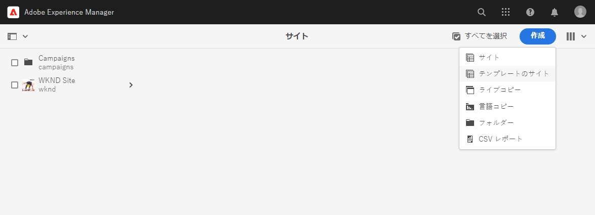
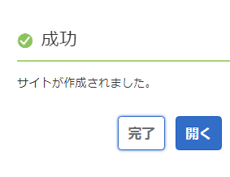
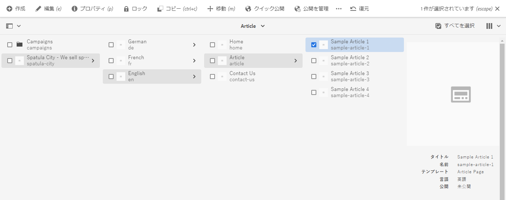

# 新しいサイトの作成 {#creating-site}

AEM でサイトテンプレートを使用してサイトを作成し、サイトのスタイルと構造を定義する方法を説明します。

## 概要 {#overview}

コンテンツ作成者がコンテンツを含むページを作成する前に、まずサイトを作成する必要があります。これは、通常、サイトの初期構造を定義する AEM 管理者が実行します。サイトテンプレートを使用すると、開発者以外のユーザーでもサイトを迅速かつ柔軟に作成できます。

## サイト構造の計画 {#structure}

時間をかけて、サイトの目的と計画済みのコンテンツを事前に考慮します。これにより、サイトの構造をどのように設計するかが決まります。適切なサイト構造は、サイト訪問者に対して容易なナビゲーションとコンテンツ検出をサポートし、[ マルチサイト管理と翻訳 ](/help/sites-cloud/administering/msm-and-translation.md) のような様々なAEM機能をサポートします。

## サイトテンプレート {#site-templates}

サイトの成功にとってサイト構造は非常に重要です。そのため、既存の一連の標準に基づいて新しいサイトをすばやくデプロイできるよう、事前定義済みの構造があると便利です。サイトテンプレートを使用すると、基本的なサイトコンテンツを組み合わせて、便利で再利用可能なパッケージを作成できます。

サイトテンプレートには通常、新しいサイトをすばやく開始するために、ベースとなるサイトのコンテンツと構造、それとサイトのスタイル設定情報が含まれています。テンプレートは再利用かつカスタマイズ可能なので、強力です。また、AEM インストールで複数のテンプレートを使用できるため、様々なビジネスニーズを満たすために異なるサイトを柔軟に作成できます。

>[!TIP]
>
>サイトテンプレートについて詳しくは、「サイトテンプレート [ のドキュメントを参照してください ](site-templates.md)。

>[!NOTE]
>
>サイトテンプレートを [ ページテンプレートと混同しないでください。](/help/sites-cloud/authoring/page-editor/templates.md) サイトテンプレートは、サイト全体の構造を定義します。ページテンプレートは、個々のページの構造と初期コンテンツを定義します。

### Adobeが提供するサイトテンプレート {#adobe-templates}

{{adobe-templates}}

## 新しいサイトの作成 {#create-site}

テンプレートを使用すると、簡単にサイトを作成できます。

1. AEM オーサリング環境にサインインし、サイトコンソールに移動します

   * `https://<your-author-environment>.adobeaemcloud.com/sites.html/content`

1. 画面の右上にある「**作成**」を選択し、ドロップダウンメニューから「**テンプレートからのサイト**」を選択します。

   

1. サイトの作成ウィザードで、左側のパネルの既存のテンプレート、または左側の列の上部にある「**読み込み**」を選択して、新しいテンプレートを読み込みます。

   

   1. 読み込むことを選択した場合は、ファイルのブラウザーで、使用するテンプレートを見つけて「**アップロード**」を選択します。

   1. アップロードが完了すると、使用可能なテンプレートのリストに表示されます。

1. テンプレートを選択すると、右側の列にそのテンプレートに関する情報が表示されます。目的のテンプレートを選択した状態で、「**次へ**」を選択します。

   

1. サイトのタイトルを指定します。サイト名を指定できます。省略した場合はタイトルからサイト名が生成されます。

   * サイトのタイトルは、ブラウザーのタイトルバーに表示されます。
   * サイト名が URL の一部になります。
   * サイト名は、[AEM のページ命名規則](/help/sites-cloud/authoring/sites-console/organizing-pages.md#page-name-restrictions-and-best-practices)に従う必要があります。

1. サイトテンプレートの必要に応じて、追加のサイト詳細を指定します。

   * テンプレートが異なると、追加の詳細が必要になる場合があります。
   * 例えば、[Edge Delivery Services プロジェクトのテンプレートには ](https://www.aem.live/developer/ue-tutorial) プロジェクトの GitHub リポジトリが必要です。

1. 「**作成**」を選択すると、サイトテンプレートからサイトが作成されます。

   

1. 表示される確認ダイアログで、「**完了**」を選択します。

   

1. サイトコンソールでは、新しいサイトが表示され、テンプレートで定義されている基本構造を参照するために移動できます。

   

これで、コンテンツ作成者はオーサリングを開始できます。

## サイトのカスタマイズ {#site-customization}

テンプレートは、サイトの基本構造とスタイルをすばやく設定するのに役立ちます。 ただし、ほとんどのプロジェクトでは、追加のスタイル設定とカスタマイズが必要です。 サイトテンプレートは、サイトのスタイルを分離するのに役立つので、フロントエンド開発者はサイトのスタイルを設定するためにAEMに関する知識を必要とせず、次のことが可能です
コンテンツ作成者とは別に、または作成者と並行して作業します。 プロジェクトのタイプに応じて、次の 2 つの形式があります。

* ユニバーサルエディターを使用したAEM ページオーサリングと [ エッジ配信 ](/help/edge/overview.md) による配信を含むプロジェクトの場合、すべてのスタイル設定は GitHub プロジェクトで行われます。
   * 詳しくは、ドキュメント [ はじめに – ユニバーサルエディターの開発者チュートリアル ](https://www.aem.live/developer/ue-tutorial) を参照してください。
* [ パブリッシュ配信 ](/help/sites-cloud/authoring/author-publish.md) を介した従来のAEM ページのオーサリングと配信を使用するプロジェクトの場合、AEM管理者は、サイトテーマをダウンロードしてフロントエンド開発者に提供するだけで、フロントエンド開発者はお気に入りのツールを使用してテーマをカスタマイズし、変更内容をAEM コードリポジトリにコミットして、デプロイします。
   * 詳しくは、[AEM クイックサイト作成のジャーニー](/help/journey-sites/quick-site/overview.md) を参照してください。
