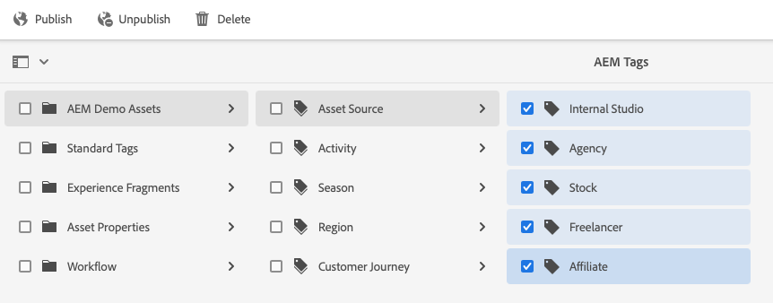

# タグの管理 {#administering-tags}

タグは、コンテンツを直感的に分類するための方法です。タグは、コンテンツをより迅速に見つけるためのキーワードまたはラベル（メタデータ）と考えることができます。

Adobe Experience Manager（AEM）では、タグが以下のプロパティとなる場合があります。

* ページのコンテンツノード
   * 詳しくは、[タグの使用](/help/sites-cloud/authoring/sites-console/tags.md)のドキュメントを参照してください。
* アセットのメタデータノード
   * 詳しくは、[デジタルアセットのメタデータの管理](/help/assets/manage-metadata.md)のドキュメントを参照してください。

>[!TIP]
>
>同じ概念に関連するタグの数を最小限に抑えることをお勧めします。例えば、アウトドア用品店のコンテンツを管理している場合、**履き物**&#x200B;と&#x200B;**靴**&#x200B;の両方にタグを付ける必要がない場合もあります。

## タグ機能 {#tag-features}

タグは、コンテンツを整理および管理するための堅牢な機能を備えています。

* タグは様々な名前空間にグループ化できます。
   * 名前空間は、分類を作成できる階層構造と考えることができます。
   * これらの分類は、AEM 全体で使用されます。
* タグは、作成者が適用し、サイト閲覧者が使用できます。
* 作成者に関係なく、ページに割り当てたとき、または検索時に、すべての形式のタグが使用可能になります。
* タグは、[リストコンポーネント](https://experienceleague.adobe.com/docs/experience-manager-core-components/using/wcm-components/list.html?lang=ja)により使用され、リストコンポーネントは、選択したタグに基づいて動的リストを生成します。

## タグの要件 {#requirements}

タグを作成および管理する際に注意すべき技術的な詳細項目がいくつかあります。

* タグは、特定の名前空間内で一意である必要があります。
* タグの名前に以下のタグ区切り文字を使用することはできません。
   * コロン（`:`） - 名前空間タグを区切ります
   * スラッシュ（`/`） - サブタグを区切ります
* タグのタイトルにタグ区切り文字が含まれている場合、UI では省略されます。
* タグの作成やタグの分類の変更は、`tag-administrators` グループのメンバーおよび `/content/cq:tags` に対する変更権限を持つメンバーが行うことができます。
   * 子タグが含まれるタグはコンテナタグと呼ばれます
   * コンテナタグ以外のタグはリーフタグと呼ばれます
   * タグの名前空間はリーフタグかコンテナタグのいずれかになります。

タグの動作方法に関する技術的な詳細について詳しくは、[AEM タグ付けフレームワーク](/help/implementing/developing/introduction/tagging-framework.md)を参照してください。

## タグ付けコンソール {#tagging-console}

タグ付けコンソールは、タグと分類の作成および管理に使用します。タグ付けコンソールを使用すると、次の方法でタグを管理できます。

* 名前空間にグループ化します。
* 新しいタグを作成する前に、既存のタグの使用状況を確認します。
* 現在参照されているコンテンツからタグを外さずにタグを整理し直します。

タグ付けコンソールにアクセスするには：

1. 管理者権限を使用してオーサリング環境にログインします。
1. グローバルナビゲーションメニューで、**`Tools`**／**`General`** を選択します。
   **`Tagging`**。

## 新しいタグの作成 {#creating-new-tags}

タグを作成、使用してコンテンツを整理するには、いくつかの手順があります。

1. [タグ用の名前空間を作成](#creating-namespaces)（または、再利用する既存の名前空間を選択します）。
1. [ 新しいタグを作成します ](#creating-tags)。
1. [ タグをPublishします ](#publishing-tags)。

### 名前空間の作成 {#creating-namespaces}

名前空間は、他のタグの整理に使用されます。これは最下層のタグと見なすことができ、通常は他のタグをグループ化するために使用されます。

1. 名前空間を作成するには、 [タグ付けコンソール](#tagging-console)をクリックし、ツールバーの「**作成**」ボタンを選択して、「**名前空間を作成**」を選択します。

   

1. 必要な情報を入力します。

   * **タイトル** - UI でユーザーに表示される名前空間のタイトル（オプション）
   * **名前** - 名前が指定されていない場合、有効なノード名が&#x200B;**タイトル**&#x200B;を基に作成されます。詳細は、[AEM タグ付けフレームワーク](/help/implementing/developing/introduction/tagging-framework.md#tagid)のドキュメントを参照してください。
   * **説明** - 名前空間の説明（オプション）

1. 必要な情報を入力したら、「**作成**」を選択します。

名前空間が作成されます。タグ付けコンソールでは、名前空間は最下位（コンソールの左端の列）にあり、フォルダーアイコンで表され、その特性が他のタグの「コンテナ」すなわちグループの形で反映されます。

この名前空間で [ 新しいタグを作成 ](#creating-tags) したり、[ 既存のタグを管理 ](#managing-tags) したりできます。

名前空間にサブタグを含める必要はありません。名前空間自体はタグなので、コンテンツを他のタグとして整理するために使用できます。ただし、構造化タグ付け分類の作成を続ける場合、プロジェクトの要件に基づきその名前空間内で[サブタグを作成](#creating-tags)できます。

### タグの作成 {#creating-tags}

タグは通常、名前空間に追加されます。

1. タグを作成するには、[ タグ付けコンソール ](#tagging-console) を開きます。

1. タグを作成する名前空間を選択します。または、別のタグを選択して、その下にサブタグを作成します。

1. ツールバーの「**作成**」ボタンを選択してから、「**タグを作成**」を選択します。

1. **タグを作成**&#x200B;ダイアログが開きます。新しいタグに必要な情報を入力します。

   * **タイトル** - タグの表示タイトル（必須）
   * **名前** - タグの名前（必須）指定しない場合、有効なノード名が「**タイトル**」から作成されます。[タグ ID](/help/implementing/developing/introduction/tagging-framework.md#tagid) を参照してください。
   * **説明** - タグの説明
   * **タグのパス** - デフォルトは、タグ付けコンソールで選択した名前空間（またはタグ）です。これは、パスセレクターアイコンをタップまたはクリックして、手動で更新できます。

   

1. 「**送信**」を選択します。

タグが作成され、コンソールが更新されて新しいタグが表示されます。

タグを使用すると、組織のニーズに基づいた独自の分類を柔軟に作成できます。

* 新しいタグを作成する前にコンソールで親タグを選択することで、既存のタグの子タグを作成できます。
* 名前空間や別のタグを選択せずにタグを作成する場合は、名前空間を効果的に作成します。

### タグの公開 {#publishing-tags}

AEM で他のコンテンツを作成する場合と同様に、タグ（または名前空間）を作成した後、タグはオーサリング環境にのみ存在します。タグをユーザーが使用できるようにするには、タグを公開する必要があります。

1. タグを公開するには、[ タグ付けコンソール ](#tagging-console) を開きます。

1. 公開するタグを選択し、ツールバーで「**公開**」を選択します。

   

1. **タグを公開**&#x200B;ダイアログで、選択したタグを公開するかどうかを確認するメッセージが表示されます。「**公開**」を選択します。

   

1. 公開アクションが、**成功**&#x200B;ダイアログによって確定されます。

   

選択したタグは、公開用のキューに入っています。ページコンテンツと同様、サブタグがあるかどうかに関係なく、選択したタグのみが公開されます。

分類（名前空間とサブタグ）を公開するお勧めの方法として、名前空間の[パッケージ](/help/implementing/developing/tools/package-manager.md)を作成する方法が挙げられます（[分類のルートノード](/help/implementing/developing/introduction/tagging-framework.md#taxonomy-root-node)を参照）。

<!--
Be sure to [apply permissions](#setting-tag-permissions) to the namespace before creating the package.
-->

## タグの管理 {#managing-tags}

既存のタグや名前空間を管理および整理するために、複数のアクションを実行できます。[タグ付けコンソール](#tagging-console)でタグまたは名前空間をクリックすると、使用可能なアクションがツールバーに表示されます。

* [プロパティを表示](#viewing-tag-properties)
* [編集](#editing-tags)
* [非公開](#unpublishing-tags)
* [参照](#viewing-tag-references)
* [移動](#moving-tags)
* [結合](#merging-tags)
* [削除](#deleting-tags)

なお、ツールバーに十分なスペースがない場合は、省略記号アイコンの後ろに追加のオプションが表示されます。

### タグプロパティの表示 {#viewing-tag-properties}

タグ付けコンソールで 1 つのタグまたは名前空間もしくは他のタグを選択すると、最終編集時間や最終公開時間など、選択したタグの基本情報がタグ列の左側の列に表示されます。

プロパティコンソールを&#x200B;**プロパティ**&#x200B;ビューに切り替えることにより、誰がいつタグを最後に公開したを含む、タグの詳細を表示することができます。

1. タグのプロパティを表示するには、[ タグ付けコンソール ](#tagging-console) を開きます。

1. プロパティを表示するタグを選択し、左側のパネルで「**プロパティ**」を選択します。

   

1. 選択したタグの詳細なプロパティが左側のパネルに表示されます。

   

表示モードとパネルの選択について詳しくは、[基本操作](/help/sites-cloud/authoring/basic-handling.md#rail-selector)を参照してください。

### タグの編集 {#editing-tags}

タグと名前空間は作成後に編集できます。

1. タグを編集するには、[ タグ付けコンソール ](#tagging-console) を開きます。

1. 編集するタグを選択し、ツールバーで「**編集**」を選択します。

1. 必要な変更を行います。次の値を変更できます。

   * **タイトル**
   * **説明**
   * [**ローカライゼーション**](#managing-tags-in-different-languages)

1. 編集が完了したら、「**送信**」を選択します。

言語の翻訳を追加する方法について詳しくは、[他の言語でのタグの管理](#managing-tags-in-different-languages)の節を参照してください。

既に公開済みのタグに変更を加えた場合は、[ 再公開 ](#publishing-tags) できます。

### タグの非公開 {#unpublishing-tags}

オーサーインスタンスでタグのアクティベートを解除し、パブリッシュインスタンスからタグを削除するには、タグを非公開にします。

1. タグの公開を解除するには、[ タグ付けコンソール ](#tagging-console) を開きます。

1. 非公開にするタグを 1 つ以上選択し、ツールバーで「**非公開**」を選択します。

   

1. **タグを非公開にする**&#x200B;ダイヤログが表示され、選択したタグを公開するか確認を求められます。「**公開**」を選択します。

   

1. **成功**&#x200B;ダイアログで非公開アクションを確認します。

   

選択したタグは、非公開のキューに入れらます。選択されているタグがコンテナタグの場合、オーサー環境でそのすべての子タグのアクティベートが解除され、パブリッシュ環境から削除されます。

### タグ参照の表示 {#viewing-tag-references}

特定のタグが適用されるコンテンツを確認するのに役立ちます。これを行うには、タグ付けコンソールで&#x200B;**参照**&#x200B;ビューを使用します。

1. タグの参照を表示するには、[ タグ付けコンソール ](#tagging-console) を開きます。

1. 参照を表示するタグを選択し、左側のパネルで「**参照**」を選択します。

   

1. 選択したタグの参照の合計数が左側のパネルに表示されます。

   

1. タグ参照の数を選択して、タグに割り当てられているコンテンツの詳細なリストを表示します。

   

リスト内の参照先のコンテンツにマウスポインターを置くか選択すると、コンテンツのフルパスが表示されます。

表示モードとパネルの選択について詳しくは、[基本操作](/help/sites-cloud/authoring/basic-handling.md#rail-selector)を参照してください。

### タグの移動 {#moving-tags}

タグを新しい場所に移動したり、タグの名前を変更したりして、タグ分類をクリーンアップしたり、整理し直したりする必要があります。

>[!TIP]
>
>タグの移動と名前の変更は、管理者のみが実行できることをお勧めします。

1. タグを移動または名前を変更するには、[ タグ付けコンソール ](#tagging-console) を開きます。

1. 移動または名前を変更するタグを選択し、ツールバーで「**移動**」を選択します。

1. **タグを移動**&#x200B;ダイアログで、変更するプロパティを指定します。

   * **変更後の名前** - タグに付ける新しい名前
      * このフィールドには、タグの現在の名前が事前に入力されます。
      * タグの移動のみを行い、名前を変更しない場合は、未変更のままにします。
   * **移動先** - タグの移動先とする場所
      * このフィールドには、タグの現在の位置が事前に入力されます。
      * タグの名前のみを変更し、移動しない場合は、未変更のままにします。

   

1. 「**送信**」を選択します。

タグの名前が変更されたり、新しい場所に移動したりします。 選択されているタグがコンテナタグの場合、タグを移動すると、そのすべての子タグも移動されます。

### タグの結合 {#merging-tags}

タグ分類に重複や類似したタグがある場合は、それらのタグを結合すると便利です。タグ `A` をタグ `B` に結合すると、`A` タグでタグ付けされるすべてのページは、タグ `B` でタグ付けされ、作成者はタグ `A` を使用できなくなります。

1. 2 つのタグを結合するには、[ タグ付けコンソール ](#tagging-console) を開きます。

1. 別のタグに統合するタグを選択し、ツールバーで「**結合**」を選択します。

1. **タグを結合**&#x200B;ダイアログで、「**結合先**」フィールドの&#x200B;**参照**&#x200B;アイコンを選択し、選択したタグの結合対象となるタグを指定します。

   

1. 「**送信**」を選択します。

コンソールで選択したタグが、ダイアログで指定したタグに結合されます。参照先のタグが移動または統合されても、タグは物理的には削除されないので、参照を維持することは可能です。詳しくは、[AEM タグ付けフレームワーク](/help/implementing/developing/introduction/tagging-framework.md#moving-and-merging-tags)を参照してください。

### タグの削除 {#deleting-tags}

タグ分類が変更され、タグや名前空間を不要にした場合は、タグや名前空間を削除できます。

1. タグを削除するには、[ タグ付けコンソール ](#tagging-console) を開きます。

1. 削除するタグを選択し、ツールバーで「**削除**」を選択します。

1. 選択したタグを削除するかどうかを確認する&#x200B;**タグを削除**&#x200B;ダイアログが表示されます。 「**削除**」を選択します。

   

1. AEM は、タグが参照されていないことを確認します。

   1. 参照が見つからない場合、AEM は削除に関する最終確認を求めます。「**削除**」を選択します。

      

   1. 参照が見つかった場合、AEM はそれらを提示し、削除の最終確認を求めます。

      

選択したタグは削除され、オーサー環境から完全に削除されます。タグが公開されていた場合は、パブリッシュ環境からも削除されます。選択されているタグがコンテナタグの場合、同様にその子タグもすべて削除されます。

<!--

## Setting Tag Permissions {#setting-tag-permissions}

Tag permissions are ['secure (by default)'](/help/sites-administering/production-ready.md); a best practice for the publish environment that requires read permission to be explicitly allowed for tags. Bascially, this is done by creating a package of the Tag Namespace after permissions have been set on author, and installing the package on all publish instances.

* on author instance

    * sign in with administrative privileges
    * access the [Security Console](/help/sites-administering/security.md#accessing-user-administration-with-the-security-console),

        * for example, browse to http://localhost:4502/useradmin

    * in the left pane, select the group (or user) for which [read permission](/help/sites-administering/security.md#permissions) is to be granted
    * in the right pane, locate the **Path **to the Tag Namespace

        * for example, `/content/cq:tags/mycommunity`

    * select the `checkbox`in the **Read** column
    * select **Save**

* ensure all publish instances have same permissions

    * one approach is to [create a package](/help/sites-administering/package-manager.md#package-manager) of the namespace on author

        * on `Advanced` tab, for `AC Handling` select `Overwrite`

    * replicate the package

        * choose `Replicate` from package manager

-->

## 他の言語でのタグの管理 {#managing-tags-in-different-languages}

タグの `title` プロパティは複数の言語に翻訳できます。翻訳が完了すると、ユーザーまたはコンテンツの言語に応じて適切なタグタイトルを表示できます。

`Animals` というタグがあり、このタグをドイツ語とフランス語に翻訳するとします。

1. [ タギングコンソール ](#tagging-console) を開きます。

1. 翻訳するタグを選択し、ツールバーで「**編集**」を選択します。

1. **タグを編集**&#x200B;ダイアログ、**ローカリゼーション**&#x200B;列で、ターゲット言語（例：ドイツ語）を選択します。

1. 表示される「**ドイツ語**」フィールドに、翻訳されたタイトルを入力します。

1. フランス語について、前の 2 つの手順を繰り返します。

   

1. 「**送信**」を選択します。

コンテンツページの場合、タグに選択した言語はページの言語から取得されます（利用可能な場合）。

ただし、オーサリング環境では、AEM はユーザー言語設定を使用します。したがって、タグ付けコンソールでは、ユーザーのプロパティで言語をフランス語に設定したユーザーには「`Animals`」タグが「`Animaux`」と表示されます。

ダイアログに新しい言語を追加するには、[AEM アプリケーションへのタグ付けの構築](/help/implementing/developing/introduction/tagging-applications.md#adding-a-new-language-to-the-edit-tag-dialog)ドキュメントを参照してください。

>[!TIP]
>
>AEM のローカライゼーション機能について詳しくは、[多言語サイトのコンテンツの翻訳](/help/sites-cloud/administering/translation/overview.md)を参照してください。
