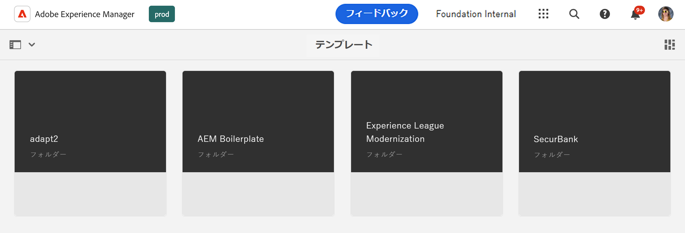
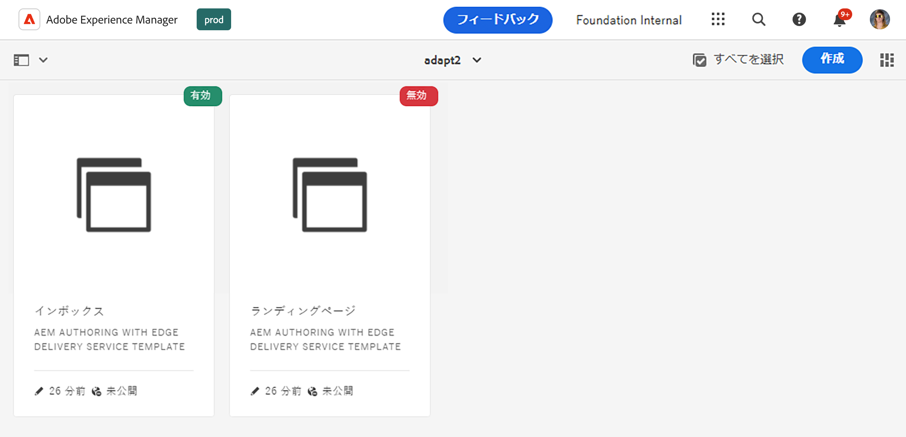
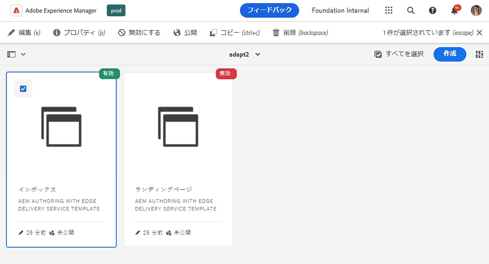

# テンプレートコンソール {#templates-console}

テンプレートコンソールでページテンプレートを一元的に表示および管理する方法を説明します。

## 概要 {#overview}

ページを作成する場合は、テンプレートを選択する必要があります。ページテンプレートは、新しいページのベースとして使用されます。[AEM の編集可能テンプレート](/help/implementing/developing/components/templates.md)では、結果ページの構造、すべての初期コンテンツ、使用可能なコンポーネント（デザインプロパティ）を定義できます。

コンテンツ作成者が [Sites コンソールで新しいページを作成](/help/sites-cloud/authoring/sites-console/creating-pages.md)すると、使用可能な一連のテンプレートが表示されます。テンプレートを使用すると、次のツールで編集可能なページを作成できます。

* [ページエディター](/help/sites-cloud/authoring/page-editor/templates.md)または
* [ユニバーサルエディター](/help/sites-cloud/authoring/universal-editor/templates.md)

テンプレートコンソールを使用すると、管理者は、すべてのページテンプレートを一元的に表示および管理できます。

## テンプレートコンソールへのアクセス {#accessing}

1. AEM as a Cloud Service にログインします。
1. グローバルナビゲーションを開き、**ツール**&#x200B;パネルを選択してから&#x200B;**一般**／**テンプレート**&#x200B;を選択します。

## オリエンテーション {#orientation}

テンプレートコンソールはフォルダーに整理され、[設定](/help/implementing/developing/introduction/configurations.md)ごとに 1 つのフォルダーが割り当てられます。フォルダーでは、設定に対して、編集可能なテンプレートがアクティブ化されています。

コンソールの[デフォルト表示](/help/sites-cloud/authoring/quick-start.md)は、カード表示です。フォルダーをタップまたはクリックすると、そのコンテンツを参照できます。

テンプレートを選択して、ツールバーで使用できるオプションを表示します。

* [編集](#edit-edit)
* [プロパティ](#properties)
* [無効／有効にする](#enable-disable)
* [公開](#publish)
* [コピー](#copy)
* [削除](#delete)

## 編集 {#edit}

テンプレートを編集すると、テンプレートの作成に使用したエディターが開きます。以下のいずれかの操作を行います。

* [テンプレートエディター](/help/sites-cloud/authoring/page-editor/templates.md)
* [ユニバーサルエディター](/help/sites-cloud/authoring/universal-editor/templates.md)

任意のエディターを使用して、テンプレートに対して必要な変更を加えることができます。使用中のテンプレートを編集すると、作成者に影響を与える可能性があります。

* テンプレートエディターで作成されたテンプレートの場合、変更を加えると、選択したテンプレートを基にしているライブページに影響を与える可能性があります。
* ユニバーサルエディターで作成されたテンプレートの場合、変更の影響を受けるのは、選択したテンプレートを基に作成者が新規作成するページのみです。

テンプレートエディターで作成され、既に有効になっているテンプレートの使用を作成者が開始すると、警告が表示されます。

>[!TIP]
>
>コンソールでテンプレートを選択したら、ホットキー `e` を使用して、選択したテンプレートを編集します。

## プロパティ {#properties}

[テンプレートのプロパティ](/help/sites-cloud/authoring/page-editor/templates.md)は、ページプロパティの編集と同じ方法で編集できます。テンプレートのプロパティには次のようなものがあります。

* テンプレートのタイトル
* 説明
* 画像

>[!TIP]
>
>コンソールでテンプレートを選択したら、ホットキー `p` を使用して、選択したテンプレートのプロパティを開きます。

## 有効化と無効化 {#enable-disable}

テンプレートの状態は、次の 3 つのいずれかになります。

* **下書き** - テンプレートはまだ作成中で、新しいページの作成には使用できません。
* **有効** - テンプレートは完成していて、新しいページの作成に使用できます。
* **無効** - テンプレートは完成していますが、新しいページの作成には使用できません。

作成されたテンプレートは、デフォルトでは、**下書き**&#x200B;状態（[テンプレートエディター](/help/sites-cloud/authoring/page-editor/templates.md)で作成されたテンプレートの場合）または&#x200B;**有効**&#x200B;状態（[ユニバーサルエディター](/help/sites-cloud/authoring/universal-editor/templates.md)で作成されたテンプレートの場合）になります。

コンテンツ作成者がテンプレートをページ作成のために使用するには、まずテンプレートを有効にする必要があります。テンプレートが不要になった場合は、無効にして、ページ作成ウィザードに表示されないようにすることができます。

* テンプレートを選択して「**無効にする**」をクリックし、テンプレートを無効にします。
* テンプレートを選択して「**有効にする**」をクリックし、テンプレートを有効にします。

## 公開 {#publish}

テンプレートエディターで作成されたテンプレートは、公開された場合にのみ使用できます。テンプレートを選択し、「**公開**」をクリックして公開します。

ユニバーサルエディターで作成されたテンプレートは、公開しなくても使用できます。

## コピー {#copy}

構造が似ているページが多数ある場合は、「**コピー**」ボタンを使用してテンプレートのコピーを作成し、必要に応じてそのコピーを変更することができます。これは、別のサイトでテンプレートを使用する場合にも便利です。

1. テンプレートを選択し、「**コピー**」をタップまたはクリックして、コピーを作成します。
1. コピーを作成する場所に移動します。
1. ツールバーの「**貼り付け**」をタップまたはクリックします。

貼り付けると、次の操作を実行できます。

* [テンプレートを編集](#edit)して、必要に応じて調整する。
* [プロパティウィンドウを使用](#properties)して、テンプレートタイトルを更新する。
* [テンプレートを有効にして](#enable-disable)、ページの作成に使用できるようにする。
* 必要に応じて[テンプレートを公開](#publish)する。

>[!TIP]
>
>コンソールでテンプレートを選択したら、ホットキー `Command+c` または `ctrl+c` を使用して、選択したテンプレートをコピーします。

## 削除 {#delete}

テンプレートが不要になった場合、そのテンプレートがページから参照されていなければ削除できます。

テンプレートを選択し、「**削除**」をタップまたはクリックして削除します。

>[!TIP]
>
>コンソールでテンプレートを選択したら、ホットキー `Backspace` を使用して、選択したテンプレートを削除します。

## テンプレートの作成 {#create}

コンソールの「**作成**」ボタンを使用して、現在の場所に新しいテンプレートを作成します。テンプレートを作成する方法について詳しくは、[ページエディターで編集可能なページを作成するテンプレート](/help/sites-cloud/authoring/page-editor/templates.md)を参照してください。

「**作成**」ボタンは、ページエディターで編集可能なテンプレートを作成する場合にのみ使用します。ユニバーサルエディターで作成されたページを基にテンプレートを作成する方法については、[ユニバーサルエディターで編集可能なページを作成するためのテンプレート](/help/sites-cloud/authoring/universal-editor/templates.md)のドキュメントを参照してください。
