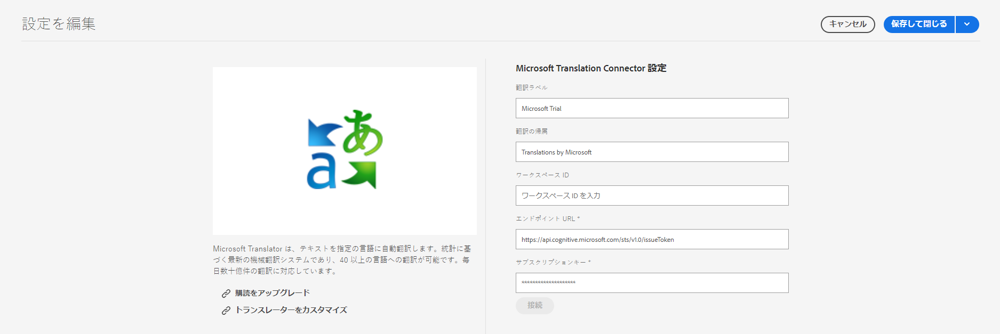

# Microsoft Translator への接続 {#connecting-to-microsoft-translator}

AEMには、ページのコンテンツまたはアセットを翻訳する ](https://www.microsoft.com/ja-jp/translator/business/)0}Microsoft Translator} 用の組み込みコネクタが用意されています。 [Microsoft Translator を使用するためのライセンスをMicrosoftから取得したら、このページの手順に従ってコネクタを設定してください。

>[!TIP]
>
>コンテンツの翻訳を初めて行う場合は、[Sites 翻訳ジャーニー](/help/journey-sites/translation/overview.md)を参照してください。これは、AEM の強力な翻訳ツールを使用して AEM Sites コンテンツを翻訳する手順を示すガイドです。AEM や翻訳の経験がないユーザーに最適です。

| プロパティ | 説明 |
|---|---|
| 翻訳ラベル | 翻訳サービスの表示名 |
| 翻訳の帰属 | （オプション）ユーザー生成コンテンツの場合に、翻訳済みのテキストの横に表示される帰属情報（例：`Translations by Microsoft`） |
| ワークスペース ID | （オプション）使用するカスタム Microsoft Translator エンジンの ID |
| サブスクリプションキー | Microsoft Translator の Microsoft サブスクリプションキー |

Microsoft Translator 設定を作成するには、次の手順に従います。

1. [ナビゲーションパネル](/help/sites-cloud/authoring/basic-handling.md#first-steps)で、**ツール**／**クラウドサービス**／**翻訳クラウドサービス**&#x200B;を選択します。
1. 設定を作成する場所に移動します。通常は、これはサイトのルートにあります。また、グローバルなデフォルト設定にすることもできます。
1. 「**作成**」ボタンを選択します。
1. 設定を定義します。
   1. ドロップダウンで **Microsoft Translator** を選択します。
   1. 設定のタイトルを入力します。このタイトルによって、クラウドサービスコンソールおよびページプロパティのドロップダウンリストで設定が識別されます。
   1. オプションとして、設定を格納するリポジトリーノードに使用する名前を入力します。

   

1. 「**作成**」をクリックします。
1. **設定を編集**&#x200B;ウィンドウで、前述の表で説明した翻訳サービスの値を指定します。

   

1. 「**接続**」を選択して接続を確認します。
1. 「**保存して閉じる**」を選択します。

## トランスレーターサービス設定の公開 {#publishing-the-translator-service-configurations}

最後の手順として、「[ ツリーの公開 ](/help/sites-cloud/authoring/sites-console/publishing-pages.md#publishing-and-unpublishing-a-tree) アクションを使用して、Microsoft Translator 設定を公開し、公開済みの翻訳済みコンテンツをサポートしてください。
