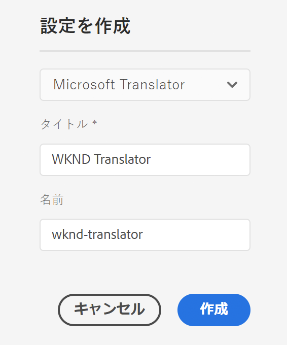
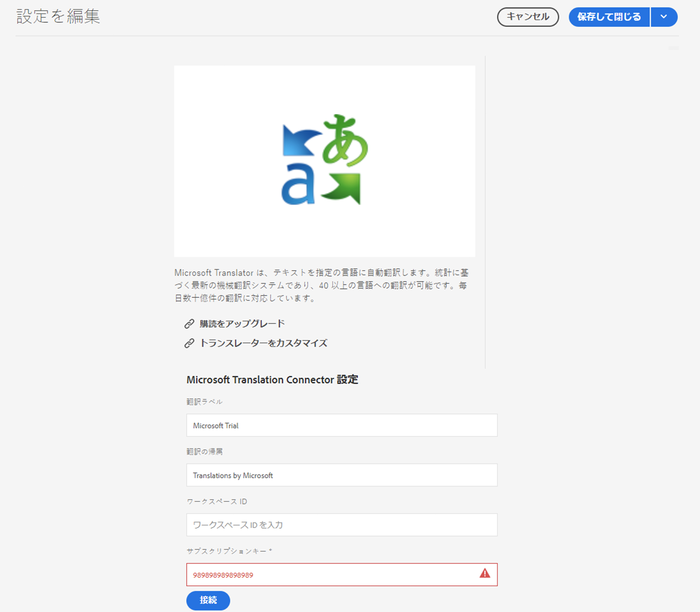

# Microsoft Translator への接続 {#connecting-to-microsoft-translator}

AEM ページのコンテンツまたはアセットの翻訳に Microsoft Translation アカウントを使用するには、[Microsoft Translator](https://hub.microsofttranslator.com) クラウドサービスの設定を作成します。

>[!TIP]
>
>コンテンツを初めて翻訳する場合は、 AEMの強力な翻訳ツールを使用してAEM Sitesコンテンツを翻訳する際のガイドとなる[サイト翻訳ジャーニー(](/help/journey-sites/translation/overview.md))を参照してください。AEMや翻訳の経験がないユーザーに最適です。

>[!NOTE]
>
>AEM には、毎月最大 2,000,000 文字の無料翻訳を利用できる体験版の Microsoft Translation アカウントが用意されています。実稼動システムに適したアカウントサブスクリプションを取得するには、[Microsoft Translator 体験版ライセンス設定のアップグレード](#upgrading-the-microsoft-translator-trial-license-configuration)を参照してください。

| プロパティ | 説明 |
|---|---|
| 翻訳ラベル | 翻訳サービスの表示名 |
| 翻訳の帰属 | （オプション）ユーザー生成コンテンツの場合に、翻訳済みのテキストの横に表示される帰属情報（例：「`Translations by Microsoft`」） |
| ワークスペース ID | （オプション）使用するカスタム Microsoft Translator エンジンの ID |
| サブスクリプションキー | Microsoft Translator の Microsoft サブスクリプションキー |

設定を作成したら、その[設定をアクティベートする](#activating-the-translator-service-configurations)必要があります。

Microsoft Translator 設定を作成するには、次の手順に従います。

1. [ナビゲーションパネル](/help/sites-cloud/authoring/getting-started/basic-handling.md#first-steps)で、**ツール**／**クラウドサービス**／**翻訳クラウドサービス**&#x200B;をクリックまたはタップします。
1. 設定を作成する場所に移動します。通常は、これはサイトのルートにあります。また、グローバルなデフォルト設定にすることもできます。
1. 「**作成**」ボタンをタップまたはクリックします。
1. 設定を定義します。
   1. ドロップダウンで **Microsoft Translator** を選択します。
   1. 設定のタイトルを入力します。このタイトルによって、クラウドサービスコンソールおよびページプロパティのドロップダウンリストで設定が識別されます。
   1. オプションとして、設定を格納するリポジトリーノードに使用する名前を入力します。

   

1. 「**作成**」をクリックします。
1. **設定を編集**&#x200B;ウィンドウで、前述の表で説明した翻訳サービスの値を指定します。

   

1. 「**接続**」をタップまたはクリックして、接続を確認します。
1. 「**保存して閉じる**」をタップまたはクリックします。

## Microsoft Translator 体験版ライセンス設定のアップグレード {#upgrading-the-microsoft-translator-trial-license-configuration}

Microsoft Translation 設定ページには、実稼動システムに適したアカウントのサブスクリプションを取得する場合に役立つ、Microsoft Web サイトへのリンクが表示されます。

1. [ナビゲーションパネル](/help/sites-cloud/authoring/getting-started/basic-handling.md#first-steps)で、**ツール**／**クラウドサービス**／**翻訳クラウドサービス**&#x200B;をタップまたはクリックします。
1. 既存の Microsoft Translator 設定をタップまたはクリックします。
1. 「**編集**」をタップまたはクリックします。
1. **設定を編集**&#x200B;ウィンドウで、「**購読をアップグレード**」をタップまたはクリックします。サービスの詳細を表示する Microsoft Web ページが開きます。

## Microsoft Translator エンジンのカスタマイズ {#customizing-your-microsoft-translator-engine}

Microsoft Translation 設定ページには、Microsoft Translator エンジンをカスタマイズする場合に役立つ、Microsoft Web サイトへのリンクが表示されます

1. [ナビゲーションパネル](/help/sites-cloud/authoring/getting-started/basic-handling.md#first-steps)で、**ツール**／**クラウドサービス**／**翻訳クラウドサービス**&#x200B;をタップまたはクリックします。
1. 既存の Microsoft Translator 設定をタップまたはクリックします。
1. 「**編集**」をタップまたはクリックします。
1. **設定を編集**&#x200B;ウィンドウで、「**トランスレーターをカスタマイズ**」をタップまたはクリックします。表示された Microsoft の Web ページを使用して、サービスをカスタマイズします。

## 翻訳サービス設定のアクティベート {#activating-the-translator-service-configurations}

パブリッシュインスタンスでレプリケーションされる翻訳コンテンツをサポートするには、クラウドサービス設定をアクティベートする必要があります。[ツリーの公開](/help/sites-cloud/authoring/fundamentals/publishing-pages.md#publishing-and-unpublishing-a-tree)方法を使用して、Microsoft Translator 設定を格納するリポジトリーノードをアクティベートします。このノードは以下に示す親ノードの下にあります。

* `/libs/settings/cloudconfigs/translation/msft-translation`
