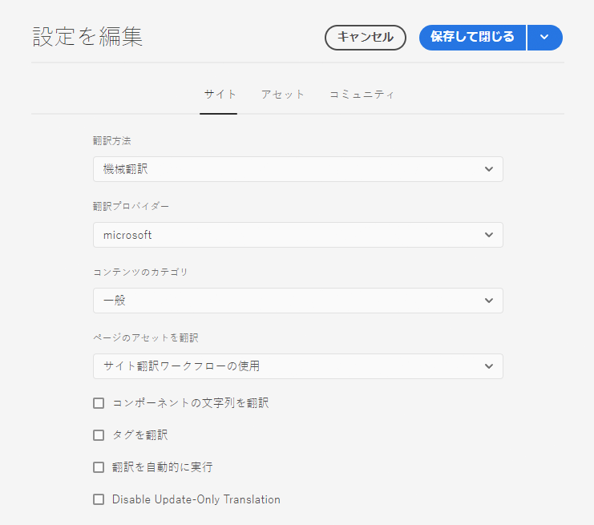
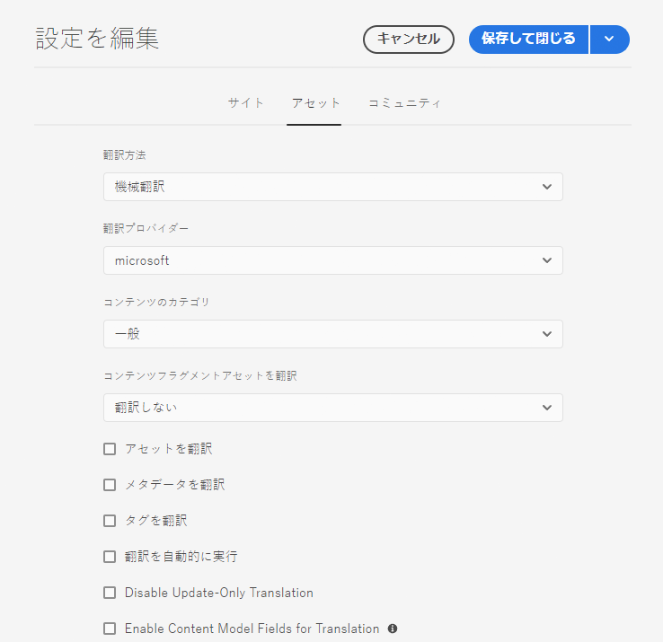

# 翻訳統合フレームワークの設定 {#configuring-the-translation-integration-framework}

翻訳統合フレームワークは、AEM コンテンツの翻訳を組織化するためにサードパーティの翻訳サービスと統合されます。これには 3 つの基本的な手順が必要です。

1. [ 翻訳サービスプロバイダーに接続します ](#connecting-to-a-translation-service-provider)。
1. [ 翻訳統合フレームワーク設定を作成 ](#creating-a-translation-integration-configuration) します。
1. [ クラウド設定をページに関連付けます ](#configuring-pages-for-translation)。

AEM のコンテンツ翻訳機能の概要については、[多言語サイトのコンテンツの翻訳](overview.md)を参照してください。

>[!TIP]
>
>コンテンツの翻訳を初めて行う場合は、[ サイト翻訳ジャーニー](/help/journey-sites/translation/overview.md) を参照してください。これは、AEMの強力な翻訳ツールを使用してAEM Sites コンテンツを翻訳する手順を示すガイドです。AEMや翻訳の経験がないユーザーに最適です。

## 翻訳サービスプロバイダーへの接続 {#connecting-to-a-translation-service-provider}

AEM をお使いの翻訳サービスプロバイダーに接続するためのクラウド設定を作成します。

AEM には、[Microsoft® Translator に接続](connect-ms-translator.md)する機能がデフォルトで含まれています。Adobe Exchange パートナープログラムに参加している、AEM コネクタを持つその他の翻訳テクノロジーベンダーについては、[ こちら](https://exchange.adobe.com/apps/browse/ec?page=1&amp;partnerLevel=All&amp;product=AEM&amp;q=experience+manager+translation&amp;sort=RELEVANCE)を参照してください。

コネクタパッケージをインストールしたら、コネクタ用のクラウド設定を作成できます。通常は、翻訳サービスで認証を行うための資格情報を指定する必要があります。Microsft Translator コネクタ用のクラウド設定の追加については、[Microsoft® Translator との統合](connect-ms-translator.md)を参照してください。

必要に応じて、同じコネクターに対して複数のクラウド設定を作成できます。例えば、同じベンダーを使用するアカウントまたはプロジェクトごとに設定を 1 つずつ作成します。

接続の設定が完了したら、その接続を使用する翻訳統合フレームワーク設定を作成できます。

## 翻訳統合フレームワーク設定の作成 {#creating-a-translation-integration-configuration}

翻訳統合フレームワーク設定を作成して、コンテンツの翻訳方法を指定できるようにします。この設定には以下の情報が含まれます。

* 使用する翻訳サービスプロバイダー
* 人間による翻訳と機械翻訳のどちらを実行するか
* ページまたはアセットに関連付けられている他のコンテンツ（タグなど）を翻訳するかどうか

フレームワーク設定を作成したら、その設定に従って、翻訳するページにクラウド設定を関連付けます。翻訳プロセスが開始すると、関連付けられているフレームワーク設定に従って翻訳ワークフローが進行します。

Web サイトのセクションごとに翻訳要件が異なる場合は、それに応じて複数のフレームワーク設定を作成します。例えば、多言語の Web サイトに英語、スペイン語、日本語の言語コピーが含まれているとします。サイトの所有者は、スペイン語と日本語の翻訳のために 2 つの異なる翻訳サービスプロバイダーを使用します。そのため、フレームワークの設定が 2 つ指定されます。使用する翻訳サービスプロバイダーは設定ごとに異なります。

翻訳統合フレームワークの設定が完了したら、[その設定を使用するページに関連付ける](preparation.md)ことができます。

>[!TIP]
>
>AEM のコンテンツ翻訳機能の概要については、[多言語サイトのコンテンツの翻訳](overview.md)を参照してください。

フレームワークの単一の設定によって、ページコンテンツとアセットの翻訳方法が制御されます。翻訳設定を作成するには、以下を実行します。

1. [ グローバルナビゲーションメニュー ](/help/sites-cloud/authoring/basic-handling.md#global-navigation) で、**ツール/Cloud Serviceと翻訳のCloud Service** を選択します。
1. コンテンツ構造内で設定を作成する場所に移動します。この場所は多くの場合、特定のサイトに基づいている場合もあれば、グローバルな場合もあります。
1. フィールドに次の情報を入力し、「**作成**」を選択します。
   1. ドロップダウンで「**設定タイプ**」を選択します。
   1. 設定の&#x200B;**タイトル**&#x200B;を入力します。この&#x200B;**タイトル**&#x200B;によって、**クラウドサービス**&#x200B;コンソールおよびページプロパティのドロップダウンリストで設定が識別されます。
   1. オプションとして、設定を格納するリポジトリノードに使用する&#x200B;**名前**&#x200B;を入力します。
1. **設定を編集**&#x200B;ウィンドウで、「**Sites**」タブと「**アセット**」タブのプロパティを設定し、「**保存して閉じる**」を選択します。

### 「Sites」の設定プロパティ  {#sites-configuration-properties}

「**Sites** 」タブは、ページのコンテンツの翻訳を実行する方法を制御します。

| プロパティ | 説明 |
|---|---|
| 翻訳方法 | このプロパティは、フレームワークがサイトコンテンツに対して実行する翻訳方法を定義します。 - 機械翻訳：翻訳プロバイダーは、リアルタイムに機械翻訳を用いて翻訳を行います。 - 人間による翻訳：コンテンツが翻訳プロバイダーに送信され、翻訳者によって翻訳されます。 - 翻訳しない：コンテンツは翻訳のために送信されません。翻訳されないものの、最新のコンテンツに更新される可能性があるコンテンツのブランチをスキップする場合に使用します。 |
| 翻訳プロバイダー | このプロパティは、翻訳を実行する翻訳プロバイダーを定義します。対応するコネクタがインストールされている場合は、プロバイダーがリストに表示されます。 |
| コンテンツのカテゴリ | （機械翻訳の場合のみ）翻訳するコンテンツを示すカテゴリです。カテゴリは、コンテンツを翻訳する際の用語や言葉遣いの選択を左右します。 |
| タグを翻訳 | このオプションを選択すると、ページに関連付けられているタグを翻訳できます。 |
| ページのアセットを翻訳 | このプロパティは、ファイルシステムからコンポーネントに追加されたアセットや、アセットから参照されたアセットを変換する方法を定義します。 - 変換しない：ページアセットは翻訳されません。 - サイト翻訳ワークフローの使用：「**Sites**」タブの設定プロパティに従ってアセットが処理されます。 - アセット翻訳ワークフローの使用：「**Assets**」タブのプロパティの設定に従ってアセットが処理されます。 |
| 翻訳を自動実行 | 翻訳プロジェクトの作成後に翻訳ジョブを自動的に実行する場合、このプロパティを有効にします。このオプションを選択すると、翻訳ジョブのレビューやスコーピングを行う機会はなくなります。 |
| 更新のみの翻訳を無効にする | このオプションをオンにした場合、翻訳プロジェクトを更新すると、前回の翻訳以降に変更されたフィールドだけでなく、すべての翻訳可能なフィールドが翻訳対象として送信されます。 |

### Assets の設定プロパティ {#assets-configuration-properties}

Assets プロパティは、アセットを設定する方法を制御します。アセットの翻訳について詳しくは、[アセットの言語コピーの作成](/help/assets/translate-assets.md)を参照してください。

| プロパティ | 説明 |
|---|---|
| 翻訳方法 | このプロパティは、フレームワークがアセットに対して実行する翻訳の種類を選択します。 - 機械翻訳：翻訳プロバイダーは、機械翻訳を用いて直ちに翻訳を行います。 - 人間による翻訳：コンテンツが自動的に翻訳プロバイダーに送信され、手動で翻訳されます。 - 翻訳しない：アセットは翻訳のために送信されません。 |
| 翻訳プロバイダー | このプロパティは、翻訳を実行する翻訳プロバイダーを定義します。対応するコネクタがインストールされている場合は、プロバイダーがリストに表示されます。 |
| コンテンツのカテゴリ | （機械翻訳の場合のみ）翻訳するコンテンツを示すプロパティです。カテゴリは、コンテンツを翻訳する際の用語や言葉遣いの選択を左右します。 |
| アセットを翻訳 | 翻訳プロジェクトにアセットを含めるには、このプロパティをアクティブにします。 |
| メタデータを翻訳 | このプロパティをアクティブ化すると、アセットのメタデータを翻訳できます。 |
| タグを翻訳 | このプロパティをアクティブ化すると、アセットに関連付けられたタグを翻訳できます。 |
| 翻訳を自動実行 | このプロパティを選択すると、翻訳プロジェクトの作成後に翻訳ジョブを自動的に実行できます。このオプションを選択すると、翻訳ジョブのレビューやスコーピングを行う機会はなくなります。 |
| 更新のみの翻訳を無効にする | このオプションをオンにした場合、翻訳プロジェクトを更新すると、前回の翻訳以降に変更されたフィールドだけでなく、すべての翻訳可能なフィールドが翻訳対象として送信されます。 |
| 翻訳用にコンテンツモデルフィールドを有効にする | このオプションを有効にすると、[コンテンツフラグメントモデル](/help/sites-cloud/administering/content-fragments/content-fragment-models.md#properties)の「**翻訳可能**」フィールドを使用して、そのフィールドが翻訳されているかどうかが判断され、それに応じて[翻訳ルール](rules.md)が自動的に作成されます。このオプションは、作成済みの翻訳ルールより優先されます。 |

## 翻訳するページの設定 {#configuring-pages-for-translation}

ソースページを他の言語に翻訳するように設定するには、そのページを次のクラウド設定に関連付けます。

* AEM を翻訳サービスプロバイダーに接続するためのクラウド設定。
* 翻訳の詳細を設定する翻訳統合フレームワーク。

翻訳統合フレームワークのクラウド設定によって、サービスプロバイダーへの接続に使用するクラウド設定が特定されます。ソースページをフレームワークのクラウド設定に関連付ける場合は、フレームワークのクラウド設定が使用するサービスプロバイダーのクラウド設定にページを関連付ける必要があります。

ページをクラウド設定に関連付ける場合は、そのページの子ページが関連付けを継承します。例えば、`/content/wknd/language-masters/en/magazine` ページを翻訳統合フレームワークに関連付けると、`magazine` ページとその下にある子ページがフレームワークに従って翻訳されます。

必要に応じて、子ページの関連付けを上書きできます。例えば、Web サイトのコンテンツがほとんど旅行とライフスタイルに関するものだとします。しかし、ページの 1 つのブランチには企業の説明が記述されています。このような場合、サイトのルートページは、「ライフスタイル」カテゴリを使用して、機械翻訳を指定する翻訳統合フレームワークに関連付けられる可能性があります。企業の説明が記述されているブランチでは、「一般」カテゴリを使用して、機械翻訳を実行するフレームワークを使用します。

### 翻訳プロバイダーへのページの関連付け {#associating-a-page-with-a-translation-provider}

ページおよび子ページの翻訳に使用する翻訳プロバイダーにページを関連付けます。

1. Sites コンソールで、設定するページを選択して、「**プロパティを表示**」を選択します。
1. 「**クラウドサービス**」タブを選択します。
1. **設定を追加**&#x200B;ドロップダウンリストで、設定を選択します。
1. 「**保存して閉じる**」を選択します。

### 翻訳統合フレームワークへのページの関連付け {#associating-pages-with-a-translation-integration-framework}

ページおよび子ページの翻訳を実行する方法を定義する翻訳統合フレームワークにページを関連付けます。

1. Sites コンソールで、設定するページを選択して、「**プロパティを表示**」を選択します。
1. 「**クラウドサービス**」タブを選択します。
1. **設定を追加**&#x200B;ドロップダウンリストで、設定を選択します。
1. 「**保存して閉じる**」を選択します。
