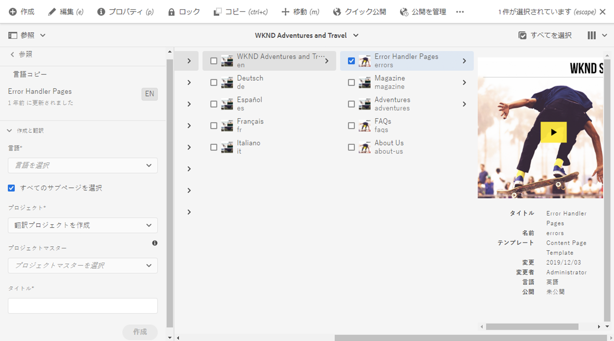
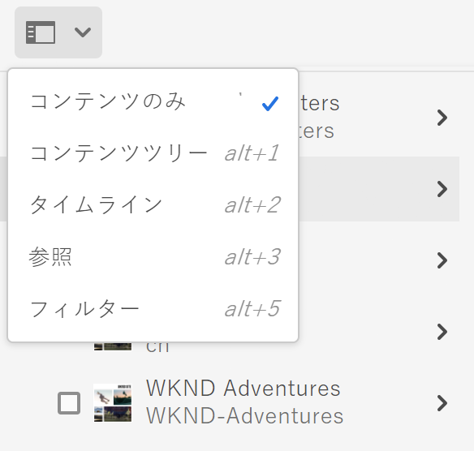
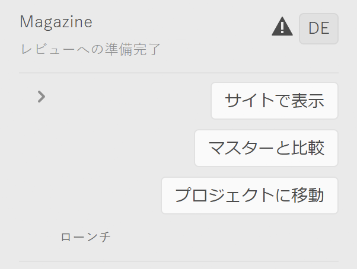

# 翻訳プロジェクトの管理 {#managing-translation-projects}

翻訳プロジェクトを使用すると、AEMコンテンツの翻訳を管理できます。翻訳プロジェクトは、他の言語に翻訳するリソースを含むAEM [プロジェクト](/help/sites-cloud/authoring/projects/overview.md)の一種です。これらのリソースは、言語マスターから作成された[言語コピー](preparation.md)のページとアセットです。

翻訳プロジェクトにリソースが追加されると、そのリソース用の翻訳ジョブが作成されます。リソースで実行される人間による翻訳と機械翻訳のワークフローの管理に使用するコマンドとステータス情報がジョブによって提供されます。

翻訳プロジェクトは、長期にわたる項目であり、グローバリゼーションに関する組織ガバナンスと合致するように言語および翻訳方法／翻訳プロバイダーによって定義されます。初期翻訳時、または手動で一度開始され、コンテンツおよび翻訳の更新アクティビティ中は有効な状態が保たれます。

翻訳プロジェクトおよびジョブは、翻訳準備ワークフローで作成されます。これらのワークフローには、初期翻訳（作成と翻訳）と更新（翻訳を更新）の両方について、次の 3 つのオプションがあります。

1. [新規プロジェクトの作成](#creating-translation-projects-using-the-references-panel)
1. [既存のプロジェクトへの追加](#adding-pages-to-a-translation-project)
1. [コンテンツ構造のみ](#creating-the-structure-of-a-language-copy)

AEM では、翻訳プロジェクトがコンテンツの初期翻訳用に作成されたものか、翻訳済みの言語コピーを更新するためのものかを検出します。ページ用の翻訳プロジェクトを作成して、翻訳対象の言語コピーを指定すると、AEM ではターゲットの言語コピーにソースページが既に存在するかどうかを検出します。

* **言語コピーにはページは含まれません。**  AEMは、この状況を最初の翻訳として扱います。ページがすぐに言語コピーにコピーされ、プロジェクトに追加されます。翻訳されたページが AEM に読み込まれると、AEM はそのページを言語コピーに直接コピーします。
* **言語コピーには既にページが含まれています。**  AEMは、この状況を翻訳の更新として処理します。ローンチが作成され、ページのコピーがローンチに追加されて、プロジェクトに含まれます。ローンチを使用すると、更新された翻訳を言語コピーにコミットする前に確認できます。

   * 翻訳されたページが AEM に読み込まれると、ローンチ内のページがそのページによって上書きされます。
   * ローンチが昇格された場合にのみ、言語コピーが翻訳されたページによって上書きされます。

例えば、`/content/wknd/fr`言語ルートは、`/content/wknd/en`マスター言語のフランス語翻訳用に作成されます。 フランス語の言語コピーにその他のページはありません。

* フランス語の言語コピーをターゲットに、`/content/wknd/en/products`ページとすべての子ページに対して翻訳プロジェクトが作成されます。 言語コピーには`/content/wknd/fr/products`ページが含まれないので、AEMは直ちに`/content/wknd/en/products`ページとすべての子ページをフランス語の言語コピーにコピーします。 これらのコピーは翻訳プロジェクトにも追加されます。
* フランス語の言語コピーをターゲットに、`/content/wknd/en`ページとすべての子ページに対して翻訳プロジェクトが作成されます。 言語コピーには`/content/wknd/en`ページ（言語ルート）に対応するページが含まれるので、AEMは`/content/wknd/en`ページとすべての子ページをコピーしてローンチに追加します。 これらのコピーは翻訳プロジェクトにも追加されます。

## サイトコンソールからの翻訳{#performing-initial-translations-and-updating-existing-translations}

翻訳プロジェクトは、サイトコンソールから直接作成または更新できます。

### 参照パネルを使用した翻訳プロジェクトの作成 {#creating-translation-projects-using-the-references-panel}

翻訳プロジェクトを作成すると、言語マスターのリソースを翻訳するためのワークフローを実行および管理できます。プロジェクトを作成する場合は、翻訳対象の言語マスター内のページおよび翻訳を実行する対象となる言語コピーを指定します。

* 選択したページに関連付けられている翻訳統合フレームワークのクラウド設定では、翻訳プロジェクトのプロパティ（使用する翻訳ワークフローなど）の多くを指定します。
* 選択した言語コピーごとにプロジェクトが作成されます。
* 選択したページおよび関連するアセットのコピーが作成され、各プロジェクトに追加されます。これらのコピーは後で翻訳プロバイダーに翻訳用として送信されます。

選択したページの子ページも選択されるように指定できます。この場合、子ページのコピーも各プロジェクトに追加され、翻訳されます。別の翻訳統合フレームワーク設定に子ページが関連付けられている場合、AEMは追加のプロジェクトを作成します。

[手動で翻訳プロジェクトを作成する](#creating-a-translation-project-using-the-projects-console)こともできます。

>[!NOTE]
>
>プロジェクトを作成するには、アカウントが`project-administrators`グループのメンバーである必要があります。

### 初期翻訳と翻訳の更新 {#initial-and-updating}

参照パネルには、既存の言語コピーを更新するか、または言語コピーの最初のバージョンを作成するかが示されます。選択したページの言語コピーが存在する場合は、「言語コピーを更新」タブが表示されます。このタブからプロジェクト関連のコマンドにアクセスできます。

翻訳が完了したら、[翻訳をレビュー](#reviewing-and-promoting-updated-content)してから、言語コピーを上書きできます。選択したページの言語コピーが存在しない場合は、「作成と翻訳」タブが表示されます。このタブからプロジェクト関連のコマンドにアクセスできます。

### 新しい言語コピー用の翻訳プロジェクトの作成 {#create-translation-projects-for-a-new-language-copy}

1. サイトコンソールを使用して、翻訳プロジェクトに追加するページを選択します。

1. ツールバーで、**参照**&#x200B;レールを開きます。

   

1. 「**言語コピー**」を選択し、ソースページを翻訳する言語コピーを選択します。
1. 「**作成と翻訳**」をクリックまたはタップして、翻訳ジョブを設定します。

   * **言語**&#x200B;ドロップダウンを使用して、翻訳対象の言語コピーを選択します。必要に応じて追加の言語を選択します。リストに表示される言語は、[作成した言語ルート](preparation.md#creating-a-language-root)に対応します。
      * 複数の言語を選択すると、各言語に対して1つの翻訳ジョブを持つプロジェクトが作成されます。
   * 選択したページとすべての子ページを翻訳するには、「**すべてのサブページを選択**」を選択します。選択したページのみを翻訳するには、「 」オプションをオフにします。
   * **プロジェクト**&#x200B;の場合、「**翻訳プロジェクトを作成**」を選択します。
   * **プロジェクトマスター**&#x200B;の場合は、ユーザーの役割と権限を継承するプロジェクトを選択します。
   * 「**タイトル**」に、プロジェクトの名前を入力します。

   

1. 「**作成**」をクリックまたはタップします。

### 既存の言語コピー用の翻訳プロジェクトの作成 {#create-translation-projects-for-an-existing-language-copy}

1. サイトコンソールを使用して、翻訳プロジェクトに追加するページを選択します。

1. ツールバーで、**参照**&#x200B;レールを開きます。

   

1. 「**言語コピー**」を選択し、ソースページを翻訳する言語コピーを選択します。
1. 「**言語コピーを更新**」をクリックまたはタップして、翻訳ジョブを設定します。

   * 選択したページとすべての子ページを翻訳するには、「**すべてのサブページを選択**」を選択します。選択したページのみを翻訳するには、「 」オプションをオフにします。
   * **プロジェクト**&#x200B;の場合、「**翻訳プロジェクトを作成**」を選択します。
   * **プロジェクトマスター**&#x200B;の場合は、ユーザーの役割と権限を継承するプロジェクトを選択します。
   * 「**タイトル**」に、プロジェクトの名前を入力します。

   

1. 「**作成**」をクリックまたはタップします。

### 翻訳プロジェクトへのページの追加 {#adding-pages-to-a-translation-project}

翻訳プロジェクトを作成したら、**リソース**&#x200B;レールを使用して、プロジェクトにページを追加できます。 ページの追加は、別のブランチのページを同じプロジェクトに含める場合に役立ちます。

翻訳プロジェクトにページを追加すると、そのページが新しい翻訳ジョブに含まれます。また、[既存のジョブにページを追加する](#adding-pages-assets-to-a-translation-job)こともできます。

新しいプロジェクトの作成時と同様に、ページを追加する際は、ページのコピーがローンチに追加されます（既存の言語コピーが上書きされないようにするために必要な場合）（[既存の言語コピー用の翻訳プロジェクトの作成](#performing-initial-translations-and-updating-existing-translations)を参照）。

1. サイトコンソールを使用して、翻訳プロジェクトに追加するページを選択します。

1. ツールバーで、**参照**&#x200B;レールを開きます。

   

1. 「**言語コピー**」を選択し、ソースページを翻訳する言語コピーを選択します。

   

1. 「**言語コピーを更新**」をクリックまたはタップして、次のプロパティを設定します。

   * 選択したページとすべての子ページを翻訳するには、「**すべてのサブページを選択**」を選択します。選択したページのみを翻訳するには、「 」オプションをオフにします。
   * **プロジェクト**&#x200B;の場合、「**既存の翻訳プロジェクトに追加**」を選択します。
   * **既存の翻訳プロジェクト**&#x200B;でプロジェクトを選択します。

   >[!NOTE]
   >
   >翻訳プロジェクトに設定されるターゲット言語は、参照レールに表示されている言語コピーのパスと一致する必要があります。

1. 「**更新**」をクリックまたはタップします。

### 言語コピーの構造の作成 {#creating-the-structure-of-a-language-copy}

言語コピーの構造のみを作成し、言語マスターのコンテンツと構造的な変更を（未翻訳の）言語コピーにコピーできます。 これは、翻訳ジョブまたは翻訳プロジェクトとは関係ありません。 翻訳がない場合でも、このオプションを使用して言語マスターの同期を維持できます。

言語コピーの構造を作成して、翻訳対象のマスター言語からのコンテンツが言語コピーに含まれるようにします。言語コピーを入力する前に、言語コピーの言語ルート](preparation.md#creating-a-language-root)を[作成しておく必要があります。

1. サイトコンソールを使用して、ソースとして使用するマスター言語の言語ルートを選択します。
1. ツールバーの「**参照**」をクリックまたはタップして、参照レールを開きます。

   

1. 「**言語コピー**」を選択し、入力する言語コピーを選択します。

   

1. 「**言語コピーを更新**」をクリックまたはタップして翻訳ツールを表示し、プロパティを設定します。

   * 「**すべてのサブページを選択**」オプションを選択します。
   * 「**プロジェクト**」で、「**構造のみを作成**」を選択します。

   

1. 「**更新**」をクリックまたはタップします。

### 翻訳メモリ{#updating-translation-memory}を更新中

翻訳済みコンテンツの手動編集を翻訳管理システム(TMS)に同期して、翻訳メモリをトレーニングできます。

1. サイトコンソールから、翻訳されたページのテキストコンテンツを更新した後、「**翻訳メモリを更新**」を選択します。
1. リストビューでは、編集されたすべてのテキストコンポーネントについて、ソースと翻訳が横に並んで比較表示されます。翻訳メモリに同期する翻訳の更新を選択し、**「メモリを更新**」を選択します。

AEM は、選択した文字列を翻訳管理システムに送信します。

### ページ{#check-translation-status}の翻訳ステータスの確認

プロパティは、ページが翻訳済みか、翻訳中か、まだ翻訳されていないかを示すサイトコンソールのリスト表示で選択できます。

1. サイトコンソールで、[リストビューに切り替えます。](/help/sites-cloud/authoring/getting-started/basic-handling.md#viewing-and-selecting-resources)
1. 「表示」ドロップダウンで「**設定を表示**」をタップまたはクリックします。
1. ダイアログで、「**翻訳済み**」プロパティを確認し、「**更新**」をタップまたはクリックします。

サイトコンソールに、リストされたページの翻訳ステータスを示す「**翻訳済み**」列が表示されるようになりました。

## プロジェクトコンソールからの翻訳プロジェクトの管理

多くの翻訳タスクや高度なオプションは、プロジェクトコンソールからアクセスできます。

### プロジェクトコンソールについて

AEMの翻訳プロジェクトは、標準の[AEMプロジェクトコンソールを使用します。](/help/sites-cloud/authoring/projects/overview.md) AEMプロジェクトに詳しくない場合は、このドキュメントを参照してください。

他のプロジェクトと同様に、翻訳プロジェクトは、プロジェクトタスクの概要を示すタイルで構成されます。

* **概要**  — プロジェクトの概要
* **タスク**  - 1つ以上の翻訳タスク
* **チーム**  — 翻訳プロジェクトで共同作業を行うユーザー
* **タスク**  — 翻訳作業の一環として完了する必要がある項目

タイルの上部と下部にあるコマンドおよび省略記号ボタンを使用して、様々なタイルのコントロールとオプションにアクセスします。

### Creating a Translation Project Using the Projects Console {#creating-a-translation-project-using-the-projects-console}

サイトコンソールの代わりにプロジェクトコンソールを使用する場合は、翻訳プロジェクトを手動で作成できます。

>[!NOTE]
>
>プロジェクトを作成するには、アカウントが`project-administrators`グループのメンバーである必要があります。

翻訳プロジェクトを手動で作成する場合は、[基本のプロパティ](/help/sites-cloud/authoring/projects/managing.md#creating-a-project)に加えて、翻訳に関連する以下のプロパティに値を指定する必要があります。

* **名前：** プロジェクト名
* **ソース言語：** ソースコンテンツの言語
* **ターゲット言語：** コンテンツの翻訳先の言語
   * 複数の言語を選択した場合、プロジェクト内の各言語に対してジョブが作成されます。
* **翻訳方法：****「人間による翻訳」を選択すると、翻訳が手動で実行されます。**

1. プロジェクトコンソールのツールバーで、「**作成**」をクリックまたはタップします。
1. **翻訳プロジェクト**&#x200B;テンプレートを選択し、「**次へ**」をクリックまたはタップします。
1. 「**基本**」プロパティタブの値を入力します。
1. 「**詳細**」をクリックまたはタップし、翻訳関連のプロパティの値を指定します。
1. 「**作成**」をクリックまたはタップします。確認ボックスで、「**完了**」をクリックまたはタップしてプロジェクトコンソールに戻るか、「**プロジェクトを開く**」をクリックまたはタップしてプロジェクトを開き、管理を開始します。

### 翻訳ジョブへのページとアセットの追加{#adding-pages-assets-to-a-translation-job}

翻訳プロジェクトの翻訳ジョブにページ、アセットまたはタグを追加できます。 ページやアセットを追加するには：

1. 翻訳プロジェクトの「翻訳ジョブ」タイルの下部にある省略記号をクリックまたはタップします。

   

1. 次のウィンドウで、ツールバーの「**追加**」ボタンをクリックまたはタップし、「**アセット/ページ**」を選択します。

   

1. モーダルウィンドウで、追加するブランチの最上部の項目を選択し、チェックマークアイコンをクリックまたはタップします。 このウィンドウでは、複数選択が有効になっています。

   

1. または、検索アイコンを選択して翻訳ジョブに追加するページやアセットを探すこともできます。

   

1. 選択したら、「**選択**」をタップまたはクリックします。 ページやアセットが翻訳ジョブに追加されます。

>[!TIP]
>
>この方法では、ページ/アセットとその子がプロジェクトに追加されます。 親のみを追加する場合は、「**アセット/ページ（子なし）**」を選択します。

### 翻訳ジョブへのタグの追加 {#adding-tags-to-a-translation-job}

[プロジェクトにアセットやページを追加する方法と同様に、翻訳プロジェクトにタグを追加できます。](#adding-pages-assets-to-a-translation-job) 「追加」メニ **** ューの「タグ **** サンダー」を選択し、同じ手順に従います。

### 翻訳プロジェクトの詳細の確認 {#seeing-translation-project-details}

翻訳プロジェクトのプロパティには、「プロジェクトの概要」タイルの省略記号ボタンを使用してアクセスできます。 一般的な[プロジェクト情報](/help/sites-cloud/authoring/projects/overview.md#project-info)に加えて、翻訳プロジェクトのプロパティには翻訳固有の情報が含まれます。

翻訳プロジェクトで、「翻訳の概要」タイルの下部にある省略記号をクリックまたはタップします。プロジェクト固有のプロパティのほとんどは、「**詳細**」タブにあります。

* **ソース言語：** 翻訳するページの言語
* **ターゲット言語：** ページの翻訳先の言語
* **クラウド設定：** プロジェクトで使用される翻訳サービスコネクタのクラウド設定
* **翻訳方法：** 人間による翻訳または機械 **翻訳** の翻 **訳ワークフロー**
* **翻訳プロバイダー：** 翻訳を実行する翻訳サービスプロバイダー
* **コンテンツカテゴリ：** （機械翻訳）翻訳に使用されるコンテンツカテゴリ
* **翻訳プロバイダーの資格情報：** プロバイダーにログインするための資格情報
* **翻訳ローンチを自動昇格：** 翻訳されたコンテンツを受け取ると、翻訳ローンチが自動的に昇格されます
   * **昇格後にローンチを削除：** 翻訳ローンチが自動的に昇格された場合、昇格後にローンチを削除します
* **翻訳を自動的に承認：** 翻訳されたコンテンツを受け取ると、翻訳ジョブが自動的に承認されます
* **翻訳の繰り返し：** プロジェクトが翻訳ジョブを自動的に作成および実行する頻度を選択して、翻訳プロジェクトの繰り返し実行を設定します

ページの参照レールを使用してプロジェクトを作成すると、これらのプロパティはソースページのプロパティに基づいて自動的に設定されます。

### 翻訳ジョブのステータスの監視 {#monitoring-the-status-of-a-translation-job}

翻訳プロジェクトの翻訳ジョブタイルには、翻訳ジョブのステータスと、ジョブ内のページ数およびアセット数が表示されます。

次の表は、ジョブまたはジョブ内の項目の各ステータスを示しています。

| ステータス | 説明 |
|---|---|
| **ドラフト** | 翻訳ジョブが開始されていません。翻訳ジョブは、作成時に「**ドラフト****」ステータスになります。 |
| **送信済み** | 翻訳ジョブ内のファイルが翻訳サービスに正常に送信されると、このステータスになります。このステータスは、**Request Scope**&#x200B;コマンドまたは&#x200B;**Start**&#x200B;コマンドの発行後に発生する可能性があります。 |
| **スコーピングリクエスト** | 人間翻訳ワークフローの場合、ジョブ内のファイルがスコーピング用に翻訳ベンダーに送信されています。このステータスは、**Request Scope**&#x200B;コマンドの発行後に表示されます。 |
| **スコーピング完了** | ベンダーによる翻訳ジョブのスコーピングが完了しました。 |
| **翻訳をコミット** | プロジェクトの所有者がスコーピングを受け入れました。このステータスは、翻訳ベンダーがジョブ内のファイルの翻訳を開始する必要があることを示します。 |
| **翻訳中** | （ジョブの場合）ジョブ内の 1 つ以上のファイルの翻訳がまだ完了していません。（ジョブ内の項目の場合）項目の翻訳中です。 |
| **翻訳済み** | （ジョブの場合）ジョブ内のすべてのファイルの翻訳が完了しました。（ジョブ内の項目の場合）項目が翻訳されました。 |
| **レビューへの準備完了** | ジョブ内の項目が翻訳され、ファイルが AEM に読み込まれました。 |
| **完了** | 翻訳の契約が完了したことがプロジェクトの所有者によって示されました。 |
| **キャンセル** | 翻訳ベンダーが翻訳ジョブの作業を停止する必要があることを示します。 |
| **更新エラー** | AEM と翻訳サービス間でのファイルの転送中にエラーが発生しました。 |
| **不明な状態** | 不明なエラーが発生しました。 |

ジョブ内の各ファイルのステータスを確認するには、タイルの下部にある省略記号をクリックまたはタップします。

### 翻訳ジョブの期限の設定  {#setting-the-due-date-of-translation-jobs}

翻訳ベンダーが翻訳済みのファイルを戻す必要のある期限を指定します。期限の設定を正しく使用できるのは、使用する翻訳ベンダーがこの機能をサポートしている場合のみです。

1. 翻訳の概要タイルの下部にある省略記号をクリックまたはタップします。

   

1. 「**基本**」タブで、**Due Date**&#x200B;プロパティの日付選択を使用して期限を選択します。

   

1. 「**保存して閉じる**」をクリックまたはタップします。

### 翻訳ジョブのスコーピング {#scoping-a-translation-job}

翻訳ジョブをスコーピングして、翻訳サービスプロバイダーから翻訳コストの見積もりを取得します。ジョブをスコーピングする場合は、ソースファイルが翻訳ベンダーに送信されます。翻訳ベンダーは、保存している翻訳のプール（翻訳メモリ）とテキストとを比較します。通常、スコープとは翻訳が必要な単語数です。

スコーピング結果の詳細を取得するには、翻訳ベンダーにお問い合わせください。

>[!NOTE]
>
>スコーピングはオプションで、人間による翻訳にのみ適用されます。 スコーピングをおこなわずに翻訳ジョブを開始できます。

翻訳ジョブのスコーピング時には、ジョブのステータスが「**スコーピングリクエスト**」になります。翻訳ベンダーがスコーピングを戻すと、ステータスが「**スコーピング完了**」に変わります。スコーピングが完了したら、**Show Scope**&#x200B;コマンドを使用してスコーピング結果を確認できます。

スコーピングを正しく使用できるのは、使用する翻訳ベンダーがこの機能をサポートしている場合のみです。

1. プロジェクトコンソールで、翻訳プロジェクトを開きます。
1. 翻訳ジョブのタイトルで、コマンドメニューをタップまたはクリックし、「**リクエスト範囲**」をタップまたはクリックします。
1. ジョブのステータスが「**スコープ完了**」に変わったら、コマンドメニューをクリックまたはタップし、「**スコープ**&#x200B;を表示」をクリックまたはタップします。

### 翻訳ジョブの開始{#starting-translation-jobs}

翻訳ジョブを開始して、ソースページをターゲット言語に翻訳します。翻訳は、翻訳の概要タイルのプロパティ値に従って実行されます。

プロジェクト内から個々のジョブを開始できます。

1. プロジェクトコンソールで、翻訳プロジェクトを開きます。
1. 「翻訳ジョブ」タイルで、コマンドメニューをクリックまたはタップし、「**開始**」をクリックまたはタップします。
1. 翻訳の開始を確認するアクションダイアログで、「**閉じる**」をクリックまたはタップします。

翻訳ジョブを開始すると、「**処理中**」ステータスの翻訳が「翻訳ジョブ」タイルに表示されます。

プロジェクトのすべての翻訳ジョブを開始することもできます。

1. プロジェクトコンソールで、翻訳プロジェクトを選択します。
1. ツールバーで、「**翻訳ジョブを開始**」をタップまたはクリックします。
1. ダイアログで、開始するジョブのリストを確認し、「**開始**」で確定するか、「**キャンセル**」で中止します。

### 翻訳ジョブのキャンセル {#canceling-a-translation-job}

翻訳ジョブをキャンセルして、翻訳プロセスを中断し、翻訳ベンダーが以降の翻訳を実行しないようにします。ステータスが「**翻訳をコミット**」または「**翻訳中**」のジョブをキャンセルできます。

1. プロジェクトコンソールで、翻訳プロジェクトを開きます。
1. 「翻訳ジョブ」タイルで、コマンドメニューをクリックまたはタップし、「**キャンセル**」をクリックまたはタップします。
1. 翻訳のキャンセルを確認するアクションダイアログで、「**OK**」をクリックまたはタップします。

### ワークフロー{#accept-reject-workflow}を許可および拒否

翻訳後にコンテンツが戻り、「**レビュー準備完了**」ステータスになったら、翻訳ジョブに移動して、コンテンツを承認/拒否できます。

「**翻訳を拒否**」を選択した場合は、コメントを追加するオプションがあります。

コンテンツを却下すると、翻訳ベンダーにコメントが送り返され、翻訳ベンダーがコメントを表示できるようになります。

### 翻訳ジョブの完了とアーカイブ {#completing-and-archiving-translation-jobs}

ベンダーが翻訳したファイルのレビューが完了したら、翻訳ジョブを完了します。

1. プロジェクトコンソールで、翻訳プロジェクトを開きます。
1. 「翻訳ジョブ」タイルで、コマンドメニューをクリックまたはタップし、「**完了**」をクリックまたはタップします。
1. これで、ジョブのステータスが「**完了**」になります。

人間翻訳ワークフローの場合、翻訳を完了すると、翻訳契約が履行され、翻訳を翻訳メモリに保存する必要があることをベンダーに通知します。

翻訳ジョブが完了し、ジョブのステータスの詳細を確認する必要がなくなった場合は、ジョブをアーカイブします。

1. プロジェクトコンソールで、翻訳プロジェクトを開きます。
1. 翻訳ジョブタイルで、コマンドメニューをクリックまたはタップし、「**アーカイブ**」をクリックまたはタップします。

ジョブをアーカイブすると、翻訳ジョブのタイルがプロジェクトから削除されます。

## 翻訳済みコンテンツのレビューと使用{#reviewing-and-promoting-updated-content}

サイトコンソールを使用して、コンテンツのレビュー、言語コピーの比較およびコンテンツのアクティブ化を行うことができます。

### 更新されたコンテンツの昇格{#promoting-updated-content}

コンテンツが既存の言語コピー用に翻訳された場合は、翻訳をレビューし、必要に応じて変更を加え、翻訳を昇格して言語コピーに移動します。翻訳ジョブのステータスが「**レビューへの準備完了**」の場合は、翻訳済みファイルをレビューできます。

1. 言語マスターでページを選択し、「**参照**」をクリックまたはタップして、「**言語コピー**」をクリックまたはタップします。
1. レビューする言語コピーをクリックまたはタップします。

   

1. 「**起動**」をクリックまたはタップして、起動関連のコマンドを表示します。

   

1. ページのローンチコピーを開いてコンテンツを確認し編集するには、「**ページを開く**」をクリックします。
1. コンテンツをレビューし、必要な変更を加えたら、ローンチコピーを昇格するには、「**昇格**」をクリックします。
1. **ローンチを昇格**&#x200B;ページで、昇格するページを指定し、「**昇格**」をクリックまたはタップします。

### 言語コピーの比較 {#comparing-language-copies}

言語コピーを言語マスターと比較するには：

1. サイトコンソールで、比較する言語コピーに移動します。
1. [参照レールを開きます。](/help/sites-cloud/authoring/getting-started/basic-handling.md#references)
1. 「**コピー**」の見出しの下で、「**言語コピー**」を選択します。
1. 特定の言語コピーを選択し、「**マスターと比較**」または「**前と比較**」（該当する場合）をクリックします。

   

1. 2 つのページ（ローンチページとソースページ）が左右に並んで開きます。
   * この機能の使用方法について詳しくは、[ページの差分](/help/sites-cloud/authoring/features/page-diff.md)を参照してください。

## 翻訳ジョブのインポートとエクスポート{#import-export}

AEMには多くの翻訳ソリューションとインターフェイスが用意されていますが、翻訳ジョブの情報を手動で読み込み、書き出しすることもできます。

### 翻訳ジョブの書き出し {#exporting-a-translation-job}

翻訳ジョブのコンテンツをダウンロードできます。この機能は、AEM と統合されていない翻訳プロバイダーにコネクターを使用して送信する場合や、コンテンツをレビューする場合などに使用します。

1. 「翻訳ジョブ」タイルのドロップダウンメニューで、「**書き出し**」をクリックまたはタップします。
1. ダイアログボックスで、「**書き出したファイルをダウンロード**」をクリックまたはタップし、必要に応じて、Webブラウザーのダイアログボックスを使用してファイルを保存します。
1. ダイアログボックスで、「**閉じる**」をクリックまたはタップします。

### 翻訳ジョブの読み込み {#importing-a-translation-job}

翻訳コンテンツを AEM に読み込むことができます。この機能は、AEM と統合されていない翻訳プロバイダーがコネクターを使用してコンテンツを送信する場合などに使用します。

1. 「翻訳ジョブ」タイルのドロップダウンメニューで、「**読み込み**」をクリックまたはタップします。
1. Web ブラウザーのダイアログボックスを使用して、読み込むファイルを選択します。
1. ダイアログボックスで、「**閉じる**」をクリックまたはタップします。
