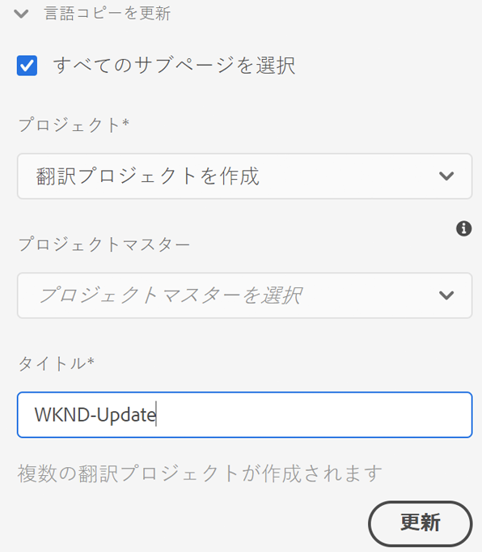
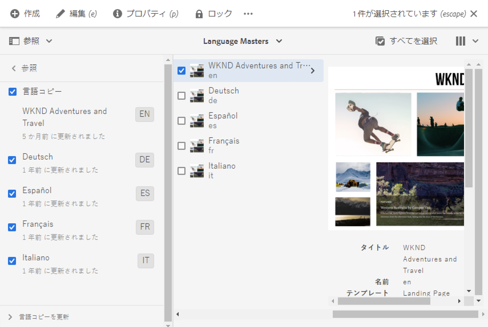
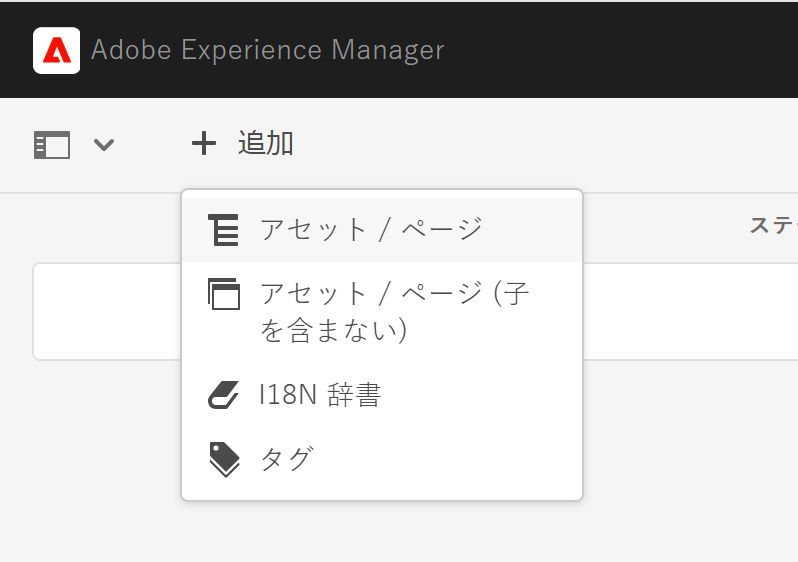
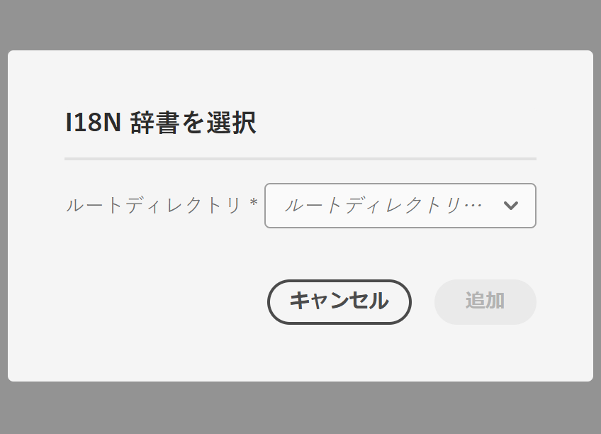
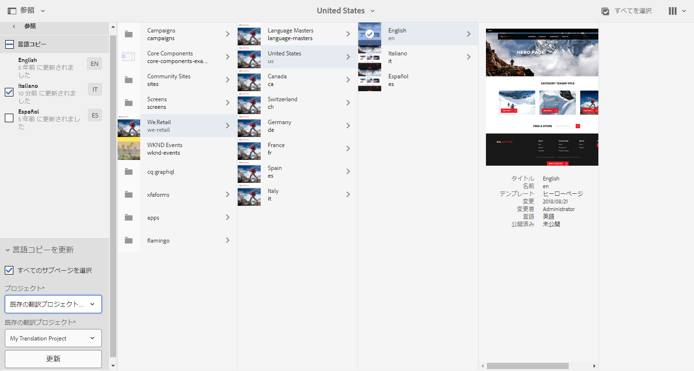
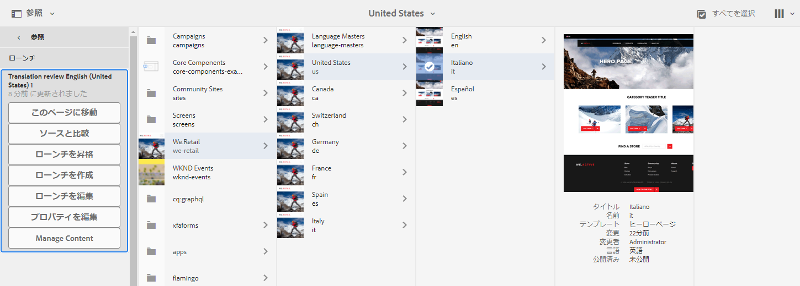

# 翻訳プロジェクトの管理 {#managing-translation-projects}

翻訳プロジェクトを使用すると、AEM コンテンツの翻訳を管理できます。翻訳プロジェクトは AEM [プロジェクト](/help/sites-cloud/authoring/projects/overview.md)の一種であり、他の言語に翻訳するリソースがその中に格納されます。これらのリソースは、言語マスターから作成される[言語コピー](preparation.md)のページとアセットです。

>[!TIP]
>
>コンテンツの翻訳を初めて行う場合は、[ サイト翻訳ジャーニー](/help/journey-sites/translation/overview.md) を参照してください。これは、AEMの強力な翻訳ツールを使用してAEM Sites コンテンツを翻訳する手順を示すガイドです。AEMや翻訳の経験がないユーザーに最適です。

翻訳プロジェクトにリソースが追加されると、そのリソース用の翻訳ジョブが作成されます。ジョブには、リソースで実行される人間による翻訳と機械翻訳のワークフローの管理に使用するコマンドとステータス情報が含まれています。

翻訳プロジェクトは、長期にわたる項目であり、グローバリゼーションに関する組織ガバナンスと合致するように言語および翻訳方法／翻訳プロバイダーによって定義されます。初期翻訳時、または手動で一度開始され、コンテンツおよび翻訳の更新アクティビティ中は有効な状態が保たれます。

翻訳プロジェクトおよびジョブは、翻訳準備ワークフローで作成されます。これらのワークフローには、初期翻訳（作成と翻訳）と更新（翻訳を更新）の両方について、次の 3 つのオプションがあります。

1. [新規プロジェクトの作成](#creating-translation-projects-using-the-references-panel)
1. [既存のプロジェクトへの追加](#adding-pages-to-a-translation-project)
1. [コンテンツ構造のみ](#creating-the-structure-of-a-language-copy)

AEM では、翻訳プロジェクトがコンテンツの初期翻訳用に作成されたものか、翻訳済みの言語コピーを更新するためのものかを検出します。ページ用の翻訳プロジェクトを作成して、翻訳対象の言語コピーを指定すると、AEM ではターゲットの言語コピーにソースページが既に存在するかどうかを検出します。

* **ページが言語コピーに含まれていない場合：** AEM はこの状況を初期翻訳として処理します。ページがすぐに言語コピーにコピーされ、プロジェクトに追加されます。翻訳されたページが AEM に読み込まれると、AEM はそのページを言語コピーに直接コピーします。
* **ページが言語コピーに既に含まれている場合：** AEM はこの状況を翻訳の更新として処理します。ローンチが作成され、ページのコピーがローンチとプロジェクトに追加されます。ローンチを使用すると、更新された翻訳をレビューしてから言語コピーに対してコミットできます。

   * 翻訳されたページが AEM に読み込まれると、ローンチ内のページがそのページによって上書きされます。
   * ローンチが昇格された場合にのみ、言語コピーが翻訳されたページによって上書きされます。

例えば、マスター言語 `/content/wknd/en` のフランス語翻訳用に言語ルート `/content/wknd/fr` が作成されるとします。フランス語の言語コピーにその他のページはありません。

* フランス語の言語コピーをターゲットとして、`/content/wknd/en/products` ページおよびすべての子ページ用の翻訳プロジェクトが作成されます。言語コピーには `/content/wknd/fr/products` ページが含まれていないので、AEM はすぐに `/content/wknd/en/products` ページとすべての子ページをフランス語の言語コピーにコピーします。これらのコピーは翻訳プロジェクトにも追加されます。
* フランス語の言語コピーをターゲットとして、`/content/wknd/en` ページおよびすべての子ページ用の翻訳プロジェクトが作成されます。言語コピーには `/content/wknd/en` ページ（言語ルート）に対応するページが含まれているので、AEM は `/content/wknd/en` ページとすべての子ページをコピーしてローンチに追加します。これらのコピーは翻訳プロジェクトにも追加されます。

## サイトコンソールからの翻訳 {#performing-initial-translations-and-updating-existing-translations}

翻訳プロジェクトは、サイトコンソールから直接作成または更新できます。

### 参照パネルを使用した翻訳プロジェクトの作成 {#creating-translation-projects-using-the-references-panel}

翻訳プロジェクトを作成すると、言語メインのリソースを翻訳するためのワークフローを実行および管理できます。プロジェクトを作成する場合は、翻訳対象の言語メイン内のページ、および翻訳を実行する対象となる言語コピーを指定します。

* 選択したページに関連付けられている翻訳統合フレームワークのクラウド設定では、翻訳プロジェクトのプロパティ（使用する翻訳ワークフローなど）の多くを指定します。
* 選択した言語コピーごとにプロジェクトが作成されます。
* 選択したページおよび関連するアセットのコピーが作成され、各プロジェクトに追加されます。これらのコピーは後で翻訳プロバイダーに翻訳用として送信されます。

選択したページの子ページも選択されるように指定できます。この場合、子ページのコピーも各プロジェクトに追加され、翻訳されます。いずれかの子ページが別の翻訳統合フレームワーク設定に関連付けられている場合、AEM は追加のプロジェクトを作成します。

[翻訳プロジェクトを手動で作成する](#creating-a-translation-project-using-the-projects-console)こともできます。

>[!NOTE]
>
>プロジェクトを作成するには、アカウントが `project-administrators` グループのメンバーである必要があります。

### 初期翻訳と翻訳の更新 {#initial-and-updating}

参照パネルには、既存の言語コピーを更新するか、または言語コピーの最初のバージョンを作成するかが示されます。選択したページの言語コピーが存在する場合は、「言語コピーを更新」タブが表示されます。このタブからプロジェクト関連のコマンドにアクセスできます。

翻訳が完了したら、[翻訳をレビュー](#reviewing-and-promoting-updated-content)してから、言語コピーを上書きできます。選択したページの言語コピーが存在しない場合は、「作成と翻訳」タブが表示されます。このタブからプロジェクト関連のコマンドにアクセスできます。

### 新しい言語コピー用の翻訳プロジェクトの作成 {#create-translation-projects-for-a-new-language-copy}

1. サイトコンソールを使用して、翻訳プロジェクトに追加するページを選択します。

1. ツールバーを使用して、**参照**&#x200B;パネルを開きます。

   

1. **言語コピー**&#x200B;を選択して、ソースページを翻訳する言語コピーを選択します。
1. 「**作成と翻訳**」を選択し、翻訳ジョブを設定します。

   * **言語**&#x200B;ドロップダウンを使用して、翻訳対象の言語コピーを選択します。必要に応じて、追加の言語を選択します。リストに表示される言語は、[作成済みの言語ルート](preparation.md#creating-a-language-root)に対応します。
      * 複数の言語を選択すると、翻訳ジョブを含んだプロジェクトが言語ごとに 1 つ作成されます。
   * 選択したページとすべての子ページを翻訳するには、「**すべてのサブページを選択**」を選択します。選択したページのみを翻訳するには、このオプションの選択を解除します。
   * 「**プロジェクト**」で「**翻訳プロジェクトを作成**」を選択します。
   * 必要に応じて、「**プロジェクトマスター**」で、ユーザーの役割と権限の継承元となるプロジェクトを選択します。
   * 「**タイトル**」にプロジェクトの名前を入力します。

   

1. 「**作成**」を選択します。

### 既存の言語コピー用の翻訳プロジェクトの作成 {#create-translation-projects-for-an-existing-language-copy}

1. サイトコンソールを使用して、翻訳プロジェクトに追加するページを選択します。

1. ツールバーを使用して、**参照**&#x200B;パネルを開きます。

   

1. **言語コピー**&#x200B;を選択して、ソースページを翻訳する言語コピーを選択します。
1. 「**言語コピーを更新**」を選択して翻訳ジョブを設定します。

   * 選択したページとすべての子ページを翻訳するには、「**すべてのサブページを選択**」を選択します。選択したページのみを翻訳するには、このオプションの選択を解除します。
   * 「**プロジェクト**」で「**翻訳プロジェクトを作成**」を選択します。
   * 必要に応じて、「**プロジェクトマスター**」で、ユーザーの役割と権限の継承元となるプロジェクトを選択します。
   * 「**タイトル**」にプロジェクトの名前を入力します。

   

1. 「**作成**」を選択します。

### 翻訳プロジェクトへのページの追加 {#adding-pages-to-a-translation-project}

翻訳プロジェクトを作成したら、**リソース**&#x200B;パネル使用してプロジェクトにページを追加します。ページの追加は、別のブランチのページを同じプロジェクトに含める場合に役立ちます。

翻訳プロジェクトにページを追加すると、そのページが新しい翻訳ジョブに含まれます。また、[既存のジョブにページを追加する](#adding-pages-assets-to-a-translation-job)こともできます。

新しいプロジェクトの作成時と同様に、ページを追加する際は、既存の言語コピーが上書きされないように、必要に応じてページのコピーがローンチに追加されます。（[既存の言語コピー用の翻訳プロジェクトの作成](#performing-initial-translations-and-updating-existing-translations)を参照してください）。

1. サイトコンソールを使用して、翻訳プロジェクトに追加するページを選択します。

1. ツールバーを使用して、**参照**&#x200B;パネルを開きます。

   

1. **言語コピー**&#x200B;を選択して、ソースページを翻訳する言語コピーを選択します。

   

1. 「**言語コピーを更新**」を選択して、プロパティを設定します。

   * 選択したページとすべての子ページを翻訳するには、「**すべてのサブページを選択**」を選択します。選択したページのみを翻訳するには、このオプションの選択を解除します。
   * 「**プロジェクト**」で「**既存の翻訳プロジェクトに追加**」を選択します。
   * **既存の翻訳プロジェクト**&#x200B;でプロジェクトを選択します。

   >[!NOTE]
   >
   >翻訳プロジェクトに設定するターゲット言語は、参照パネルに表示される言語コピーのパスと一致している必要があります。

1. 「**更新**」を選択します。

### 言語コピーの構造の作成 {#creating-the-structure-of-a-language-copy}

言語コピーの構造のみを作成して、言語マスターの内容と構造の変更を（未翻訳の）言語コピーにコピーすることができます。これは、翻訳ジョブまたはプロジェクトとは無関係です。翻訳がない場合でも、このオプションを使用して言語マスターの同期を維持できます。

言語コピーの構造を作成して、翻訳対象のマスター言語からのコンテンツが言語コピーに含まれるようにします。言語コピーの構造を作成する前に、言語コピーの[言語ルートを作成](preparation.md#creating-a-language-root)しておく必要があります。

1. サイトコンソールを使用して、ソースとして使用するマスター言語の言語ルートを選択します。
1. ツールバーの「**参照**」をクリックまたはタップして、参照パネルを開きます。

   

1. **言語コピー**&#x200B;を選択してから、構造を作成する言語コピーを選択します。

   

1. 「**言語コピーを更新**」を選択して翻訳ツールを表示し、以下のプロパティを設定します。

   * 「**すべてのサブページを選択**」オプションを選択します。
   * 「**プロジェクト**」で、「**構造のみを作成**」を選択します。

   

1. 「**更新**」を選択します。

### 翻訳メモリの更新 {#updating-translation-memory}

翻訳済みコンテンツを手動で編集すると、翻訳管理システム（TMS）に同期し直され、翻訳メモリに反映されます。

1. サイトコンソールから、翻訳済みページのテキストコンテンツを更新した後、「**翻訳メモリを更新**」を選択します。
1. リスト表示では、編集されたすべてのテキストコンポーネントについて、ソースと翻訳が横に並んで比較表示されます。翻訳メモリに同期する必要がある翻訳の更新を選択して、「**メモリを更新**」を選択します。

AEM は、設定済みの TMS の翻訳メモリ内の既存の文字列の翻訳を更新します。

* このアクションは、設定済みの TMS の翻訳メモリ内の既存の文字列の翻訳を更新します。
* 新しい翻訳ジョブは作成されません。
* AEM 翻訳 API を介して、翻訳を TMS に返します（以下を参照）。

この機能を使用するには：

* AEM で使用するように TMS を設定する必要があります。
* コネクターはメソッド [`storeTranslation`](https://developer.adobe.com/experience-manager/reference-materials/cloud-service/javadoc/com/adobe/granite/translation/api/TranslationService.html) を実装する必要があります。
   * このメソッド内のコードは、翻訳メモリの更新リクエストの処理を決定します。
   * AEM 翻訳フレームワークは、このメソッドの実装を通じて、文字列の値のペア（元の翻訳と更新された翻訳）を TMS に返します。

独自の翻訳メモリを使用している場合、翻訳メモリの更新をインターセプトして、独自の宛先に送信できます。

### ページの翻訳ステータスの確認 {#check-translation-status}

ページが翻訳済みである、翻訳中である、またはまだ翻訳されていないことを示すプロパティを、サイトコンソールのリスト表示で選択できます。

1. サイトコンソールで、[リスト表示](/help/sites-cloud/authoring/basic-handling.md#viewing-and-selecting-resources)に切り替えます。
1. ビュードロップダウンで「**設定を表示**」を選択します。
1. ダイアログで、「**翻訳済み**」プロパティをオンにし、「**更新**」を選択します。

リストされたページの翻訳ステータスを示す「**翻訳済み**」列がサイトコンソールに表示されるようになりました。

## プロジェクトコンソールからの翻訳プロジェクトの管理

多くの翻訳タスクや詳細設定オプションには、プロジェクトコンソールでアクセスできます。

### プロジェクトコンソールについて

AEM の翻訳プロジェクトでは、標準の [AEM プロジェクトコンソール](/help/sites-cloud/authoring/projects/overview.md)を使用します。AEM プロジェクトに詳しくない場合は、そのドキュメントを参照してください。

他のあらゆるプロジェクトと同様に、翻訳プロジェクトも、プロジェクトタスクの概要を示すタイルで構成されます。

* **概要** - プロジェクトの概要
* **タスク** - 1 つ以上の翻訳タスク
* **チーム** - 翻訳プロジェクトに共同で取り組んでいるユーザー
* **翻訳ジョブ** - 翻訳作業の一環として完了する必要のある項目

各タイルの上部と下部にあるコマンドと省略記号ボタンを使用すると、様々なタイルのコントロールとオプションにアクセスできす。

### プロジェクトコンソールを使用した翻訳プロジェクトの作成 {#creating-a-translation-project-using-the-projects-console}

サイトコンソールではなくプロジェクトコンソールを使用する場合は、翻訳プロジェクトを手動で作成できます。

>[!NOTE]
>
>プロジェクトを作成するには、アカウントが `project-administrators` グループのメンバーである必要があります。

翻訳プロジェクトを手動で作成する場合は、[基本のプロパティ](/help/sites-cloud/authoring/projects/managing.md#creating-a-project)に加えて、翻訳に関連する以下のプロパティに値を指定する必要があります。

* **名前：**&#x200B;プロジェクト名です。
* **ソース言語：**&#x200B;ソースコンテンツの言語です。
* **ターゲット言語：**&#x200B;コンテンツの翻訳先の言語（複数可）です。
   * 複数の言語を選択した場合、プロジェクト内に言語ごとにジョブが作成されます。
* **翻訳方法：**「**人間翻訳**」を選択すると、翻訳が手動で実行されます。

1. プロジェクトコンソールのツールバーで「**作成**」を選択します。
1. 「**翻訳プロジェクト**」テンプレート、「**次へ**」の順にを選択します。
1. 「**基本のプロパティ**」タブの値を入力します。
1. 「**詳細**」を選択し、翻訳関連のプロパティの値を指定します。
1. 「**作成**」を選択します。確認ボックスで、「**完了**」をクリックまたはタップしてプロジェクトコンソールに戻ります。または、「**プロジェクトを開く**」を選択してプロジェクトを開き、管理を開始します。

### 翻訳ジョブへのページやアセットの追加 {#adding-pages-assets-to-a-translation-job}

翻訳プロジェクトの翻訳ジョブにページ、アセット、タグを追加できます。ページやアセットを追加するには：

1. 翻訳プロジェクトの「翻訳ジョブ」タイルの下部にある省略記号（...）を選択します。

   

1. 次のウィンドウで、ツールバーの&#x200B;**追加**&#x200B;ボタン、「**アセット/ページ**」の順にを選択します。

   

1. モーダルウィンドウで、追加するブランチの最上位項目を選択し、チェックマークアイコンを選択します。このウィンドウでは、複数選択が有効になっています。

   

1. または、検索アイコンを選択して翻訳ジョブに追加するページやアセットを探すこともできます。

   

1. 選択したら、「**選択**」をクリックします。翻訳ジョブにページやアセットが追加されます。

>[!TIP]
>
>この方法では、ページやアセットとその子がプロジェクトに追加されます。親のみを追加する場合は、「**アセット / ページ (子を含まない)**」を選択します。

### 翻訳ジョブへの I18n 辞書の追加 {#adding-i-n-dictionaries-to-a-translation-job}

翻訳プロジェクトの翻訳ジョブにページ、アセット、タグおよび I18N 辞書を追加できます。I18n 辞書を追加するには：

1. 翻訳プロジェクトの「翻訳ジョブ」タイルの下部にある省略記号をクリックします。

   

1. 「追加」、「I18N 辞書」の順にクリックします。

   

1. 追加する&#x200B;**ルートディレクトリ**&#x200B;と辞書（必要な場合）を選択し、「**追加**」を選択します。

   

これで、辞書が翻訳ジョブに追加され、翻訳プロセスを開始して、辞書の言語コピーを `/content/cq:i18n` で作成し、それらの辞書の言語コピーを翻訳用に送信することができます。

>[!NOTE]
>
>I18N 辞書について詳しくは、[トランスレーターを使用した辞書の管理](/help/implementing/developing/extending/i18n/translator.md)を参照してください。

### 翻訳ジョブへのタグの追加 {#adding-tags-to-a-translation-job}

[プロジェクトにアセットやページを追加する](#adding-pages-assets-to-a-translation-job)のと同じように、翻訳プロジェクトにタグを追加できます。**追加**&#x200B;メニューの「**タグ**」を選択して、同様の手順に従います。

### 翻訳プロジェクトの詳細の確認 {#seeing-translation-project-details}

プロジェクト概要タイルの省略記号ボタンを使用すると、翻訳プロジェクトのプロパティにアクセスできます。翻訳プロジェクトのプロパティには、汎用の[プロジェクト情報](/help/sites-cloud/authoring/projects/overview.md#project-info)に加えて、翻訳固有の情報が含まれています。

翻訳プロジェクトで、「翻訳の概要」タイルの下部にある省略記号（...）を選択します。プロジェクト固有のプロパティのほとんどは、「**詳細**」タブにあります。

* **ソース言語：**&#x200B;翻訳対象となるページの言語です。
* **ターゲット言語：**&#x200B;ページの翻訳先の言語（複数可）です。
* **クラウド設定：**&#x200B;プロジェクトに使用する翻訳サービスコネクタのクラウド設定です。
* **翻訳方法：**&#x200B;翻訳ワークフロー（**人間翻訳**&#x200B;か&#x200B;**機械翻訳**&#x200B;のどちらか）です。
* **翻訳プロバイダー：**&#x200B;翻訳を実行する翻訳サービスプロバイダーです。
* **コンテンツのカテゴリ：**（機械翻訳）翻訳に使用するコンテンツカテゴリです。
* **翻訳プロバイダー資格情報：**&#x200B;プロバイダーにサインインするための資格情報です。
* **翻訳ローンチを自動的に昇格：**&#x200B;翻訳済みコンテンツの受信後、翻訳ローンチが自動的に昇格されます。
   * **昇格後にローンチを削除：**&#x200B;翻訳ローンチが自動的に昇格される場合は、昇格後にローンチが削除されます。
* **翻訳を自動承認：**&#x200B;翻訳済みコンテンツの受信後、翻訳ジョブが自動的に承認されます。
* **翻訳を繰り返す：**&#x200B;翻訳ジョブを自動的に作成および実行する頻度を選択して、翻訳プロジェクトの繰り返し実行を設定します。

ページの参照パネルを使用してプロジェクトが作成されると、上記のプロパティがソースページのプロパティに基づいて自動的に設定されます。

### 翻訳ジョブのステータスの監視 {#monitoring-the-status-of-a-translation-job}

翻訳プロジェクトの「翻訳ジョブ」タイルには、翻訳ジョブのステータスと、ジョブ内のページおよびアセットの数が表示されます。

次の表は、ジョブまたはジョブ内の項目の各ステータスを示しています。

| ステータス | 説明 |
|---|---|
| **ドラフト** | 翻訳ジョブが開始されていません。作成時の翻訳ジョブのステータスは&#x200B;**ドラフト**&#x200B;になります。 |
| **送信済み** | 翻訳ジョブ内のファイルが翻訳サービスに正常に送信されると、このステータスになります。「**リクエスト範囲**」コマンドまたは「**開始**」コマンドの発行後に、このステータスになることができます。 |
| **スコーピングリクエスト** | 間翻訳ワークフローで、ジョブ内のファイルがスコーピング用に翻訳ベンダーに送信されました。このステータスは、「**リクエスト範囲**」コマンドの実行後に表示されます。 |
| **スコーピング完了** | ベンダーによる翻訳ジョブのスコーピングが完了しました。 |
| **翻訳をコミット** | プロジェクト所有者がスコーピングを受け入れました。このステータスは、翻訳ベンダーがジョブ内のファイルの翻訳を開始する必要があることを示します。 |
| **翻訳中** | （ジョブの場合）ジョブ内の 1 つ以上のファイルの翻訳がまだ完了していません。（ジョブ内の項目の場合）項目の翻訳中です。 |
| **翻訳済み** | （ジョブの場合）ジョブ内のすべてのファイルの翻訳が完了しました。（ジョブ内の項目の場合）項目が翻訳されました。 |
| **レビューへの準備完了** | ジョブ内の項目が翻訳され、ファイルが AEM に読み込まれました。 |
| **完了** | 翻訳の契約が完了したことがプロジェクトの所有者によって示されました。 |
| **キャンセル** | 翻訳ベンダーが翻訳ジョブの作業を停止する必要があることを示します。 |
| **更新エラー** | AEM と翻訳サービス間でのファイルの転送中にエラーが発生しました。 |
| **不明な状態** | 不明なエラーが発生しました。 |

ジョブ内の各ファイルのステータスを確認するには、タイルの下部にある省略記号（...）を選択します。

### 翻訳ジョブの期限の設定 {#setting-the-due-date-of-translation-jobs}

翻訳ベンダーが翻訳済みのファイルを戻す必要のある期限を指定します。期限の設定を正しく使用できるのは、使用する翻訳ベンダーがこの機能をサポートしている場合のみです。

1. 「翻訳の概要」タイルの下部にある省略記号（...）を選択します。

   

1. 「**基本**」タブで、「**期限**」プロパティの日付選択を使用して期限を選択します。

   

1. 「**保存して閉じる**」を選択します。

### 翻訳ジョブのスコーピング {#scoping-a-translation-job}

翻訳ジョブをスコーピング（範囲指定）して、翻訳サービスプロバイダーから翻訳コストの見積もりを取得します。ジョブをスコーピングする場合は、ソースファイルが翻訳ベンダーに送信されます。翻訳ベンダーは、保存された翻訳のプール（翻訳メモリ）とテキストとを比較します。通常、スコーピングとは翻訳が必要なワード数を表します。

スコーピング結果の詳細を取得するには、翻訳ベンダーにお問い合わせください。

>[!NOTE]
>
>スコーピングはオプションで、人間による翻訳にのみ適用されます。スコーピングを行わずに翻訳ジョブを開始できます。

翻訳ジョブのスコーピング時には、ジョブのステータスが「**スコーピングリクエスト**」になります。翻訳ベンダーがスコーピングを戻すと、ステータスが「**スコーピング完了**」に変わります。スコーピングが完了したら、「**範囲を表示**」コマンドを使用してスコーピング結果を確認できます。

スコーピングを正しく使用できるのは、使用する翻訳ベンダーがこの機能をサポートしている場合のみです。

1. プロジェクトコンソールで、翻訳プロジェクトを開きます。
1. 翻訳ジョブのタイトルでコマンドメニュー、「**リクエスト範囲**」の順に選択します。
1. ジョブのステータスが **スコープ完了**&#x200B;に変更されると、コマンドメニューを選択し、次に「**範囲を表示**」を選択します。

### 翻訳ジョブの開始 {#starting-translation-jobs}

翻訳ジョブを開始して、ソースページをターゲット言語に翻訳します。翻訳は「翻訳の概要」タイルのプロパティ値に従って実行されます。

プロジェクト内から個々のジョブを開始できます。

1. プロジェクトコンソールで、翻訳プロジェクトを開きます。
1. 「翻訳ジョブ」タイルでコマンドメニュー、「**開始**」の順に選択します。
1. 翻訳の開始を確認するアクションダイアログで、「**閉じる**」を選択します。

翻訳ジョブの開始後、「翻訳ジョブ」タイルに表示されるステータスは「**翻訳中**」になります。

また、プロジェクトのすべての翻訳ジョブを開始することもできます。

1. プロジェクトコンソールで、翻訳プロジェクトを選択します。
1. ツールバーで、「**翻訳ジョブを開始**」を選択します。
1. このダイアログボックスで、開始するジョブのリストを確認したあと、「**開始**」で確定するか、「**キャンセル**」で中止します。

### 翻訳ジョブのキャンセル {#canceling-a-translation-job}

翻訳ジョブをキャンセルして、翻訳プロセスを中断し、翻訳ベンダーがそれ以上の翻訳を実行しないようにします。キャンセルできるのは、ジョブのステータスが「**翻訳をコミット**」または「**翻訳中**」の場合です。

1. プロジェクトコンソールで、翻訳プロジェクトを開きます。
1. 「翻訳ジョブ」タイルでコマンドメニュー、「**キャンセル**」の順に選択します。
1. 翻訳のキャンセルを確定するアクションダイアログで「**OK**」を選択します。

### ワークフローの承認と却下 {#accept-reject-workflow}

コンテンツが翻訳から戻り、「**レビューへの準備完了**」ステータスになったら、翻訳ジョブに移動してコンテンツを承認または却下できます。

「**翻訳を拒否**」を選択した場合は、コメントを追加できます。

コンテンツを拒否すると、コンテンツは翻訳ベンダーに戻され、翻訳ベンダーではコメントを参照できます。

### 翻訳ジョブの完了とアーカイブ {#completing-and-archiving-translation-jobs}

ベンダーが翻訳したファイルのレビューが完了したら、翻訳ジョブを完了します。

1. プロジェクトコンソールで、翻訳プロジェクトを開きます。
1. 「翻訳ジョブ」タイルでコマンドメニュー、「**完了**」の順に選択します。
1. ジョブのステータスが「**完了**」になります。

人間翻訳ワークフローの場合、翻訳の完了は、翻訳の契約が履行されたこと、およびベンダーが翻訳メモリに翻訳を保存する必要があることをベンダーに対して示します。

翻訳ジョブが完了し、ジョブのステータスの詳細を確認する必要がなくなった場合は、ジョブをアーカイブします。

1. プロジェクトコンソールで、翻訳プロジェクトを開きます。
1. 「翻訳ジョブ」タイルでコマンドメニューを選択し、「**アーカイブ**」を選択します。

ジョブをアーカイブすると、「翻訳ジョブ」タイルがプロジェクトから削除されます。

## 翻訳済みコンテンツのレビューと使用 {#reviewing-and-promoting-updated-content}

サイトコンソールを使用して、コンテンツのレビュー、言語コピーの比較、コンテンツのアクティベートを行うことができます。

### 更新済みコンテンツの昇格 {#promoting-updated-content}

既存の言語コピーのコンテンツの翻訳が完了したら、翻訳をレビューし、必要に応じて変更を加えてから、翻訳を昇格させて言語コピーへと移動します。翻訳ジョブのステータスが「**レビューへの準備完了**」と表示されたら、翻訳済みのファイルをレビューできます。

1. 言語メインでページを選択し、「**参照**」、「**言語コピー**」の順に選択します。
1. レビューする言語コピーを選択します。

   

1. 「**ローンチ**」をクリックして、ローンチ関連のコマンドを表示します。

   

1. ページのローンチコピーを開いてコンテンツをレビューおよび編集するには、「**ページを開く**」をクリックします。
1. コンテンツをレビューして必要な変更を行ったら、「**昇格**」をクリックしてローンチコピーを昇格します。
1. 「**ローンチを昇格**」ページで、昇格するページを指定し、「**昇格**」を選択します。

### 言語コピーの比較 {#comparing-language-copies}

言語コピーを言語マスターと比較するには：

1. サイトコンソールで、比較する言語コピーに移動します。
1. [参照パネル](/help/sites-cloud/authoring/basic-handling.md#references)を開きます。
1. **コピー**&#x200B;見出しの下で、「**言語コピー**」を選択します。
1. 特定の言語コピーを選択し、「**マスターと比較**」または「**前と比較**」（該当する場合）をクリックできます。

   

1. 2 つのページ（ローンチとソース）が左右に並んで開きます。
   * この機能の使用方法について詳しくは、[ページの差分](/help/sites-cloud/authoring/sites-console/page-diff.md)を参照してください。

## ソースページの移動または名前の変更 {#move-source}

翻訳済みのソースページの[名前変更または移動](/help/sites-cloud/authoring/sites-console/managing-pages.md#moving-or-renaming-a-page)が必要な場合、移動後にページを再度翻訳すると、新しいページ名／場所に基づいて言語コピーが作成されます。以前の名前／場所に基づいた古い言語コピーは、引き続き存在します。これを回避するには、移行後に言語コピーを更新機能を使用できます。

1. 言語コピーが含まれるページを移動します。
1. 言語コピーのルートを選択します。
1. **参照**&#x200B;パネルを開きます。
1. 「**言語コピー**」を選択します。
1. 更新するターゲット言語を選択します。
1. 「**言語コピーを更新**」を選択します。

   

1. 「**更新**」をクリックします。[ローンチ](/help/sites-cloud/authoring/launches/promoting.md)が作成されます。
1. 必要な言語ルートに移動して選択します。
1. **参照**&#x200B;パネルを開いて、「**ローンチ**」を選択します。

   

1. 作成したローンチをクリックし、「**ローンチを昇格**」をクリックします。

これで、ソースページと関連する言語コピーが移動されました。

## 翻訳ジョブの読み込みと書き出し {#import-export}

AEM にはいくつかの翻訳ソリューションおよびインターフェイスが用意されていますが、翻訳ジョブ情報を手動で読み込んだり書き出したりすることも可能です。

### 翻訳ジョブの書き出し {#exporting-a-translation-job}

翻訳ジョブのコンテンツをダウンロードできます。この機能は、コネクタを介して AEM と統合されていない翻訳プロバイダーに送信する場合や、コンテンツをレビューする場合などに使用します。

1. 「翻訳ジョブ」タイルのドロップダウンメニューから、「**書き出し**」を選択します。
1. ダイアログボックスで、「**書き出されたファイルをダウンロード**」を選択します。必要に応じて、Web ブラウザーのダイアログボックスを使用してファイルを保存します。
1. ダイアログボックスで「**閉じる**」を選択します。

### 翻訳ジョブの読み込み {#importing-a-translation-job}

翻訳済みコンテンツを AEM に読み込むことができます。この機能は、AEM と統合されていない翻訳プロバイダーが、コネクタを使用してコンテンツを送信する場合などに使用します。

1. 「翻訳ジョブ」タイルのドロップダウンメニューから「**読み込み**」を選択します。
1. Web ブラウザーのダイアログボックスを使用して、読み込むファイルを選択します。
1. ダイアログボックスで「**閉じる**」を選択します。
