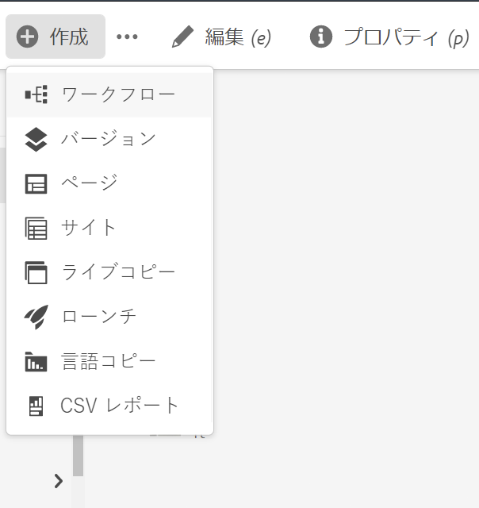
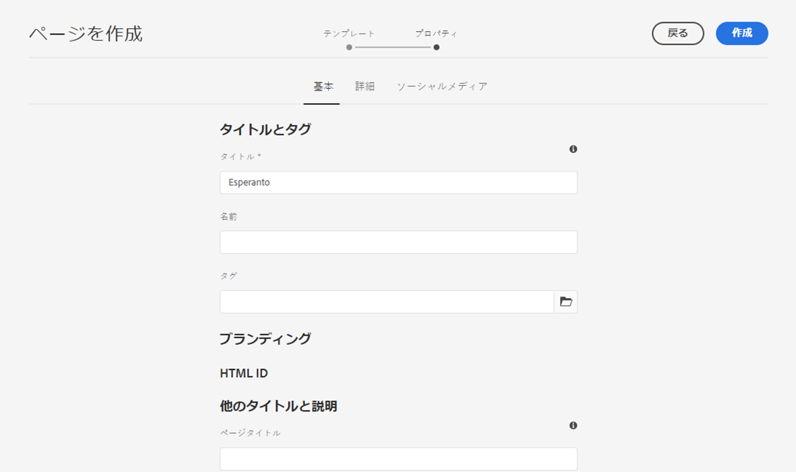
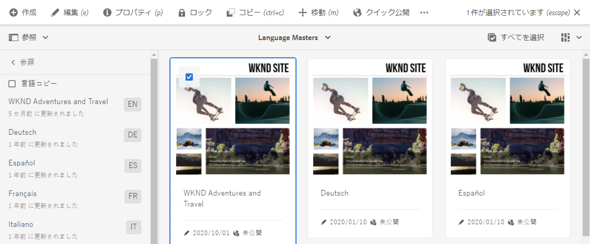
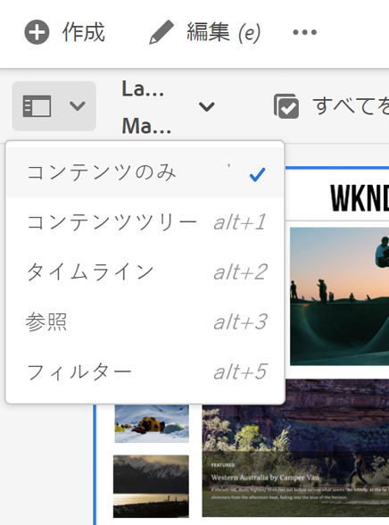

# 翻訳するコンテンツの準備 {#preparing-content-for-translation}

通常、多言語の web サイトでは、ある程度の量のコンテンツを複数の言語で提供します。サイトは 1 つの言語で作成されてから、他の言語に翻訳されます。一般に、多言語サイトはページの分岐で構成され、各分岐には異なる言語のサイトのページが含まれます。

>[!TIP]
>
>コンテンツの翻訳を初めて行う場合は、[ サイト翻訳ジャーニー](/help/journey-sites/translation/overview.md) を参照してください。これは、AEMの強力な翻訳ツールを使用してAEM Sites コンテンツを翻訳する手順を示すガイドです。AEMや翻訳の経験がないユーザーに最適です。

[WKND チュートリアルサイト](/help/implementing/developing/introduction/develop-wknd-tutorial.md)には、複数の言語ブランチが含まれています。使用される構造は次のとおりです。

```text
/content
    |- wknd
        |- language-masters
            |- en
            |- de
            |- es
            |- fr
            |- it
        |- us
            |- en
            |- es
        |- ca
            |- en
            |- fr
        |- ch
            |- de
            |- fr
            |- it
        |- de
            |- de
        |- fr
            |- fr
        |- es
            |- es
        |- it
            |- it
```

サイトのコンテンツを最初にオーサリングするための言語コピーが言語マスターです。言語マスターは、他の言語に翻訳されるソースです。

サイトの各言語分岐は、言語コピーと呼ばれます。言語コピーのルートフォルダー（言語ルート）が、言語コピー内のコンテンツの言語を識別します。例えば、`/content/wknd/fr` は、フランス語の言語コピー用の言語ルートです。ソースサイトの翻訳の実行時に適切な言語がターゲットになるように、言語コピーは、[正しく設定された言語ルート](preparation.md#creating-a-language-root)を使用する必要があります。

翻訳するサイトを準備するには、次の手順を使用します。

1. 言語マスターの言語ルートを作成します。例えば、英語 WKND Demo Site の言語ルートは `/content/wknd/language-masters/en` です。[言語ルートの作成](preparation.md#creating-a-language-root)に記載の情報に従って言語ルートが正しく設定されていることを確認してください。
1. 言語マスターのコンテンツをオーサリングします。
1. サイトの各言語コピーの言語ルートを作成します。例えば、WKND のサンプルサイトのフランス語の言語コピーは `/content/wknd/language-masters/fr` です。

翻訳するコンテンツの準備が完了したら、言語コピーおよび関連する翻訳プロジェクトの不足ページを自動的に作成できます（[ 翻訳プロジェクトの作成 ](managing-projects.md) を参照）。AEMのコンテンツ翻訳プロセスの概要については、[ 多言語サイトのコンテンツの翻訳 ](overview.md) を参照してください。

## 言語ルートの作成 {#creating-a-language-root}

コンテンツの言語を識別する言語コピーのルートページとして言語ルートを作成します。言語ルートを作成したら、その言語コピーを含む翻訳プロジェクトを作成できます。

言語ルートを作成するには、ページを作成し、「**名前**」プロパティの値として ISO 言語コードを使用します。言語コードは次のどちらかの形式にしてください。

* `<language-code>`：サポートされている言語コードは、ISO-639-1 で定義されている 2 文字のコード（例：`en`）です。
* `<language-code>_<country-code>` または `<language-code>-<country-code>`：サポートされている国コードは、ISO 3166 で定義されている小文字または大文字 2 文字のコードです（例：`en_US`、`en_us`、`en_GB`、`en-gb`）。

グローバルサイト用に選択した構造に従って、どちらかの形式を使用できます。例えば、WKND サイトのフランス語の言語コピーのルートページには、**名前**&#x200B;プロパティとして `fr` があります。「**名前**」プロパティは、リポジトリ内の page ノードの名前として使用されるため、このプロパティによってページのパス（`http://<host>:<4502>/content/wknd/language-masters/fr.html`）が指定されます。

1. サイトに移動します。
1. 言語コピーを作成するサイトを選択します。
1. **作成**／**ページ**&#x200B;を選択します。

   

1. ページテンプレートを選択して、「**次へ**」を選択します。
1. 「**名前**」フィールドに国コードを入力します。国コードの形式は `<language-code>` または `<language-code>_<country-code>` です（例：`en`、`en_US`、`en_us`、`en_GB`、`en_gb`）。ページのタイトルを入力します。

   

1. 「**作成**」を選択します。確認のダイアログボックスで、「**完了**」を選択して Sites コンソールに戻ります。または「**開く**」を選択して言語コピーを開きます。

## 言語ルートのステータスの確認 {#seeing-the-status-of-language-roots}

AEM には&#x200B;**参照**&#x200B;パネルがあります。このパネルには、作成された言語ルートのリストが表示されます。



次の手順に従い、[パネルセレクター](/help/sites-cloud/authoring/basic-handling.md#rail-selector)を使用して、ページの言語コピーを表示します。

1. Sites コンソールで、サイトのページを選択し、「**参照**」を選択します。

   

1. 参照パネルで、「**言語コピー**」を選択します。Web サイトの言語コピーがパネルに表示されます。

## 複数のレベルの言語コピー {#multiple-levels}

言語ルートは、言語コピーのルートを認識できる状態で、ノード（地域など）の下にグループ化することもできます。

```text
/content
    |- wknd
        |- language-masters
            |- europe
                |- de
                |- fr
                |- it
                |- es
                ]- pt
            |- americas
                |- en
                |- es
                |- fr
                |- pt
            |- asia
                |- ...
            |- africa
                |- ...
            |- oceania
                |- ...
        |- europe
        |- americas
        |- asia
        |- africa
        |- oceania            
```

>[!NOTE]
>
>1 レベルのみ許可されます。例えば、次の場合、`es` ページで言語コピーを解決することはできません。
>
>* `/content/wknd/language-masters/en`
>* `/content/wknd/language-masters/americas/central-america/es`
>
> この `es` 言語コピーは、`en` ノードから 2 レベル離れている（`americas/central-america`）ので、検出されません。

>[!TIP]
>
>このような設定では、言語ルートは、言語の ISO コードだけでなく、任意のページ名を持つことができます。AEM は常に最初にパスと名前を確認しますが、ページ名で言語が識別されない場合は、ページの `cq:language` プロパティを確認して言語を識別します。
