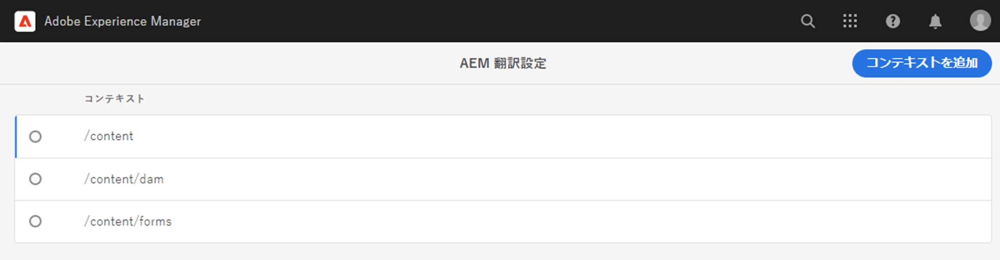
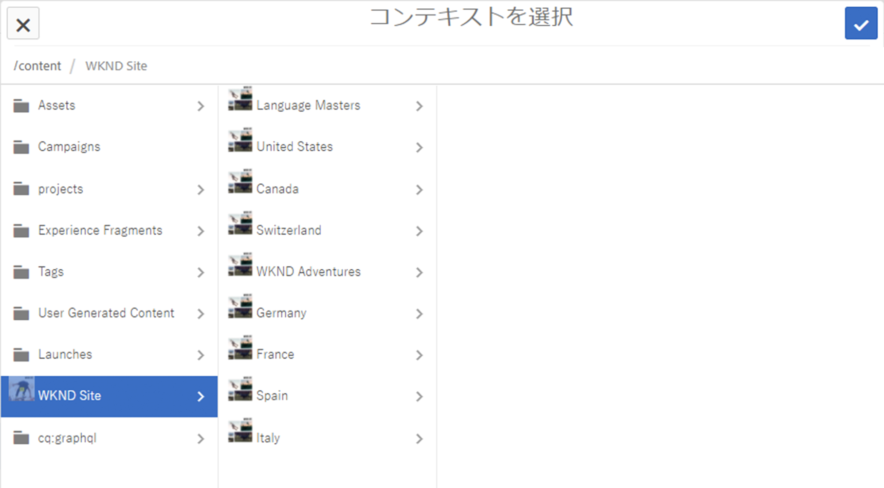
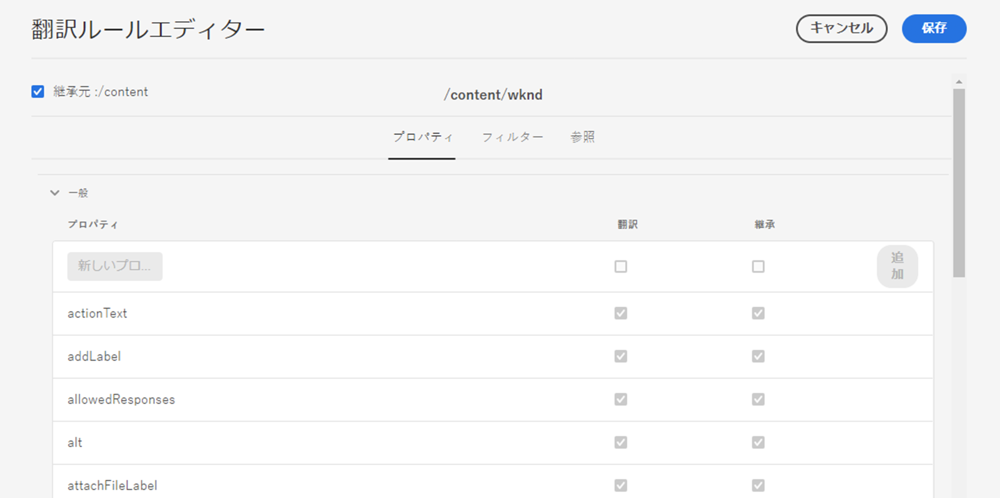
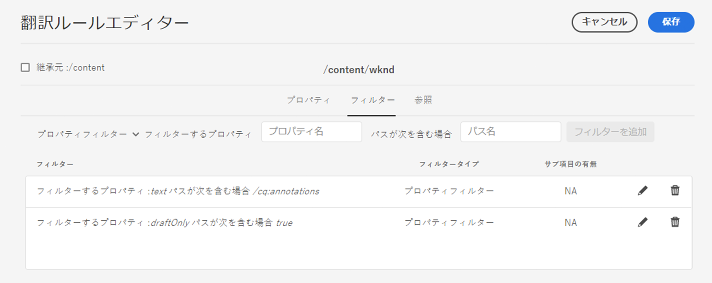
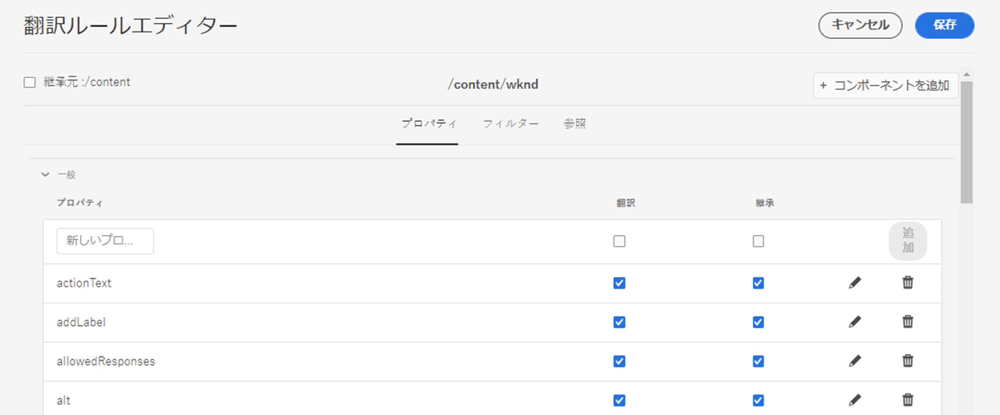

# 翻訳するコンテンツの特定 {#identifying-content-to-translate}

翻訳ルールは、翻訳プロジェクトに含まれる（または翻訳プロジェクトから除外される）ページ、コンポーネントおよびアセットについて、翻訳対象のコンテンツを特定します。ページまたはアセットの翻訳中に、AEM は翻訳対象のコンテンツを抽出し、翻訳サービスに送信できるようにします。

>[!TIP]
>
>コンテンツの翻訳を初めて行う場合は、[AEM Sites 翻訳ジャーニー](/help/journey-sites/translation/overview.md)を参照してください。これは、AEM の強力な翻訳ツールを使用して AEM Sites コンテンツを翻訳する手順を示すガイドです。AEM や翻訳の経験がないユーザーに最適です。

## コンテンツフラグメントと翻訳ルール {#content-fragments}

このドキュメントで説明されている翻訳ルールは、[翻訳統合フレームワーク設定レベル](integration-framework.md#assets-configuration-properties)で「**翻訳用にコンテンツモデルフィールドを有効にする**」オプションをアクティブ化していない場合にのみ、コンテンツフラグメントに適用されます。

「**翻訳用にコンテンツモデルフィールドを有効にする**」オプションがアクティブの場合、AEM は[コンテンツフラグメントモデル](/help/sites-cloud/administering/content-fragments/content-fragment-models.md#properties)の&#x200B;**翻訳可能**&#x200B;フィールドを使用して、そのフィールドを翻訳するかどうかを判断し、それに応じて自動的に翻訳ルールを作成します。このオプションは、作成済みの翻訳ルールより優先され、介入や追加の手順は必要ありません。

翻訳ルールを使用してコンテンツフラグメントを翻訳する場合は、翻訳統合フレームワーク設定の「**翻訳用にコンテンツモデルフィールドを有効にする**」オプションを無効にする必要があります。また、ルールを作成するには、以下の手順に従う必要があります。

## 概要 {#overview}

ページとアセットは、JCR リポジトリー内のノードとして表されます。抽出されるコンテンツはノードの 1 つ以上のプロパティ値です。抽出するコンテンツを格納するプロパティは翻訳ルールで特定されます。

翻訳ルールは XML 形式で表現され、次の場所に格納されています。

* `/libs/settings/translation/rules/translation_rules.xml`
* `/apps/settings/translation/rules/translation_rules.xml`
* `/conf/global/settings/translation/rules/translation_rules.xml`

このファイルはすべての翻訳プロジェクトに適用されます。

ルールには以下の情報が含まれます。

* ルールが適用されるノードのパス
   * ノードの子ノードにもルールが適用されます。
* 翻訳するコンテンツを含んだノードプロパティの名前
   * このプロパティは、特定のリソースタイプに固有のものでも、すべてのリソースタイプに固有のものでもかまいません。

例えば、ページ上のすべてのテキストコンポーネントに作成者が追加するコンテンツを翻訳するルールを作成できます。このルールでは、`/content` ノードと `core/wcm/components/text/v2/text` コンポーネントの `text` プロパティを識別できます。

翻訳ルールの設定用に追加された[コンソール](#translation-rules-ui)があります。UI での定義の内容がファイルに自動的に入力されます。

AEM のコンテンツ翻訳機能の概要については、[多言語サイトのコンテンツの翻訳](overview.md)を参照してください。

>[!NOTE]
>
>AEM は、ページ上の参照コンテンツの翻訳に関して、リソースタイプと参照属性の 1 対 1 マッピングをサポートしています。

## ページ、コンポーネントおよびアセット用のルールの構文 {#rule-syntax-for-pages-components-and-assets}

ルールとは、1 個以上の `node` 子要素と 0 個以上の `property` 子要素を含む `node` 要素です。

```xml
<node path="content path">
          <property name="property name" [translate="false"]/>
          <node resourceType="component path" >
               <property name="property name" [translate="false"]/>
          </node>
</node>
```

これらの各 `node` 要素には以下の特徴があります。

* `path` 属性には、ルールが適用されるブランチのルートノードのパスが格納されます。
* `property` 子要素は、すべてのリソースタイプについて、翻訳するノードプロパティを特定します。
   * `name` 属性には、プロパティ名が格納されます。
   * プロパティが翻訳されていない場合、オプションの `translate` 属性は `false` になります。デフォルト値は `true` です。この属性は、以前のルールを上書きする場合に役立ちます。
* `node` 子要素は、特定のリソースタイプについて、翻訳するノードプロパティを特定します。
   * `resourceType` 属性には、リソースタイプを実装するコンポーネントに解決されるパスが格納されます。
   * `property` 子要素は、翻訳するノードプロパティを特定します。このノードは、ノードルールの `property` 子要素と同じ方法で使用します。

以下のルール例を適用すると、`/content` ノード下のすべてのページについて、すべての `text` プロパティのコンテンツが翻訳されます。このルールは、テキストコンポーネントなど、`text` プロパティにコンテンツを格納するすべてのコンポーネントに対して有効です。

```xml
<node path="/content">
          <property name="text"/>
</node>
```

次の例では、すべての `text` プロパティのコンテンツを翻訳し、画像コンポーネントのその他のプロパティも翻訳します。その他のコンポーネントに同じ名前のプロパティが含まれている場合、それらのプロパティにはルールが適用されません。

```xml
<node path="/content">
      <property name="text"/>
      <node resourceType="core/wcm/components/image/v2/image">
         <property name="image/alt"/>
         <property name="image/jcr:description"/>
         <property name="image/jcr:title"/>
      </node>
</node>
```

## ページからアセットを抽出するルールの構文  {#rule-syntax-for-extracting-assets-from-pages}

次に示すルールの構文を使用して、コンポーネントに埋め込むアセットまたはコンポーネントから参照するアセットを追加します。

```xml
<assetNode resourceType="path to component" assetReferenceAttribute="property that stores asset"/>
```

各 `assetNode` 要素には以下の特徴があります。

* 1 つの `resourceType` 属性は、コンポーネントに解決されるパスと等しくなります。
* 1 つの `assetReferenceAttribute` 属性は、（埋め込みアセット用の）アセットバイナリを格納するプロパティの名前または参照先のアセットのパスと等しくなります。

次の例では、画像コンポーネントから画像を抽出します。

```xml
<assetNode resourceType="core/wcm/components/image/v2/image" assetReferenceAttribute="fileReference"/>
```

## ルールの上書き {#overriding-rules}

`translation_rules.xml` ファイルは、複数の `node` 子要素を持つ `nodelist` 要素で構成されます。AEM は、このノードリストを上から下に読み取ります。複数のルールが同じノードをターゲットにする場合は、ファイル内で下方にあるルールが使用されます。例えば、以下のルールを適用すると、ページの `/content/mysite/en` ブランチを除く、`text` プロパティのすべてのコンテンツが翻訳されます。

```xml
<nodelist>
     <node path="/content">
           <property name="text" />
     </node>
     <node path="/content/mysite/en">
          <property name="text" translate="false" />
     </node>
<nodelist>
```

## プロパティのフィルタリング {#filtering-properties}

`filter` 要素を使用して、特定のプロパティを持つノードをフィルタリングできます。

例えば、次のルールを使用すると、プロパティ `text` が `draft` に設定されている場合を除き、`true` プロパティのすべてのコンテンツが翻訳されます。

```xml
<nodelist>
    <node path="/content">
     <filter>
   <node containsProperty="draft" propertyValue="true" />
     </filter>
        <property name="text" />
    </node>
<nodelist>
```

## 翻訳ルール UI {#translation-rules-ui}

コンソールを使用して翻訳ルールを設定することもできます。

コンソールにアクセスするには：

1. **ツール**／**一般**&#x200B;に移動します。

1. 「**翻訳設定**」を選択します。

翻訳ルール UI では、次の操作を行えます。

1. **コンテキストを追加**&#x200B;でパスを追加できます。

   

1. パスブラウザーを使用して必要なコンテキストを選択し、「**確認**」ボタンを選択して保存します。

   

1. 次に、コンテキストを選択して「**編集**」をクリックする必要があります。翻訳ルールエディターが開きます。

   

この UI を使用して変更できる属性は、次のとおり 4 つあります。

* `isDeep`
* `inherit`
* `translate`
* `updateDestinationLanguage`

### isDeep {#isdeep}

**`isDeep`** はノードフィルターに適用可能で、デフォルトでは true です。ノード（またはその上位ノード）に、フィルターで指定されたプロパティ値を持つそのプロパティが含まれているかどうかをチェックします。false の場合は、現在のノードのみでチェックします。

例えば、ドラフトコンテンツであることを示すために親ノードの `draftOnly` プロパティが true に設定されている場合でも、子ノードは翻訳ジョブに追加されます。ここで、`isDeep` が機能し、親ノードの `draftOnly` プロパティが true であるかどうかをチェックして、それらの子ノードを除外します。

エディターでは、「**フィルター**」タブで「**サブ項目の有無**」をチェックまたはチェック解除できます。



UI で「**サブ項目の有無**」をチェック解除した場合に得られる XML の例を次に示します。

```xml
 <filter>
    <node containsProperty="draftOnly" isDeep="false" propertyValue="true"/>
</filter>
```

### inherit {#inherit}

**`inherit`** はプロパティに適用できます。デフォルトではすべてのプロパティが継承されますが、一部のプロパティが子で継承されないようにする場合は、その特定のノードのみに適用されるように、そのプロパティを false に指定できます。

UI では、「**プロパティ**」タブで「**継承**」をチェックまたはチェック解除できます。

### translate {#translate}

**`translate`** は、プロパティを翻訳するかどうかを指定するためにのみ使用されます。

UI では、「**プロパティ**」タブで「**翻訳**」をチェックまたはチェック解除できます。

### updateDestinationLanguage {#updatedestinationlanguage}

**`updateDestinationLanguage`** は、テキストがなく言語コード（`jcr:language` など）はあるプロパティに使用されます。ユーザーはテキストを翻訳するのではなく、言語ロケールをソースから宛先に翻訳します。そのようなプロパティは、翻訳用に送信されません。

UI では、言語コードを値として持つ特定のプロパティについてのみ、「**プロパティ**」タブで「**翻訳**」をチェックまたはチェック解除してこの値を変更できます。

`updateDestinationLanguage` と `translate` の違いを明確にするために、ルールが 2 つのみのコンテキストの単純な例を次に示します。



xml での結果は、次のようになります。

```xml
<property inherit="true" name="text" translate="true" updateDestinationLanguage="false"/>
<property inherit="true" name="jcr:language" translate="false" updateDestinationLanguage="true"/>
```

## ルールファイルの手動編集 {#editing-the-rules-file-manually}

AEM と共にインストールされる `translation_rules.xml` ファイルには、デフォルトの翻訳ルールセットが記述されています。翻訳プロジェクトの要件をサポートするように、このファイルを編集できます。例えば、カスタムコンポーネントのコンテンツが翻訳されるように、ルールを追加できます。

`translation_rules.xml` ファイルを編集する場合は、バックアップコピーをコンテンツパッケージに保存しておきます。特定の AEM パッケージを再インストールすると、現在の `translation_rules.xml` ファイルが元のファイルに置き換わる可能性があります。この状況でルールを復元するには、バックアップコピーを含むパッケージをインストールします。

>[!NOTE]
>
>コンテンツパッケージを作成した後は、ファイルを編集するたびにパッケージを再作成してください。

## 翻訳ルールファイルの例 {#example-translation-rules-file}

```xml
<?xml version="1.0" encoding="UTF-8"?><nodelist>
  <node path="/content">
    <property name="addLabel"/>
    <property name="allowedResponses"/>
    <property name="alt"/>
    <property name="attachFileLabel"/>
    <property name="benefits"/>
    <property name="buttonLabel"/>
    <property name="chartAlt"/>
    <property name="confirmationMessageToggle"/>
    <property name="confirmationMessageUntoggle"/>
    <property name="constraintMessage"/>
    <property name="contentLabel"/>
    <property name="denyText"/>
    <property name="detailDescription"/>
    <property name="emptyText"/>
    <property name="helpMessage"/>
    <property name="image/alt"/>
    <property name="image/jcr:description"/>
    <property name="image/jcr:title"/>
    <property name="jcr:description"/>
    <property name="jcr:title"/>
    <property name="heading"/>
    <property name="label"/>
    <property name="main"/>
    <property name="listLabel"/>
    <property name="moreText"/>
    <property name="pageTitle"/>
    <property name="placeholder"/>
    <property name="requiredMessage"/>
    <property name="resetTitle"/>
    <property name="subjectLabel"/>
    <property name="subtitle"/>
    <property name="tableData"/>
    <property name="text"/>
    <property name="title"/>
    <property name="navTitle"/>
    <property name="titleDivContent"/>
    <property name="toggleLabel"/>
    <property name="transitionLabel"/>
    <property name="untoggleLabel"/>
    <property name="name"/>
    <property name="occupations"/>
    <property name="greetingLabel"/>
    <property name="signInLabel"/>
    <property name="signOutLabel"/>
    <property name="pretitle"/>
    <property name="cq:panelTitle"/>
    <property name="actionText"/>
    <property name="cq:language" updateDestinationLanguage="true"/>
    <node pathContains="/cq:annotations">
      <property name="text" translate="false"/>
    </node>
    <node path="/content/wknd"/>
  </node>
  <node path="/content/forms">
    <property name="text" translate="false"/>
  </node>
  <node path="/content/dam">
    <property name="dc:description"/>
    <property name="dc:rights"/>
    <property name="dc:subject"/>
    <property name="dc:title"/>
    <property name="defaultContent"/>
    <property name="jcr:description"/>
    <property name="jcr:title"/>
    <property name="pdf:Title"/>
    <property name="xmpRights:UsageTerms"/>
    <property name="main"/>
    <property name="adventureActivity"/>
    <property name="adventureDescription"/>
    <property name="adventureDifficulty"/>
    <property name="adventureGearList"/>
    <property name="adventureGroupSize"/>
    <property name="adventureItinerary"/>
    <property name="adventurePrice"/>
    <property name="adventureTitle"/>
    <property name="adventureTripLength"/>
    <property name="adventureType"/>
    <node pathContains="/jcr:content/metadata/predictedTags">
      <property name="name"/>
    </node>
  </node>
  <assetNode assetReferenceAttribute="fragmentPath" resourceType="cq/experience-fragments/editor/components/experiencefragment"/>
  <assetNode assetReferenceAttribute="fragmentVariationPath" resourceType="core/wcm/components/experiencefragment/v1/experiencefragment"/>
  <assetNode assetReferenceAttribute="fileReference" resourceType="dam/cfm/components/contentfragment"/>
  <assetNode resourceType="docs/components/download"/>
  <assetNode resourceType="docs/components/image"/>
  <assetNode assetReferenceAttribute="fileReference" resourceType="foundation/components/image"/>
  <assetNode assetReferenceAttribute="asset" resourceType="foundation/components/video"/>
  <assetNode assetReferenceAttribute="fileReference" resourceType="foundation/components/download"/>
  <assetNode assetReferenceAttribute="fileReference" resourceType="core/wcm/components/download/v1/download"/>
  <assetNode assetReferenceAttribute="fileReference" resourceType="wcm/foundation/components/image"/>
  <assetNode assetReferenceAttribute="fragmentPath" resourceType="core/wcm/components/contentfragment/v1/contentfragment"/>
  <assetNode assetReferenceAttribute="fileReference" resourceType="core/wcm/components/image/v2/image"/>
</nodelist>
```
