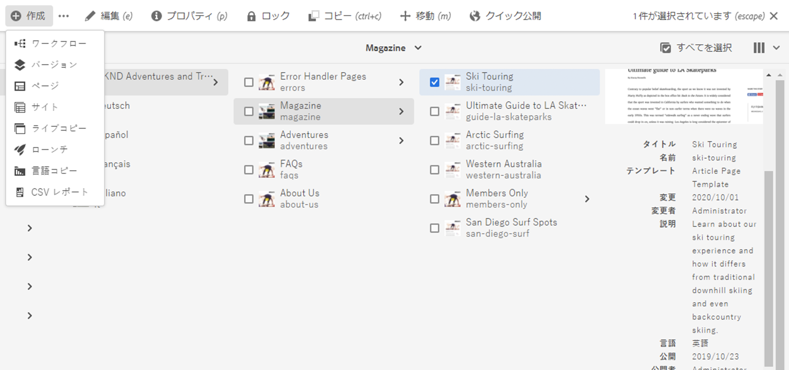
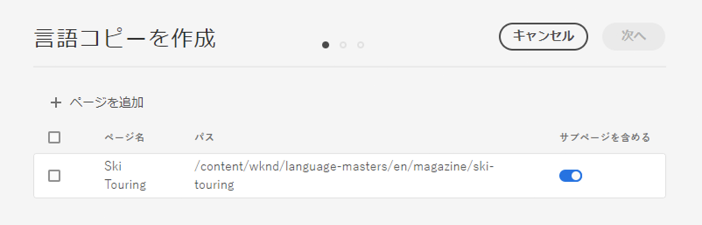
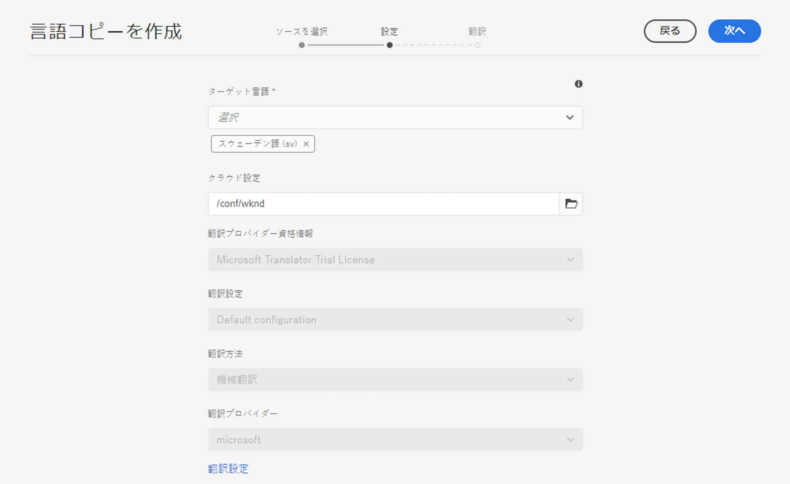
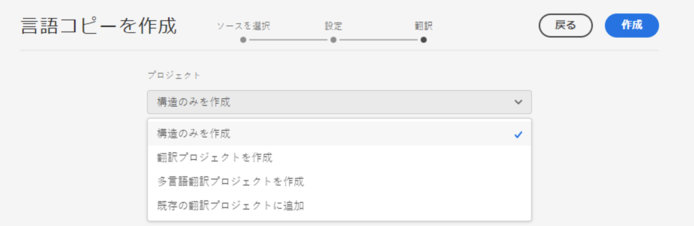
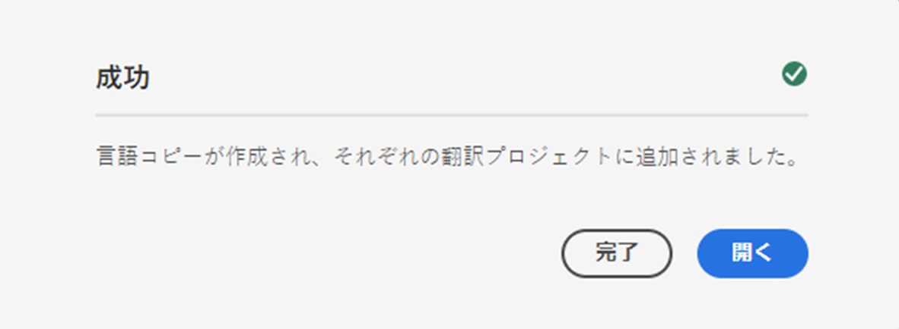

# 言語コピーウィザード {#language-copy-wizard}

言語コピーウィザードは、多言語コンテンツ構造を作成して実装するためのガイド付きエクスペリエンスです。ウィザードを使用すると、言語コピーを簡単かつ迅速に作成できます。

>[!TIP]
>
>コンテンツの翻訳を初めて行う場合は、[AEM Sites 翻訳ジャーニー](/help/journey-sites/translation/overview.md)を参照してください。これは、AEM の強力な翻訳ツールを使用して AEM Sites コンテンツを翻訳する手順を示すガイドです。AEM や翻訳の経験がないユーザーに最適です。

>[!NOTE]
>
>サイトの言語コピーを作成するには、ユーザーは `project-administrators` グループのメンバーである必要があります。

ウィザードにアクセスするには、次の手順を実行します。

1. Sites コンソールで、ページを選択し、「**作成**」を選択して、「**言語コピー**」を選択します。

   

1. ウィザードが開き、**ソースを選択**&#x200B;の手順が表示されます。この手順を使用して、ページを追加および削除できます。サブページを含めるか除外するオプションもあります。含めるページを選択し、「**Next**」を選択します。

   

1. ウィザードの&#x200B;**設定**&#x200B;手順を実行すると、言語の追加と削除、翻訳方法の選択を行うことができます。「**次へ**」を選択します。

   

   >[!NOTE]
   >
   >デフォルトでは、翻訳設定は 1 つのみです。他の設定を選択するには、最初にクラウド設定を行う必要があります。[翻訳統合フレームワークの設定](integration-framework.md)を参照してください。

1. ウィザードの&#x200B;**翻訳**&#x200B;手順では、構造のみの作成、翻訳プロジェクトの作成、既存の翻訳プロジェクトに追加のいずれかを選択できます。

   >[!NOTE]
   >
   >前の手順で複数言語を選択した場合は、複数の翻訳プロジェクトが作成されます。

   

1. 「**作成**」ボタンをクリックすると、ウィザードは終了します。「**完了**」を選択してウィザードを閉じるか、「**開く**」を選択して結果の翻訳プロジェクトを表示します。

   
