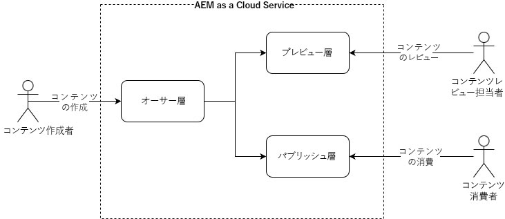

# オーサリングとパブリッシングの概念 {#authoring-publishing}

コンテンツ作成者にとって、AEM as a Cloud Service のインストールは、最も基本的なレベルの 3 つのプライマリ層として考えることができます

* オーサー層
* プレビュー層
* パブリッシュ層

これらの層は相互作用することで、コンテンツが web サイト上で利用できるようになり、訪問者がアクセスできるようになります。基本的なワークフローは次のとおりです。

1. コンテンツ作成者は、オーサー層を使用してコンテンツを作成します。
1. コンテンツ作成者は、プレビュー層を使用して、コンテンツをレビュアーがプレビューできるようにします。
1. コンテンツが公開される準備が整ったら、作成者は、パブリッシュ層を使用してコンテンツを公開します。

コンテンツには、ページ、アセット、パブリケーションなど、様々なタイプがあります。コンテンツのプレビューは、作成者の裁量でスキップできます。

Adobe Experience Manager as a Cloud Serviceの技術的アーキテクチャについて詳しくは、「AEM as a Cloud Serviceのアーキテクチャの概要 [ を参照してくだ ](/help/overview/architecture.md) い。

{{edge-delivery-authoring}}

## コンテンツのオーサリング {#author-environment}

オーサー層のオーサリング環境では、コンテンツを作成するための使いやすいグラフィカルユーザーインターフェイスを提供します。作成者は、適切なアクセス権が割り当てられたアカウントを使用してログインする必要があります。

使用しているインスタンスや個人のアクセス権の設定に合わせて、コンテンツに対して次のように様々なタスクを実行できます。

* ページでの新しいコンテンツの生成や既存のコンテンツの編集
* 事前定義済みのテンプレートを使用した、コンテンツページの作成
* アセットやコレクションの作成、編集、管理
* コンテンツページやアセットなどの移動、コピー、削除
* ページおよびアセットの公開（または非公開）。

さらに、コンテンツの管理に役立つ次のような管理タスクがあります。

* 変更の管理方法を制御するワークフロー（公開前のレビューの適用など）
* 個々のタスクを調整するプロジェクト

AEM はオーサー環境からも管理されます。

オーサリングプロセスの概要については、[オーサリングのクイックスタートガイド](/help/sites-cloud/authoring/quick-start.md)ドキュメントを参照してください。

## コンテンツのプレビュー {#previewing-content}

AEM ではプレビューサービスも提供されており、web サイトがパブリッシュ環境になって一般公開される前に、開発者とコンテンツ作成者が web サイトの最終的なエクスペリエンスをプレビューすることができます。

詳しくは、[コンテンツのプレビュー](/help/sites-cloud/authoring/sites-console/previewing-content.md)ドキュメントを参照してください。

## パブリッシュ環境 {#publish-environment}

準備が完了したサイトのコンテンツは、パブリッシュ層のパブリッシュ環境に公開されます。対象となるオーディエンスは、コンテンツテンプレートのルックアンドフィールに従って web サイトのページを利用できます。

ページの公開と非公開について詳しくは、[ページの公開](/help/sites-cloud/authoring/sites-console/publishing-pages.md)ドキュメントを参照してください。

## Dispatcher {#dispatcher}

Web サイトの訪問者に対するパフォーマンスを最適化するには、**[Dispatcher](/help/implementing/dispatcher/overview.md)** を使用してパブリッシュ層とプレビュー層の両方にロードバランシングとキャッシングを実装します。
