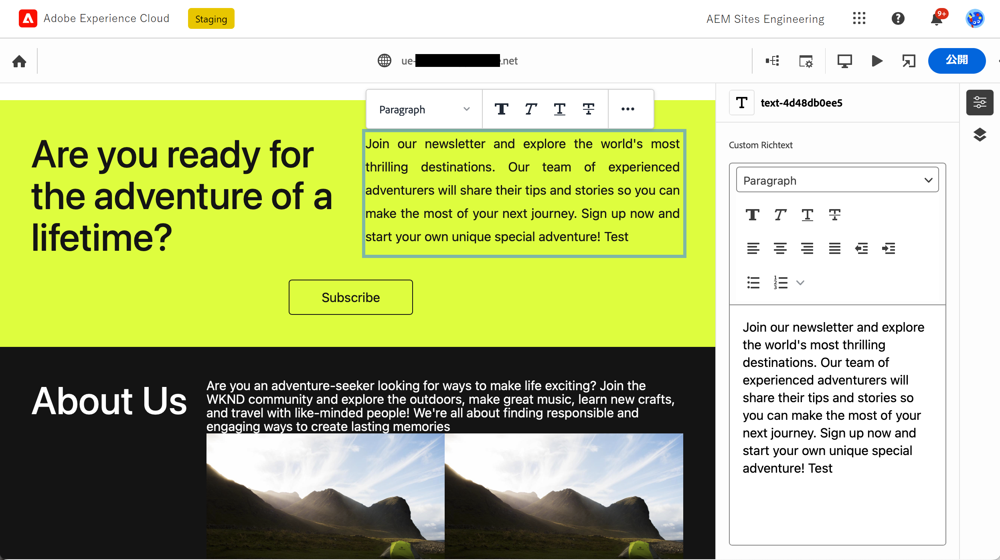
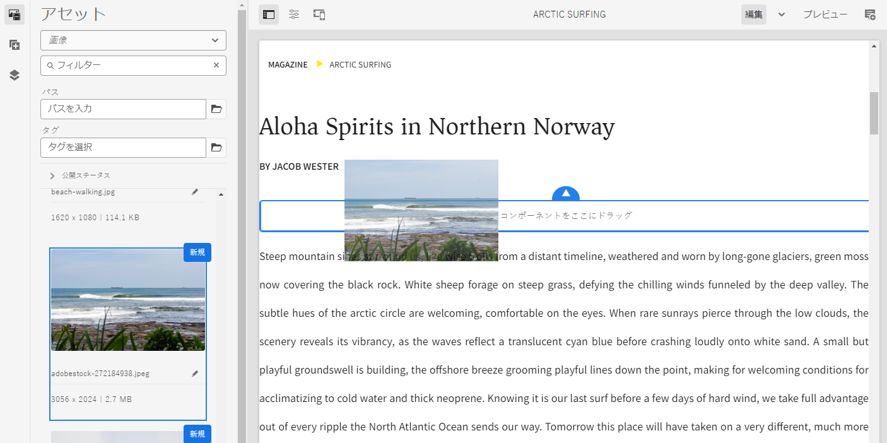

# AEM でコンテンツをオーサリングする方法 {#authoring-methods}

AEM でコンテンツを作成する様々な方法、その違い、どのような場合にそれぞれの方法を使用するかについて説明します。

## AEM オーサリングの柔軟性 {#authoring-flexibility}

AEM as a Cloud Service には、各種コンテンツを編集するための様々なエディターが用意されており、様々なオーサリングの使用例もサポートしています。

* [ユニバーサルエディターを使用した WYSIWYG オーサリング](#universal-editor)：ユニバーサルエディターは、コンテンツに依存しない方法で AEM コンテンツを作成できる最新の UI であり、Edge Delivery Services を活用した AEM プロジェクトで使用できます。
* [ページエディターを使用した WYSIWYG オーサリング](#page-editor)：ページエディターは、AEM でのコンテンツのオーサリングに使用されている従来のエディターであり、何千もの web サイトで実証され、信頼されています。
* [ドキュメントベースのオーサリング](#document-based)：Edge Delivery Services を使用する場合、AEM コンソールの完全な外部で、Microsoft Word ドキュメントや Google ドキュメントなどの従来のドキュメントとしてコンテンツを作成することもできます。
* [AEM コンテンツフラグメントエディタ ](#cf-editor)：ヘッドレスコンテンツを作成する場合に最適なエディターです。

AEM の統合された拡張性のある特性により、プロジェクトのニーズに応じて、これらの方法を単独で使用することも、相互に組み合わせて使用することもできます。

使用可能なオーサリングオプションが不明な場合や、コンテンツのオーサリング用の新しいオプションを検討したい場合は、システム管理者またはプロジェクトマネージャーにお問い合わせください。

## ユニバーサルエディターを使用した WYSIWYG オーサリング {#universal-editor}

ユニバーサルエディターは、コンテンツに依存しない方法で AEM コンテンツを作成できる最新の UI です。Edge Delivery Services を活用する AEM プロジェクトの最初の選択肢になります。

ユニバーサルエディターには AEM 内の Sites コンソールからアクセスしますが、そのパワーやコンテンツに依存しない柔軟性により、AEM コンテンツだけでなく、適切にインストルメント化された外部コンテンツも作成することができます。

ユニバーサルエディターについて詳しくは、[ユニバーサルエディターを使用したコンテンツのオーサリング](/help/sites-cloud/authoring/universal-editor/authoring.md)のドキュメントを参照してください。

## ページエディターを使用した WYSIWYG オーサリング {#page-editor}

これは、従来の AEM プロジェクトでコンテンツをオーサリングするための従来のエディターです。何千もの web サイトで実証され、信頼されています。

AEM ページエディターは、WYSIWYG（見た通りの）インターフェイスを使用して、コンテンツをオーサリングするための統合環境を提供します。事前定義されたコンポーネントをドラッグ＆ドロップしてページを作成し、コンテンツをインプレースで編集します。

AEM ページエディターについて詳しくは、[AEM ページエディター](/help/sites-cloud/authoring/page-editor/introduction.md)のドキュメントを参照してください。

## ドキュメントベースのオーサリング  {#document-based}

Edge Delivery Services を使用する場合は、[AEM **Sites** コンソール](/help/sites-cloud/authoring/sites-console/introduction.md)の完全な外部で、Microsoft Word や Google Docs などの従来のドキュメントとして、コンテンツを作成できます。

ドキュメントベースのオーサリングでは、作成者は既に使い慣れたツールを使用して、AEM の Edge Delivery Services の速度とパフォーマンスのメリットを活用しながらコンテンツを公開できます。ドキュメントベースのオーサリングでは、AEM コンソールを使用する必要はありません。

ドキュメントベースのオーサリングについて詳しくは、[コンテンツのオーサリングと公開](/help/edge/docs/authoring.md)を参照してください。

## AEM コンテンツフラグメントエディター {#cf-editor}

AEM コンテンツフラグメントエディターは、ヘッドレスコンテンツを作成する場合に最適なエディターです。

AEM コンテンツフラグメントエディターは、ヘッドレス配信に最適な、構造化コンテンツを作成および管理するための明確なインターフェイスを提供します。

AEM コンテンツフラグメントエディターについて詳しくは、[コンテンツフラグメントの管理](/help/sites-cloud/administering/content-fragments/managing.md)および[コンテンツフラグメントのオーサリング](/help/sites-cloud/administering/content-fragments/managing.md)のドキュメントを参照してください。

>[!NOTE]
>
>この節でハイライト表示されている&#x200B;*新しい*&#x200B;エディターは、AEM as a Cloud Service をローカルで開発する場合には使用できません。
>
>[*オリジナル*&#x200B;コンテンツフラグメントエディター](/help/assets/content-fragments/content-fragments-variations.md)も利用できます。
