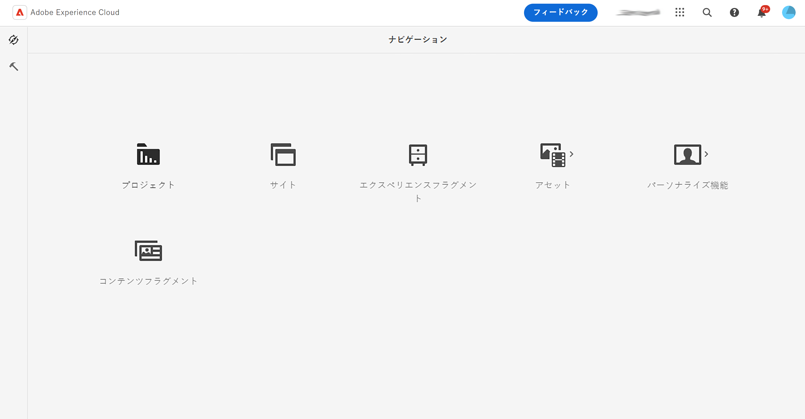
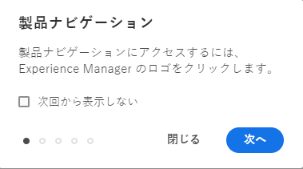
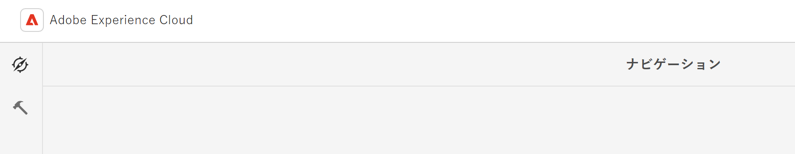
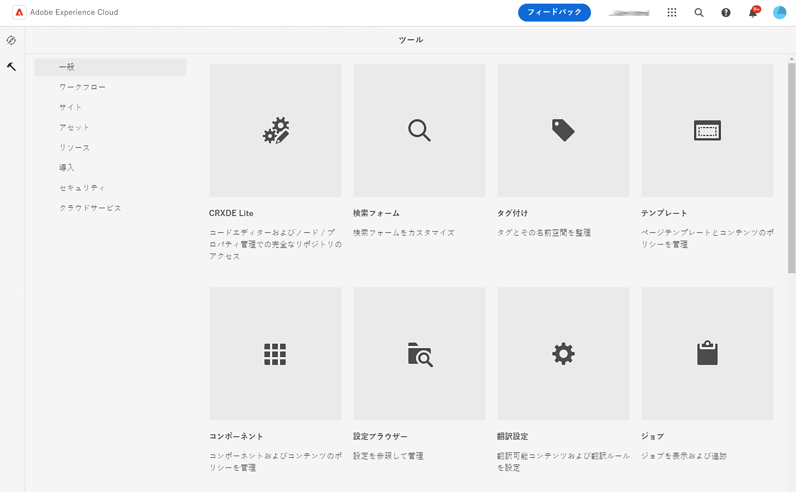
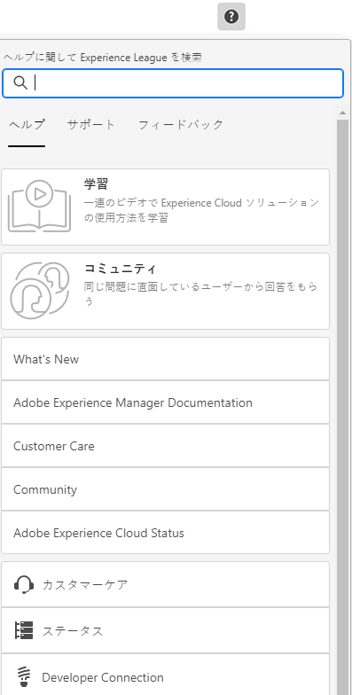
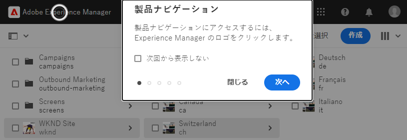
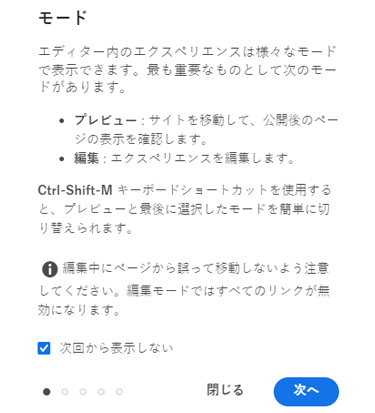

# 基本操作 {#basic-handling}

このドキュメントでは、AEM オーサー環境を使用する際の基本操作の概要をまとめています。

>[!TIP]
>
>AEM 全体でキーボードショートカットを利用できます。特に、[Sites コンソール](/help/sites-cloud/authoring/sites-console/keyboard-shortcuts.md)や[ページエディター](/help/sites-cloud/authoring/page-editor/keyboard-shortcuts.md)を使用する場合です。

## タッチ対応 UI {#a-touch-enabled-ui}

AEM のユーザーインターフェイスは、タッチ操作に対応しています。タッチ対応インターフェイスを使用すると、タップ、タップ＆ホールド、スワイプなどのジェスチャーを使用して、ソフトウェアをタッチで操作できます。AEM UI はタッチ対応なので、携帯電話やタブレットなどのタッチデバイスでタッチジェスチャーを使用できます。ただし、従来のデスクトップデバイスでのマウス操作も可能で、その場合はコンテンツのオーサリング方法を柔軟に選択できます。

## 最初の手順 {#first-steps}

ログインするとすぐに、[ナビゲーションパネル](#navigation-panel)が表示されます。いずれかのオプションを選択すると、それぞれのコンソールが開きます。

AEM の基本的な使用方法を適切に理解できるように、このドキュメントでは **Sites** コンソールに基づいて説明します。「**Sites**」を選択して開始します。

## 製品ナビゲーション {#product-navigation}

ユーザーが初めてコンソールにアクセスすると、必ず製品ナビゲーションチュートリアルが開始されます。ここで時間を割いて、ひととおり選択し、AEM の基本操作の概要を把握してください。

「**次へ**」を選択して、概要の次のページに進みます。「**閉じる**」を選択するか、概要ダイアログの外側を選択して閉じます。

すべてのスライドを表示するか「**次回から表示しない**」オプションをオンにする場合を除き、概要は、次回コンソールにアクセスすると再び開始します。

## グローバルナビゲーション {#global-navigation}

グローバルナビゲーションパネルを使用してコンソール間を移動できます。これは、画面の左上にある **Adobe Experience Manager** リンクを選択すると、フルスクリーンのドロップダウンとしてトリガーされます。

「**閉じる**」をクリックまたはタップすると、グローバルナビゲーションパネルが閉じて、前の場所に戻ることができます。

グローバルナビゲーションには、2 つのパネルがあり、画面の左余白にアイコンで表示されます。

* **[ナビゲーション](#navigation-panel)** - AEM へのログイン時のコンパスとデフォルトのパネルで表示
* **[ツール](#tools-panel)** - ハンマーで表示

これらのパネルで使用できるオプションは、以下の通りです。

### ナビゲーションパネル {#navigation-panel}

**ナビゲーション**&#x200B;パネル：

コンソールやコンテンツ間を移動すると、現在の場所を反映するようにブラウザータブのタイトルが更新されます。

ナビゲーションでは、次のコンソールを使用できます。

| コンソール | 目的 |
|---|---|
| プロジェクト | プロジェクトコンソールでは、プロジェクトに直接アクセスできます。[プロジェクトは、チームの構築に使用できる仮想ダッシュボード](/help/sites-cloud/authoring/projects/overview.md)です。その後、そのチームがリソース、ワークフローおよびタスクにアクセスできるようになるので、チームメンバーが共通の目標に向かって作業できます。 |
| Sites | [Sites コンソール](/help/sites-cloud/authoring/sites-console/introduction.md)では、AEM インスタンス上で実行されるサイトの作成、表示、管理を行えます。このコンソールを通じて、ページの作成、編集、コピー、移動および削除や、ワークフローの開始、ページの公開を行うことができます。 |
| エクスペリエンスフラグメント | [エクスペリエンスフラグメント](/help/sites-cloud/authoring/fragments/content-fragments.md)は、チャネル間で再利用でき、バリエーションのあるスタンドアロンエクスペリエンスです。エクスペリエンスやエクスペリエンスの一部を繰り返しコピー＆ペーストする手間を省きます。 |
| Assets | Assets コンソールでは、[画像、ビデオ、ドキュメント、オーディオファイルなどのデジタルアセット](/help/assets/overview.md)を読み込んで、それらのデジタルアセットを管理できます。同じ AEM インスタンス上で実行されているどのサイトでも、これらのアセットを使用できます。また、Assets コンソールから[コンテンツフラグメント](/help/assets/content-fragments/content-fragments.md)を作成および管理することもできます。 |
| パーソナライズ機能 | このコンソールには、[ターゲットとなるコンテンツをオーサリングして、パーソナライズされたエクスペリエンスを提供](/help/sites-cloud/authoring/personalization/overview.md)するためのツールのフレームワークが用意されています。 |
| コンテンツフラグメント | [コンテンツフラグメント](/help/sites-cloud/administering/content-fragments/overview.md)を使用すると、ページに依存しないコンテンツの設計、作成、キュレーションおよび公開が可能になります。複数の場所や複数のチャネルで使用できる構造化コンテンツを準備でき、ページのオーサリングとヘッドレス配信の両方に最適です。 |
| バリエーションを生成 | [バリエーションを生成](/help/generative-ai/generate-variations.md)では、生成 AI（人工知能）を使用して、プロンプトに基づいてコンテンツのバリエーションを作成します。これらのプロンプトは、アドビが提供するか、ユーザーが作成および管理します。 |

## ツールパネル {#tools-panel}

**ツール**&#x200B;パネルには、同様のコンソールをグループ化した様々なカテゴリを含んだサイドパネルがあります。**ツール**&#x200B;コンソールを使用すると、web サイト、デジタルアセットおよびコンテンツリポジトリのその他の要素の管理に役立つ、いくつかの専用ツールおよびコンソールにアクセスできます。

## ヘッダー {#the-header}

ヘッダーは、常に画面の上部に表示されます。ヘッダーのほとんどのオプションは、システム内のどこにいても同じですが、コンテキストに固有のオプションもあります。

* [グローバルナビゲーション](#global-navigation) - コンソール間を移動するには、**Adobe Experience Manager** リンクを選択します。

  

* フィードバック

  

* IMS 組織 - 必要に応じて変更を選択します。

* [ソリューション](https://www.adobe.com/jp/experience-cloud.html) - これを選択すると、他のアドビソリューションにアクセスできます。

  

* [検索](/help/sites-cloud/authoring/search.md) - [ショートカットキー](/help/sites-cloud/authoring/sites-console/keyboard-shortcuts.md) `/`（スラッシュ）を使用して、任意のコンソールから検索を呼び出すこともできます。

  

* [ヘルプ](#accessing-help)

  

* [通知](/help/sites-cloud/authoring/inbox.md) - このアイコンには、現在割り当てられている未完了の通知の数を示すバッジが付きます。

  

* [ユーザープロパティ](/help/sites-cloud/authoring/account-environment.md) - ユーザー設定を変更するには、これを選択します。

  

## ヘルプへのアクセス {#accessing-help}

利用可能な多数のヘルプリソースと、それにアクセスする方法がいくつかあります。

* **ツールバー** - **ヘルプ**&#x200B;アイコンにより、現在の場所に応じた適切なリソースが開きます。

  

* **コンソール** - 初めてシステムを操作する際に、[AEM ナビゲーションを紹介する一連のスライドが表示されます。](#product-navigation)。

  

* **ページエディター** - ページを初めて編集する際に、ページエディターを紹介する一連のスライドが表示されます。

  

   * コンソールに最初にアクセスしたときの[製品ナビゲーションの概要](#product-navigation)と同様に、この概要をナビゲートします。
   * このスライドをもう一度表示するには、 [**ページ情報** メニューの「**ヘルプ**](#accessing-help)」を選択します。

* **ツールコンソール** - また、**ツール**&#x200B;コンソールから、外部&#x200B;**リソース**&#x200B;にアクセスすることもできます。

   * **文書** - Web Experience Management のドキュメントを表示します。
   * **開発者向けリソース** - 開発者向けリソースおよびダウンロードです。

>[!TIP]
>
>コンソールでは、ホットキー `?`（疑問符）を使用して、いつでもショートカットキーの概要を確認できます。
>
>すべてのキーボードショートカットの概要については、次のドキュメントを参照してください。
>
>* [ページ編集のキーボードショートカット](/help/sites-cloud/authoring/page-editor/keyboard-shortcuts.md)
>* [コンソールのキーボードショートカット](/help/sites-cloud/authoring/sites-console/keyboard-shortcuts.md)
