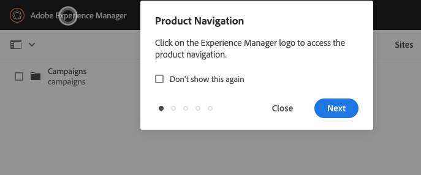
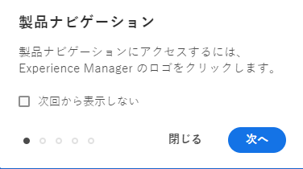

# 基本操作 {#basic-handling}

このドキュメントでは、AEMオーサー環境を使用する際の基本操作の概要を説明します。

>[!TIP]
>
>AEM 全体でキーボードショートカットを利用できます。特に [サイトコンソールの使用](/help/sites-cloud/authoring/sites-console/keyboard-shortcuts.md) および [ページエディター](/help/sites-cloud/authoring/page-editor/keyboard-shortcuts.md).

{{edge-delivery-authoring}}

## タッチ対応 UI {#a-touch-enabled-ui}

AEM のユーザーインターフェイスは、タッチ操作に対応しています。タッチ対応インターフェイスを使用すると、タップ、タップ&amp;ホールド、スワイプなどのジェスチャーを使用して、タッチを使用してソフトウェアを操作できます。 AEM UI はタッチ対応なので、携帯電話やタブレットなどのタッチデバイスでタッチジェスチャーを使用できます。ただし、従来のデスクトップデバイスでのマウス操作も可能で、その場合はコンテンツのオーサリング方法を柔軟に選択できます。

## 最初の手順 {#first-steps}

ログインするとすぐに、[ナビゲーションパネル](#navigation-panel)が表示されます。いずれかのオプションを選択すると、それぞれのコンソールが開きます。

AEM の基本的な使用方法を適切に理解できるように、このドキュメントでは **Sites** コンソールに基づいて説明します。「**Sites**」を選択して開始します。

## 製品ナビゲーション {#product-navigation}

ユーザーが初めてコンソールにアクセスすると、必ず製品ナビゲーションチュートリアルが開始されます。ここで時間を割いて、ひととおり選択し、AEM の基本操作の概要を把握してください。

「**次へ**」を選択して、概要の次のページに進みます。「**閉じる**」を選択するか、概要ダイアログの外側を選択して閉じます。

すべてのスライドを表示するか「**次回から表示しない**」オプションをオンにする場合を除き、概要は、次回コンソールにアクセスすると再び開始します。

## グローバルナビゲーション {#global-navigation}

グローバルナビゲーションパネルを使用してコンソール間を移動できます。これは、 **Adobe Experience Manager** リンクをクリックします。

「**閉じる**」をクリックまたはタップすると、グローバルナビゲーションパネルが閉じて、前の場所に戻ることができます。

グローバルナビゲーションには、2 つのパネルがあり、画面の左余白にアイコンで表示されます。

* **[ナビゲーション](#navigation-panel)** - AEM へのログイン時のコンパスとデフォルトのパネルで表示
* **[ツール](#tools-panel)** - ハンマーで表示

これらのパネルで使用できるオプションは、以下の通りです。

### ナビゲーションパネル {#navigation-panel}

The **ナビゲーション** パネル：

コンソールやコンテンツ間を移動すると、現在の場所を反映するようにブラウザータブのタイトルが更新されます。

ナビゲーションでは、次のコンソールを使用できます。

| コンソール | 目的 |
|---|---|
| プロジェクト | プロジェクトコンソールでは、プロジェクトに直接アクセスできます。[プロジェクトは、チームの構築に使用できる仮想ダッシュボード](/help/sites-cloud/authoring/projects/overview.md)です。その後、そのチームがリソース、ワークフローおよびタスクにアクセスできるようになるので、チームメンバーが共通の目標に向かって作業できます。 |
| Sites | [サイトコンソール](/help/sites-cloud/authoring/sites-console/introduction.md) AEMインスタンス上で実行するサイトを作成、表示および管理できます。 このコンソールを通じて、ページの作成、編集、コピー、移動および削除や、ワークフローの開始、ページの公開を行うことができます。 |
| エクスペリエンスフラグメント | [エクスペリエンスフラグメント](/help/sites-cloud/authoring/fragments/content-fragments.md)は、チャネル間で再利用でき、バリエーションのあるスタンドアロンエクスペリエンスです。エクスペリエンスやエクスペリエンスの一部を繰り返しコピー＆ペーストする手間を省きます。 |
| Assets | Assets コンソールでは、[画像、ビデオ、ドキュメント、オーディオファイルなどのデジタルアセット](/help/assets/overview.md)を読み込んで、それらのデジタルアセットを管理できます。同じ AEM インスタンス上で実行されているどのサイトでも、これらのアセットを使用できます。また、Assets コンソールから[コンテンツフラグメント](/help/assets/content-fragments/content-fragments.md)を作成および管理することもできます。 |
| パーソナライズ機能 | このコンソールには、[ターゲットとなるコンテンツをオーサリングして、パーソナライズされたエクスペリエンスを提供](/help/sites-cloud/authoring/personalization/overview.md)するためのツールのフレームワークが用意されています。 |
| コンテンツフラグメント | [コンテンツフラグメント](/help/sites-cloud/administering/content-fragments/overview.md)を使用すると、ページに依存しないコンテンツの設計、作成、キュレーションおよび公開が可能になります。複数の場所や複数のチャネルで使用できる構造化コンテンツを準備でき、ページのオーサリングとヘッドレス配信の両方に最適です。 |

## ツールパネル {#tools-panel}

Adobe Analytics の **ツール** パネルには、様々なカテゴリを含むサイドパネルがあり、類似したコンソールをグループ化します。 The **ツール** コンソールから、Web サイト、デジタルアセット、およびコンテンツリポジトリのその他の要素の管理に役立つ、いくつかの専用ツールおよびコンソールにアクセスできます。 <!--The [Tools consoles](/help/sites-administering/tools-consoles.md) provide access to several specialized tools and consoles that help you administer your websites, digital assets, and other aspects of your content repository.-->

## ヘッダー {#the-header}

ヘッダーは、常に画面の上部に表示されます。ヘッダーのほとんどのオプションは、システム内のどこにいても同じですが、コンテキストに固有のオプションもあります。

* [グローバルナビゲーション](#global-navigation)  — を選択します。 **Adobe Experience Manager** コンソール間を移動するためのリンク。

  

* [検索](/help/sites-cloud/authoring/search.md)  — また、 [ショートカットキー](/help/sites-cloud/authoring/sites-console/keyboard-shortcuts.md) `/` （スラッシュ）を使用して、任意のコンソールから検索を呼び出します。

  

* [ソリューション](https://www.adobe.com/jp/experience-cloud.html)  — これを選択して、他のAdobeソリューションにアクセスします。

  

* [ヘルプ](#accessing-help)

  

* [通知](/help/sites-cloud/authoring/inbox.md)  — このアイコンには、現在割り当てられている未完了の通知の数を示すバッジが付きます。

  

* [ユーザープロパティ](/help/sites-cloud/authoring/account-environment.md)  — ユーザー設定を変更するには、これを選択します。

  

## ヘルプへのアクセス {#accessing-help}

利用可能なヘルプリソースとアクセス方法がいくつかあります。

* **ツールバー**  — お使いの場所に応じて、 **ヘルプ** アイコンは、次の適切なリソースを開きます。

  

* **コンソール**  — 初めてシステムを操作するときは、 [一連のスライドでAEMのナビゲーションを紹介](#product-navigation).

  

* **ページエディター**  — ページを初めて編集するときに、一連のスライドでページエディターが導入されます。

  

   * コンソールに最初にアクセスしたときの[製品ナビゲーションの概要](#product-navigation)と同様に、この概要をナビゲートします。
   * このスライドをもう一度表示するには、 [**ページ情報** メニューの「**ヘルプ**](#accessing-help)」を選択します。

* **ツールコンソール**  — から **ツール** コンソールで、外部の **リソース**:

   * **文書** - Web Experience Management のドキュメントを表示します。
   * **開発者向けリソース** - 開発者向けリソースおよびダウンロードです。

>[!TIP]
>
>コンソールでは、ホットキー `?`（疑問符）を使用して、いつでもショートカットキーの概要を確認できます。
>
>すべてのキーボードショートカットの概要については、次のドキュメントを参照してください。
>
>* [ページ編集のキーボードショートカット](/help/sites-cloud/authoring/page-editor/keyboard-shortcuts.md)
>* [コンソールのキーボードショートカット](/help/sites-cloud/authoring/sites-console/keyboard-shortcuts.md)
