# AEMでの Campaign ニュースレターの作成 {#creating-newsletters}

このドキュメントでは、AEM as a Cloud Serviceを使用して、Adobe Campaign Classicと共に送信できるニュースレターを作成する方法について説明します。

AEM as a Cloud ServiceとAdobe Campaign Classicの統合を活用し、強力なオーサリングツールを使用してニュースレターを作成できます。 ニュースレターを送信する準備が整ったら、Campaign の受信者管理および配信機能を使用して送信できます。

## 前提条件 {#prerequisites}

AEMでニュースレターを作成し、Campaign で送信する前に、まず次の手順を実行する必要があります [Adobe Campaign ClassicとAEMの統合as a Cloud Service](/help/sites-cloud/integrating/integrating-campaign-classic.md)

## ニュースレター構造の作成 {#create-structure}

ニュースレターのコンテンツは、サイトコンテンツの管理と同様にAEMで管理されます。 まず、コンテンツを保持する「サイト」を作成します。 この「サイト」内では、ブランド別にニュースレターを収集できます。

1. AEMオーサーインスタンスにサインインします。

1. メインナビゲーションページで、 **サイト** コンソール。

1. AEMの標準インストールでは、既存の **Campaign** フォルダー。 選択し、「 **作成** ボタンと **ページ**.

   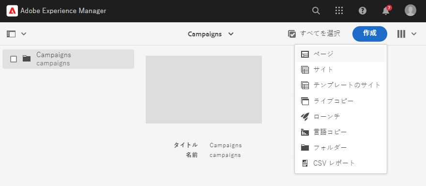

1. 選択 **ブランド** をサイトテンプレートとして使用し、 **次へ**.

   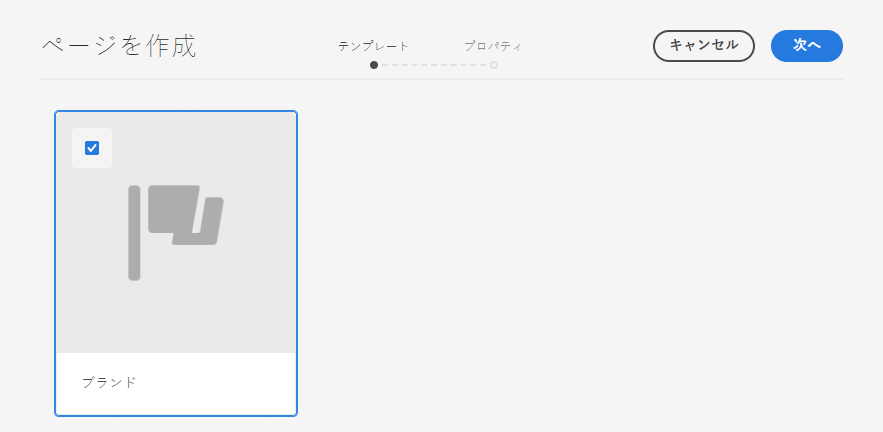

1. を入力します。 **タイトル** をクリックし、 **作成** その後 **完了**.

   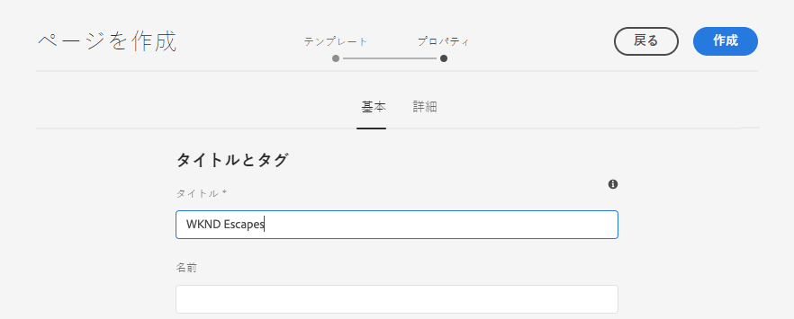

これで、キャンペーンを作成するための基本的なコンテンツ構造が作成されました。

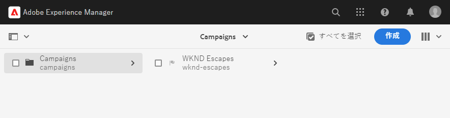

## キャンペーンの作成 {#create-campaign}

これで、キャンペーンの基本的なコンテンツ構造が完成し、キャンペーン自体を作成できます。 このキャンペーンは、複数のニュースレターを整理するために使用されます。

1. 使用 [列表示](/help/sites-cloud/authoring/getting-started/basic-handling.md#viewing-and-selecting-resources) サイトコンソールで、以前に作成したブランド ( この場合は **WKND エスケープ**) をクリックし、 **マスター領域**（自動的に作成されたもの）を選択し、 **作成** ボタンと **ページ**.

   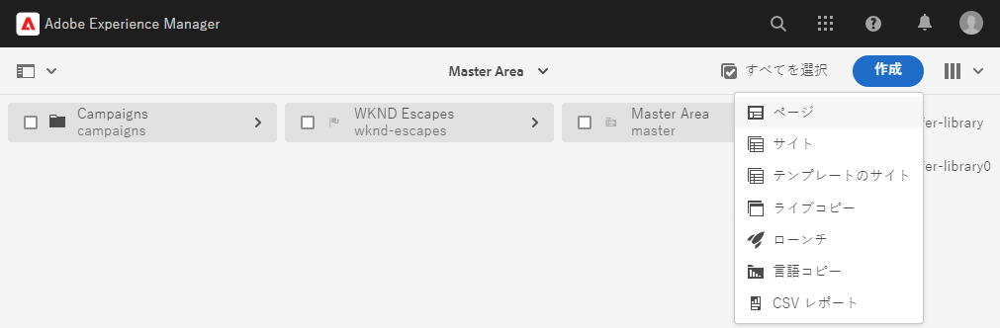

1. 選択 **Campaign** をテンプレートとして設定し、「 **次へ** および **完了**.

   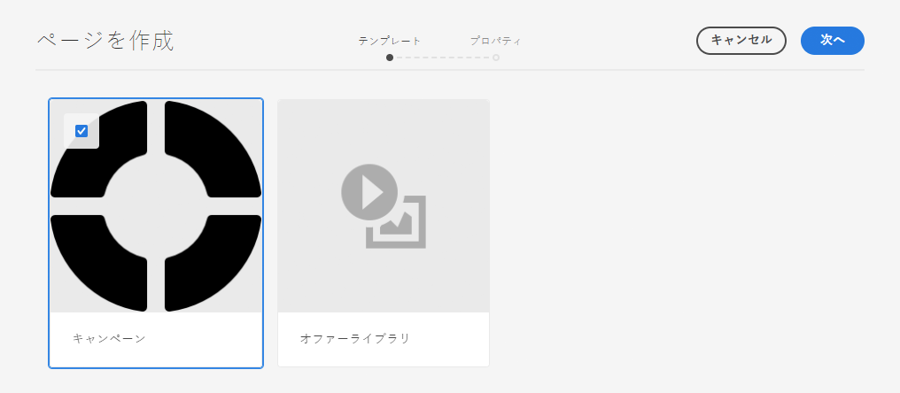

1. を入力します。 **タイトル** キャンペーンの場合は、 **作成** および **完了**.

   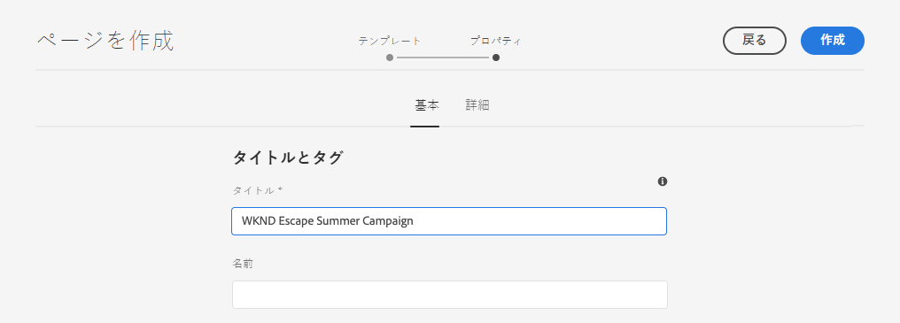

これで、ニュースレターを作成できるキャンペーンが作成されました。

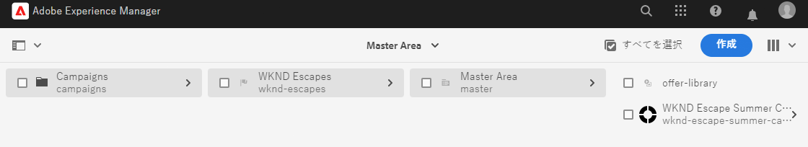

## キャンペーン設定の選択 {#campaign-configuration}

AEMは複数の統合設定をサポートできます。 新しいキャンペーンで、ニュースレターのコンテンツを送信する際に使用する設定を定義する必要があります。

1. 使用 [列表示](/help/sites-cloud/authoring/getting-started/basic-handling.md#viewing-and-selecting-resources) サイトコンソールで、以前に作成したキャンペーン ( この場合は **WKND Escape Summer キャンペーン**) をクリックし、チェックボックスを使用して選択してから、 **プロパティ** ボタンをクリックします。

   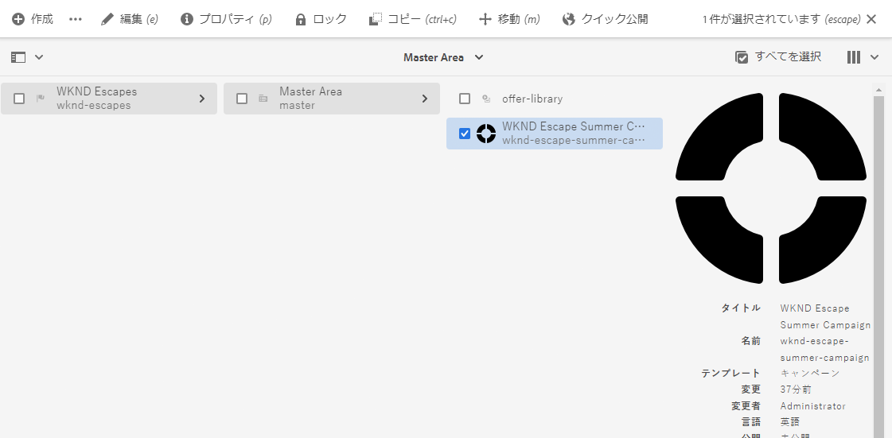

1. 内 **プロパティ** ウィンドウで、 **Cloud Service** タブをクリックして、このキャンペーンで使用する統合を定義します。

   * 選択 **Adobe Campaign** から **Cloud Service設定** 」ドロップダウンリストから選択できます。
   * 目的のAdobe Campaign統合設定を **Adobe Campaign** 」ドロップダウンリストから選択できます。
   * 「**保存して閉じる**」をクリックします。

   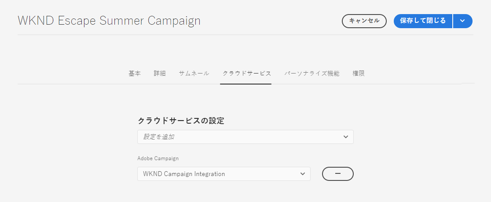

これで、キャンペーンがAdobe Campaign統合にリンクされました。 これで、AEMでニュースレターを作成し、Adobe Campaignと共に送信する準備が整いました。

## ニュースレターの作成 {#create-newsletter}

作成および設定済みのキャンペーンコンテンツ構造で、ニュースレターを作成および管理します。

1. 使用 [列表示](/help/sites-cloud/authoring/getting-started/basic-handling.md#viewing-and-selecting-resources) サイトコンソールで、以前に設定したキャンペーン ( この場合は **WKND Escape Summer キャンペーン**) をクリックし、選択して、 **作成** ボタンと **ページ**.

   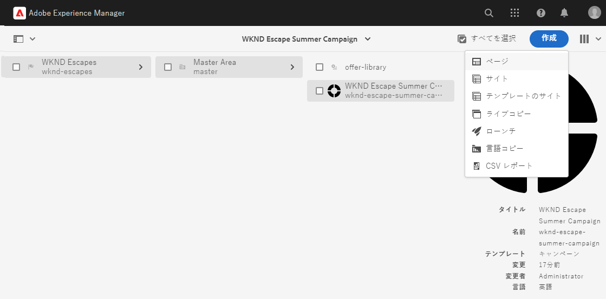

1. ページを作成ウィザードで、 **Adobe Campaign電子メール (AC 6.1)** テンプレートを選択し、 **次へ**.

   

1. の **プロパティ** ウィザードの手順で、 **タイトル** ニュースレターの場合は、 **作成** および **開く**.

   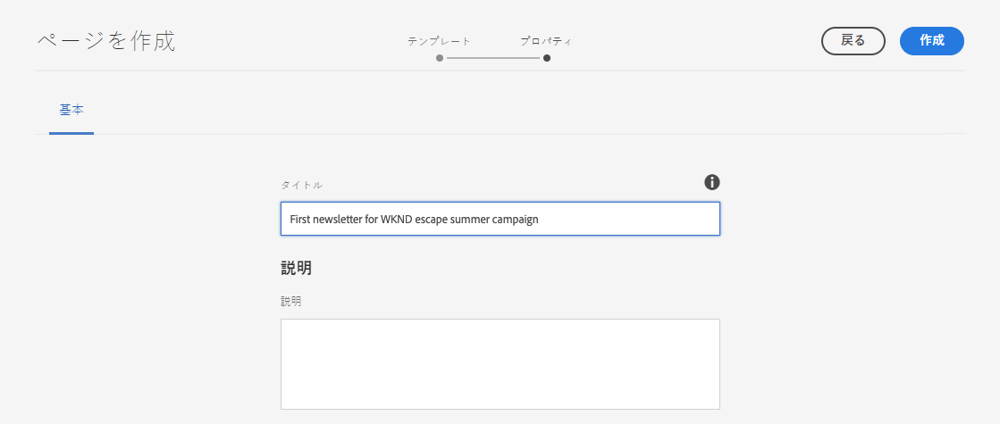

1. 他のAEMコンテンツページと同様に、ニュースレターページを編集して要件を満たします。

これで、Adobe Campaignで送信するニュースレターの準備が整いました。

## ニュースレターの公開 {#publishing-newsletter}

Adobe Campaignが送信できるようにするには、ニュースレターを公開する必要があります。

1. 使用 [列表示](/help/sites-cloud/authoring/getting-started/basic-handling.md#viewing-and-selecting-resources) サイトコンソールで、以前に作成したニュースレター ( この場合は **WKND エスケープサマーキャンペーン用の最初のニュースレター**) をクリックし、選択して、 **ページ情報** ボタンを左上に置き、 **ページを公開**.

1. ページを公開する設定を選択し、「 **公開**.

   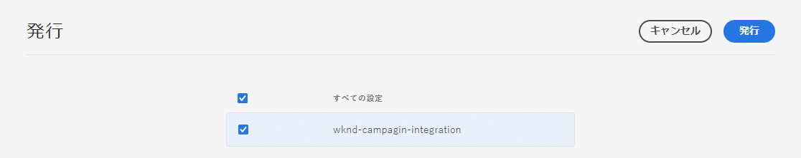

これで、ニュースレターページがAEMパブリッシュインスタンスに公開され、Adobe Campaign Classicに表示されます。 Adobe Campaign内で選択するには、承認が必要です。

1. をクリックします。 **ページ情報** もう一度ニュースレターのボタンをクリックし、「 」を選択します。 **ワークフローを開始**.

1. 選択 **Adobe Campaignの承認** をワークフローモデルとして（オプションで説明を入力）、 **ワークフローを開始** 」ボタンをクリックします。

   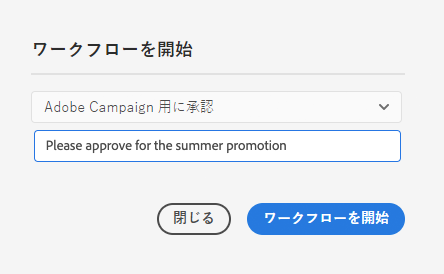

1. バナーがニュースレターページエディターの上部に表示され、承認プロセスの次の手順を示します。 「**完了**」をクリックします。

   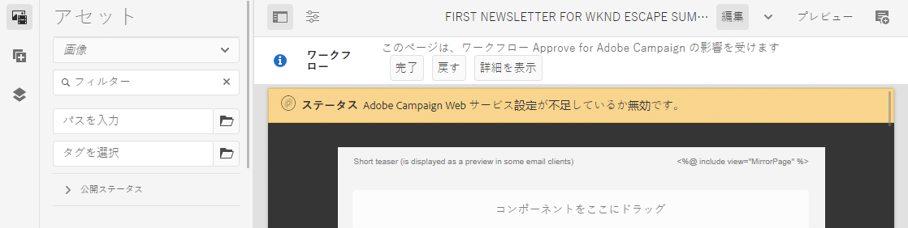

1. 内 **作業項目を完了** ダイアログ、選択 **ニュースレターのレビュー（管理者）** 内 **次のステップ** ドロップダウンリストから、 **OK** 」ボタンをクリックします。

   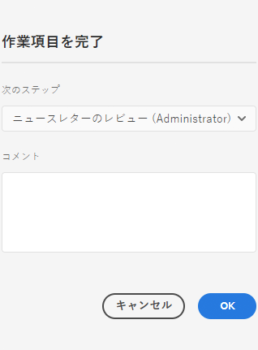

1. ニュースレターページエディターの上部に表示されるバナーで、もう一度「 **完了**.

1. 内 **作業項目を完了** ダイアログ、選択 **ニュースレターの承認** 内 **次のステップ** ドロップダウンリストから、 **OK** 」ボタンをクリックします。

   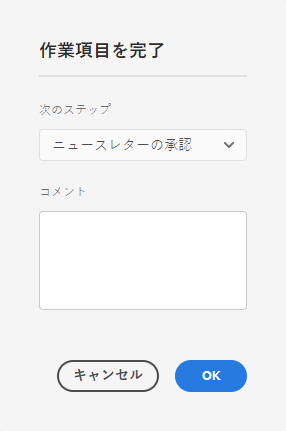

1. 承認ワークフローが完了したので、ダイアログが閉じると、ニュースレターページエディターの上部に表示されたバナーが消えます。

ニュースレターがAEMで公開され、Adobe Campaignでの使用が承認されました。

>[!TIP]
>
>ここで説明するワークフロー手順は、プロセスを示すために簡略化されています。 通常のワークフローでは、ニュースレターを作成し、その作業を承認すると、通常は異なる役割になります
>
>ドキュメントを参照 [ワークフローの操作](/help/sites-cloud/authoring/workflows/overview.md) ワークフローの使用に関する詳細は、を参照してください。

## 受信者の作成 {#creating-recipient}

AEMで作成したニュースレターを送信できるようにするには、まずAdobe Campaign Classicで受信者を定義する必要があります。

1. クライアントコンソールを使用してAdobe Campaign Classicにログインします。

1. 選択 **ツール** -> **エクスプローラ** をクリックします。

1. エクスプローラーで、 **プロファイルとターゲット** -> **受信者** ノード。

   

1. クリック **新規** をクリックし、受信者の詳細を入力します。

   * 名
   * 名前（姓）
   * メールアドレス

1. 「**保存**」をクリックします。

これで、Adobe Campaign Classicを使用してニュースレターを配信できる受信者が得られました。

## E メール配信の作成 {#create-delivery}

最後の手順は、AEMで作成したニュースレターを、Adobe Campaign Classicで追加した受信者に送信することです。

1. クライアントコンソールを使用してAdobe Campaign Classicにログインします。

1. 選択 **ツール** -> **エクスプローラ** をクリックします。

1. エクスプローラーで、 **Campaign Management** -> **配信** ノードをクリックし、 **新規**.

   

1. 内 **配信** ダイアログ、選択 **E メール配信 (AEM Content)** を **配信テンプレート** ドロップダウンリストから、 **続行**.

   

1. 内 **E メールパラメーター** セクションで、 **送信者** リンクして送信者の情報を入力し、 **OK**.

   * 送信者のアドレス
   * 開始フィールド

   

1. 内 **E メールパラメーター** セクションで、 **宛先** 開くリンク **ターゲットを選択** ダイアログで、 **追加**.

   

1. 内 **ターゲット要素を選択** ダイアログ、選択 **受信者** をクリックし、 **次へ**.

   

1. フィルターを使用して、 [作成済み](#creating-recipient) をクリックし、 **完了**.

   

1. 戻る **ターゲットを選択** ダイアログ、クリック **OK**.

1. 配信ウィンドウで、 **同期**.

   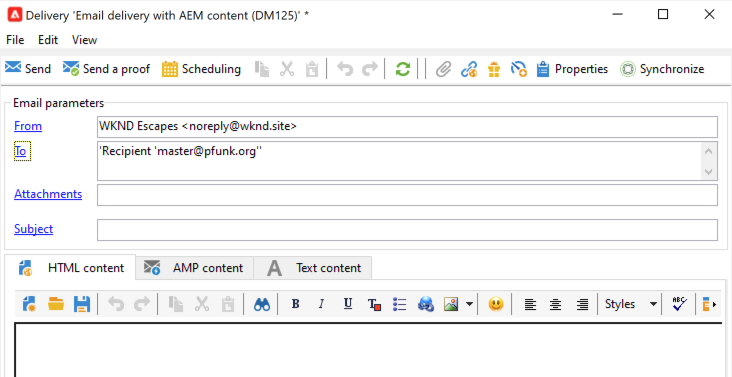

1. 内 **AEMコンテンツと同期** ダイアログで、以前に作成したニュースレターをリストから選択し、 **OK**.

1. Adobe Campaignの E メールコンテンツが、AEMで作成したニュースレターコンテンツと同期されます。

   * クリック **コンテンツを更新** （コンテンツが自動的に読み込まれない場合）

1. クリック **送信** 電子メールを送信します。

1. 内 **メインの配信ターゲットに送信** ダイアログ、選択 **可能な限り早く配信** 次に、 **分析**.

   

1. 分析手順は、コンテンツと受信者を組み合わせて配信を構築します。 配信が作成されたら、 **配信を確定** 電子メールを送信する際に使用します。 「**はい**」をクリックして実行を確認します。

1. 配信が開始されました。 「**閉じる**」をクリックします。

   

1. クリック **保存** 配信を保存します。

ニュースレターが送信されました。

>[!TIP]
>
>次の例では、1 人の受信者へのニュースレターの送信を簡略化しています。 もちろん、通常の配信には様々な受信者が含まれるので、Adobe Campaignでは管理が簡単です。 詳しくは、 [Adobe Campaign Classicドキュメント](https://experienceleague.adobe.com/docs/campaign-classic.html) ：配信と受信者の管理の詳細を参照してください。
