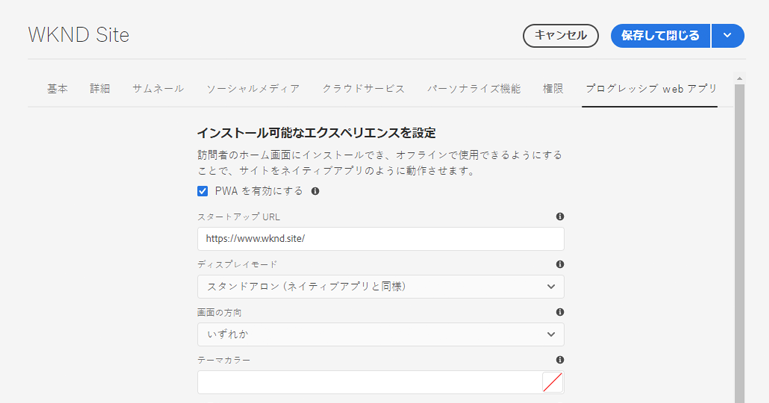
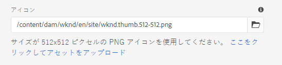
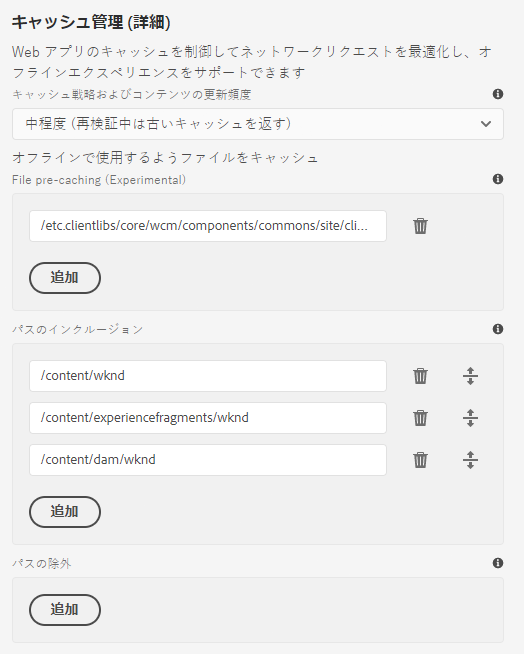

# プログレッシブ Web アプリケーション機能の有効化 {#enabling-pwa}

シンプルな設定で、コンテンツ作成者が AEM Sites で作成されたエクスペリエンスに対してプログレッシブ Web アプリケーション（PWA）機能を有効化できるようになりました。

>[!CAUTION]
>
>これは高度な機能で、次を必要とします。
>
>* PWA に関する知識
>* サイトとコンテンツ構造に関する知識
>* キャッシュ方法の理解
>* 開発チームによるサポート

>
>
この機能を使用する前に、開発チームに相談して、プロジェクトに最適な利用方法を決めることをお勧めします。

>[!NOTE]
>
>このドキュメントで説明する機能は、AEMの2021年3月リリースでCloud Serviceとして使用できるようになる予定です。](https://experienceleague.adobe.com/docs/experience-manager-release-information/aem-release-updates/update-releases-roadmap.html?lang=ja)[

## はじめに {#introduction}

[プログレッシブ Web アプリケーション（PWA）](https://developer.mozilla.org/ja-JP/docs/Web/Progressive_web_apps) を使用すると、AEM サイトのアプリケーションのような臨場感のあるエクスペリエンスを、ユーザーのコンピューターにローカルに保存し、オフラインでアクセスできるようになります。インターネット接続が切れた場合でも、外出中にサイトを閲覧できます。PWA を使用すると、ネットワークが失われたり不安定な状態になった場合でも、シームレスなエクスペリエンスを維持できます。

コンテンツ作成者は、サイトの再コーディングは必要なく、サイトの[ページプロパティ](/help/sites-cloud/authoring/fundamentals/page-properties.md)の追加タブとして PWA プロパティを設定できます。

* この設定を保存または公開すると、サイト上の PWA 機能を有効にする[マニフェストファイル](https://developer.mozilla.org/ja-JP/docs/Web/Manifest)と[サービスワーカー](https://developer.mozilla.org/ja-JP/docs/Web/API/Service_Worker_API)を書き出すイベントハンドラーがトリガーされます。
* Sling マッピングは、サービスワーカーがアプリケーションのルートから提供されるように維持され、アプリケーション内でオフライン機能を可能にするコンテンツのプロキシ化を有効にします。

PWA では、ユーザーはサイトのローカルコピーを保持するので、インターネットに接続していなくてもアプリケーションのような操作をおこなうことができます。

>[!NOTE]
>
>プログレッシブ Web アプリケーションは発展中のテクノロジーであり、ローカルアプリケーションのインストールやその他の機能のサポート状況は[どのブラウザーを使用するかによって異なります。](https://developer.mozilla.org/ja-JP/docs/Web/Progressive_web_apps/Installable_PWAs#Summary)

## 前提条件 {#prerequisites}

サイトで PWA 機能を使用するには、プロジェクト環境に必要な要件が ２ つあります。

1. [この機能を活](#adjust-components) 用するには、コアコンポーネントを使用します
1. [Dispatcher ルールを調整](#adjust-dispatcher)して、必要なファイルを公開する

これらは、作成者が開発チームと連携する必要がある技術的な手順です。これらの手順は、サイトごとに 1 回だけ必要です。

### コアコンポーネントの使用 {#adjust-components}

コアコンポーネントリリース2.15.0以降は、AEMサイトのPWA機能を完全にサポートします。 AEMaaCSには常に最新バージョンのコアコンポーネントが含まれているので、PWA機能をすぐに利用できます。 AEMaCSプロジェクトは、この要件を自動的に満たします。

>[!NOTE]
>
>Adobeは、カスタムコンポーネントのPWA機能の使用や、古いコンポーネントから拡張された[コンポーネントの使用はお勧めしません。](https://experienceleague.adobe.com/docs/experience-manager-core-components/using/developing/customizing.html?lang=ja)
<!--
Your components need to include the [manifest files](https://developer.mozilla.org/en-US/docs/Web/Manifest) and [service worker,](https://developer.mozilla.org/en-US/docs/Web/API/Service_Worker_API) which supports the PWA features.

 To do this, the developer will need to add the following link to the `customheaderlibs.html` file of your page component.

```xml
<link rel="manifest" href="/content/<projectName>/manifest.webmanifest" crossorigin="use-credentials"/>
```

The developer will also need to add the following link to the `customfooterlibs.html` file of your page component.

```xml
<script>
        // Check that service workers are supported
        if ('serviceWorker' in navigator) {
            // Use the window load event to make sure the page load performs well
            window.addEventListener('load', () => {
                let serviceWorker = '/<projectName>sw.js';
                navigator.serviceWorker.register(serviceWorker);
            });
        }
</script>
```
-->

### Dispatcher の調整 {#adjust-dispatcher}

PWA 機能は、`/content/<sitename>/manifest.webmanifest` ファイルを生成して使用します。デフォルトでは、[Dispatcher](/help/implementing/dispatcher/overview.md) はこのようなファイルを公開しません。これらのファイルを公開するには、デベロッパーはサイトプロジェクトに次の設定を追加する必要があります。

```text
File location: [project directory]/dispatcher/src/conf.dispatcher.d/filters/filters.any >

# Allow webmanifest files
/0102 { /type "allow" /extension "webmanifest" /path "/content/*/manifest" }
```

プロジェクトに応じて、様々なタイプの拡張機能を書き換えルールに含めることができます。 `webmanifest`拡張は、リクエストを非表示にして`/content/<projectName>`にリダイレクトするルールを導入した際に、書き換え条件に含めると便利です。

```text
RewriteCond %{REQUEST_URI} (.html|.jpe?g|.png|.svg|.webmanifest)$
```

## サイトの PWA の有効化 {#enabling-pwa-for-your-site}

[前提条件](#prerequisites)が満たされれば、コンテンツ作成者は簡単にサイトの PWA 機能を有効にできます。次に、その方法の概要を示します。個々のオプションの詳細は「[詳細なオプション](#detailed-options)」節で説明されています。

1. AEM にログインします。
1. メインメニューで、**ナビゲーション**／**Sites** をタップまたはクリックします。
1. サイトプロジェクトを選択し、「[**プロパティ**](/help/sites-cloud/authoring/fundamentals/page-properties.md)」をタップまたはクリックするか、ホットキー `p` を使用します。
1. 「**プログレッシブ Web アプリケーション**」タブを選択し、該当するプロパティを設定します。少なくとも、次のことをおこないます。
   1. 「**PWA を有効にする**」オプションを選択します。
   1. **スタートアップ URL** を定義します。

      

   1. 512x512 の png アイコンを DAM にアップロードし、それをアプリケーションのアイコンとして参照します。

      

   1. サービスワーカーがオフラインにするパスを構成します。一般的なパスは次のとおりです。
      * `/content/<sitename>`
      * `/content/experiencefragements/<sitename>`
      * `/content/dam/<sitename>`
      * 任意のサードパーティフォントの参照
      * `/etc/clientlibs/<sitename>`

      


1. 「**保存して閉じる**」をタップまたはクリックします。

これでサイトが構成され、[ローカルアプリケーションとしてインストールできます。](#using-pwa-enabled-site)

## PWA 対応サイトの使用 {#using-pwa-enabled-site}

これで、[PWA をサポートするようにサイトを設定できたので、](#enabling-pwa-for-your-site)体験してみてください。

1. [サポートされているブラウザー](https://developer.mozilla.org/en-US/docs/Web/Progressive_web_apps/Installable_PWAs#Summary)でサイトにアクセスします。
1. ブラウザーのアドレスバーに、サイトをローカルアプリとしてインストールできることを示す新しいアイコンが表示されます。
   * ブラウザーによってはアイコンが異なる場合があり、ブラウザーには、ローカルアプリとしてインストールできることを示す通知（バナーやダイアログボックスなど）が表示される場合もあります。
1. AEM Desktop App をインストールします。
1. アプリケーションがデバイスのホーム画面にインストールされます。
1. アプリケーションを開いてしばらく作業して、ページがオフラインで使用できることを確認してください。

## 詳細なオプション {#detailed-options}

次の節では、[PWA 用にサイトを設定](#enabling-pwa-for-your-site)する際に使用できるオプションの詳細を説明します。

### インストール可能なエクスペリエンスの設定 {#configure-installable-experience}

これらの設定を使用すると、訪問者のホーム画面にサイトをインストールしてオフラインで使用できるようにすることで、サイトをネイティブアプリケーションのように動作させることができます。

* **PWA を有効にする** - これは、サイトの PWA を有効にするためのメイントグルです。
* **起動 URL** - これは、ユーザーがローカルにインストールしたアプリケーションを読み込むときに開く、 [優先的な起動 URL](https://developer.mozilla.org/ja-JP/docs/Web/Manifest/start_url) です。
   * これは、コンテンツ構造内の任意のパスにすることができます。
   * ルートにする必要はなく、多くの場合アプリケーションの開始ページにします。
   * この URL が相対 URL の場合、マニフェスト URL がベース URL として使用され、解決されます。
   * 空白のままにすると、アプリケーションのインストール元の Web ページのアドレスが使用されます。
   * 値を設定することをお勧めします。
* **表示モード** - PWA 対応のアプリケーションは、引き続きブラウザーを介して配信される AEM サイトです。[これらの表示オプション](https://developer.mozilla.org/ja-JP/docs/Web/Manifest/display)は、ブラウザーを非表示にする方法や、ローカルデバイス上のユーザーに表示する方法を定義します。
   * **スタンドアロン** - ブラウザーはユーザーに完全に非表示になり、ネイティブアプリケーションのように表示されます。これがデフォルト値です。
      * このオプションを使用する場合、アプリケーションのナビゲーションは、ブラウザーのナビゲーションコントロールを使用することなく、サイトのページ上のリンクやコンポーネントを使用してコンテンツ全体でナビゲーション可能でなければなりません。
   * **ブラウザー** - ブラウザーは、サイトの訪問時に通常通り表示されます。
   * **最小限の UI** - ネイティブアプリケーションと同様に、ブラウザーはほとんど非表示ですが、基本的なナビゲーションコントロールが表示されます。
   * **全画面表示** - ブラウザーはネイティブアプリケーションと同様に完全に非表示になりますが、全画面モードでレンダリングされます。
      * このオプションを使用する場合、アプリケーションのナビゲーションは、ブラウザーのナビゲーションコントロールを使用することなく、サイトのページ上のリンクやコンポーネントを使用してコンテンツ全体でナビゲーション可能でなければなりません。
* **画面の向き** - PWA は、ローカルアプリケーションとして、[デバイスの向き](https://developer.mozilla.org/ja-JP/docs/Web/Manifest/orientation)を処理する方法がわかっている必要があります。
   * **任意** - アプリケーションはユーザーのデバイスの向きに合わせて調整されます。これがデフォルト値です。
   * **縦置き** - ユーザーのデバイスの向きに関係なく、アプリケーションが強制的に縦置きレイアウトで開きます。
   * **横置き** - ユーザーのデバイスの向きに関係なく、アプリケーションが強制的に横置きレイアウトで開きます。
* **テーマの色** - ローカルユーザーのオペレーティングシステムがネイティブの UI ツールバーとナビゲーションコントロールを表示する方法に影響する[アプリケーションの色](https://developer.mozilla.org/ja-JP/docs/Web/Manifest/theme_color)を定義します。ブラウザーによっては、他のアプリケーションプレゼンテーション要素に影響を与える場合があります。
   * カラーウェルポップアップを使用して、色を選択します。
   * 色は、16 進数または RGB 値で定義することもできます。
* **背景色** — アプリケーションの読み込み時に表示される、 [アプリケーションの背景色](https://developer.mozilla.org/ja-JP/docs/Web/Manifest/background_color)を定義します。
   * カラーウェルポップアップを使用して、色を選択します。
   * 色は、16 進数または RGB 値で定義することもできます。
   * 特定のブラウザーでは、アプリケーション名、背景色、アイコンから[自動的にスプラッシュスクリーンが作成されます](https://developer.mozilla.org/ja-JP/docs/Web/Manifest#Splash_screens)。
* **アイコン** - ユーザーのデバイス上に表示される、アプリケーションを表す[アイコン](https://developer.mozilla.org/ja-JP/docs/Web/Manifest/icons)を定義します。
   * アイコンは、サイズが 512x512 ピクセルの png ファイルである必要があります。
   * アイコンは [DAM に保存](/help/assets/overview.md)されている必要があります。

### キャッシュ管理 (詳細) {#offline-configuration}

これらの設定により、このサイトの一部はオフラインで使用できるようになり、訪問者のデバイスでローカルに使用できるようになります。Web アプリケーションのキャッシュを制御してネットワークリクエストを最適化し、オフラインエクスペリエンスをサポートできます。

* **コンテンツ更新のキャッシュ方法と頻度** - この設定は、PWA のキャッシュモデルを定義します。
   * **中程度** - [この設定](https://web.dev/stale-while-revalidate/)は、大半のサイトで使用されます。これがデフォルト値です。
      * この設定を使用すると、ユーザーが最初に閲覧したコンテンツがキャッシュから読み込まれ、ユーザーがそのコンテンツを利用している間は、キャッシュ内の残りのコンテンツが再検証されます。
   * **頻繁** - これは、オークション会社など、非常に速く更新する必要があるサイトで使用します。
      * この設定を使用すると、アプリケーションは最初にネットワーク経由で最新のコンテンツを探し、使用できない場合はローカルキャッシュにフォールバックします。
   * **まれ** - これは、リファレンスページなど、ほとんど静的なサイトの場合に使用します。
      * この設定を使用すると、アプリケーションは最初にキャッシュ内のコンテンツを探し、利用できない場合はネットワークにフォールバックして取得します。
* **ファイルの事前キャッシュ** - AEM でホストされているこれらのファイルは、サービスワーカーのインストール時および使用前に、ローカルブラウザーのキャッシュに保存されます。これにより、オフライン時に Web アプリケーションが完全に機能することが保証されます。
* **パスの包含** - 定義されたパスに対するネットワーク要求が捕捉され、設定された&#x200B;**キャッシュ方法とコンテンツ更新の頻度**&#x200B;に従ってキャッシュされたコンテンツが返されます。
* **キャッシュの除外** - これらのファイルは、「 **ファイルの事前キャッシュ**」および「**パスの挿入**」の設定に関係なくキャッシュされません。

>[!TIP]
>
>デベロッパーチームは、オフライン設定の設定方法に関する貴重な情報を得られる可能性が高くなります。

## 制限事項とRecommendations {#limitations-recommendations}

AEM Sites では PWA 機能の一部が利用できます。これらには、いくつかの顕著な制限があります。

* ユーザーがアプリケーションを使用していない場合、ページは自動的に同期または更新されません。

Adobeは、実装時に次の推奨事項もおこないます。PWA

### プリキャッシュするリソースの数を最小限に抑えます。{#minimize-precache}

Adobeでは、キャッシュ前のページ数を制限するようお勧めします。

* ライブラリを埋め込んで、プリキャッシュ時に管理するエントリ数を減らします。
* 画像のバリエーション数をプリキャッシュに制限します。

### PWAは、プロジェクトスクリプトとスタイルシートを安定化した後に有効にします。{#pwa-stabilized}

クライアントライブラリは、次のパターン`lc-<checksumHash>-lc`を観察するキャッシュセレクターを追加して提供されます。 ライブラリを構成するファイル（および依存関係）の1つが変更されるたびに、このセレクターが変更されます。 service-workerによって事前にキャッシュされるクライアントライブラリを一覧表示し、新しいバージョンを参照する場合は、手動でエントリを取得して更新します。 そのため、プロジェクトのスクリプトとスタイルシートを安定化させた後に、サイトをPWAにするように設定することをお勧めします。

### 画像のバリエーションの数を最小限に抑えます。{#minimize-variations}

AEMコアコンポーネントの画像コンポーネントは、取得する最適なレンディションのフロントエンドを決定します。 このメカニズムには、そのリソースの最終変更時刻に対応するタイムスタンプも含まれます。 このメカニズムは、PWAのプリキャッシュの設定を複雑にします。

プリキャッシュを設定する場合、ユーザーは、取得可能なすべてのパスバリエーションをリストする必要があります。 これらのバリエーションは、画質や幅などのパラメーターで構成されます。 これらのバリエーションの数を、最大3つ（小、中、大）に減らすことを強くお勧めします。 それには、[画像コンポーネントのコンテンツポリシーダイアログを使用します。](https://experienceleague.adobe.com/docs/experience-manager-core-components/using/components/image.html?lang=ja)

慎重に設定しないと、メモリとネットワークの消費がPWAのパフォーマンスに大きな影響を与える可能性があります。 また、50個の画像をプリキャッシュし、1つの画像に3つの幅を持つ場合、サイトを維持するユーザーは、ページプロパティの「PWAプリキャッシュ」セクションで最大150個のエントリのリストを維持する必要があります。

Adobeでは、画像のプロジェクト使用を安定させた後に、サイトをPWAにするように設定することもお勧めします。
