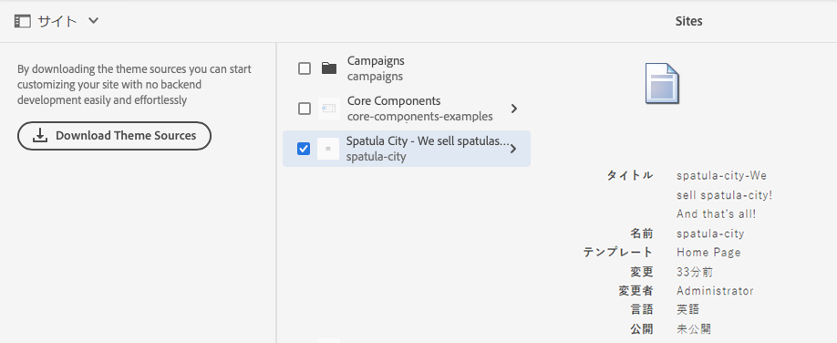

# 基本操作 {#basic-handling}

このドキュメントでは、AEM オーサー環境を使用する際の基本操作の概要をまとめています。これは **Sites** コンソールを基礎として使用します。

>[!NOTE]
>
>* 一部の機能はすべてのコンソールで使用できるわけではなく、一部のコンソールでしか使用できない追加機能もあります。個別のコンソールや関連する機能に関する具体的な情報については、他のページで詳しく取り上げます。
>* AEM 全体でキーボードショートカットを利用できます。特に、[コンソールの使用](/help/sites-cloud/authoring/getting-started/keyboard-shortcuts.md)時や[ページの編集](/help/sites-cloud/authoring/fundamentals/keyboard-shortcuts.md)時に顕著です。

{{edge-delivery-authoring}}

## タッチ対応 UI {#a-touch-enabled-ui}

AEM のユーザーインターフェイスは、タッチ操作に対応しています。タッチ対応インターフェイスを使用すると、選択、タッチ＆ホールド、スワイプなどのジェスチャーを使用して、ソフトウェアをタッチで操作できます。AEM UI はタッチ対応なので、携帯電話やタブレットなどのタッチデバイスでタッチジェスチャーを使用できます。ただし、従来のデスクトップデバイスでのマウス操作も可能で、その場合はコンテンツのオーサリング方法を柔軟に選択できます。

## 最初の手順 {#first-steps}

ログインするとすぐに、[ナビゲーションパネル](#navigation-panel)が表示されます。いずれかのオプションを選択すると、それぞれのコンソールが開きます。

AEM の基本的な使用方法を適切に理解できるように、このドキュメントでは **Sites** コンソールに基づいて説明します。「**Sites**」を選択して開始します。

## 製品ナビゲーション {#product-navigation}

ユーザーが初めてコンソールにアクセスすると、必ず製品ナビゲーションチュートリアルが開始されます。ここで時間を割いて、ひととおり選択し、AEM の基本操作の概要を把握してください。

「**次へ**」を選択して、概要の次のページに進みます。「**閉じる**」を選択するか、概要ダイアログの外側を選択して閉じます。

すべてのスライドを表示するか「**次回から表示しない**」オプションをオンにする場合を除き、概要は、次回コンソールにアクセスすると再び開始します。

## グローバルナビゲーション {#global-navigation}

グローバルナビゲーションパネルを使用してコンソール間を移動できます。これは、画面の左上にある Adobe Experience Manager リンクを選択すると、フルスクリーンのドロップダウンとしてトリガーされます。

「**閉じる**」をクリックまたはタップすると、グローバルナビゲーションパネルが閉じて、前の場所に戻ることができます。

グローバルナビゲーションには、2 つのパネルがあり、画面の左余白にアイコンで表示されます。

* **[ナビゲーション](#navigation-panel)** - AEM へのログイン時のコンパスとデフォルトのパネルで表示
* **[ツール](#tools-panel)** - ハンマーで表示

これらのパネルで使用できるオプションは、以下の通りです。

### ナビゲーションパネル {#navigation-panel}

ナビゲーションパネル：

コンソールやコンテンツ間を移動すると、現在の場所を反映するようにブラウザータブのタイトルが更新されます。

ナビゲーションでは、次のコンソールを使用できます。

| コンソール | 目的 |
|---|---|
| プロジェクト | プロジェクトコンソールでは、プロジェクトに直接アクセスできます。[プロジェクトは、チームの構築に使用できる仮想ダッシュボード](/help/sites-cloud/authoring/projects/overview.md)です。その後、そのチームがリソース、ワークフローおよびタスクにアクセスできるようになるので、チームメンバーが共通の目標に向かって作業できます。 |
| Sites | Sites コンソールでは、AEM インスタンス上で実行される[サイトの作成、表示、管理](/help/sites-cloud/authoring/fundamentals/organizing-pages.md)を行えます。このコンソールを通じて、ページの作成、編集、コピー、移動および削除や、ワークフローの開始、ページの公開を行うことができます。 |
| エクスペリエンスフラグメント | [エクスペリエンスフラグメント](/help/sites-cloud/authoring/fundamentals/experience-fragments.md)は、チャネル間で再利用でき、バリエーションのあるスタンドアロンエクスペリエンスです。エクスペリエンスやエクスペリエンスの一部を繰り返しコピー＆ペーストする手間を省きます。 |
| Assets | Assets コンソールでは、[画像、ビデオ、ドキュメント、オーディオファイルなどのデジタルアセット](/help/assets/overview.md)を読み込んで、それらのデジタルアセットを管理できます。同じ AEM インスタンス上で実行されているどのサイトでも、これらのアセットを使用できます。また、Assets コンソールから[コンテンツフラグメント](/help/assets/content-fragments/content-fragments.md)を作成および管理することもできます。 |
| パーソナライズ機能 | このコンソールには、[ターゲットとなるコンテンツをオーサリングして、パーソナライズされたエクスペリエンスを提供](/help/sites-cloud/authoring/personalization/overview.md)するためのツールのフレームワークが用意されています。 |
| コンテンツフラグメント | [コンテンツフラグメント](/help/sites-cloud/administering/content-fragments/overview.md)を使用すると、ページに依存しないコンテンツの設計、作成、キュレーションおよび公開が可能になります。複数の場所や複数のチャネルで使用できる構造化コンテンツを準備でき、ページのオーサリングとヘッドレス配信の両方に最適です。 |

## ツールパネル {#tools-panel}

ツールパネルには、同様のツールコンソールをグループ化した様々なカテゴリを含むサイドパネルがあります。ツールコンソールを使用して、web サイト、デジタルアセットおよびコンテンツリポジトリのその他の要素の管理に役立つ、数多くの専用ツールおよびコンソールにアクセスできます。<!--The [Tools consoles](/help/sites-administering/tools-consoles.md) provide access to several specialized tools and consoles that help you administer your websites, digital assets, and other aspects of your content repository.-->

## ヘッダー {#the-header}

ヘッダーは、常に画面の上部に表示されます。ヘッダーのほとんどのオプションは、システム内のどこにいても同じですが、コンテキストに固有のオプションもあります。

* [グローバルナビゲーション](#global-navigation)

  コンソール間を移動するには、 **Adobe Experience Manager** リンクを選択します。

  

* [検索](/help/sites-cloud/authoring/getting-started/search.md)

  

  [ショートカットキー](/help/sites-cloud/authoring/getting-started/keyboard-shortcuts.md) `/`（スラッシュ）を使用して、任意のコンソールから検索を呼び出すこともできます。

* [ソリューション](https://www.adobe.com/jp/experience-cloud.html)

  

* [ヘルプ](#accessing-help)

  

* [通知](/help/sites-cloud/authoring/getting-started/inbox.md)

  

  このアイコンには、現在割り当てられている未完了の通知の数を示すバッジが付きます。

* [ユーザープロパティ](/help/sites-cloud/authoring/getting-started/account-environment.md)

  

* [パネルセレクター](#rail-selector)

  

  現在のコンソールに応じて表示されるオプションです。例えば、**Sites** では、コンテンツのみ（デフォルト）、タイムライン、参照またはフィルターのサイドパネルを選択できます。

  

* パンくずリスト

  

  パネルの中央に位置し、常に現在選択している項目の説明を表示するパンくずリストを使用すると、特定のコンソール内を移動できます。**Sites** コンソールでは、Web サイトのレベル間を移動できます。

  パンくずリストのテキストをクリックすると、現在選択している項目の階層レベルをリストするドロップダウンが表示されます。エントリをクリックすると、その場所にジャンプします。

  

* 「**作成**」ボタン

  

  クリックすると、コンソール／コンテキストに適したオプションが表示されます。

* [表示](#viewing-and-selecting-resources)

  表示アイコンは、AEM ツールバーの右端にあります。このアイコンは、そのときの表示に応じて随時変化します。例えば、デフォルト表示では、次のように&#x200B;**列表示**&#x200B;が表示されます。

  

  列表示、カード表示、リスト表示を切り替えることができます。リスト表示では、表示設定も表示されます。

  

  >[!NOTE]
  >
  >「**表示設定**」オプションは、**リスト表示**&#x200B;モードでのみ使用できます。

* キーボードナビゲーション

  キーボードだけを使用して Web サイト内を移動できます。この場合、**Tab** キー（または **Opt+Tab**）の標準的なブラウザ機能を使用して、ページ上のフォーカス可能な要素間を移動します。

  **Sites** コンソールには、「**メインコンテンツにスキップ**」するためのオプションが追加されています。これは、ヘッダーオプション間をタブで移動すると表示され、（製品）ツールバーの標準要素をスキップしてメインコンテンツに直接移動できるので、ナビゲーションが迅速化されます。

  

## ヘルプへのアクセス {#accessing-help}

様々なヘルプリソースを使用できます。

* **コンソールツールバー**

  「**ヘルプ**」アイコンにより、現在の場所に応じた適切なリソースが開きます。

  

* **ナビゲーション**

  初めてシステムを操作する際に、[AEM の操作を紹介するスライドが表示されます](#product-navigation)。

  

* **ページエディター**

  ページを初めて編集する場合は、ページエディターを紹介する一連のスライドが表示されます。

  

  コンソールに最初にアクセスしたときの[製品ナビゲーションの概要](#product-navigation)と同様に、この概要をナビゲートします。

  このスライドをもう一度表示するには、 [**ページ情報** メニューの「**ヘルプ**](/help/sites-cloud/authoring/fundamentals/environment-tools.md#accessing-help)」を選択します。

* **ツールコンソール**

  **ツール**&#x200B;コンソールから、外部&#x200B;**リソース**&#x200B;にアクセスすることもできます。

   * **文書** - Web Experience Management のドキュメントを表示します。
   * **開発者向けリソース** - 開発者向けリソースおよびダウンロードです。

  >[!NOTE]
  >
  >コンソールでは、ホットキー `?`（疑問符）を使用して、いつでもショートカットキーの概要を確認できます。
  >
  >すべてのキーボードショートカットの概要については、次のドキュメントを参照してください。
  >
  >* [ページ編集のキーボードショートカット](/help/sites-cloud/authoring/fundamentals/keyboard-shortcuts.md)
  >* [コンソールのキーボードショートカット](/help/sites-cloud/authoring/getting-started/keyboard-shortcuts.md)

## アクションツールバー {#actions-toolbar}

リソース（ページやアセットなど）を選択するたびに、様々なアクションがアイコンで示され、ツールバーに説明テキストが表示されます。これらのアクションは、次によって決定されます。

* 現在のコンソール
* 現在のコンテキスト
* [選択モード](#viewing-and-selecting-resources)になっているかどうか

ツールバーで使用できるアクションは、選択した特定の項目に対して取ることのできるアクションを反映して変化します。

[リソースを選択する](#viewing-and-selecting-resources)方法は、表示によって異なります。

一部のウィンドウではスペースが制限されるので、使用可能なスペースよりもツールバーのほうが長くなることがよくあります。この場合は、追加のオプションが表示されます。省略記号（三点リーダーまたは「**...**」）をクリックまたはタップすると、その他のすべてのアクションを含むドロップダウンセレクターが開きます。例えば、**Sites** コンソールでページを選択すると、次のように表示されます。

>[!NOTE]
>
>利用可能な個々のアイコンについては、それぞれのコンソール、機能、シナリオに関連するページで説明しています。

## クイックアクション {#quick-actions}

[カード表示](#card-view)では、クイックアクションアイコンで使用できるアクションがあります。それらのアクションはツールバーにも表示されます。クイックアクションアイコンは、一度に 1 つの項目に対してのみ利用できます。このアイコンを使用すると、事前に選択しておく必要がなくなります。

クイックアクションは、リソースカードにポインタを合わせると（デスクトップデバイスの場合）表示されます。使用できるクイックアクションは、コンソールとコンテキストによって異なります。例えば、**Sites** コンソールのページのクイックアクションを次に示します。

## リソースの表示と選択 {#viewing-and-selecting-resources}

概念上、表示、ナビゲーションおよび選択はすべての表示で同じ操作ですが、使用している表示によって処理がわずかに異なります。

使用可能な任意の表示方法で、リソースを表示、ナビゲーションおよび（追加のアクションを行うために）選択できます。表示を選択するには、右上のアイコンを使用します。

* [列表示](#column-view)
* [カード表示](#card-view)
* [リスト表示](#list-view)

>[!NOTE]
>
>デフォルトでは、AEM Assets のいずれの表示においても、UI のアセットの元のレンディションはサムネールとして表示されません。管理者の場合は、オーバーレイを使用すると、元のレンディションをサムネールとして AEM Assets に表示するように設定できます。

### リソースの選択 {#selecting-resources}

特定のリソースの選択方法は、表示とデバイスの組み合わせによって異なります。

| 表示 | タッチの選択 | デスクトップの選択 | タッチの選択解除 | デスクトップの選択解除 |
|---|---|---|---|---|
| 列 | サムネールを選択 | サムネールをクリック | サムネールを選択 | サムネールをクリック |
| カード | カードを選択＆ホールド | 項目の上にマウスを移動しチェックマークのクイックアクションを使用 | カードを選択 | カードをクリック |
| リスト | サムネールを選択 | サムネールをクリック | サムネールを選択 | サムネールをクリック |

#### すべてを選択 {#select-all}

コンソールの右上隅にある「**すべてを選択**」オプションをクリックすると、どの表示でも、すべての項目を選択できます。

* **カード表示**&#x200B;では、すべてのカードが選択されます。
* **リスト表示**&#x200B;では、リスト内のすべての項目が選択されます。
* **列表示**&#x200B;では、一番左の列にあるすべての項目が選択されます。

#### すべて選択解除 {#deselecting-all}

どのような場合でも、項目を選択すると、選択された項目の数がツールバーの右上に表示されます。

すべての項目の選択を解除して選択モードを終了するには、次の操作を行います。

* カウントの横にある「**X**」をクリックまたはタップする
* **Esc** キーを使用する

デスクトップデバイスを使用している場合、すべての表示において、キーボードの Esc キーを押すことですべての項目を選択解除できます。

#### 選択の例 {#selecting-example}

1. 例えば、カード表示では次のようになります。

   

1. リソースを選択すると、上部のヘッダーの上に[アクションツールバー](#actions-toolbar)が重なって表示され、選択したリソースで現在適用可能なアクションにアクセスできます。

   選択モードを終了するには、右上の「**X**」を選択するか、**Esc** キーを使用します。

### 列表示 {#column-view}

列表示を使用すると、一連のカスケード表示された列を通じて、コンテンツツリーを視覚的に移動できます。この表示では、web サイトのツリー構造を視覚化して移動できます。

一番左の列でリソースを選択すると、右の列に子リソースが表示されます。右側の列でリソースを選択すると、さらに右側の列にその子リソースが表示されます。

* リソース名またはその右にある山形記号をタップまたはクリックすると、ツリー内を上下に移動できます。

   * タップまたはクリックするとリソース名と山形記号がハイライト表示されます。
   * クリックまたはタップしたリソースの子は、クリックまたはタップしたリソースの右側の列に表示されます。
   * 子を持たないリソース名を選択すると、その詳細が最後の列に表示されます。

* サムネールをタップまたはクリックすると、リソースが選択されます。

   * すると、チェックマークがサムネールにオーバーレイ表示され、リソース名もハイライト表示されます。
   * 選択されたリソースの詳細が最後の列に表示されます。
   * アクションツールバーが使用可能になります。

  列表示でページを選択すると、選択したページが次の詳細と共に最後の列に表示されます。

   * ページタイトル
   * ページ名（ページの URL の一部）
   * ページの基になるテンプレート
   * 変更の詳細
   * ページ言語
   * 公開およびプレビューの詳細

### カード表示 {#card-view}

* カード表示では、現在のレベルの各項目の情報カードが表示されます。次のような情報が提供されます。

   * ページの内容を視覚的に表現したもの
   * ページのタイトル
   * 重要な日付（最終編集日、最終公開日など）。
   * ページがロックされているかどうか、非表示になっているかどうか、またはライブコピーの一部であるかどうか
   * ワークフローの一部としてアクションを実行する必要があるタイミング（適切な場合）
      * 必要なアクションを示すマーカーは、[インボックス](/help/sites-cloud/authoring/getting-started/inbox.md)のエントリに関連している場合があります。

* この表示では、選択などの [クイックアクション](#quick-actions)や、編集などの一般的なアクションも使用できます。

  

* カードを（クイックアクションを回避するために慎重に）タップまたはクリックしてツリーの下位に移動したり、[ヘッダーのパンくずリスト](#the-header)を使用して再度上位に移動したりできます。

### リスト表示 {#list-view}

* リスト表示では、現在のレベルの各リソースの情報が表示されます。
* リソース名をタップまたはクリックしてツリーの下に移動したり、[ヘッダーのパンくずリスト](#the-header)を使用して上に戻ったりできます。
* リストですべての項目を簡単に選択するには、リストの左上にあるチェックボックスを使用します。

  

   * リストのすべての項目を選択すると、このチェックボックスがオンになります。

      * すべての選択を解除するには、このチェックボックスを選択します。

   * 一部の項目のみが選択されている場合は、マイナス記号が表示されます。

      * すべてを選択するには、チェックボックスを選択します。
      * すべての選択を解除するには、チェックボックスを再度選択します。

* 表示ボタンの下にある「**設定を表示**」オプションを使用して、表示する列を選択します。次の列を表示できます。

   * **名前** - ページ名。ページの URL の一部であり、言語に関係なく変化しないので、多言語オーサリング環境で役立つ場合があります。
   * **更新** - 最終更新日と最終更新者
   * **公開** - 公開ステータス
   * **プレビュー** - プレビューステータス
   * **テンプレート** - ページがベースにしているテンプレート
   * **ワークフロー** - 現在ページに適用されているワークフロー。ポインタを合わせたり、タイムラインを開いたりすると、詳細情報が表示されます。
   * **ページ分析**
   * **ユニーク訪問者数**
   * **ページ滞在時間**

     

  デフォルトでは、ページの URL の一部を構成する「**名前**」列が表示されます。場合によっては、作成者は、異なる言語のページにアクセスする必要があることがあり、ページの名前（通常は変更なし）を確認することは、作成者がページの言語を知らない場合に非常に役立ちます。

* リストの各項目の右端にある縦の点線マークを使用して項目の順序を変更します。

  >[!NOTE]
  >
  >順序を変更できるのは、`jcr:primaryType` 値が `sling:OrderedFolder` である順序付きフォルダーの内部のみです。

  

  縦の選択バーを選択して、項目をリストの新しい位置にドラッグします。

  

## パネルセレクター {#rail-selector}

**レールセレクター**&#x200B;は、ウィンドウの左上にあり、現在のコンソールに応じてオプションを表示します。

例えば、**Sites** コンソールでは、コンテンツのみ（デフォルト）、コンテンツツリー、タイムライン、参照、サイト詳細またはフィルターのサイドパネルを選択できます。

コンテンツのみが選択されている場合は、パネルアイコンのみが表示されます。他のオプションが選択されている場合は、パネルアイコンの隣にオプション名が表示されます。

>[!NOTE]
>
>[キーボードショートカット](/help/sites-cloud/authoring/getting-started/keyboard-shortcuts.md)を使用してパネル表示オプションをすばやく切り替えることができます。

### コンテンツツリー {#content-tree}

コンテンツツリーを使用すると、サイドパネル内のサイト階層をすばやく移動して、現在のフォルダー内のページに関する多くの情報を表示できます。

コンテンツツリーサイドパネルをリスト表示またはカード表示と共に使用すると、ユーザーはプロジェクトの階層構造を簡単に確認したり、コンテンツツリーサイドパネルを使用してコンテンツ構造を簡単に移動したり、リスト表示で詳細なページ情報を表示したりできます。

>[!NOTE]
>
>階層表示のエントリを選択すると、矢印キーを使用して階層をすばやく移動できます。
>
>詳しくは、[キーボードショートカット](/help/sites-cloud/authoring/getting-started/keyboard-shortcuts.md)を参照してください。

### タイムライン {#timeline}

タイムラインを使用して、選択したリソースで発生したイベントを表示または開始することができます。「タイムライン」列を開くには、パネルセレクターを使用します。

「タイムライン」列では、次の操作を実行できます。

* 選択した項目に関連する様々なイベントを表示します。

   * ドロップダウンリストからイベントタイプを選択できます。

      * コメント
      * [注釈](/help/sites-cloud/authoring/fundamentals/annotations.md)
      * [アクティビティ](/help/sites-cloud/authoring/personalization/activities.md)
      * [ローンチ](/help/sites-cloud/authoring/launches/overview.md)
      * [バージョン](/help/sites-cloud/authoring/features/page-versions.md)
      * [ワークフロー](/help/sites-cloud/authoring/workflows/overview.md)
         * 履歴情報が保存されないので、一時的なワークフローは除きます <!--With the exception of [transient workflows](/help/sites-developing/workflows.md#transient-workflows) as no history information is saved for these-->
      * すべて表示

* 選択した項目に関するコメントを追加または表示します。イベントのリストの下部に「**コメント**」ボックスが表示されます。コメントを入力して Return キーを押すと、コメントが登録されます。「**コメント**」または「**すべてを表示**」が選択されている場合に表示されます。

* 特定のコンソールには追加機能が用意されています。例えば、Sites コンソールでは次のアクションを実行できます。

   * [バージョンの保存](/help/sites-cloud/authoring/features/page-versions.md)
   * [ワークフローを開始](/help/sites-cloud/authoring/workflows/applying.md)

これらのオプションには、「**コメント**」フィールドの横にある山形記号からアクセスできます。

### 参照 {#references}

**参照**&#x200B;には、選択したリソースへの接続が表示されます。例えば、**Sites** コンソールでは、ページの[参照](/help/sites-cloud/authoring/fundamentals/environment-tools.md#references)には次が表示されます。

* [ローンチ](/help/sites-cloud/authoring/launches/overview.md#launches-in-references-sites-console)
* [ライブコピー](/help/sites-cloud/administering/msm/overview.md#openingthelivecopyoverviewfromreferences)
* [言語コピー](/help/sites-cloud/administering/translation/preparation.md#seeing-the-status-of-language-roots)
* コンテンツは次の項目を参照します。

   * 他のページから選択ページへのリンク
   * 参照コンポーネントで選択したページから借りたコンテンツや、選択したページに貸したコンテンツ

### サイト {#site}

**サイト**&#x200B;には、[サイトテンプレートを使用して作成された](/help/sites-cloud/administering/site-creation/create-site.md)サイトの詳細が表示されます。

サイトパネルを使用して[サイトのテーマ](/help/sites-cloud/administering/site-creation/site-themes.md)を管理する方法について詳しくは、[サイトパネルを使用したサイトテーマの管理](/help/sites-cloud/administering/site-creation/site-rail.md)のドキュメントを参照してください。

>[!TIP]
>
>テンプレートからサイトを作成し、そのテーマをカスタマイズするプロセスに関するエンドツーエンドの説明について詳しくは、[クイックサイト作成ジャーニー](/help/journey-sites/quick-site/overview.md)を参照してください。

### フィルター {#filter}

これを使用すると、適切な場所フィルターが既に設定された状態で[検索](/help/sites-cloud/authoring/getting-started/search.md)と同じようなパネルが開き、表示するコンテンツをさらにフィルタリングできます。

