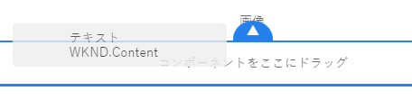
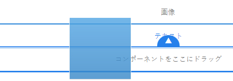
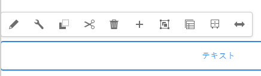
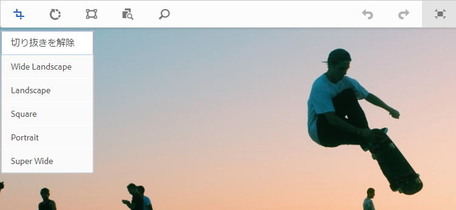
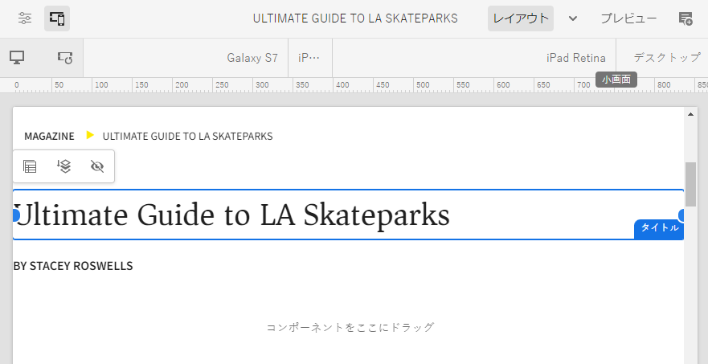

# AEM ページエディターを使用したページコンテンツの編集 {#edit-content}

AEM ページエディターは、ページのコンテンツをオーサリングする強力なツールです。これを使用してコンテンツをドラッグ＆ドロップし、インプレースでコンテンツを編集する方法について説明します。

## 概要 {#overview}

ページエディターでのコンテンツの編集に実行できる基本的なアクションは 3 つあります。

1. ページにドラッグ＆ドロップして、[新しいコンポーネントを追加](#adding-components)します。
1. ページにドラッグ＆ドロップして、[新しいアセットを追加](#adding-asset)します。
1. 既にページ上に存在する[コンポーネントをインプレースで編集](#edit-in-place)します。

AEM ページエディターには、より高度な機能にアクセスできることに加えて、これらのタスクを実行する直感的な UI が用意されています。

また、エディターを使用すると、次のアクションを行うことで、ページ上の既存のコンテンツを整理できます。

* [コンポーネントを移動](#moving-components)
* [コンポーネントのレイアウトを編集](#editing-component-layout)
* [コンポーネントの継承を編集](#inherited-components)

## コンポーネントの追加 {#adding-components}

新しいコンポーネントをページにドラッグ＆ドロップするには、[サイドパネルのコンポーネントブラウザー](/help/sites-cloud/authoring/page-editor/editor-side-panel.md#components-browser)からコンポーネントを選択し、コンポーネントプレースホルダーにドロップします。

### コンポーネントプレースホルダー {#component-placeholder}

コンポーネントプレースホルダーは、コンポーネントをドロップしたときのコンポーネントの配置場所を示すインジケーターです。外観が 2 つあります。

* 新しいコンポーネントをページに追加すると（コンポーネントブラウザーからドラッグ）、配置するコンポーネントの詳細を示す灰色のボックスとして表示されます。

  

* [ 既存のコンポーネントを移動 ](#movging-components) すると、青い四角形で表示されます。

  

どちらの場合も、選択したターゲットは、ドラッグしているコンポーネントの下に青色のアウトラインで表示されます。コンポーネントをリリースする際にコンポーネントが配置されるターゲットです。

### コンポーネントブラウザーからのコンポーネントの追加 {#adding-a-component-from-the-components-browser}

[コンポーネントブラウザー](/help/sites-cloud/authoring/page-editor/editor-side-panel.md#components-browser)を使用して、新しいコンポーネントを追加できます。[コンポーネントプレースホルダー](#component-placeholder)は、コンポーネントを配置している場所を示します。

1. ページエディターが [**編集** モードになっていることを確認 ](/help/sites-cloud/authoring/page-editor/introduction.md#mode-selector) ます。
1. [コンポーネントブラウザー](/help/sites-cloud/authoring/page-editor/editor-side-panel.md#components-browser)を開きます。
1. 必要なコンポーネントを[必要な位置](#component-placeholder)までドラッグしてリリースします。
1. 新しく配置したコンポーネントを[編集](#edit-content)します。

>[!NOTE]
>
>モバイルデバイスでは、コンポーネントブラウザーが画面全体に表示されます。コンポーネントをドラッグすると、ブラウザーが閉じてページが再度表示され、コンポーネントを配置できるようになります。

### 段落システムからのコンポーネントの追加 {#adding-a-component-from-the-paragraph-system}

段落システムの「**ここにコンポーネントをドラッグ**」プレースホルダーを使用して、新しいコンポーネントを追加できます。

1. ページエディターが [**編集** モードになっていることを確認 ](/help/sites-cloud/authoring/page-editor/introduction.md#mode-selector) ます。
1. 段落システムから新しいコンポーネントを選択して追加するには、2 つの方法があります。

   * 既存のコンポーネントのツールバーまたは「**コンポーネントをここにドラッグ**」ボックスから「**コンポーネントを挿入**」オプション（+）を選択します。

     

   * デスクトップデバイスを使用している場合は、「**コンポーネントをここにドラッグ**」ボックスをダブルクリックできます。

1. **新規コンポーネントを挿入**&#x200B;ダイアログが表示され、必要なコンポーネントを選択できるようになります。追加するコンポーネントをタップまたはクリックします。

   * 検索フィルターを使用して、コンポーネントを検索します。
   * コンポーネント名の横にある情報アイコンを使用して、コンポーネントの詳細を確認します。

   

1. 選択したコンポーネントが、選択したターゲットに追加されます。必要に応じて、コンポーネントを[編集](#edit-content)します。

## アセットの追加 {#adding-asset}

[アセットブラウザー](/help/sites-cloud/authoring/page-editor/editor-side-panel.md#assets-browser)からアセットをドラッグして、新しいコンポーネントをページに追加することもできます。これにより、適切なタイプのコンポーネント（アセットを含む）が自動的に作成されます。

この動作は使用しているインストール環境で設定できます。詳しくは、[コンポーネントのリファレンスガイド](/help/implementing/developing/components/reference.md#component-placeholders)のドキュメントを参照してください。

前述のいずれかのアセットタイプをドラッグしてコンポーネントを作成するには：

1. ページが&#x200B;[**編集**&#x200B;モード](/help/sites-cloud/authoring/page-editor/introduction.md#mode-selector)であることを確認します。
1. [アセットブラウザー](/help/sites-cloud/authoring/page-editor/editor-side-panel.md#assets-browser)を開きます。
1. 必要なアセットを必要な位置にドラッグします。[コンポーネントプレースホルダー](#component-placeholder)は、コンポーネントが配置されている場所を示し、挿入されるターゲットも表示されます。
1. アセットをターゲット上にリリースします。アセットタイプに適したコンポーネントが、必要な場所に作成されます。これには選択したアセットが含まれます。
1. 必要に応じて、コンポーネントを[編集](#edit-content)します。

>[!NOTE]
>
>モバイルデバイスでは、アセットブラウザーが画面全体に表示されます。アセットをドラッグすると、ブラウザーが閉じてページが再度表示され、アセットを配置できるようになります。

アセットを参照して、すぐにアセットに変更を加える必要があると気づいた場合は、アセット名の横にある編集アイコンをクリックして、ブラウザーから直接[アセットエディター](/help/assets/manage-digital-assets.md)を起動できます。

## コンポーネントをインプレースで編集 {#edit-in-place}

コンポーネントを選択すると、コンポーネントツールバーが開きます。これにより、コンポーネントで実行できる様々なアクションにアクセスできます。

選択したコンポーネントに応じて、コンポーネントツールバーで使用できるアクションが表示されます。選択したコンポーネントに応じて、多くまたは少なく表示される場合があり、ここでは説明しない場合もあります。

* **編集**&#x200B;では、多くの場合、インプレースでコンポーネントのコンテンツを変更できます。その動作はコンポーネントによって異なります。

  

* **設定**&#x200B;では、通常はダイアログ内で、コンテンツに直接関係していないコンポーネントの一部のパラメーターを変更できます。その動作はコンポーネントによって異なります。

  

* **コピー**&#x200B;は、コンポーネントをクリップボードにコピーして別の場所に貼り付けます。元のコンポーネントは変更されません。

  

* **カット**&#x200B;は、コンポーネントをクリップボードにコピーします。元のコンポーネントが削除されます。

  

* **削除**&#x200B;は、確認後に、ページからコンポーネントを削除します。

  

* **コンポーネントを挿入** して、「新しいコンポーネントを追加 [ するためのダイアログを開き ](#adding-a-component-from-the-paragraph-system) す。

  

* **ペースト**&#x200B;は、クリップボードのコンポーネントをページにペーストします。元のコンポーネントが残るかどうかは、**コピー**&#x200B;または&#x200B;**カット**&#x200B;のどちらを使用したかによって異なります。

   * 同じページまたは別のページにペーストできます。
   * カット／コピー操作の前に開いていた別のページにペーストする場合は、ページを更新して、ペーストしたコンテンツを表示する必要があります。
   * 項目は、貼り付けアクションを選択した項目の上に貼り付けられます。
   * ペースト操作は、クリップボードにコンテンツがある場合にのみ表示されます。

  

* **グループ化**&#x200B;は、複数のコンポーネントを一度に選択できます。デスクトップデバイスで同じ操作をおこなうには、**Ctrl キーを押しながらクリック**&#x200B;するか、または **Command キーを押しながらクリック**&#x200B;します。

  

* **親**&#x200B;は、選択したコンポーネントの親コンポーネントを選択します。

  

* **レイアウト**&#x200B;は、選択したコンポーネントの[レイアウト](#editing-component-layout)を変更できます。

   * これは選択したコンポーネントにのみ適用され、ページ全体の[レイアウトモード](/help/sites-cloud/authoring/page-editor/introduction.md#mode-selector)はアクティベートされません。

  

* 「**エクスペリエンスフラグメントバリエーションに変換**」を使用すると、[エクスペリエンスフラグメント](/help/sites-cloud/authoring/fragments/content-fragments.md)を、選択したコンポーネントから作成したり、既存のエクスペリエンスフラグメントに追加したりできます。

  

### コンポーネント編集ダイアログ {#component-edit-dialog}

一部のコンポーネントには、インプレースで使用できるものを超える追加の編集オプションが用意されています。コンポーネントの編集ダイアログを開き、[コンポーネントツールバーの編集（鉛筆）アイコン](#component-toolbar)を開くと、追加の設定オプションにアクセスできます。

実際に使用できる編集オプションはコンポーネントによって異なります。一部のコンポーネントでは、[いくつかのアクションが全画面モードでのみ使用できます](#edit-content-full-screen-mode)。次に例を示します。

* テキストコンポーネント

  

* 画像コンポーネント

  

### 全画面表示モードでのコンポーネントの編集 {#edit-content-full-screen-mode}

多くのコンポーネントには、このボタンでアクセスできる編集用の全画面表示モードが用意されています。

全画面表示編集では、画像コンポーネントなどのインプレースエディターよりも多くの編集オプションを表示できます。

全画面表示モードを終了するには、「**最小化**」ボタンを使用します。

## コンポーネントの移動 {#moving-components}

コンポーネントを移動するには、次の手順に従います。

1. タップ＆ホールドまたはクリック＆ホールドによって移動するコンポーネントを選択します。
1. コンポーネントを新しい場所にドラッグします。

   * ページエディターは、[プレースホルダー](#component-placeholder)を使用してコンポーネントの位置を示し、ターゲットを使用して段落をドロップできる場所を示します。

   

1. 目的の場所にドロップします。

>[!TIP]
>
>また、[切り取りと貼り付け](#component-toolbar)を使用して、コンポーネントを移動することもできます。

## コンポーネントのレイアウトの編集 {#editing-component-layout}

コンポーネントを調整するために編集モードから[レイアウトモード](/help/sites-cloud/authoring/page-editor/responsive-layout.md)に繰り返し切り替える代わりに、コンポーネントの&#x200B;**レイアウト**&#x200B;アクションを選択してそのコンポーネントのレイアウトを変更すると、編集モードから切り替える必要がなくなり、時間を節約できます。

1. Sites コンソールの&#x200B;**編集**&#x200B;モードでコンポーネントを選択すると、コンポーネントのツールバーが表示されます。

1. コンポーネントのレイアウトを調整するには、**レイアウト**&#x200B;アクションを選択します。

   

1. レイアウトアクションを選択すると、[ レイアウトモード ](/help/sites-cloud/authoring/page-editor/responsive-layout.md#defining-layouts-layout-mode) で行うようにコンポーネントのレイアウトを変更できます。

   * コンポーネントのサイズ変更ハンドルが表示されます。
   * エミュレーターツールバーが画面の上部に表示されます。
   * 標準の編集アクションの代わりにレイアウトアクションが、コンポーネントツールバーに表示されます。

   

1. 必要なレイアウトの変更を行った後、コンポーネントのアクションメニューの「**閉じる**」ボタンをタップまたはクリックして、コンポーネントのレイアウトの変更を終了すると、コンポーネントのツールバーが通常の編集状態に戻ります。

   

>[!TIP]
>
>レイアウトアクションは、選択したコンポーネントの範囲に限定されます。例えば、あるコンポーネントのレイアウトを編集してから別のコンポーネントをクリックすると、新しく選択したコンポーネントに（レイアウトツールバーではなく）標準の編集ツールバーが表示され、サイズ変更ハンドルとエミュレーターツールバーが表示されなくなります。
>
>複数のコンポーネントに影響するページの全体のレイアウトを編集する必要がある場合は、[レイアウトモード](/help/sites-cloud/authoring/page-editor/responsive-layout.md)に切り替えます。

## コンポーネントの継承の編集 {#inherited-components}

継承とは、一方を変更するともう一方も自動的に変更されるようにコンテンツをリンクできるメカニズムです。継承されたコンポーネントは、次のような様々なシナリオによって生成されます。

* [マルチサイト管理](/help/sites-cloud/administering/msm/overview.md)
* [ローンチ](/help/sites-cloud/authoring/launches/overview.md)

継承をキャンセルして再度有効にできます。コンポーネントに応じて、コンポーネントがライブコピーまたはローンチの一部である場合、以下のオプションはコンポーネントツールバーから使用できます。

* **継承をキャンセル**

  

* 既に継承がキャンセルされている場合、**継承を再度有効にする**&#x200B;ことができます。

  

* **ロールアウト**&#x200B;は、ブループリントまたはライブコピーのソースでも使用できます

  
