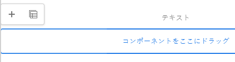

# AEM Page Editor を使用したページコンテンツの編集 {#edit-content}

AEMページエディターは、ページのコンテンツをオーサリングするための強力なツールです。 これを使用してコンテンツをドラッグ&amp;ドロップし、その場でコンテンツを編集する方法を説明します。

## 概要 {#overview}

ページエディターでコンテンツを編集する際に実行できる基本的なアクションは 3 つあります。

1. [新しいコンポーネントの追加](#adding-components) ページにドラッグ&amp;ドロップすることによって。
1. [新しいアセットの追加](#adding-asset) ページにドラッグ&amp;ドロップすることによって。
1. [コンポーネントをインプレースで編集する](#edit-in-place) 既にページ上に存在する

AEMのページエディターは、これらのタスクを実行するための直感的な UI と、より高度な機能へのアクセスを提供します。

また、エディターを使用すると、ページ上の既存のコンテンツを整理できます。次の操作を行うことができます。

* [コンポーネントの移動](#moving-components)
* [コンポーネントレイアウトを編集](#editing-component-layout)
* [コンポーネントの継承を編集](#inherited-components)

## コンポーネントの追加 {#adding-components}

新しいコンポーネントをページ上から選択してドラッグ&amp;ドロップできます。 [サイドパネルのコンポーネントブラウザー](/help/sites-cloud/authoring/page-editor/editor-side-panel.md#components-browser) コンポーネントプレースホルダーにドロップします。

### コンポーネントプレースホルダー {#component-placeholder}

コンポーネントプレースホルダーは、コンポーネントをドロップしたときの位置を示すインジケーターです。 見た目が二つある。

* ページに新しいコンポーネントを追加すると（コンポーネントブラウザーからドラッグ）、グレーのボックスとして表示され、配置するコンポーネントの詳細が表示されます。

  

* 条件 [既存のコンポーネントの移動](#movging-components) 青い四角形で表示されます。

  

どちらの場合も、選択したターゲットは、ドラッグするコンポーネントの下に青いアウトラインで表示されます。 コンポーネントをリリースする際に配置されるターゲット。

### コンポーネントブラウザーからのコンポーネントの追加 {#adding-a-component-from-the-components-browser}

[コンポーネントブラウザー](/help/sites-cloud/authoring/page-editor/editor-side-panel.md#components-browser)を使用して、新しいコンポーネントを追加できます。The [コンポーネントプレースホルダー](#component-placeholder) に、コンポーネントの位置を示します。

1. ページエディターが [**編集** モード。](/help/sites-cloud/authoring/page-editor/introduction.md#mode-selector)
1. を開きます。 [コンポーネントブラウザー。](/help/sites-cloud/authoring/page-editor/editor-side-panel.md#components-browser)
1. 必要なコンポーネントを [必要な位置](#component-placeholder) とリリース。
1. [編集](#edit-content) 新しく配置されたコンポーネント。

>[!NOTE]
>
>モバイルデバイスでは、コンポーネントブラウザーが画面全体に表示されます。コンポーネントをドラッグすると、ブラウザーが閉じてページが再度表示され、コンポーネントを配置できるようになります。

### 段落システムからのコンポーネントの追加 {#adding-a-component-from-the-paragraph-system}

新しいコンポーネントを追加するには、 **ここにコンポーネントをドラッグ** 段落システムのプレースホルダー：

1. ページエディターが [**編集** モード。](/help/sites-cloud/authoring/page-editor/introduction.md#mode-selector)
1. 段落システムから新しいコンポーネントを選択して追加するには、2 つの方法があります。

   * 既存のコンポーネントのツールバーまたは「**コンポーネントをここにドラッグ**」ボックスから「**コンポーネントを挿入**」オプション（+）を選択します。

     

   * デスクトップデバイスを使用している場合は、「**コンポーネントをここにドラッグ**」ボックスをダブルクリックできます。

1. The **新規コンポーネントを挿入** ダイアログが開き、必要なコンポーネントを選択できます。 追加するコンポーネントをタップまたはクリックします。

   * 検索フィルターを使用して、コンポーネントを検索します。
   * コンポーネント名の横にある情報アイコンを使用して、コンポーネントの詳細を確認します。

   

1. 選択したコンポーネントが、選択したターゲットに追加されます。 必要に応じて、コンポーネントを[編集](#edit-content)します。

## アセットの追加 {#adding-asset}

また、ページに新しいコンポーネントを追加するには、 [アセットブラウザー。](/help/sites-cloud/authoring/page-editor/editor-side-panel.md#assets-browser) これにより、適切なタイプの（およびアセットを含む）コンポーネントが自動的に作成されます。

この動作は使用しているインストール環境で設定できます。ドキュメントを参照してください [コンポーネントリファレンスガイド](/help/implementing/developing/components/reference.md#component-placeholders) 詳しくは、を参照してください。

前述のいずれかのアセットタイプをドラッグしてコンポーネントを作成するには：

1. ページがにあることを確認します。 [**編集** モード。](/help/sites-cloud/authoring/page-editor/introduction.md#mode-selector)
1. [アセットブラウザー](/help/sites-cloud/authoring/page-editor/editor-side-panel.md#assets-browser)を開きます。
1. 必要なアセットを必要な位置にドラッグします。The [コンポーネントプレースホルダー](#component-placeholder) コンポーネントが配置される場所と、挿入された場合にターゲットが表示される場所を示します。
1. アセットをターゲット上に放します。 選択したアセットを含む必要な場所に、アセットタイプに適したコンポーネントが作成されます。
1. 必要に応じて、コンポーネントを[編集](#edit-content)します。

>[!NOTE]
>
>モバイルデバイスでは、アセットブラウザーが画面全体に表示されます。アセットをドラッグすると、ブラウザーが閉じてページが再度表示され、アセットを配置できるようになります。

アセットを参照して、すぐにアセットに変更を加える必要があると気づいた場合は、アセット名の横にある編集アイコンをクリックして、ブラウザーから直接[アセットエディター](/help/assets/manage-digital-assets.md)を起動できます。

## コンポーネントをインプレースで編集する {#edit-in-place}

コンポーネントを選択すると、コンポーネントツールバーが開きます。 これにより、コンポーネントで実行できる様々なアクションにアクセスできます。

コンポーネントツールバーで使用できるアクションは、選択したコンポーネントに適しています。 選択したコンポーネントに応じて、多かれ少なかれ表示される場合があり、ここで説明する場合とそうでない場合があります。

* **編集** では、多くの場合、インプレースでコンポーネントのコンテンツを変更できます。 その動作はコンポーネントによって異なります。

  

* **設定** では、コンポーネントのコンテンツに直接関連していない一部のパラメーターを変更できます（通常はダイアログで）。 その動作はコンポーネントによって異なります。

  

* **コピー** コンポーネントをクリップボードにコピーして別の場所に貼り付けます。 元のコンポーネントは変更されません。

  

* **カット** コンポーネントをクリップボードにコピーします。 元のコンポーネントが削除されます。

  

* **削除** 確認を含むコンポーネントをページから削除します。

  

* **コンポーネントを挿入** ダイアログを開く [新しいコンポーネントを追加します。](#adding-a-component-from-the-paragraph-system)

  

* **貼り付け** コンポーネントをクリップボードからページに貼り付けます。 元の画像が残るかどうかは、使用したかどうかによって異なります。 **コピー** または **カット**.

   * 同じページまたは別のページにペーストできます。
   * カット／コピー操作の前に開いていた別のページにペーストする場合は、ページを更新して、ペーストしたコンテンツを表示する必要があります。
   * 項目は、貼り付けアクションを選択した項目の上に貼り付けられます。
   * ペースト操作は、クリップボードにコンテンツがある場合にのみ表示されます。

  

* **グループ化** 複数のコンポーネントを一度に選択できます。 デスクトップデバイスで同じ操作をおこなうには、**Ctrl キーを押しながらクリック**&#x200B;するか、または **Command キーを押しながらクリック**&#x200B;します。

  

* **親** 選択したコンポーネントの親コンポーネントを選択します。

  

* **レイアウト** を使用すると、 [レイアウト](#editing-component-layout) 選択したコンポーネントの。

   * これは選択したコンポーネントにのみ適用され、ページ全体の[レイアウトモード](/help/sites-cloud/authoring/page-editor/introduction.md#mode-selector)はアクティベートされません。

  

* **エクスペリエンスフラグメントバリエーションに変換** を使用すると、 [エクスペリエンスフラグメント](/help/sites-cloud/authoring/fragments/content-fragments.md) 選択したコンポーネントから、または既存のエクスペリエンスフラグメントに追加します。

  

### コンポーネント編集ダイアログ {#component-edit-dialog}

一部のコンポーネントでは、インプレースで使用できる以外の追加の編集オプションが用意されています。 コンポーネントの編集ダイアログは、 [コンポーネントツールバーの編集（鉛筆）アイコン](#component-toolbar) をクリックして、追加の設定オプションにアクセスします。

実際に使用できる編集オプションはコンポーネントによって異なります。一部のコンポーネントの場合 [一部のアクションは全画面表示モードでのみ使用できます](#edit-content-full-screen-mode). 次に例を示します。

* テキストコンポーネント

  

* 画像コンポーネント

  

### フルスクリーンモードでのコンポーネントの編集 {#edit-content-full-screen-mode}

多くのコンポーネントでは、編集用のフルスクリーンモードが用意されており、このボタンを使用してアクセスできます。

全画面表示編集では、画像コンポーネントなど、インプレースエディターよりも多くの編集オプションを表示できます。

以下を使用します。 **最小化** ボタンをクリックしてフルスクリーンモードで使用できます。

## コンポーネントの移動 {#moving-components}

コンポーネントを移動するには：

1. タップ&amp;ホールドまたはクリック&amp;ホールドで移動するコンポーネントを選択します。
1. コンポーネントを新しい場所にドラッグします。

   * ページエディターは、 [プレースホルダー](#component-placeholder) また、ターゲットと共に段落をドロップできる場所も示します。

   

1. 目的の場所にドロップします。

>[!TIP]
>
>[切り取りと貼り付け](#component-toolbar)を使用して、コンポーネントを移動することもできます。

## コンポーネントレイアウトを編集する {#editing-component-layout}

コンポーネントを調整するために編集モードから[レイアウトモード](/help/sites-cloud/authoring/page-editor/responsive-layout.md)に繰り返し切り替える代わりに、コンポーネントの&#x200B;**レイアウト**&#x200B;アクションを選択してそのコンポーネントのレイアウトを変更すると、編集モードから切り替える必要がなくなり、時間を節約できます。

1. When in **編集** サイトコンソールのモードで、コンポーネントを選択して、コンポーネントのツールバーを表示します。

1. コンポーネントのレイアウトを調整するには、**レイアウト**&#x200B;アクションを選択します。

   

1. 「Layout」アクションを選択したら、 [レイアウトモード。](/help/sites-cloud/authoring/page-editor/responsive-layout.md#defining-layouts-layout-mode)

   * コンポーネントのサイズ変更ハンドルが表示されます。
   * エミュレーターツールバーが画面の上部に表示されます。
   * 標準の編集アクションの代わりにレイアウトアクションが、コンポーネントツールバーに表示されます。

   

1. 必要なレイアウトの変更を行った後、 **閉じる** ボタンを使用して、コンポーネントのレイアウトの変更を停止し、コンポーネントのツールバーが通常の編集状態に戻ります。

   

>[!TIP]
>
>レイアウトアクションは、選択したコンポーネントの範囲に限定されます。例えば、あるコンポーネントのレイアウトを編集してから別のコンポーネントをクリックすると、新しく選択したコンポーネントに（レイアウトツールバーではなく）標準の編集ツールバーが表示され、サイズ変更ハンドルとエミュレーターツールバーが表示されなくなります。
>
>複数のコンポーネントに影響するページの全体のレイアウトを編集する必要がある場合は、[レイアウトモード](/help/sites-cloud/authoring/page-editor/responsive-layout.md)に切り替えます。

## コンポーネントの継承の編集 {#inherited-components}

継承とは、コンテンツをリンクして、一方を変更するともう一方が自動的に変更されるようにするメカニズムです。 継承されたコンポーネントは、次のような様々なシナリオによって生成されます。

* [マルチサイト管理](/help/sites-cloud/administering/msm/overview.md)
* [ローンチ](/help/sites-cloud/authoring/launches/overview.md)

継承はキャンセルして再度有効にすることができます。 コンポーネントがライブコピーまたはローンチの一部である場合は、コンポーネントに応じて、これらのオプションをコンポーネントツールバーから使用できます。

* **継承をキャンセル**

  

* **継承を再度有効にする** 継承が既にキャンセルされている場合

  

* **ロールアウト** は、ブループリントまたはライブコピーのソースでも使用できます

  
