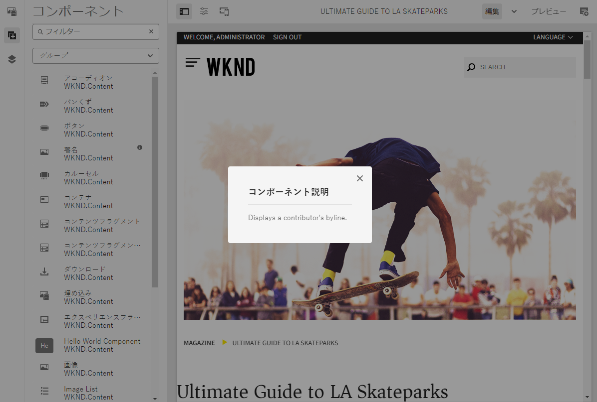

# ページエディターのサイドパネル {#side-panel}

AEM サイトエディターのサイドパネルを使用して、ページにコンポーネントやアセットを追加する方法を説明します。

## サイドパネルモード {#modes}

ページエディターのツールバーにある「**サイドパネルを切り替え**」アイコンをタップまたはクリックすると、ページエディター内でサイドパネルに常にアクセスできます。

サイドパネルを開くと、パネルは左側からスライドして開き、次の 3 つの重要なタブから選択できます。

* ページに新しいコンテンツを追加するための[コンポーネントブラウザー](#components-browser)
* ページに新しいアセットを追加するための[アセットブラウザー](#assets-browser)
* ページの構造を参照するための[コンテンツツリー](#content-tree)

## コンポーネントブラウザー {#components-browser}

[コンポーネント](/help/implementing/developing/components/overview.md)は、AEM ページエディターでコンテンツを作成するために使用される構築ブロックです。コンテンツページを作成するには、ページ上に複数のコンポーネントを配置し、そのオプションを設定します。

コンポーネントブラウザーには、現在のページで使用可能なすべてのコンポーネントが表示されます。これらのコンポーネントを適切な場所にドラッグして編集することで、コンテンツを追加できます。

サイドパネルの「**コンポーネント**」タブをタップまたはクリックして、**コンポーネント**&#x200B;ブラウザーにアクセスします。

実際の外観や処理は、使用しているデバイスの種類によって異なります。

### モバイルデバイス {#mobile-device-components-browser}

モバイルデバイスでコンポーネントブラウザーを開くと、編集中のページ全体が表示されます。

ページにコンポーネントを追加するには、コンポーネントを選択してドラッグし、右側に移動します。コンポーネントブラウザーが閉じて、コンポーネントを配置できるページが再度表示されます。

>[!NOTE]
>
>モバイルデバイスは、幅が 1,024 px 未満の場合に検出されます。

### デスクトップデバイス {#desktop-device-components-browser}

デスクトップデバイスでコンポーネントブラウザーを開くと、ウィンドウの左側に表示されます。

ページにコンポーネントを追加するには、目的のコンポーネントをクリックして、必要な位置までドラッグします。

### コンポーネントブラウザーの使用 {#using-component-browser}

**コンポーネント**&#x200B;ブラウザー内のコンポーネントは、次のように表されます。

* コンポーネント名
* コンポーネントグループ（グレー）
* アイコンまたは略語
   * 標準コンポーネントのアイコンはモノクロです。
   * 略語は常にコンポーネント名の最初の 2 文字です。

**コンポーネント**&#x200B;ブラウザーの上部のツールバーでは、次の操作を実行できます。

* コンポーネントを名前でフィルターします。
* ドロップダウンから選択して、特定のグループのみを表示します。

コンポーネントについて詳しくは、**コンポーネント**&#x200B;ブラウザー内のコンポーネントの横にある情報アイコンを選択してください（使用可能な場合）。例えば、**コンテンツフラグメント**&#x200B;の場合は、次のようになります。

使用可能なコンポーネントについて詳しくは、[ コンポーネントコンソール ](/help/sites-cloud/authoring/components-console.md) を参照してください

## アセットブラウザー {#assets-browser}

**アセット**&#x200B;ブラウザーには、現在のページで直接使用可能なすべての[アセット](/help/assets/overview.md)が表示されます。

サイドパネルの「**Assets**」タブをタップまたはクリックし、アセットを参照します。

必要に応じて、スクロールしながらアセットのリストを展開するには、無限スクロールを使用します。

実際の表示方法や処理は、使用しているデバイスの種類によって異なります。

### モバイルデバイス {#mobile-device-assets-browser}

モバイルデバイスでアセットブラウザーを開くと、編集中のページ全体が表示されます。

ページにアセットを追加するには、必要なアセットを選択してドラッグし、右側に移動します。アセットブラウザーが閉じてページが再び表示されると、必要なコンポーネントにアセットを追加できます。

>[!NOTE]
>
>モバイルデバイスは、幅が 1,024 px 未満の場合に検出されます。

### デスクトップデバイス {#desktop-device-assets-browser}

デスクトップデバイスでアセットブラウザーを開くと、ウィンドウの左側に開きます。

ページにアセットを追加するには、必要なアセットを選択して、必要なコンポーネントまたは場所までドラッグします。

### アセットブラウザーの使用 {#using-assets-browser}

ページにアセットを追加するには、アセットを選択して必要な場所までドラッグします。次のことが考えられます。

* 適切なタイプの既存のコンポーネント。
   * 例えば、画像タイプのアセットを画像コンポーネントにドラッグできます。
* 適切なタイプの新しいコンポーネントを作成するために使用する、段落システム内の[プレースホルダー](/help/sites-cloud/authoring/page-editor/edit-content.md#component-placeholder)。
   * 例えば、画像タイプのアセットを段落システムにドラッグして画像コンポーネントを作成できます。

>[!NOTE]
>
>特定のアセットおよびコンポーネントタイプで、アセットのドラッグ＆ドロップを使用できます。詳しくは、[アセットブラウザーを使用したコンポーネントの挿入](/help/sites-cloud/authoring/page-editor/edit-content.md#adding-a-component-from)を参照してください。

アセットブラウザーの上部のツールバーでは、アセットを次の項目でフィルタリングできます。

* 名前
* パス
* アセットタイプ（画像、ビデオ、ドキュメント、段落、コンテンツフラグメント、エクスペリエンスフラグメントなど）
* アセットの特性（向きやスタイルなど）
   * 特定のアセットタイプに対してのみ使用可能

アセットをすばやく変更する必要がある場合は、アセット名の横にある編集アイコンをクリックして、アセットブラウザーから直接[アセットエディター](/help/assets/manage-digital-assets.md)を開始できます。

## コンテンツツリー {#content-tree}

**コンテンツツリー**&#x200B;では、ページ上のすべてのコンポーネントの概要が階層形式で表示されるので、ページの構成を一目で確認できます。

>[!NOTE]
>
>モバイルデバイス（ブラウザーの幅が 1,024 px より小さい場合）でページを編集している場合、コンテンツツリーは表示されません。

「**コンテンツツリー**」タブをタップまたはクリックし、コンテンツツリーにアクセスします。

このタブを開くと、ページやテンプレートがツリー形式で表示されるので、コンテンツの階層構造を理解しやすくなります。さらに、複雑なページでは、ページのコンポーネント間を簡単にジャンプできるようになります。

ページは同じタイプの多数のコンポーネントで簡単に構成できます。コンテンツツリーには、コンポーネントタイプの名前（黒色）の後に説明テキスト（グレー）が表示されます。説明テキストは、コンポーネントの一般的なプロパティ（タイトルやテキストなど）から得られます。

コンポーネントタイプがユーザーの言語で表示されるのに対して、コンポーネントの説明テキストはページの言語で表示されます。

コンポーネントの横にある山形をクリックすると、そのレベルが折りたたまれたり展開されたりします。

コンポーネントをクリックすると、ページエディターでそのコンポーネントがハイライト表示されます。使用可能なアクションは、ページの状態によって異なります。次に例を示します。

## 基本ページ {#basic-page}

基本ページのコンポーネントには通常のオプションがあります。

ツリー内でクリックしたコンポーネントが編集可能な場合は、レンチアイコンが名前の右側に表示されます。このアイコンをクリックすると、コンポーネントの編集ダイアログボックスが開始されます。

### ライブコピー {#live-copy}

コンポーネントが別のページから継承されている[ライブコピー](/help/sites-cloud/administering/msm/overview.md)の一部のページには、異なるオプションが表示されます。

## 関連コンテンツブラウザー {#associated-content-browser}

ページにコンテンツフラグメントが含まれている場合、[ 関連コンテンツのブラウザー ](/help/sites-cloud/authoring/fragments/content-fragments.md#using-associated-content) にもアクセスできます。
