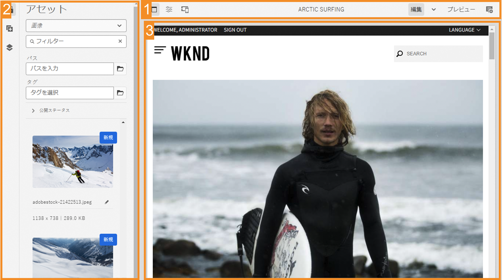
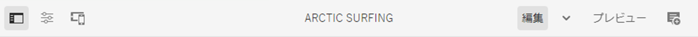
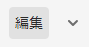
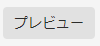
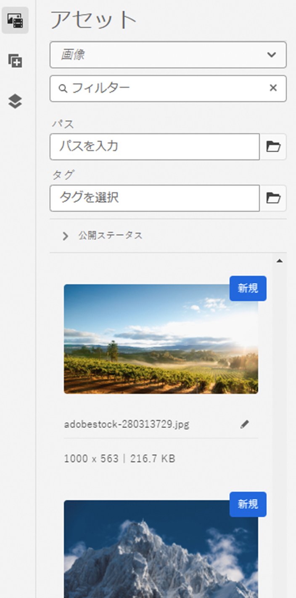
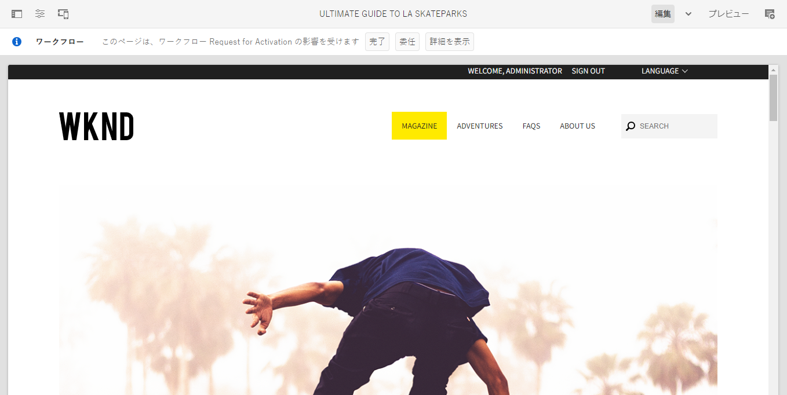
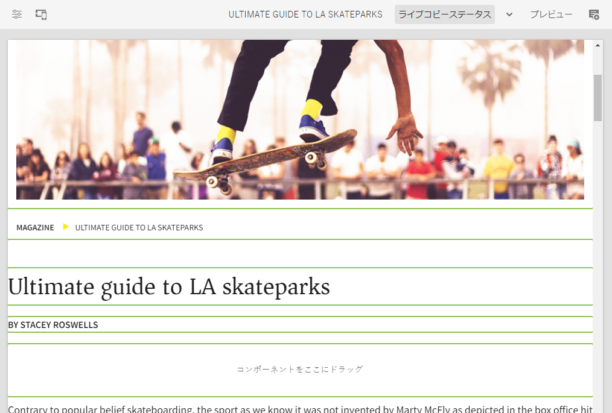

# AEM ページエディター {#editing-page-content}

[**Sites** コンソール](/help/sites-cloud/authoring/sites-console/introduction.md)でページを作成したら、AEM ページエディターを使用してページのコンテンツを編集できます。これは、コンテンツをオーサリングする強力なツールです。

>[!NOTE]
>
>[**Sites** コンソール](/help/sites-cloud/authoring/sites-console/introduction.md)でページを編集すると、コンソールはページの[テンプレート](/help/sites-cloud/authoring/page-editor/templates.md)に適したエディター（このドキュメントで説明するページエディターや、[ユニバーサルエディター](/help/sites-cloud/authoring/universal-editor/authoring.md)）を開きます。

>[!NOTE]
>
>アカウントには、ページを編集するための適切なアクセス権と権限が必要です。権限がない場合は、システム管理者にお問い合わせください。

{{traditional-aem}}

## オリエンテーション {#orientation}

AEM ページエディターは、主に次の 3 つのセクションで構成されます。

1. [ツールバー](#toolbar) - ツールバーを使用すると、ページ モードの変更や、追加のページ設定へのアクセスが素早くできます。
1. [サイドパネル](#side-panel) - サイドパネルでは、ページコンポーネントやアセット、その他のオーサリングツールにアクセスできます。
1. [エディター](#editor) - エディターでは、コンテンツを変更してプレビューできます。

コンテンツは、ページにドラッグ可能な[コンポーネント](/help/sites-cloud/authoring/components-console.md)（コンテンツのタイプに適したもの）を使用して追加できます。コンポーネントはその後、そのまま編集したり、移動や削除をおこなったりすることができます。

### ツールバー {#page-toolbar}

ページツールバーを使用すると、ページ設定に応じて、コンテキストに適切な機能にアクセスできます。

#### サイドパネル {#side-panel-button}

[サイドパネル](/help/sites-cloud/authoring/page-editor/editor-side-panel.md)が開きます（または閉じます）。このパネルには、アセットブラウザー、コンポーネントブラウザー、コンテンツツリーが含まれています。

#### ページ情報 {#page-information}

ページの詳細およびページに対して実行できるアクション（ページ情報の表示と編集、ページのプロパティの表示、ページの公開／非公開など）を含む詳細なページ情報にアクセスできます。

**ページ情報**&#x200B;をクリックするとドロップダウンメニューが開き、選択したページの最後の編集および最後の公開に関する詳細が表示されます。ページ、ページのサイト、インスタンスの特性に応じて、追加のアクションを使用できます。

* [プロパティを開く](/help/sites-cloud/authoring/sites-console/page-properties.md)
* [ページをロールアウト](/help/sites-cloud/administering/msm/overview.md#msm-from-the-ui)
* [ワークフローを開始](/help/sites-cloud/authoring/workflows/applying.md#starting-a-workflow-from-the-page-editor)
* [ページをロック](/help/sites-cloud/authoring/page-editor/introduction.md#locking-unlocking)
* [ページを公開](/help/sites-cloud/authoring/sites-console/publishing-pages.md#publishing-pages-1)
* [ページを非公開](/help/sites-cloud/authoring/sites-console/publishing-pages.md#unpublishing-pages)
* [テンプレートを編集](/help/sites-cloud/authoring/page-editor/templates.md)
* [公開済みとして表示](/help/sites-cloud/authoring/page-editor/introduction.md#view-as-published)
* [管理画面で表示](/help/sites-cloud/authoring/basic-handling.md#viewing-and-selecting-resources)
* [ヘルプ](/help/sites-cloud/authoring/basic-handling.md#accessing-help)
* [ローンチを昇格](/help/sites-cloud/authoring/launches/promoting.md)（ページがローンチの場合のみ）

該当する場合、**ページ情報**&#x200B;から分析やレコメンデーションを確認することもできます。

#### エミュレーター {#emulator}

別のデバイスでのページのルックアンドフィールをエミュレートするために使用する[エミュレーターツールバー](/help/sites-cloud/authoring/page-editor/responsive-layout.md#selecting-a-device-to-emulate)を切り替えます。レイアウトモードでは自動的に切り替わります。

#### ContextHub {#context-hub}

これにより、[ContextHub](/help/sites-cloud/authoring/personalization/contexthub.md) が開きます。**プレビュー**&#x200B;モードでのみ使用できます。

#### ページタイトル {#page-title}

これは、情報として大文字でレンダリングされたページのタイトルです。

#### モードセレクター {#mode-selector}

モードセレクターには現在の[モード](/help/sites-cloud/authoring/page-editor/introduction.md#mode-selector)が表示され、別のモード（編集、レイアウト、タイムワープ、ターゲティングなど）を選択できます。

ページの編集時には様々なモードがあり、異なる操作を行うことができます。

* [編集](/help/sites-cloud/authoring/page-editor/edit-content.md) - ページコンテンツの編集時に使用するモード
* [レイアウト](/help/sites-cloud/authoring/page-editor/responsive-layout.md) - デバイスに応じたレスポンシブレイアウトを作成および編集できます（ページがレイアウトコンテナに基づいている場合）
* [ターゲティング](/help/sites-cloud/authoring/personalization/targeted-content.md) - すべてのチャネルにわたるターゲティングと測定で、コンテンツの関連性を高めます
* [タイムワープ](/help/sites-cloud/authoring/sites-console/page-versions.md#timewarp) - 特定の時点のページの状態を表示します
* [ライブコピーステータス](/help/sites-cloud/authoring/page-editor/introduction.md#live-copy-status) - ライブコピーのステータスと継承される（または継承されない）コンポーネントの概要を素早く確認できます
* [開発者モード](/help/implementing/developing/tools/developer-mode.md)
* [プレビュー](/help/sites-cloud/authoring/page-editor/introduction.md#previewing-pages) - パブリッシュ環境とまったく同じ形式でページを表示するか、コンテンツ内のリンクを使って移動します
* [注釈](/help/sites-cloud/authoring/page-editor/annotations.md) - ページに注釈を追加または表示します。

>[!NOTE]
>
>* ページの特性によっては、一部のモードを使用できない場合があります。
>* 一部のモードにアクセスするには、適切な権限または特権が必要です。
>* モバイルデバイスでは、スペースの制約により、開発者モードを使用できません。
>* [キーボードショートカット](/help/sites-cloud/authoring/sites-console/keyboard-shortcuts.md)（`Ctrl-Shift-M`）で、**プレビュー**&#x200B;と、現在選択されているモード（**編集モード**、**レイアウトモード**&#x200B;など）を切り替えることができます。

#### プレビュー {#preview}

「**プレビュー**」ボタンを使用すると、[プレビューモード](#preview-mode)が有効になり、公開時に表示されるとおりにページが表示されます。

#### 注釈 {#annotate}

**注釈**&#x200B;モードを使用すると、ページをレビューするときに、ページに[注釈](/help/sites-cloud/authoring/page-editor/annotations.md)を追加できます。最初の注釈を追加後、アイコンは、ページ上の注釈の数を示す数字に切り替わります。

### サイドパネル {#side-panel}

サイドパネルから 3 つの異なるタブにアクセスできます。

* ページに新しいコンテンツを追加するコンポーネントブラウザー
* ページに新しいアセットを追加するアセットブラウザー
* ページの構造を参照するコンテンツツリー

詳しくは、[ページエディターのサイドパネル](/help/sites-cloud/authoring/page-editor/editor-side-panel.md)ドキュメントを参照してください。

### エディター {#editor}

エディターで、ページコンテンツに直接変更を行います。ページは表示されるとおりにレンダリングされ、サイドパネルのアセットブラウザーまたはコンポーネントブラウザーを使用して新しいコンテンツをドラッグ＆ドロップしたり、コンテンツをインプレースで編集したりできます。

## コンテンツの編集 {#editing-content}

ページエディターについて理解したので、コンテンツを編集する準備が整いました。

詳しくは、[AEM ページエディターを使用したコンテンツの編集](/help/sites-cloud/authoring/page-editor/edit-content.md)ドキュメントを参照してください。

## ステータスの通知 {#status-notification}

ページが 1 つまたは複数の[ワークフロー](/help/sites-cloud/authoring/workflows/overview.md)の一部である場合、この情報はページの編集時にツールバーの下部にある通知バーに表示されます。

>[!NOTE]
>
>ステータスバーは、適切な特権を持つユーザーアカウントにのみ表示されます。

通知には、ページに対して実行されているワークフローが一覧表示されます。ユーザーが現在のワークフローステップに関係している場合は、[ワークフローのステータスに影響する](/help/sites-cloud/authoring/workflows/participating.md)オプションや、ワークフローの詳細を取得するオプションを使用できます。例えば、次のようなものがあります。

* **完了** - **作業項目を完了**&#x200B;ダイアログを開きます
* **委任** - **作業項目を完了**&#x200B;ダイアログを開きます
* **詳細を表示** - ワークフローの&#x200B;**詳細**&#x200B;ウィンドウを開きます

通知バーからのワークフローステップの完了および委任は、通知インボックスから[ワークフローに参加](/help/sites-cloud/authoring/workflows/participating.md)している場合に動作します。

ページが複数のワークフローの対象である場合は、ワークフローの数がワークフローをスクロールできる矢印ボタンと共に通知の右端に表示されます。

## ライブコピーステータス {#live-copy-status}

**ライブコピーステータス**&#x200B;ページモードでは、ライブコピーのステータスの簡単な概要、および継承される（または継承されない）コンポーネントを示すことができます。

* 緑のボーダー：継承
* ピンクのボーダー：継承がキャンセルされている

次に例を示します。

## ページのプレビュー {#previewing-pages}

ページをプレビューするには、以下の 2 つの方法があります。

* [プレビューモード](#preview-mode) - その場で素早く確認できるプレビュー
* [公開済みとして表示](#view-as-published) - ページを新しいタブに開くフルプレビュー

>[!TIP]
>
>* コンテンツ内のリンクは表示されますが、**編集**&#x200B;モードでアクセスすることはできません。
>* リンクを使用して移動する場合には、いずれかのプレビューオプションを使用してください。
>* プレビューと最後に選択したモードを切り替えるには、[キーボードショートカット](/help/sites-cloud/authoring/sites-console/keyboard-shortcuts.md) `Ctrl-Shift-M` を使用します。

>[!NOTE]
>
>両方のプレビューオプションに WCM Mode Cookie が設定されています。

### プレビューモード {#preview-mode}

コンテンツの編集時に、プレビューモードを使用してページをプレビューすることができます。このモードでは、次の操作を実行できます。

* 各種編集メカニズムを非表示にして公開時にページがどのように表示されるかをすばやく確認できます。
* リンクを使用して移動できます。
* ページコンテンツは更新&#x200B;**されません**。

オーサリング時に、ページエディターの右上にある次のアイコンを使用して、プレビューモードに切り替えることができます。

### 公開済みとして表示 {#view-as-published}

「**公開済みとして表示**」オプションは、[ページ情報](#page-information)メニューで使用できます。ページが新しいタブで開き、コンテンツが更新され、ページがパブリッシュ環境で表示されるとおりに表示されます。

## ページのロックとロック解除 {#locking-unlocking}

AEM では、他のユーザーによるコンテンツの編集を防ぐためにページをロックできます。ロックは、1 つの特定のページで大量の編集作業を行う場合や、短期間ページを凍結する必要がある場合に便利です。

1. **ページ情報**&#x200B;アイコンを選択して、メニューを開きます。
1. 「**ページをロック**」オプションを選択します。

ロックすると、ページエディターのツールバーに鍵マークシンボルが表示されます。

ページのロック解除は、[ページのロック](#locking-a-page)と非常に似ています。ページをロックすると、ロックオプションはロック解除アクションに置き換わります。

>[!CAUTION]
>
>* ページのロックは、別のユーザーとして実行している場合にも実行できます。ただし、別のユーザーに成り代わって実行したユーザーのみが、この方法でロックされたページをロック解除することができます。
>* 実際にページのロック作業を行なったユーザーに成り代わっても、ページをロック解除できません。
>* ページをロックしたユーザーが（対応できないため）ページのロックを解除できない場合は、カスタマーサポートに連絡して、ロックを解除するオプションを評価してください。

## ページ編集の取り消しとやり直し {#undoing-and-redoing-page-edits}

次のアイコンを使用して、アクションの取り消しまたはやり直しを行うことができます。これらのアイコンは、ツールバーに適宜表示されます。

>[!TIP]
>
>* [キーボードショートカット](/help/sites-cloud/authoring/sites-console/keyboard-shortcuts.md) `Ctrl-Z` を使用して、ページの編集アクションを取り消すこともできます。
>* キーボードショートカット `Ctrl-Y` を使用して、ページの編集アクションをやり直すこともできます。

>[!NOTE]
>
>ページ編集の取り消しとやり直しで実行できることについて詳しくは、[取り消しとやり直しの制限](/help/sites-cloud/authoring/page-editor/undo-redo.md)ドキュメントを参照してください。
