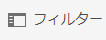

# パスの選択 {#path-selection}

オーサリング時に、別のリソースを選択する必要がある場合がよくあります（別のページへのリンクを定義する場合、画像を選択する場合など）。パスの選択を簡単にするために、[パスフィールド](#path-fields)にはオートコンプリート機能があり、[パスブラウザー](#path-browser)ではより堅牢な選択が可能になっています。

## パスフィールド {#path-fields}

説明のためにここで使用する例は、画像コンポーネントです。コンポーネントの使用および編集について詳しくは、[ページオーサリング用コンポーネント](/help/sites-cloud/authoring/page-editor/components.md)を参照してください。

パスフィールドには、オートコンプリート機能とルックアヘッド機能があり、リソースを見つけやすくなっています。

パスフィールドで「**選択ダイアログを開く**」ボタンをクリックすると、[パスブラウザー](#path-browser)ダイアログが開き、より詳細な選択オプションが表示されます。

または、パスフィールドで入力を開始すると、入力した内容と一致するパスが表示されます。

## パスブラウザー {#path-browser}

パスブラウザーは、[**Sites** コンソール](/help/sites-cloud/authoring/sites-console/introduction.md)の[列表示](/help/sites-cloud/authoring/basic-handling.md#column-view)のように整理されており、リソースをより詳細に選択できます。

* リソースを選択すると、ダイアログボックスの右上にある「**選択**」ボタンがアクティブになります。
   * 選択して選択内容を確定するか、「**キャンセル**」を選択して中止します。
* コンテキストで複数のリソースを選択できる場合、リソースを選択すると「**選択**」ボタンがアクティブ化され、選択したリソースの数がウィンドウの右上に表示されます。
   * すべての選択を解除するには、数字の横にある **X** をクリックします。
* ツリー内を移動すると、ダイアログ上部のパンくずリストに現在の場所が反映されます。
   * これらのパンくずリストを使用すると、リソース階層内で素早くジャンプすることもできます。
* ダイアログボックスの上部にある検索フィールドは、いつでも使用できます。
   * 検索フィールドの「**X**」をクリックして、検索をクリアします。
* 検索を絞り込むには、フィルターオプションを表示して、特定のパスに基づいて結果をフィルターできます。

